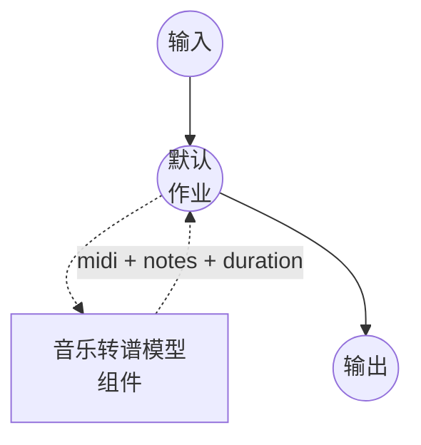

# 音乐转谱模型任务示例

此示例演示如何使用 model-compose 内置的 music-transcription 任务和本地 Spotify Basic Pitch 模型将音频录音转换为结构化音符事件和 MIDI 文件，在初次包安装后完全离线运行。

## 概述

此工作流返回从输入音频中提取的 MIDI 文件、音符事件的 JSON 列表，以及输入音频时长：

1. **本地转谱模型**：在本地运行 Basic Pitch 的 ICASSP-2022 模型；检查点随 `basic-pitch` 包一起提供，运行时无需下载
2. **可选输出**：通过 `return_midi`、`return_notes`、`return_metadata` 切换，仅在响应中包含所需字段
3. **可调阈值**：`onset_threshold`、`frame_threshold` 和 `minimum_note_length` 让您在召回率和精确度之间权衡
4. **无需外部 API**：依赖项安装后完全离线

## 准备工作

### 前置条件

- 已安装 model-compose 并在您的 PATH 中可用
- 包含 `basic-pitch`、`numpy`、`soxr` 的 Python 环境（作为组件设置要求声明，首次运行时自动安装）
- 仅需 CPU：Basic Pitch 是一个小型 CNN，可在 CPU 上舒适运行；无需 GPU

### 为何选择音乐转谱

自动音乐转谱将录制的演奏转换为音符级符号数据（起始、结束、音高和力度）。典型的下游用途：

- **乐谱生成**：将 MIDI 输出输入 music21 或 MuseScore 以渲染乐谱
- **DAW 导入**：将 MIDI 拖入 DAW 以重新演奏或重新编排录音
- **音乐分析**：从纯音频源研究旋律、和声和节奏
- **和弦与调性估计**：将音符事件聚合为和弦和调性特征

注意：转谱是多声部的但不进行源分离。如果输入是完整乐队混音且您想要每个乐器的乐谱，请先使用 `music-source-separation` 任务分割混音，然后独立转谱每个音轨。

## 运行方式

1. **启动服务：**
   ```bash
   model-compose up
   ```

2. **运行工作流：**

   **使用 API：**
   ```bash
   # 基础转谱
   curl -X POST http://localhost:8080/api/workflows/runs \
     -F "audio=@/path/to/your/recording.wav" \
     -F "input={\"audio\": \"@audio\"}"

   # 更保守的起始（更少的误报）
   curl -X POST http://localhost:8080/api/workflows/runs \
     -F "audio=@/path/to/your/recording.wav" \
     -F "input={\"audio\": \"@audio\", \"onset_threshold\": 0.7, \"minimum_note_length\": 100}"
   ```

   **使用 Web UI：**
   - 打开 Web UI：http://localhost:8081
   - 上传音频文件（MP3、WAV、FLAC 等）
   - 可选择调整 `onset_threshold`、`frame_threshold`、`minimum_note_length`
   - 点击"运行工作流"按钮

   **使用 CLI：**
   ```bash
   # 基础转谱
   model-compose run music-transcription --input '{"audio": "/path/to/your/recording.wav"}'

   # 带阈值调整
   model-compose run music-transcription --input '{
     "audio": "/path/to/your/recording.wav",
     "onset_threshold": 0.7,
     "minimum_note_length": 100
   }'
   ```

## 组件详情

### 音乐转谱模型组件（默认）

- **类型**：具有 `music-transcription` 任务的模型组件
- **驱动**：`custom`
- **系列**：`basic-pitch`
- **用途**：将音频转换为多声部音符事件 + MIDI
- **功能**：
  - 通过 `basic-pitch` 包进行本地推理；检查点包含在 wheel 内
  - 单次调用返回 MIDI 字节、音符事件列表以及输入音频时长
  - 通过 `return_midi`、`return_notes`、`return_metadata` 选择输出字段
  - 当 `return_pitch_bends: true` 时可选的每个音符音高弯曲

### 模型信息：Basic Pitch (ICASSP-2022)

- **开发者**：Spotify Research
- **类型**：用于多声部音高估计的卷积神经网络
- **许可证**：Apache 2.0（权重随 `basic-pitch` 包一起提供）
- **论文**："A Lightweight Instrument-Agnostic Model for Polyphonic Note Transcription and Multipitch Estimation" (ICASSP 2022)

## 工作流详情

### "Music Transcription" 工作流（默认）

**描述**：将输入录音转谱为 MIDI 文件、音符事件 JSON 和音频时长。

#### 作业流程



#### 输入参数 (Basic Pitch)

`basic-pitch` 系列在其 action 上接受的字段。检测调节参数位于 `action.params` 下，其余则直接位于 `action` 上。

| 参数 | 位置 | 类型 | 必需 | 默认值 | 描述 |
|-----------|----------|------|----------|---------|-------------|
| `audio` | `action` | audio | 是 | - | 输入录音（MP3、WAV、FLAC 等） |
| `return_midi` | `action` | boolean | 否 | `true` | 是否在结果中包含渲染的 MIDI 文件 |
| `return_notes` | `action` | boolean | 否 | `false` | 是否在结果中包含每个音符的事件列表 |
| `return_metadata` | `action` | boolean | 否 | `true` | 是否在结果中包含处理元数据（`duration`、...） |
| `return_pitch_bends` | `action` | boolean | 否 | `false` | 是否将每个音符的音高弯曲事件写入 MIDI 并作为 `pitch_bends` 数组包含在每个音符中 |
| `onset_threshold` | `action.params` | float | 否 | `0.5` | 检测音符起始的置信度阈值 (0.0-1.0)；越高音符越少 |
| `frame_threshold` | `action.params` | float | 否 | `0.3` | 跨帧维持音符的置信度阈值 (0.0-1.0) |
| `minimum_note_length` | `action.params` | float | 否 | `58.0` | 以毫秒为单位的最小音符持续时间 |
| `minimum_frequency` | `action.params` | float | 否 | - | 检测音高的下限（Hz） |
| `maximum_frequency` | `action.params` | float | 否 | - | 检测音高的上限（Hz） |
| `midi_tempo` | `action.params` | float | 否 | `120` | 写入 MIDI 头部的速度 (BPM)；不影响检测到的时序 |

#### 输出格式

工作流输出是一个 JSON 对象，其字段由 `return_*` 标志选择：

- `midi` — 适合保存为 `.mid` 或管道传入乐谱渲染器的 MIDI 文件（当 `return_midi: true` 时包含）
- `notes` — `{ "start_time", "end_time", "pitch", "velocity" }` 对象的列表（时间以秒为单位，`pitch` 为 MIDI 音符编号，`velocity` 范围 0.0-1.0；当 `return_notes: true` 时包含）
- `duration` — 输入音频时长（秒，float；当 `return_metadata: true` 时包含）

`return_midi` 和 `return_notes` 中至少一个必须为 true。

## 使用 Piano Transcription 替代 Basic Pitch

对于仅钢琴录音，ByteDance 的 Piano Transcription 模型可生成明显更干净的转谱（包括延音踏板事件）。将组件替换为：

```yaml
component:
  type: model
  task: music-transcription
  driver: custom
  family: piano-transcription
  device: auto
  action:
    audio: ${input.audio as audio}
    params:
      onset_threshold:        0.3   # note attack sensitivity
      offset_threshold:       0.3   # note release sensitivity
      frame_threshold:        0.1   # sustained-note frame sensitivity
      pedal_offset_threshold: 0.2   # sustain-pedal release sensitivity
```

Piano Transcription 公开的参数集与 Basic Pitch 不同 — 该模式是按系列定义的，因此上面的字段即为完整列表。`minimum_note_length`、`minimum_frequency`、`maximum_frequency`、`return_pitch_bends` 和 `midi_tempo` 在此不适用（该模型固定为 88 键钢琴，并将踏板事件写入 MIDI 而非音高弯曲）。

首次运行会将检查点（~180 MB）下载到 `~/piano_transcription_inference_data/`。设置要求：`piano_transcription_inference`、`torch`、`numpy`、`soxr`。Piano Transcription 仅适用于 88 键钢琴 — 对于任何其他乐器或混音，请继续使用 Basic Pitch。

## 与音乐源分离串联

将每个分离的音轨输入转谱以获得每个乐器的乐谱：

```yaml
workflow:
  jobs:
    - id: separate
      component: demucs-separator
      input:
        audio: ${input.audio as audio}
      output:
        vocals: ${output.vocals as audio/wav}
        other:  ${output.other as audio/wav}

    - id: transcribe-vocals
      component: transcriber
      depends_on: [separate]
      input:
        audio: ${jobs.separate.output.vocals as audio}

    - id: transcribe-other
      component: transcriber
      depends_on: [separate]
      input:
        audio: ${jobs.separate.output.other as audio}

components:
  - id: demucs-separator
    type: model
    task: music-source-separation
    driver: custom
    family: demucs
    model: htdemucs_ft
    action:
      audio: ${input.audio as audio}
      params:
        stems: [ vocals, other ]

  - id: transcriber
    type: model
    task: music-transcription
    driver: custom
    family: basic-pitch
    action:
      audio: ${input.audio as audio}
```

## 故障排除

### 常见问题

1. **误报音符过多**：提高 `onset_threshold`（例如 `0.7`-`0.8`）并增加 `minimum_note_length`（例如 `100`-`150` ms）以抑制虚假的短暂杂音。
2. **缺失安静或快速的音符**：降低 `onset_threshold`（例如 `0.3`）和 `frame_threshold`（例如 `0.2`）。请注意召回率的提升会伴随更多误报。
3. **DAW 中的时序听起来不对**：Basic Pitch 以秒为单位估计绝对音符时间；MIDI 输出使用默认速度 120 BPM。在 `action.params` 下设置 `midi_tempo` 以匹配源录音，或在您的 DAW 中重新量化。
4. **和弦密集的段落被输出为琶音**：和弦中非常短的音符可能会被帧级跟踪器拆分。提高 `minimum_note_length`（例如 `120` ms）以将相邻检测合并为持续音符。
5. **钢琴录音但转谱模糊**：切换到 `piano-transcription` 系列（见上文）。Basic Pitch 是乐器无关的；钢琴专用模型在 MAESTRO 上训练，处理钢琴多声部效果更好。
