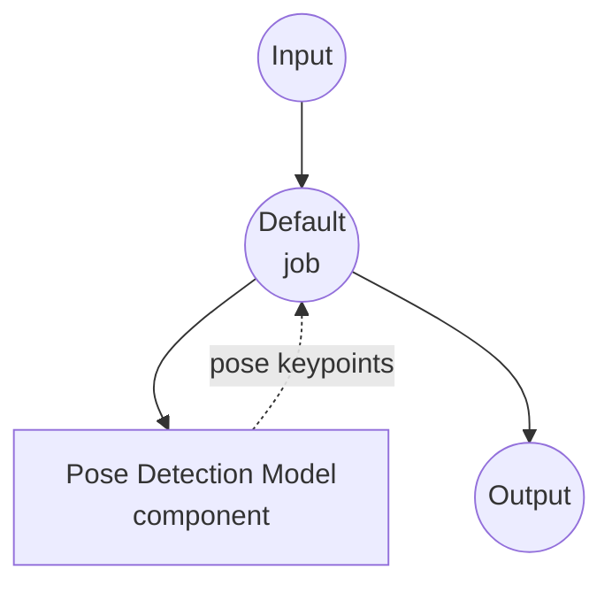

# Pose Detection Model Task 예제

이 예제는 model-compose의 내장 pose-detection 작업과 MediaPipe BlazePose를 사용하여 이미지에서 사람의 신체 키포인트를 검출하는 방법을 보여주며, 오프라인 자세 분석 기능을 제공합니다.

## 개요

이 워크플로우는 다음과 같은 로컬 자세 검출을 제공합니다:

1. **로컬 자세 모델**: 외부 API 없이 Google의 MediaPipe BlazePose 모델을 로컬에서 실행
2. **2D 및 3D 키포인트**: 33개의 자세 랜드마크를 픽셀 좌표와 실제 3D 공간 좌표로 반환
3. **다중 인물 검출**: 하나의 이미지에서 여러 사람의 자세를 검출 지원
4. **선택적 세그멘테이션**: 자세별 세그멘테이션 마스크 생성 가능
5. **자동 모델 관리**: 첫 사용 시 모델을 자동으로 다운로드하고 캐시

## 준비사항

### 필수 요구사항

- model-compose가 설치되어 PATH에서 사용 가능
- MediaPipe 실행을 위한 충분한 시스템 리소스 (권장: 4GB+ RAM)
- `mediapipe`와 `Pillow`가 있는 Python 환경 (첫 실행 시 자동 설치)

### 로컬 자세 검출을 사용하는 이유

클라우드 기반 비전 API와 달리 BlazePose를 로컬에서 실행하면 다음을 제공합니다:

**로컬 처리의 이점:**
- **프라이버시**: 모든 이미지가 로컬에서 처리되며 외부 서비스로 데이터 전송 없음
- **비용**: 이미지당 또는 API 사용 요금 없음
- **오프라인**: 초기 모델 다운로드 후 인터넷 연결 없이 작동
- **지연시간**: 매 추론마다 네트워크 왕복이 없음
- **배치 처리**: 속도 제한 없이 무제한 이미지 처리

**트레이드오프:**
- **하드웨어 요구사항**: 실시간 성능을 위해서는 적절한 CPU/GPU 리소스 필요
- **모델 제한**: BlazePose는 프레임당 한 명의 주요 인물에 최적화되어 있으며, 심한 가림이나 특이한 자세는 정확도가 저하될 수 있음

### 환경 구성

1. 이 예제 디렉토리로 이동:
   ```bash
   cd examples/model-tasks/pose-detection
   ```

2. 추가 환경 구성 불필요 - 모델 및 종속성이 자동으로 관리됩니다.

## 실행 방법

1. **서비스 시작:**
   ```bash
   model-compose up
   ```

2. **워크플로우 실행:**

   **API 사용:**
   ```bash
   # 기본 자세 검출
   curl -X POST http://localhost:8080/api/workflows/runs \
     -F "image=@/path/to/your/image.jpg" \
     -F "input={\"image\": \"@image\"}"

   # 다중 인물 검출 및 3D 키포인트 포함
   curl -X POST http://localhost:8080/api/workflows/runs \
     -F "image=@/path/to/your/image.jpg" \
     -F "input={\"image\": \"@image\", \"max_pose_count\": 3, \"return_keypoints_3d\": true}"
   ```

   **Web UI 사용:**
   - Web UI 열기: http://localhost:8081
   - 이미지 파일 업로드
   - 선택적으로 `max_pose_count`, `min_confidence`, 3D 키포인트/세그멘테이션 마스크 토글 조정
   - "Run Workflow" 버튼 클릭

   **CLI 사용:**
   ```bash
   # 기본 자세 검출
   model-compose run pose-detection --input '{"image": "/path/to/your/image.jpg"}'

   # 다중 인물 검출 및 3D 키포인트 포함
   model-compose run pose-detection --input '{"image": "/path/to/your/image.jpg", "max_pose_count": 3, "return_keypoints_3d": true}'
   ```

## 컴포넌트 상세

### Pose Detection 모델 컴포넌트 (기본)
- **유형**: pose-detection 작업이 있는 Model 컴포넌트
- **목적**: 정지 이미지에서 사람의 신체 키포인트 검출
- **드라이버**: `custom`
- **패밀리**: `blazepose`
- **모델**: `pose_landmarker_lite.task` (첫 사용 시 Google MediaPipe 모델 저장소에서 다운로드)
- **기능**:
  - `~/.cache/models/mediapipe` 아래로 모델 자동 다운로드 및 캐싱
  - 33개 신체 랜드마크 출력 (코, 눈, 어깨, 팔꿈치, 손목, 엉덩이, 무릎, 발목 등)
  - 실제 3D 좌표 (엉덩이 중심, 미터 단위)
  - 자세별 PNG 인코딩 세그멘테이션 마스크 (선택)

### 모델 정보: BlazePose (MediaPipe Pose Landmarker Lite)
- **개발**: Google MediaPipe
- **유형**: 온디바이스 자세 추정
- **랜드마크**: 33개 신체 키포인트
- **라이선스**: Apache 2.0

## 워크플로우 상세

### "Detect Human Pose from Image" 워크플로우 (기본)

**설명**: MediaPipe BlazePose를 사용해 입력 이미지에서 사람의 신체 키포인트를 검출합니다.

#### 작업 흐름

이 예제는 명시적인 작업 없이 단순화된 단일 컴포넌트 구성을 사용합니다.



#### 입력 매개변수

| 매개변수 | 유형 | 필수 | 기본값 | 설명 |
|-----------|------|----------|---------|-------------|
| `image` | image | 예 | - | 입력 이미지 파일 (JPEG, PNG 등) |
| `max_pose_count` | int | 아니요 | 1 | 이미지당 검출할 최대 자세 수 |
| `min_confidence` | float | 아니요 | 0.5 | 최소 자세 검출 신뢰도 (0.0 - 1.0) |
| `return_keypoints_3d` | bool | 아니요 | false | 실제 3D 키포인트 포함 (엉덩이 중심, 미터) |
| `return_segmentation_mask` | bool | 아니요 | false | 자세별 PNG 인코딩 세그멘테이션 마스크 포함 |

#### 출력 형식

| 필드 | 유형 | 설명 |
|-------|------|-------------|
| `result.poses` | array | 검출된 자세, 각각 `keypoints` (선택적으로 `keypoints_3d`, `segmentation_mask`) 포함 |
| `result.width` | int | 분석된 이미지의 너비 (픽셀) |
| `result.height` | int | 분석된 이미지의 높이 (픽셀) |

각 `keypoints` 항목의 필드: `x`, `y` (픽셀 좌표), `z` (상대 깊이), `visibility`, `presence`.

## 시스템 요구사항

### 최소 요구사항
- **RAM**: 4GB (권장 8GB+)
- **디스크 공간**: pose landmarker 모델용 약 50MB
- **CPU**: 멀티코어 프로세서
- **인터넷**: 초기 모델 다운로드 시에만 필요

### 성능 참고사항
- 첫 실행 시 pose landmarker 다운로드 (lite 변형의 경우 약 10MB)
- 모델 로딩은 몇 초 소요
- GPU 가속 불필요; 정지 이미지에는 CPU 추론으로 충분

## 사용자 정의

### 더 높은 정확도의 변형 사용

`model.path`를 MediaPipe의 더 큰 pose landmarker 체크포인트로 지정:

```yaml
component:
  type: model
  task: pose-detection
  driver: custom
  family: blazepose
  model:
    provider: local
    path: https://storage.googleapis.com/mediapipe-models/pose_landmarker/pose_landmarker_full/float16/latest/pose_landmarker_full.task
```

또는 최대 정확도를 위한 heavy 변형:

```yaml
component:
  model:
    provider: local
    path: https://storage.googleapis.com/mediapipe-models/pose_landmarker/pose_landmarker_heavy/float16/latest/pose_landmarker_heavy.task
```

### 로컬로 다운로드한 모델 사용

```yaml
component:
  type: model
  task: pose-detection
  driver: custom
  family: blazepose
  model: ./models/pose_landmarker_full.task
```

### 세그멘테이션이 포함된 다중 인물 검출

```yaml
component:
  action:
    image: ${input.image as image}
    max_pose_count: 5
    return_keypoints_3d: true
    return_segmentation_mask: true
```

### YOLO Pose family로 전환

BlazePose 대신 `yolo` family는 [Ultralytics YOLOv8-pose](https://docs.ultralytics.com/tasks/pose/)를 사용해 더 빠른 다중 인물 검출을 제공합니다. pose당 **17개 COCO 키포인트**(코, 눈, 귀, 어깨, 팔꿈치, 손목, 엉덩이, 무릎, 발목)를 반환하며 3D 좌표나 세그멘테이션 마스크는 지원하지 않습니다.

```yaml
component:
  type: model
  task: pose-detection
  driver: custom
  family: yolo
  model:
    provider: local
    path: https://github.com/ultralytics/assets/releases/download/v8.3.0/yolov8n-pose.pt
  max_concurrent_count: 1
  action:
    image: ${input.image as image}
    max_pose_count: 5
    min_confidence: 0.4
```

더 무거운 YOLO 체크포인트로 정확도를 높이려면:

```yaml
component:
  model:
    provider: local
    path: https://github.com/ultralytics/assets/releases/download/v8.3.0/yolov8m-pose.pt
```

사용 가능한 변형(정확도 ↑, 속도 ↓): `yolov8n-pose`, `yolov8s-pose`, `yolov8m-pose`, `yolov8l-pose`, `yolov8x-pose`.

**언제 YOLO를 선택하나:**

- 같은 프레임에서 **여러 사람을 검출**해야 할 때 — YOLO는 다중 인스턴스 검출에 최적화
- 다운스트림 모델과 호환되는 **COCO 17-포인트** 규격이 필요할 때
- 3D 키포인트나 세그멘테이션 마스크가 필요 없을 때

**언제 BlazePose를 선택하나:**

- 단일 인물 장면에서 손/발 관절 포함 33-포인트 전신 랜드마크가 필요할 때
- 실제 3D 좌표(엉덩이 중심, 미터)가 필요할 때
- 인물별 세그멘테이션 마스크가 필요할 때

## 문제 해결

### 일반적인 문제

1. **모델 다운로드 실패**: 인터넷 연결과 `storage.googleapis.com` 접근 가능 여부 확인
2. **`mediapipe` 임포트 오류**: Python 3.9+ 확인; 설정 요구사항이 설치되도록 `model-compose up` 재실행
3. **자세가 검출되지 않음**: `min_confidence`를 낮추거나, 피사체가 프레임에 온전히 보이는지 확인
4. **낮은 정확도**: `pose_landmarker_full` 또는 `pose_landmarker_heavy` 변형으로 전환

### 성능 최적화

- **모델 선택**: 속도를 위해 `lite`, 정확도를 위해 `heavy` 사용
- **이미지 전처리**: 매우 큰 이미지는 제출 전 축소 — BlazePose는 약 1024px 이상의 해상도에서 이점을 얻지 못함
