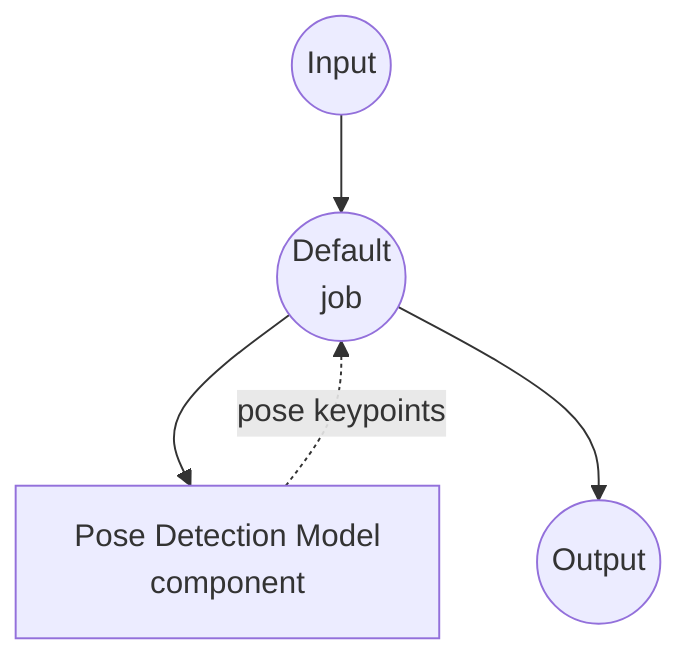

# Pose Detection Model Task Example

This example demonstrates how to use MediaPipe BlazePose to detect human body keypoints from images using model-compose's built-in pose-detection task, providing offline pose analysis capabilities.

## Overview

This workflow provides local pose detection that:

1. **Local Pose Model**: Runs Google's MediaPipe BlazePose model locally without external APIs
2. **2D & 3D Keypoints**: Returns 33 pose landmarks in both pixel coordinates and real-world 3D space
3. **Bounding Box**: Returns an axis-aligned bounding box per detected pose
4. **Multi-Person Detection**: Supports detecting multiple poses in a single image
5. **Optional Segmentation**: Can produce per-pose segmentation masks
6. **Optional Skeleton Image**: Can render a per-pose skeleton image (natural layout or OpenPose BODY_18, suitable as ControlNet input)
7. **Automatic Model Management**: Downloads and caches the model automatically on first use

## Preparation

### Prerequisites

- model-compose installed and available in your PATH
- Sufficient system resources to run MediaPipe (recommended: 4GB+ RAM)
- Python environment with `mediapipe` and `Pillow` (installed automatically on first run)

### Why Local Pose Detection

Unlike cloud-based vision APIs, running BlazePose locally provides:

**Benefits of Local Processing:**
- **Privacy**: All images are processed locally, no data sent to external services
- **Cost**: No per-image or API usage fees
- **Offline**: Works without an internet connection after the initial model download
- **Latency**: No network round-trip on every inference
- **Batch Processing**: Unlimited image processing without rate limits

**Trade-offs:**
- **Hardware Requirements**: Requires adequate CPU/GPU resources for real-time performance
- **Model Limitations**: BlazePose is optimized for a single dominant person per frame; extreme occlusions or unusual poses may reduce accuracy

### Environment Configuration

1. Navigate to this example directory:
   ```bash
   cd examples/model-tasks/pose-detection
   ```

2. No additional environment configuration required - the model and dependencies are managed automatically.

## How to Run

1. **Start the service:**
   ```bash
   model-compose up
   ```

2. **Run the workflow:**

   **Using API:**
   ```bash
   # Basic pose detection
   curl -X POST http://localhost:8080/api/workflows/runs \
     -F "image=@/path/to/your/image.jpg" \
     -F "input={\"image\": \"@image\"}"

   # Detect multiple people and include 3D keypoints
   curl -X POST http://localhost:8080/api/workflows/runs \
     -F "image=@/path/to/your/image.jpg" \
     -F "input={\"image\": \"@image\", \"max_pose_count\": 3, \"return_keypoints_3d\": true}"

   # Render an OpenPose-style skeleton image (usable as ControlNet OpenPose input)
   curl -X POST http://localhost:8080/api/workflows/runs \
     -F "image=@/path/to/your/image.jpg" \
     -F "input={\"image\": \"@image\", \"return_skeleton_image\": true, \"skeleton_format\": \"openpose\"}"
   ```

   **Using Web UI:**
   - Open the Web UI: http://localhost:8081
   - Upload an image file
   - Optionally adjust `max_pose_count`, `min_confidence`, and toggles for 3D keypoints / segmentation mask / skeleton image (with `skeleton_format`)
   - Click the "Run Workflow" button

   **Using CLI:**
   ```bash
   # Basic pose detection
   model-compose run pose-detection --input '{"image": "/path/to/your/image.jpg"}'

   # With multi-person detection and 3D keypoints
   model-compose run pose-detection --input '{"image": "/path/to/your/image.jpg", "max_pose_count": 3, "return_keypoints_3d": true}'

   # Render a skeleton image in OpenPose BODY_18 layout
   model-compose run pose-detection --input '{"image": "/path/to/your/image.jpg", "return_skeleton_image": true, "skeleton_format": "openpose"}'
   ```

## Component Details

### Pose Detection Model Component (Default)
- **Type**: Model component with pose-detection task
- **Purpose**: Detect human body keypoints from still images
- **Driver**: `custom`
- **Family**: `blazepose`
- **Model**: `pose_landmarker_lite.task` (downloaded from Google's MediaPipe model store on first use)
- **Features**:
  - Automatic model downloading and caching under `~/.cache/models/mediapipe`
  - 33-point body landmark output (nose, eyes, shoulders, elbows, wrists, hips, knees, ankles, etc.)
  - Real-world 3D coordinates (hip-centered, in meters)
  - Axis-aligned bounding box derived from visible keypoints
  - Optional PNG-encoded segmentation masks per pose
  - Optional skeleton image rendering (natural 33-point layout or OpenPose BODY_18, suitable as ControlNet OpenPose input)

### Model Information: BlazePose (MediaPipe Pose Landmarker Lite)
- **Developer**: Google MediaPipe
- **Type**: On-device pose estimation
- **Landmarks**: 33 body keypoints
- **License**: Apache 2.0

## Workflow Details

### "Detect Human Pose from Image" Workflow (Default)

**Description**: Detect human body keypoints from an input image using MediaPipe BlazePose.

#### Job Flow

This example uses a simplified single-component configuration without explicit jobs.



#### Input Parameters

| Parameter | Type | Required | Default | Description |
|-----------|------|----------|---------|-------------|
| `image` | image | Yes | - | Input image file (JPEG, PNG, etc.) |
| `max_pose_count` | int | No | 1 | Maximum number of poses to detect per image |
| `min_confidence` | float | No | 0.5 | Minimum pose-detection confidence (0.0 - 1.0) |
| `return_keypoints_3d` | bool | No | false | Include real-world 3D keypoints (hip-centered, meters) |
| `return_segmentation_mask` | bool | No | false | Include a PNG-encoded segmentation mask per pose |
| `return_skeleton_image` | bool | No | false | Render a per-pose skeleton image on a black canvas |
| `skeleton_format` | string | No | `natural` | Skeleton layout: `natural` (33-point BlazePose) or `openpose` (BODY_18, ControlNet-ready) |

#### Output Format

| Field | Type | Description |
|-------|------|-------------|
| `result.poses` | array | Detected poses. Each pose always includes `bounding_box` and (by default) `keypoints`; may also include `keypoints_3d`, `segmentation_mask`, `skeleton_image` when requested |
| `result.width` | int | Width of the analyzed image in pixels |
| `result.height` | int | Height of the analyzed image in pixels |

Each pose entry:
- `bounding_box`: `[x, y, width, height]` in pixel coordinates, derived from visible keypoints
- `keypoints`: 33 entries with `x`, `y` (pixel coordinates), `z` (relative depth), `visibility`, `presence`
- `keypoints_3d` *(optional)*: same shape as `keypoints`, in real-world meters (hip-centered)
- `segmentation_mask` *(optional)*: PNG-encoded grayscale mask
- `skeleton_image` *(optional)*: PNG-encoded skeleton on a black canvas (layout determined by `skeleton_format`)

## System Requirements

### Minimum Requirements
- **RAM**: 4GB (recommended 8GB+)
- **Disk Space**: ~50MB for the pose landmarker model
- **CPU**: Multi-core processor
- **Internet**: Required for initial model download only

### Performance Notes
- First run downloads the pose landmarker (~10MB for the lite variant)
- Model loading takes a few seconds
- GPU acceleration is not required; CPU inference is fast enough for still images

## Customization

### Using a Higher-Accuracy Variant

Point `model.path` at one of MediaPipe's larger pose landmarker checkpoints:

```yaml
component:
  type: model
  task: pose-detection
  driver: custom
  family: blazepose
  model:
    provider: local
    path: https://storage.googleapis.com/mediapipe-models/pose_landmarker/pose_landmarker_full/float16/latest/pose_landmarker_full.task
```

Or use the heavy variant for maximum accuracy:

```yaml
component:
  model:
    provider: local
    path: https://storage.googleapis.com/mediapipe-models/pose_landmarker/pose_landmarker_heavy/float16/latest/pose_landmarker_heavy.task
```

### Using a Locally Downloaded Model

```yaml
component:
  type: model
  task: pose-detection
  driver: custom
  family: blazepose
  model: ./models/pose_landmarker_full.task
```

### Multi-Person Detection with Segmentation

```yaml
component:
  action:
    image: ${input.image as image}
    max_pose_count: 5
    return_keypoints_3d: true
    return_segmentation_mask: true
```

### Rendering a ControlNet-Ready Skeleton Image

Set `skeleton_format: openpose` to remap keypoints to the OpenPose BODY_18 layout with the standard OpenPose color palette. The resulting `skeleton_image` can be piped directly into a ControlNet OpenPose preprocessor / model.

```yaml
component:
  action:
    image: ${input.image as image}
    return_keypoints: false
    return_skeleton_image: true
    skeleton_format: openpose
    output: ${result.poses[0].skeleton_image}
```

For a debug-style visualization that keeps the backend's own topology, set `skeleton_format: natural` (default). It uses an HSV palette so each limb stays visually distinguishable regardless of the keypoint count.

### Switching to YOLO Pose Family

Instead of BlazePose, the `yolo` family runs [Ultralytics YOLOv8-pose](https://docs.ultralytics.com/tasks/pose/) for faster multi-person detection. It returns **17 COCO keypoints** per pose (nose, eyes, ears, shoulders, elbows, wrists, hips, knees, ankles) plus the model's own `bounding_box` and detection `score`. No 3D coordinates or segmentation masks. `return_skeleton_image` and `skeleton_format: openpose` work the same way.

```yaml
component:
  type: model
  task: pose-detection
  driver: custom
  family: yolo
  model:
    provider: local
    path: https://github.com/ultralytics/assets/releases/download/v8.3.0/yolov8n-pose.pt
  max_concurrent_count: 1
  action:
    image: ${input.image as image}
    max_pose_count: 5
    min_confidence: 0.4
```

Point `model` at a heavier YOLO checkpoint for higher accuracy:

```yaml
component:
  model:
    provider: local
    path: https://github.com/ultralytics/assets/releases/download/v8.3.0/yolov8m-pose.pt
```

Available variants (accuracy ↑, speed ↓): `yolov8n-pose`, `yolov8s-pose`, `yolov8m-pose`, `yolov8l-pose`, `yolov8x-pose`.

**When to pick YOLO over BlazePose:**

- Detecting **many people** in the same frame — YOLO is optimized for multi-instance detection
- Prefer the ubiquitous **COCO 17-point** convention for downstream models
- Don't need 3D keypoints or segmentation masks

**When to pick BlazePose:**

- Single-person scenes where 33-point full-body landmarks (including hand/foot pivots) matter
- Need real-world 3D coordinates (hip-centered, meters)
- Need per-person segmentation masks

## Troubleshooting

### Common Issues

1. **Model Download Fails**: Check internet connection and that `storage.googleapis.com` is reachable
2. **`mediapipe` Import Error**: Ensure Python 3.9+; re-run `model-compose up` so setup requirements are installed
3. **No Poses Detected**: Lower `min_confidence`, or verify the subject is fully visible in the frame
4. **Poor Accuracy**: Switch to the `pose_landmarker_full` or `pose_landmarker_heavy` variant

### Performance Optimization

- **Model Selection**: Use `lite` for speed, `heavy` for accuracy
- **Image Preprocessing**: Downscale very large images before submission — BlazePose does not benefit from resolutions above ~1024px
