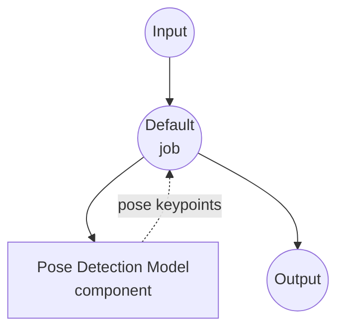

# 姿态检测模型任务示例

此示例演示如何使用 model-compose 的内置 pose-detection 任务通过 MediaPipe BlazePose 从图像中检测人体关键点，提供离线姿态分析能力。

## 概述

此工作流提供本地姿态检测功能，包括：

1. **本地姿态模型**：无需外部 API，在本地运行 Google 的 MediaPipe BlazePose 模型
2. **2D 和 3D 关键点**：以像素坐标和真实 3D 空间返回 33 个姿态地标
3. **多人检测**：支持在单张图像中检测多个姿态
4. **可选分割**：可为每个姿态生成分割掩码
5. **自动模型管理**：首次使用时自动下载和缓存模型

## 准备工作

### 前置条件

- 已安装 model-compose 并在 PATH 中可用
- 运行 MediaPipe 的足够系统资源（推荐：4GB+ RAM）
- 具有 `mediapipe` 和 `Pillow` 的 Python 环境（首次运行时自动安装）

### 为什么使用本地姿态检测

与基于云的视觉 API 不同，在本地运行 BlazePose 提供：

**本地处理的优势：**
- **隐私**：所有图像都在本地处理，不向外部服务发送数据
- **成本**：无按图像或 API 使用费用
- **离线**：初始模型下载后可在无互联网连接的情况下工作
- **延迟**：每次推理无网络往返
- **批量处理**：无速率限制的无限图像处理

**权衡：**
- **硬件要求**：实时性能需要足够的 CPU/GPU 资源
- **模型限制**：BlazePose 针对每帧一个主要人物进行了优化；严重遮挡或不寻常的姿态可能降低精度

### 环境配置

1. 导航到此示例目录：
   ```bash
   cd examples/model-tasks/pose-detection
   ```

2. 无需额外的环境配置 - 模型和依赖项会自动管理。

## 运行方法

1. **启动服务：**
   ```bash
   model-compose up
   ```

2. **运行工作流：**

   **使用 API：**
   ```bash
   # 基本姿态检测
   curl -X POST http://localhost:8080/api/workflows/runs \
     -F "image=@/path/to/your/image.jpg" \
     -F "input={\"image\": \"@image\"}"

   # 检测多个人并包含 3D 关键点
   curl -X POST http://localhost:8080/api/workflows/runs \
     -F "image=@/path/to/your/image.jpg" \
     -F "input={\"image\": \"@image\", \"max_pose_count\": 3, \"return_keypoints_3d\": true}"
   ```

   **使用 Web UI：**
   - 打开 Web UI：http://localhost:8081
   - 上传图像文件
   - 可选择调整 `max_pose_count`、`min_confidence` 以及 3D 关键点 / 分割掩码开关
   - 点击 "Run Workflow" 按钮

   **使用 CLI：**
   ```bash
   # 基本姿态检测
   model-compose run pose-detection --input '{"image": "/path/to/your/image.jpg"}'

   # 多人检测和 3D 关键点
   model-compose run pose-detection --input '{"image": "/path/to/your/image.jpg", "max_pose_count": 3, "return_keypoints_3d": true}'
   ```

## 组件详情

### 姿态检测模型组件（默认）
- **类型**：具有 pose-detection 任务的 Model 组件
- **目的**：从静态图像中检测人体关键点
- **驱动**：`custom`
- **系列**：`blazepose`
- **模型**：`pose_landmarker_lite.task`（首次使用时从 Google MediaPipe 模型库下载）
- **功能**：
  - 自动下载并缓存到 `~/.cache/models/mediapipe`
  - 33 点身体地标输出（鼻子、眼睛、肩膀、肘部、手腕、髋部、膝盖、脚踝等）
  - 真实 3D 坐标（以髋部为中心，以米为单位）
  - 每个姿态的 PNG 编码分割掩码（可选）

### 模型信息：BlazePose (MediaPipe Pose Landmarker Lite)
- **开发者**：Google MediaPipe
- **类型**：设备端姿态估计
- **地标**：33 个身体关键点
- **许可证**：Apache 2.0

## 工作流详情

### "Detect Human Pose from Image" 工作流（默认）

**描述**：使用 MediaPipe BlazePose 从输入图像中检测人体关键点。

#### 作业流程

此示例使用简化的单组件配置，无显式作业。



#### 输入参数

| 参数 | 类型 | 必需 | 默认值 | 描述 |
|-----------|------|----------|---------|-------------|
| `image` | image | 是 | - | 输入图像文件（JPEG、PNG 等） |
| `max_pose_count` | int | 否 | 1 | 每张图像检测的最大姿态数 |
| `min_confidence` | float | 否 | 0.5 | 最小姿态检测置信度（0.0 - 1.0） |
| `return_keypoints_3d` | bool | 否 | false | 包含真实 3D 关键点（以髋部为中心，以米为单位） |
| `return_segmentation_mask` | bool | 否 | false | 为每个姿态包含 PNG 编码的分割掩码 |

#### 输出格式

| 字段 | 类型 | 描述 |
|-------|------|-------------|
| `result.poses` | array | 检测到的姿态，每个包含 `keypoints`（可选包含 `keypoints_3d`、`segmentation_mask`） |
| `result.width` | int | 分析图像的宽度（像素） |
| `result.height` | int | 分析图像的高度（像素） |

每个 `keypoints` 条目的字段：`x`、`y`（像素坐标）、`z`（相对深度）、`visibility`、`presence`。

## 系统要求

### 最低要求
- **RAM**：4GB（推荐 8GB+）
- **磁盘空间**：姿态 landmarker 模型约 50MB
- **CPU**：多核处理器
- **互联网**：仅初始模型下载时需要

### 性能注意事项
- 首次运行下载姿态 landmarker（lite 版本约 10MB）
- 模型加载需几秒
- 无需 GPU 加速；对于静态图像，CPU 推理已足够快

## 自定义

### 使用更高精度的变体

将 `model.path` 指向 MediaPipe 更大的姿态 landmarker 检查点：

```yaml
component:
  type: model
  task: pose-detection
  driver: custom
  family: blazepose
  model:
    provider: local
    path: https://storage.googleapis.com/mediapipe-models/pose_landmarker/pose_landmarker_full/float16/latest/pose_landmarker_full.task
```

或使用 heavy 变体以获得最大精度：

```yaml
component:
  model:
    provider: local
    path: https://storage.googleapis.com/mediapipe-models/pose_landmarker/pose_landmarker_heavy/float16/latest/pose_landmarker_heavy.task
```

### 使用本地下载的模型

```yaml
component:
  type: model
  task: pose-detection
  driver: custom
  family: blazepose
  model: ./models/pose_landmarker_full.task
```

### 带分割的多人检测

```yaml
component:
  action:
    image: ${input.image as image}
    max_pose_count: 5
    return_keypoints_3d: true
    return_segmentation_mask: true
```

### 切换到 YOLO Pose 系列

除了 BlazePose，`yolo` 系列使用 [Ultralytics YOLOv8-pose](https://docs.ultralytics.com/tasks/pose/) 提供更快的多人检测。它为每个姿态返回 **17 个 COCO 关键点**（鼻子、眼睛、耳朵、肩膀、肘部、手腕、髋部、膝盖、脚踝）——不提供 3D 坐标或分割掩码。

```yaml
component:
  type: model
  task: pose-detection
  driver: custom
  family: yolo
  model:
    provider: local
    path: https://github.com/ultralytics/assets/releases/download/v8.3.0/yolov8n-pose.pt
  max_concurrent_count: 1
  action:
    image: ${input.image as image}
    max_pose_count: 5
    min_confidence: 0.4
```

将 `model` 指向更重的 YOLO 检查点以获得更高精度：

```yaml
component:
  model:
    provider: local
    path: https://github.com/ultralytics/assets/releases/download/v8.3.0/yolov8m-pose.pt
```

可用变体（精度 ↑，速度 ↓）：`yolov8n-pose`、`yolov8s-pose`、`yolov8m-pose`、`yolov8l-pose`、`yolov8x-pose`。

**何时选择 YOLO：**

- 同一帧中检测**多个人物**时——YOLO 针对多实例检测进行了优化
- 需要与下游模型兼容的 **COCO 17 点**规范
- 不需要 3D 关键点或分割掩码

**何时选择 BlazePose：**

- 单人场景，需要 33 点全身地标（包括手/脚关节）
- 需要真实 3D 坐标（以髋部为中心，以米为单位）
- 需要每个人物的分割掩码

## 故障排除

### 常见问题

1. **模型下载失败**：检查互联网连接以及 `storage.googleapis.com` 是否可访问
2. **`mediapipe` 导入错误**：确保 Python 3.9+；重新运行 `model-compose up` 以安装设置要求
3. **未检测到姿态**：降低 `min_confidence`，或验证主体在画面中完全可见
4. **精度较低**：切换到 `pose_landmarker_full` 或 `pose_landmarker_heavy` 变体

### 性能优化

- **模型选择**：使用 `lite` 追求速度，使用 `heavy` 追求精度
- **图像预处理**：提交前缩小非常大的图像 —— BlazePose 在约 1024px 以上的分辨率下不会获益
