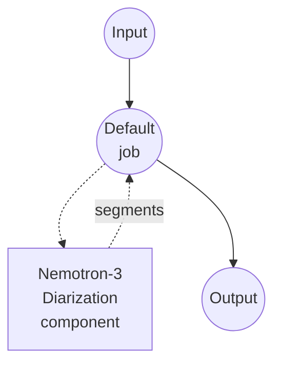

# Nemotron 3를 활용한 화자 다이어리제이션 예제

이 예제는 NVIDIA의 [Nemotron-3-Diarization](https://huggingface.co/nvidia/Nemotron-3-Diarization) 모델을 사용해 여러 화자가 등장하는 오디오 파일에서 화자 다이어리제이션을 수행합니다. model-compose에 내장된 `speaker-diarization` 태스크로 실행됩니다.

## 개요

이 워크플로우는 입력 오디오에서 감지된 화자 발화 구간을 평탄한 리스트로 반환합니다:

1. **Nemotron 3 Diarization**: NVIDIA가 오픈웨이트로 공개한 약 100M 파라미터 규모의 Sortformer 기반 프레임 분류기. 최대 8명의 동시 화자를 지원하며 1~4명 범위에서 성능이 가장 좋습니다.
2. **로컬 추론**: 최초 1회 모델 다운로드 이후 완전히 로컬에서 실행됩니다.
3. **발화 구간 분할**: 감지된 각 발화에 대해 `speaker`, `start_time`, `end_time`, `confidence`를 반환합니다.
4. **선택적 스트리밍**: `streaming_latency` 프리셋을 지정하면 저지연 모드로 청크 단위 추론을 수행합니다 (미지정 시 오프라인 모드로 전체 클립을 한 번에 처리).

## 사전 준비

### 필수 조건

- model-compose가 설치되어 PATH에 등록되어 있어야 합니다
- `torch`, `torchaudio`, `transformers`, `accelerate`, `soxr`가 있는 Python 환경 (컴포넌트의 setup 요구사항으로 선언되어 있어 최초 실행 시 자동 설치됩니다)

### Nemotron 3 Diarization을 왜 사용하나

- **경량**: 디스크 용량 약 400MB, 단일 컨슈머 GPU(RTX 3090/4090급 이상)에서 여유롭게 동작하며 짧은 클립은 CPU에서도 실행 가능
- **높은 처리량**: NVIDIA 발표 기준 RTX PRO 5000에서 오프라인 모드/배치 32일 때 최대 15k RTFx
- **스트리밍 지원**: 엔드투엔드 320ms까지 낮출 수 있는 지연시간 프리셋 내장
- **오픈 웨이트**: 관대한 라이선스로 HuggingFace Hub에 공개

참고: 다이어리제이션은 화자별 *시간 구간*을 반환하는 것이지, 소스 분리된 오디오를 만드는 것이 아닙니다. 두 화자가 겹쳐 말하면 두 사람 모두 라벨링되고 시간 구간이 겹치지만, 원본 오디오 자체가 분리되지는 않습니다.

## 실행 방법

1. **서비스 시작:**
   ```bash
   model-compose up
   ```

2. **워크플로우 실행:**

   **API 사용:**
   ```bash
   # 기본 다이어리제이션
   curl -X POST http://localhost:8080/api/workflows/runs \
     -F "audio=@/path/to/your/audio.mp3" \
     -F "input={\"audio\": \"@audio\"}"

   # 후처리 적용
   curl -X POST http://localhost:8080/api/workflows/runs \
     -F "audio=@/path/to/your/audio.mp3" \
     -F "input={\"audio\": \"@audio\", \"merge_gap\": \"500ms\", \"min_segment_duration\": \"250ms\"}"
   ```

   **웹 UI 사용:**
   - 웹 UI 열기: http://localhost:8081
   - 오디오 파일 업로드 (MP3, WAV, FLAC, OPUS)
   - 선택적으로 `min_segment_duration`, `merge_gap` 설정
   - "Run Workflow" 버튼 클릭

   **CLI 사용:**
   ```bash
   model-compose run speaker-diarization-nemotron --input '{
     "audio": "/path/to/your/audio.mp3",
     "merge_gap": "500ms",
     "min_segment_duration": "250ms"
   }'
   ```

## 컴포넌트 상세

### Speaker Diarization 모델 컴포넌트 (기본)

- **타입**: `speaker-diarization` 태스크의 model 컴포넌트
- **드라이버**: `huggingface`
- **역할**: 화자 정체성 기준으로 오디오를 분할
- **특징**:
  - 최초 1회 모델 다운로드 후 로컬에서 추론
  - 겹치는 발화 처리 (동시 화자 최대 8명)
  - 청크 단위 추론을 위한 선택적 스트리밍 지연시간 프리셋 제공

### 모델 정보: Nemotron-3-Diarization

- **개발**: NVIDIA
- **아키텍처**: Sortformer 엔드투엔드 다이어리제이션 (프레임 단위 화자 분류기)
- **파라미터 수**: 약 100M
- **샘플레이트**: 16kHz 모노 (오디오는 자동 리샘플/다운믹스됨)
- **라이선스**: 정확한 조항은 HuggingFace 모델 카드 참고

## 워크플로우 상세

### "Speaker Diarization (Nemotron 3)" 워크플로우 (기본)

**설명**: 오디오 파일에서 화자 발화 구간을 감지해 평탄한 리스트로 반환합니다.

#### 작업 흐름



#### 입력 파라미터

| 파라미터 | 타입 | 필수 | 기본값 | 설명 |
|----------|------|------|--------|------|
| `audio` | audio | 예 | - | 입력 오디오 파일 (MP3, WAV, FLAC, OPUS) |
| `min_segment_duration` | duration | 아니오 | `0s` | 이 값보다 짧은 발화는 제거 |
| `merge_gap` | duration | 아니오 | `0s` | 같은 화자의 발화가 이 간격 이하로 떨어져 있으면 병합 |

duration 필드는 `"250ms"`, `"0.5s"` 또는 초 단위 숫자를 받을 수 있습니다.

액션 레벨의 `streaming_latency` 필드로 스트리밍 지연시간 프리셋을 사용할 수 있습니다: `low`, `very_low`, `ultra_low`. 지정하지 않으면 전체 클립을 한 번에 처리하는 오프라인 모드로 동작합니다.

#### 출력 포맷

워크플로우 출력은 화자 발화 구간의 평탄한 JSON 배열을 포함하는 객체입니다.

| 필드 | 타입 | 설명 |
|------|------|------|
| `speaker` | string | 화자 라벨 (예: `speaker_0`, `speaker_1`) |
| `start_time` | float | 발화 시작 시각(초) |
| `end_time` | float | 발화 종료 시각(초) |
| `confidence` | float | 자리표시자 값(`1.0`). 프레임 분류기는 발화 단위 확률을 제공하지 않음 |

#### 출력 예시

```json
{
  "segments": [
    { "speaker": "speaker_0", "start_time": 0.51, "end_time": 12.62, "confidence": 1.0 },
    { "speaker": "speaker_1", "start_time": 12.80, "end_time": 24.05, "confidence": 1.0 },
    { "speaker": "speaker_0", "start_time": 24.10, "end_time": 29.85, "confidence": 1.0 }
  ]
}
```

## 음성 인식과 체이닝

Nemotron 다이어리제이션과 ASR 모델을 결합하면 화자 라벨링 트랜스크립트를 만들 수 있습니다:

```yaml
workflow:
  jobs:
    - id: diarize
      component: nemotron-diarizer
      input:
        audio: ${input.audio as audio}

    - id: transcribe
      component: whisper
      depends_on: [diarize]
      input:
        audio: ${input.audio as audio}
        segments: ${jobs.diarize.output}

components:
  - id: nemotron-diarizer
    type: model
    task: speaker-diarization
    driver: huggingface
    model:
      provider: huggingface
      repository: nvidia/Nemotron-3-Diarization

  - id: whisper
    type: model
    task: speech-to-text
    driver: huggingface
    architecture: whisper
    model: openai/whisper-large-v3-turbo
```

## 문제 해결

### 자주 발생하는 문제

1. **같은 화자가 여러 짧은 발화로 쪼개짐**: `merge_gap`을 늘려(예: `"500ms"` 또는 `"1s"`) 같은 화자의 인접 발화를 합치세요.
2. **클립에 화자가 8명을 초과함**: Nemotron-3-Diarization은 설계상 최대 8명의 동시 화자만 지원하며, 초과분은 가장 가까운 라벨로 병합됩니다.
3. **잡음이나 음악이 화자로 잡힘**: `voice-activity-detection` 태스크로 전처리한 뒤 음성 구간만 다이어리제이션하세요.
