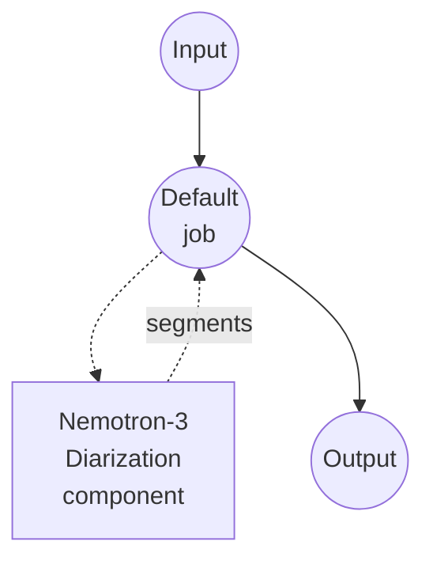

# Speaker Diarization with Nemotron 3 Example

This example runs speaker diarization on a multi-speaker audio file using NVIDIA's [Nemotron-3-Diarization](https://huggingface.co/nvidia/Nemotron-3-Diarization) model with model-compose's built-in `speaker-diarization` task.

## Overview

The workflow returns a flat list of speaker turns detected in the input audio:

1. **Nemotron 3 Diarization**: A ~100M-parameter Sortformer-based frame classifier from NVIDIA, released under an open-weight license. Supports up to 8 concurrent speakers and works best with 1-4.
2. **Local Inference**: Runs fully on your machine after a one-time model download.
3. **Turn Segmentation**: Emits `speaker`, `start_time`, `end_time`, and `confidence` for each detected speaker turn.
4. **Optional Streaming**: A `streaming_latency` preset switches the model into a chunked mode for low-latency scenarios (offline runs cover the full clip).

## Preparation

### Prerequisites

- model-compose installed and available in your PATH
- Python environment with `torch`, `torchaudio`, `transformers`, `accelerate`, `soxr` (declared as component setup requirements and auto-installed on first run)

### Why Nemotron 3 Diarization

- **Compact**: About 400 MB on disk, runs comfortably on a single consumer GPU (RTX 3090/4090 class or better) and on CPU for shorter clips.
- **High throughput**: NVIDIA reports up to 15k RTFx at batch size 32 on an RTX PRO 5000 in offline mode.
- **Streaming-ready**: Ships with latency presets down to 320 ms end-to-end.
- **Open weights**: Permissively licensed and hosted on HuggingFace Hub.

Note: diarization returns *time ranges* per speaker, not source-separated audio. When two speakers overlap, both are labeled and their time ranges overlap; the original audio itself is not unmixed.

## How to Run

1. **Start the service:**
   ```bash
   model-compose up
   ```

2. **Run the workflow:**

   **Using API:**
   ```bash
   # Basic diarization
   curl -X POST http://localhost:8080/api/workflows/runs \
     -F "audio=@/path/to/your/audio.mp3" \
     -F "input={\"audio\": \"@audio\"}"

   # With post-processing
   curl -X POST http://localhost:8080/api/workflows/runs \
     -F "audio=@/path/to/your/audio.mp3" \
     -F "input={\"audio\": \"@audio\", \"merge_gap\": \"500ms\", \"min_segment_duration\": \"250ms\"}"
   ```

   **Using Web UI:**
   - Open the Web UI: http://localhost:8081
   - Upload an audio file (MP3, WAV, FLAC, OPUS)
   - Optionally set `min_segment_duration`, `merge_gap`
   - Click the "Run Workflow" button

   **Using CLI:**
   ```bash
   model-compose run speaker-diarization-nemotron --input '{
     "audio": "/path/to/your/audio.mp3",
     "merge_gap": "500ms",
     "min_segment_duration": "250ms"
   }'
   ```

## Component Details

### Speaker Diarization Model Component (Default)

- **Type**: Model component with `speaker-diarization` task
- **Driver**: `huggingface`
- **Purpose**: Segment audio by speaker identity
- **Features**:
  - Local inference after one-time model download
  - Handles overlapping speech (up to 8 concurrent speakers)
  - Optional streaming latency presets for chunked inference

### Model Information: Nemotron-3-Diarization

- **Developer**: NVIDIA
- **Architecture**: Sortformer end-to-end diarization (frame-level speaker classifier)
- **Parameters**: ~100M
- **Sample Rate**: 16 kHz mono (audio is auto-resampled and downmixed)
- **License**: See the model card on HuggingFace for the exact terms

## Workflow Details

### "Speaker Diarization (Nemotron 3)" Workflow (Default)

**Description**: Detect speaker turns in an audio file and return them as a flat list.

#### Job Flow



#### Input Parameters

| Parameter | Type | Required | Default | Description |
|-----------|------|----------|---------|-------------|
| `audio` | audio | Yes | - | Input audio file (MP3, WAV, FLAC, OPUS) |
| `min_segment_duration` | duration | No | `0s` | Discard turns shorter than this |
| `merge_gap` | duration | No | `0s` | Merge same-speaker turns separated by <= this gap |

Duration fields accept values like `"250ms"`, `"0.5s"`, or bare numeric seconds.

Streaming latency presets are available via the action-level `streaming_latency` field: `low`, `very_low`, `ultra_low`. Leaving it unset runs offline diarization on the full clip.

#### Output Format

The workflow output is a JSON object containing a flat array of speaker turns.

| Field | Type | Description |
|-------|------|-------------|
| `speaker` | string | Speaker label (e.g. `speaker_0`, `speaker_1`) |
| `start_time` | float | Turn start time in seconds |
| `end_time` | float | Turn end time in seconds |
| `confidence` | float | Placeholder confidence (`1.0`); the frame classifier does not expose per-turn probabilities |

#### Example Output

```json
{
  "segments": [
    { "speaker": "speaker_0", "start_time": 0.51, "end_time": 12.62, "confidence": 1.0 },
    { "speaker": "speaker_1", "start_time": 12.80, "end_time": 24.05, "confidence": 1.0 },
    { "speaker": "speaker_0", "start_time": 24.10, "end_time": 29.85, "confidence": 1.0 }
  ]
}
```

## Chaining with Speech-to-Text

Produce a speaker-labeled transcript by combining Nemotron diarization with an ASR model:

```yaml
workflow:
  jobs:
    - id: diarize
      component: nemotron-diarizer
      input:
        audio: ${input.audio as audio}

    - id: transcribe
      component: whisper
      depends_on: [diarize]
      input:
        audio: ${input.audio as audio}
        segments: ${jobs.diarize.output}

components:
  - id: nemotron-diarizer
    type: model
    task: speaker-diarization
    driver: huggingface
    model:
      provider: huggingface
      repository: nvidia/Nemotron-3-Diarization

  - id: whisper
    type: model
    task: speech-to-text
    driver: huggingface
    architecture: whisper
    model: openai/whisper-large-v3-turbo
```

## Troubleshooting

### Common Issues

1. **Same speaker split into many short turns**: Increase `merge_gap` (e.g. `"500ms"` or `"1s"`) to fuse adjacent turns from the same speaker.
2. **More than 8 speakers in the clip**: Nemotron-3-Diarization is limited to 8 concurrent speakers by design; excess speakers will be merged into the nearest labels.
3. **Noise or music detected as a speaker**: Preprocess with the `voice-activity-detection` task and only diarize the speech regions.
