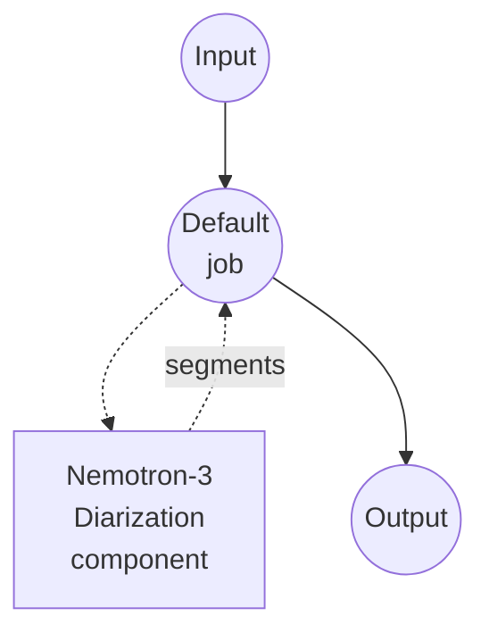

# 使用 Nemotron 3 的说话人分离示例

本示例使用 NVIDIA 的 [Nemotron-3-Diarization](https://huggingface.co/nvidia/Nemotron-3-Diarization) 模型,对包含多位说话人的音频文件执行说话人分离,通过 model-compose 内置的 `speaker-diarization` 任务运行。

## 概述

该工作流会返回从输入音频中检测到的说话人发言片段的扁平列表:

1. **Nemotron 3 Diarization**: NVIDIA 以开放权重发布的约 100M 参数 Sortformer 帧级分类器。最多支持 8 位同时说话人,在 1~4 位时效果最佳。
2. **本地推理**: 首次下载模型后完全在本地运行。
3. **发言片段分割**: 为每个检测到的发言输出 `speaker`、`start_time`、`end_time`、`confidence`。
4. **可选流式模式**: 通过 `streaming_latency` 预设可切换到分块低延迟推理模式(不设置则以离线模式一次处理整个音频)。

## 准备工作

### 必要条件

- 已安装 model-compose 并加入 PATH
- Python 环境包含 `torch`、`torchaudio`、`transformers`、`accelerate`、`soxr`(已声明为组件的 setup 依赖,首次运行时自动安装)

### 为什么选择 Nemotron 3 Diarization

- **轻量**: 磁盘占用约 400MB,可在单张消费级 GPU(RTX 3090/4090 及以上)上流畅运行,较短的音频也可用 CPU 处理
- **高吞吐**: NVIDIA 报告在 RTX PRO 5000 离线模式、批大小 32 下最高可达 15k RTFx
- **可流式**: 内置的延迟预设可将端到端延迟压至 320ms
- **开放权重**: 采用宽松许可证,托管于 HuggingFace Hub

注意: 说话人分离返回的是每位说话人的 *时间区间*,并不是分离后的音频源。当两位说话人重叠发言时,他们都会被标注且时间区间会重叠,但原始音频本身不会被解混。

## 运行方法

1. **启动服务:**
   ```bash
   model-compose up
   ```

2. **运行工作流:**

   **使用 API:**
   ```bash
   # 基础说话人分离
   curl -X POST http://localhost:8080/api/workflows/runs \
     -F "audio=@/path/to/your/audio.mp3" \
     -F "input={\"audio\": \"@audio\"}"

   # 配合后处理
   curl -X POST http://localhost:8080/api/workflows/runs \
     -F "audio=@/path/to/your/audio.mp3" \
     -F "input={\"audio\": \"@audio\", \"merge_gap\": \"500ms\", \"min_segment_duration\": \"250ms\"}"
   ```

   **使用 Web UI:**
   - 打开 Web UI: http://localhost:8081
   - 上传音频文件(MP3、WAV、FLAC、OPUS)
   - 可选地设置 `min_segment_duration`、`merge_gap`
   - 点击 "Run Workflow" 按钮

   **使用 CLI:**
   ```bash
   model-compose run speaker-diarization-nemotron --input '{
     "audio": "/path/to/your/audio.mp3",
     "merge_gap": "500ms",
     "min_segment_duration": "250ms"
   }'
   ```

## 组件详情

### Speaker Diarization 模型组件(默认)

- **类型**: `speaker-diarization` 任务的 model 组件
- **驱动**: `huggingface`
- **用途**: 按说话人身份分割音频
- **特性**:
  - 首次下载后在本地进行推理
  - 处理重叠语音(最多 8 位同时说话人)
  - 提供可选的流式延迟预设用于分块推理

### 模型信息: Nemotron-3-Diarization

- **开发方**: NVIDIA
- **架构**: Sortformer 端到端说话人分离(帧级说话人分类器)
- **参数量**: 约 100M
- **采样率**: 16kHz 单声道(音频会自动重采样并下混)
- **许可证**: 具体条款请参阅 HuggingFace 上的模型卡片

## 工作流详情

### "Speaker Diarization (Nemotron 3)" 工作流(默认)

**说明**: 检测音频文件中的说话人发言片段,并以扁平列表返回。

#### 作业流程



#### 输入参数

| 参数 | 类型 | 必填 | 默认值 | 说明 |
|------|------|------|--------|------|
| `audio` | audio | 是 | - | 输入音频文件(MP3、WAV、FLAC、OPUS) |
| `min_segment_duration` | duration | 否 | `0s` | 丢弃短于该长度的发言片段 |
| `merge_gap` | duration | 否 | `0s` | 合并同一说话人间隔不超过该值的相邻片段 |

duration 字段接受 `"250ms"`、`"0.5s"` 或纯数字秒。

通过动作级 `streaming_latency` 字段可使用流式延迟预设: `low`、`very_low`、`ultra_low`。不设置时以离线模式一次处理整个音频。

#### 输出格式

工作流输出是一个 JSON 对象,包含扁平的发言片段数组。

| 字段 | 类型 | 说明 |
|------|------|------|
| `speaker` | string | 说话人标签(例如 `speaker_0`、`speaker_1`) |
| `start_time` | float | 发言开始时间(秒) |
| `end_time` | float | 发言结束时间(秒) |
| `confidence` | float | 占位置信度(`1.0`);帧级分类器不提供片段级概率 |

#### 输出示例

```json
{
  "segments": [
    { "speaker": "speaker_0", "start_time": 0.51, "end_time": 12.62, "confidence": 1.0 },
    { "speaker": "speaker_1", "start_time": 12.80, "end_time": 24.05, "confidence": 1.0 },
    { "speaker": "speaker_0", "start_time": 24.10, "end_time": 29.85, "confidence": 1.0 }
  ]
}
```

## 与语音识别串联

将 Nemotron 说话人分离与 ASR 模型结合,即可产出带说话人标注的转录:

```yaml
workflow:
  jobs:
    - id: diarize
      component: nemotron-diarizer
      input:
        audio: ${input.audio as audio}

    - id: transcribe
      component: whisper
      depends_on: [diarize]
      input:
        audio: ${input.audio as audio}
        segments: ${jobs.diarize.output}

components:
  - id: nemotron-diarizer
    type: model
    task: speaker-diarization
    driver: huggingface
    model:
      provider: huggingface
      repository: nvidia/Nemotron-3-Diarization

  - id: whisper
    type: model
    task: speech-to-text
    driver: huggingface
    architecture: whisper
    model: openai/whisper-large-v3-turbo
```

## 故障排查

### 常见问题

1. **同一位说话人被拆成多个短片段**: 增大 `merge_gap`(例如 `"500ms"` 或 `"1s"`),合并同一说话人的相邻片段。
2. **音频中出现超过 8 位说话人**: Nemotron-3-Diarization 设计上仅支持 8 位同时说话人,超出部分会被合并到最接近的标签。
3. **噪声或音乐被识别为说话人**: 先用 `voice-activity-detection` 任务预处理,只对语音区间做说话人分离。
