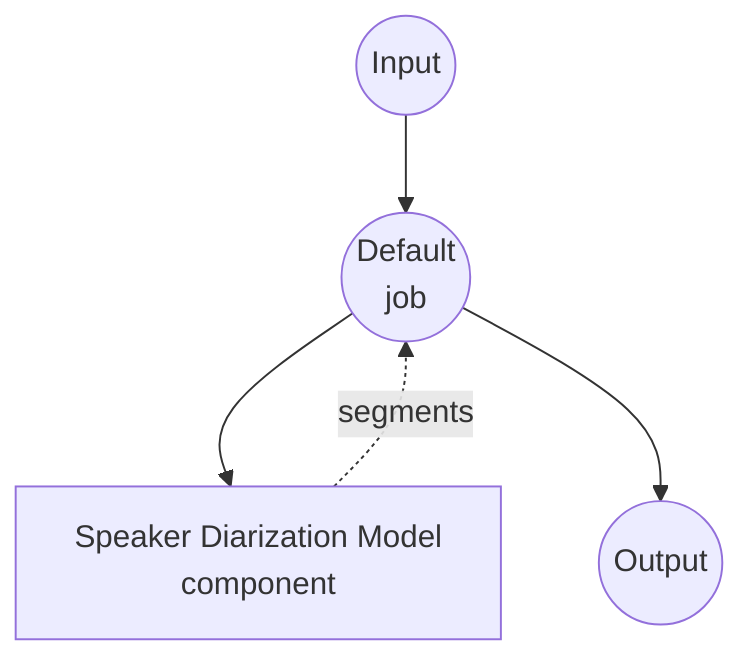

# Speaker Diarization Model Task 예제

이 예제는 model-compose에 내장된 speaker-diarization 작업과 pyannote.audio 파이프라인을 사용하여, 여러 화자가 등장하는 오디오 파일에서 "누가 언제 말했는지"를 판별하는 방법을 보여줍니다. 최초 모델 다운로드 이후에는 완전히 로컬에서 실행됩니다.

## 개요

이 워크플로우는 입력 오디오에서 감지된 화자 발화 구간들을 평탄한 리스트로 반환합니다:

1. **로컬 다이어리제이션 모델**: 최초 1회 HuggingFace에서 다운로드한 뒤 pyannote.audio의 `speaker-diarization-3.1` 파이프라인을 로컬에서 실행
2. **발화 구간 분할**: 감지된 각 발화에 대해 `speaker`, `start`, `end`, `confidence`를 반환
3. **화자 수 설정 가능**: `num_speakers`로 정확한 수를 지정하거나 `min_speakers` / `max_speakers`로 범위를 지정
4. **외부 API 불필요**: 파이프라인 캐시가 완료되면 완전 오프라인 동작

## 사전 준비

### 필수 조건

- model-compose가 설치되어 PATH에 등록되어 있어야 합니다
- `pyannote.audio`, `torch`, `torchaudio`, `numpy`, `soxr`가 있는 Python 환경 (컴포넌트의 setup 요구사항으로 선언되어 있어 최초 실행 시 자동 설치됩니다)
- 게이트가 걸린 `pyannote/speaker-diarization-3.1` 모델의 이용 약관을 수락한 HuggingFace 액세스 토큰. model-compose를 실행하기 전에 `HF_TOKEN` 환경 변수로 설정하세요.

### 다이어리제이션을 왜 사용하나

화자 다이어리제이션은 흔히 음성 인식과 결합되어 트랜스크립트의 각 문장을 화자에게 귀속시키는 데 사용됩니다:

- **화자 라벨링 트랜스크립트**: Whisper와 결합해 다중 화자 대화를 가독성 있게 정리
- **회의 분석**: 발언 시간 분포, 턴 교체율, 끼어들기 빈도 측정
- **화자별 필터링**: 특정 인물의 오디오만 하류 작업(예: 특정 참가자의 보이스 클로닝)으로 전달

참고: 다이어리제이션은 화자별 *시간 구간*을 반환하는 것이지, 소스 분리된 오디오를 만드는 것이 아닙니다. 두 화자가 겹쳐 말하면 두 사람 모두 라벨링되고 시간 구간이 겹치지만, 원본 오디오 자체가 분리되지는 않습니다.

## 실행 방법

1. **서비스 시작:**
   ```bash
   export HF_TOKEN=hf_xxx     # pyannote/speaker-diarization-3.1 접근 권한이 있는 토큰
   model-compose up
   ```

2. **워크플로우 실행:**

   **API 사용:**
   ```bash
   # 기본 다이어리제이션 (화자 수 자동 감지)
   curl -X POST http://localhost:8080/api/workflows/runs \
     -F "audio=@/path/to/your/audio.mp3" \
     -F "input={\"audio\": \"@audio\"}"

   # 정확한 화자 수 지정 및 후처리
   curl -X POST http://localhost:8080/api/workflows/runs \
     -F "audio=@/path/to/your/audio.mp3" \
     -F "input={\"audio\": \"@audio\", \"num_speakers\": 3, \"merge_gap\": \"500ms\"}"
   ```

   **웹 UI 사용:**
   - 웹 UI 열기: http://localhost:8081
   - 오디오 파일 업로드 (MP3, WAV, FLAC 등)
   - 선택적으로 `num_speakers`, `min_speakers`, `max_speakers`, `min_segment_duration`, `merge_gap` 설정
   - "Run Workflow" 버튼 클릭

   **CLI 사용:**
   ```bash
   # 기본 다이어리제이션
   model-compose run speaker-diarization --input '{"audio": "/path/to/your/audio.mp3"}'

   # 최소/최대 화자 수 범위 지정과 gap 병합
   model-compose run speaker-diarization --input '{
     "audio": "/path/to/your/audio.mp3",
     "min_speakers": 2,
     "max_speakers": 4,
     "merge_gap": "500ms",
     "min_segment_duration": "250ms"
   }'
   ```

## 컴포넌트 상세

### Speaker Diarization 모델 컴포넌트 (기본)

- **타입**: `speaker-diarization` 태스크의 model 컴포넌트
- **드라이버**: `custom`
- **패밀리**: `pyannote`
- **역할**: 화자 정체성 기준으로 오디오를 분할
- **특징**:
  - 최초 1회 모델 다운로드 후 pyannote.audio로 로컬 추론
  - 겹치는 발화 처리 (같은 시간대에 두 화자가 함께 나타날 수 있음)
  - 화자 수 자동 감지 또는 정확값/범위 지정 지원

### 모델 정보: pyannote.audio 3.1

- **개발**: pyannote 팀 (Hervé Bredin 외)
- **방식**: 엔드투엔드 신경망 다이어리제이션 파이프라인 (segmentation + embedding + clustering)
- **라이선스**: MIT (모델 가중치는 HuggingFace에서 게이팅되어 있어 이용 약관 수락 필요)

## 워크플로우 상세

### "Speaker Diarization" 워크플로우 (기본)

**설명**: 오디오 파일에서 화자 발화 구간을 감지해 평탄한 리스트로 반환합니다.

#### 잡 흐름



#### 입력 파라미터

| 파라미터 | 타입 | 필수 | 기본값 | 설명 |
|----------|------|------|--------|------|
| `audio` | audio | 예 | - | 입력 오디오 파일 (MP3, WAV, FLAC 등) |
| `sample_rate` | integer | 아니오 | `16000` | 목표 샘플링 레이트. 필요 시 리샘플링됨 |
| `num_speakers` | integer | 아니오 | `null` | 화자 수를 알고 있을 때의 정확한 값. min/max보다 우선 |
| `min_speakers` | integer | 아니오 | `null` | 고려할 최소 화자 수 |
| `max_speakers` | integer | 아니오 | `null` | 고려할 최대 화자 수 |
| `min_segment_duration` | duration | 아니오 | `0s` | 이 값보다 짧은 발화는 제거 |
| `merge_gap` | duration | 아니오 | `0s` | 같은 화자의 발화가 이 간격 이하로 떨어져 있으면 병합 |

duration 필드는 `"250ms"`, `"0.5s"` 또는 초 단위 숫자를 받을 수 있습니다.

#### 출력 포맷

워크플로우 출력은 화자 발화 구간의 평탄한 JSON 배열입니다.

| 필드 | 타입 | 설명 |
|------|------|------|
| `speaker` | string | 화자 라벨 (예: `SPEAKER_00`, `SPEAKER_01`) |
| `start` | float | 발화 시작 시각(초) |
| `end` | float | 발화 종료 시각(초) |
| `confidence` | float | 자리표시자 값(`1.0`). pyannote는 발화 단위 확률을 제공하지 않음 |

#### 출력 예시

```json
{
  "segments": [
    { "speaker": "SPEAKER_00", "start": 0.50, "end": 3.20, "confidence": 1.0 },
    { "speaker": "SPEAKER_01", "start": 3.40, "end": 7.10, "confidence": 1.0 },
    { "speaker": "SPEAKER_00", "start": 7.20, "end": 9.85, "confidence": 1.0 }
  ]
}
```

## 음성 인식과 체이닝

다이어리제이션과 ASR 모델을 결합하면 화자 라벨링 트랜스크립트를 만들 수 있습니다:

```yaml
workflow:
  jobs:
    - id: diarize
      component: pyannote-diarizer
      input:
        audio: ${input.audio as audio}

    - id: transcribe
      component: whisper
      depends_on: [diarize]
      input:
        audio: ${input.audio as audio}
        segments: ${jobs.diarize.output}

components:
  - id: pyannote-diarizer
    type: model
    task: speaker-diarization
    driver: custom
    family: pyannote
    model:
      provider: huggingface
      repository: pyannote/speaker-diarization-3.1
      token: ${env.HF_TOKEN}

  - id: whisper
    type: model
    task: speech-to-text
    driver: huggingface
    architecture: whisper
    model: openai/whisper-large-v3-turbo
```

## 문제 해결

### 자주 발생하는 문제

1. **"gated repo" 오류로 로딩 실패**: https://huggingface.co/pyannote/speaker-diarization-3.1 에서 모델 이용 약관을 수락한 뒤, 유효한 `HF_TOKEN`을 export하고 서비스를 시작하세요.
2. **감지된 화자 수가 너무 적음**: 실제 화자 수를 알고 있다면 `min_speakers`(또는 정확한 `num_speakers`)를 설정하세요.
3. **같은 화자가 여러 짧은 발화로 쪼개짐**: `merge_gap`을 늘려(예: `"500ms"` 또는 `"1s"`) 같은 화자의 인접 발화를 합치세요.
4. **잡음이나 음악이 화자로 잡힘**: `voice-activity-detection` 태스크로 전처리한 뒤 음성 구간만 다이어리제이션하세요.
