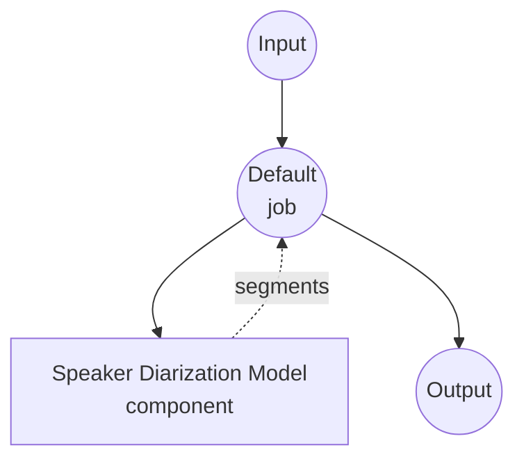

# Speaker Diarization Model Task Example

This example demonstrates how to answer "who spoke when" in a multi-speaker audio file using model-compose's built-in speaker-diarization task with the pyannote.audio pipeline, running fully locally after the initial model download.

## Overview

This workflow returns a flat list of speaker turns detected in the input audio:

1. **Local Diarization Model**: Runs pyannote.audio's `speaker-diarization-3.1` pipeline locally after a one-time HuggingFace download
2. **Turn Segmentation**: Emits `speaker`, `start`, `end`, and `confidence` for each detected speaker turn
3. **Configurable Speaker Count**: Provide an exact `num_speakers`, or bound the search with `min_speakers` / `max_speakers`
4. **No External APIs**: Fully offline once the pipeline is cached

## Preparation

### Prerequisites

- model-compose installed and available in your PATH
- Python environment with `pyannote.audio`, `torch`, `torchaudio`, `numpy`, `soxr` (declared as component setup requirements and auto-installed on first run)
- A HuggingFace access token accepted for the gated `pyannote/speaker-diarization-3.1` model. Set it via the `HF_TOKEN` environment variable before starting model-compose.

### Why Diarization

Speaker diarization is commonly chained with speech-to-text to attribute lines of transcript to individual speakers:

- **Speaker-labeled transcripts**: Combine with Whisper to produce readable multi-speaker transcripts
- **Meeting analytics**: Measure talk-time balance, turn-taking rate, and interruptions
- **Filtering by speaker**: Route audio from a specific person to downstream tasks (e.g. voice cloning of a single participant)

Note: diarization returns *time ranges* per speaker, not source-separated audio. When two speakers overlap, both are labeled and their time ranges overlap; the original audio itself is not unmixed.

## How to Run

1. **Start the service:**
   ```bash
   export HF_TOKEN=hf_xxx     # token with access to pyannote/speaker-diarization-3.1
   model-compose up
   ```

2. **Run the workflow:**

   **Using API:**
   ```bash
   # Basic diarization (auto speaker count)
   curl -X POST http://localhost:8080/api/workflows/runs \
     -F "audio=@/path/to/your/audio.mp3" \
     -F "input={\"audio\": \"@audio\"}"

   # With an exact speaker count and post-processing
   curl -X POST http://localhost:8080/api/workflows/runs \
     -F "audio=@/path/to/your/audio.mp3" \
     -F "input={\"audio\": \"@audio\", \"num_speakers\": 3, \"merge_gap\": \"500ms\"}"
   ```

   **Using Web UI:**
   - Open the Web UI: http://localhost:8081
   - Upload an audio file (MP3, WAV, FLAC, etc.)
   - Optionally set `num_speakers`, `min_speakers`, `max_speakers`, `min_segment_duration`, `merge_gap`
   - Click the "Run Workflow" button

   **Using CLI:**
   ```bash
   # Basic diarization
   model-compose run speaker-diarization --input '{"audio": "/path/to/your/audio.mp3"}'

   # With min/max speaker bounds and gap merging
   model-compose run speaker-diarization --input '{
     "audio": "/path/to/your/audio.mp3",
     "min_speakers": 2,
     "max_speakers": 4,
     "merge_gap": "500ms",
     "min_segment_duration": "250ms"
   }'
   ```

## Component Details

### Speaker Diarization Model Component (Default)

- **Type**: Model component with `speaker-diarization` task
- **Driver**: `custom`
- **Family**: `pyannote`
- **Purpose**: Segment audio by speaker identity
- **Features**:
  - Local inference via pyannote.audio after one-time model download
  - Handles overlapping speech (two speakers may cover the same time range)
  - Auto-detects speaker count, or accepts hard/bounded constraints

### Model Information: pyannote.audio 3.1

- **Developer**: pyannote team (Hervé Bredin et al.)
- **Type**: End-to-end neural diarization pipeline (segmentation + embedding + clustering)
- **License**: MIT (model weights gated on HuggingFace; requires accepting the terms)

## Workflow Details

### "Speaker Diarization" Workflow (Default)

**Description**: Detect speaker turns in an audio file and return them as a flat list.

#### Job Flow



#### Input Parameters

| Parameter | Type | Required | Default | Description |
|-----------|------|----------|---------|-------------|
| `audio` | audio | Yes | - | Input audio file (MP3, WAV, FLAC, etc.) |
| `sample_rate` | integer | No | `16000` | Target sample rate; input is resampled if needed |
| `num_speakers` | integer | No | `null` | Exact number of speakers if known; overrides min/max |
| `min_speakers` | integer | No | `null` | Minimum number of speakers to consider |
| `max_speakers` | integer | No | `null` | Maximum number of speakers to consider |
| `min_segment_duration` | duration | No | `0s` | Discard turns shorter than this |
| `merge_gap` | duration | No | `0s` | Merge same-speaker turns separated by <= this gap |

Duration fields accept values like `"250ms"`, `"0.5s"`, or bare numeric seconds.

#### Output Format

The workflow output is a flat JSON array of speaker turns.

| Field | Type | Description |
|-------|------|-------------|
| `speaker` | string | Speaker label (e.g. `SPEAKER_00`, `SPEAKER_01`) |
| `start` | float | Turn start time in seconds |
| `end` | float | Turn end time in seconds |
| `confidence` | float | Placeholder confidence (`1.0`); pyannote does not expose per-turn probabilities |

#### Example Output

```json
{
  "segments": [
    { "speaker": "SPEAKER_00", "start": 0.50, "end": 3.20, "confidence": 1.0 },
    { "speaker": "SPEAKER_01", "start": 3.40, "end": 7.10, "confidence": 1.0 },
    { "speaker": "SPEAKER_00", "start": 7.20, "end": 9.85, "confidence": 1.0 }
  ]
}
```

## Chaining with Speech-to-Text

Produce a speaker-labeled transcript by combining diarization with an ASR model:

```yaml
workflow:
  jobs:
    - id: diarize
      component: pyannote-diarizer
      input:
        audio: ${input.audio as audio}

    - id: transcribe
      component: whisper
      depends_on: [diarize]
      input:
        audio: ${input.audio as audio}
        segments: ${jobs.diarize.output}

components:
  - id: pyannote-diarizer
    type: model
    task: speaker-diarization
    driver: custom
    family: pyannote
    model:
      provider: huggingface
      repository: pyannote/speaker-diarization-3.1
      token: ${env.HF_TOKEN}

  - id: whisper
    type: model
    task: speech-to-text
    driver: huggingface
    architecture: whisper
    model: openai/whisper-large-v3-turbo
```

## Troubleshooting

### Common Issues

1. **Fails to load with "gated repo" error**: Accept the model terms at https://huggingface.co/pyannote/speaker-diarization-3.1 and export a valid `HF_TOKEN` before starting the service.
2. **Too few speakers detected**: Set `min_speakers` (or an exact `num_speakers`) if you know the true speaker count.
3. **Same speaker split into many short turns**: Increase `merge_gap` (e.g. `"500ms"` or `"1s"`) to fuse adjacent turns from the same speaker.
4. **Noise or music detected as a speaker**: Preprocess with the `voice-activity-detection` task and only diarize the speech regions.
