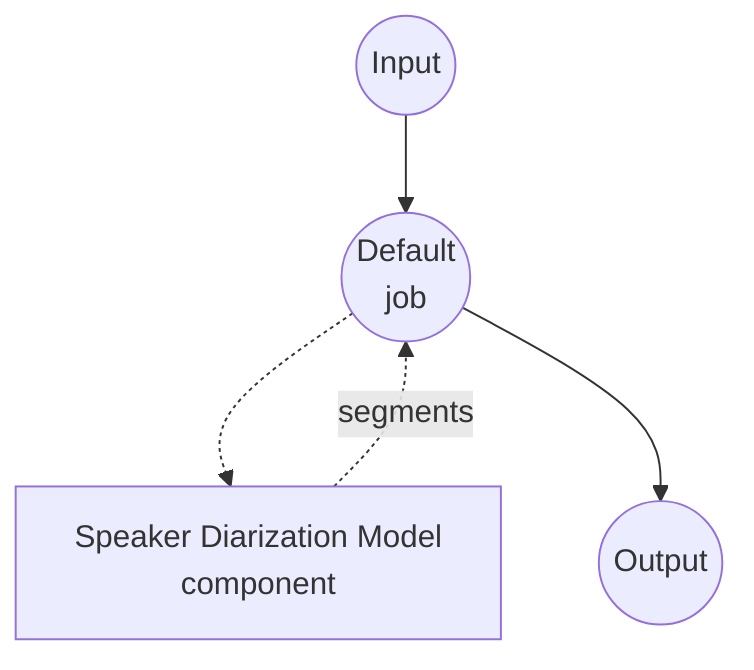

# Speaker Diarization Model Task 示例

本示例演示如何使用 model-compose 内置的 speaker-diarization 任务与 pyannote.audio 流水线,回答多说话人音频文件中"谁在何时说话"的问题。首次模型下载完成后,可完全在本地运行。

## 概述

该工作流会返回从输入音频中检测到的说话人发言片段的扁平列表:

1. **本地说话人分离模型**: 首次从 HuggingFace 下载后,在本地运行 pyannote.audio 的 `speaker-diarization-3.1` 流水线
2. **发言片段分割**: 为每个检测到的发言输出 `speaker`、`start`、`end`、`confidence`
3. **可配置说话人数**: 可指定精确的 `num_speakers`,或使用 `min_speakers` / `max_speakers` 限定搜索范围
4. **无需外部 API**: 流水线缓存完成后完全离线运行

## 准备工作

### 必要条件

- 已安装 model-compose 并加入 PATH
- Python 环境包含 `pyannote.audio`、`torch`、`torchaudio`、`numpy`、`soxr`(已声明为组件的 setup 依赖,首次运行时自动安装)
- 已接受受门控的 `pyannote/speaker-diarization-3.1` 模型条款的 HuggingFace 访问令牌。启动 model-compose 前,请通过 `HF_TOKEN` 环境变量设置。

### 为什么需要说话人分离

说话人分离通常与语音识别串联,用于将转录文本归属到具体说话人:

- **带说话人标注的转录**: 与 Whisper 结合,生成可读的多说话人转录
- **会议分析**: 度量发言时长比例、话轮切换频率、打断次数
- **按说话人过滤**: 将某位特定说话人的音频路由到下游任务(例如仅克隆某位参会者的声音)

注意: 说话人分离返回的是每位说话人的 *时间区间*,并不是分离后的音频源。当两位说话人重叠发言时,他们都会被标注且时间区间会重叠,但原始音频本身不会被解混。

## 运行方法

1. **启动服务:**
   ```bash
   export HF_TOKEN=hf_xxx     # 拥有 pyannote/speaker-diarization-3.1 访问权限的令牌
   model-compose up
   ```

2. **运行工作流:**

   **使用 API:**
   ```bash
   # 基础说话人分离(自动检测说话人数)
   curl -X POST http://localhost:8080/api/workflows/runs \
     -F "audio=@/path/to/your/audio.mp3" \
     -F "input={\"audio\": \"@audio\"}"

   # 指定精确说话人数并配合后处理
   curl -X POST http://localhost:8080/api/workflows/runs \
     -F "audio=@/path/to/your/audio.mp3" \
     -F "input={\"audio\": \"@audio\", \"num_speakers\": 3, \"merge_gap\": \"500ms\"}"
   ```

   **使用 Web UI:**
   - 打开 Web UI: http://localhost:8081
   - 上传音频文件(MP3、WAV、FLAC 等)
   - 可选地设置 `num_speakers`、`min_speakers`、`max_speakers`、`min_segment_duration`、`merge_gap`
   - 点击 "Run Workflow" 按钮

   **使用 CLI:**
   ```bash
   # 基础说话人分离
   model-compose run speaker-diarization --input '{"audio": "/path/to/your/audio.mp3"}'

   # 指定最小/最大说话人数范围并合并间隙
   model-compose run speaker-diarization --input '{
     "audio": "/path/to/your/audio.mp3",
     "min_speakers": 2,
     "max_speakers": 4,
     "merge_gap": "500ms",
     "min_segment_duration": "250ms"
   }'
   ```

## 组件详情

### Speaker Diarization 模型组件(默认)

- **类型**: `speaker-diarization` 任务的 model 组件
- **驱动**: `custom`
- **家族**: `pyannote`
- **用途**: 按说话人身份分割音频
- **特性**:
  - 首次下载后通过 pyannote.audio 在本地进行推理
  - 处理重叠语音(同一时间段可能标注两位说话人)
  - 自动检测说话人数,或接受精确值/范围约束

### 模型信息: pyannote.audio 3.1

- **开发方**: pyannote 团队(Hervé Bredin 等)
- **架构**: 端到端神经网络说话人分离流水线(segmentation + embedding + clustering)
- **许可证**: MIT(模型权重在 HuggingFace 上受门控,需先接受条款)

## 工作流详情

### "Speaker Diarization" 工作流(默认)

**说明**: 检测音频文件中的说话人发言片段,并以扁平列表返回。

#### 作业流程



#### 输入参数

| 参数 | 类型 | 必填 | 默认值 | 说明 |
|------|------|------|--------|------|
| `audio` | audio | 是 | - | 输入音频文件(MP3、WAV、FLAC 等) |
| `num_speakers` | integer | 否 | `null` | 已知说话人数时的精确值,优先于 min/max |
| `min_speakers` | integer | 否 | `null` | 考虑的最小说话人数 |
| `max_speakers` | integer | 否 | `null` | 考虑的最大说话人数 |
| `min_segment_duration` | duration | 否 | `0s` | 丢弃短于该长度的发言片段 |
| `merge_gap` | duration | 否 | `0s` | 合并同一说话人间隔不超过该值的相邻片段 |

duration 字段接受 `"250ms"`、`"0.5s"` 或纯数字秒。

#### 输出格式

工作流输出是发言片段的扁平 JSON 数组。

| 字段 | 类型 | 说明 |
|------|------|------|
| `speaker` | string | 说话人标签(例如 `SPEAKER_00`、`SPEAKER_01`) |
| `start` | float | 发言开始时间(秒) |
| `end` | float | 发言结束时间(秒) |
| `confidence` | float | 占位置信度(`1.0`);pyannote 不提供片段级概率 |

#### 输出示例

```json
{
  "segments": [
    { "speaker": "SPEAKER_00", "start_time": 0.50, "end_time": 3.20, "confidence": 1.0 },
    { "speaker": "SPEAKER_01", "start_time": 3.40, "end_time": 7.10, "confidence": 1.0 },
    { "speaker": "SPEAKER_00", "start_time": 7.20, "end_time": 9.85, "confidence": 1.0 }
  ]
}
```

## 与语音识别串联

将说话人分离与 ASR 模型结合,即可产出带说话人标注的转录:

```yaml
workflow:
  jobs:
    - id: diarize
      component: pyannote-diarizer
      input:
        audio: ${input.audio as audio}

    - id: transcribe
      component: whisper
      depends_on: [diarize]
      input:
        audio: ${input.audio as audio}
        segments: ${jobs.diarize.output}

components:
  - id: pyannote-diarizer
    type: model
    task: speaker-diarization
    driver: custom
    family: pyannote
    model:
      provider: huggingface
      repository: pyannote/speaker-diarization-3.1
      token: ${env.HF_TOKEN}

  - id: whisper
    type: model
    task: speech-to-text
    driver: huggingface
    architecture: whisper
    model: openai/whisper-large-v3-turbo
```

## 故障排查

### 常见问题

1. **加载时出现 "gated repo" 错误**: 请在 https://huggingface.co/pyannote/speaker-diarization-3.1 接受模型条款,并在启动服务前 export 一个有效的 `HF_TOKEN`。
2. **检测到的说话人数过少**: 如果已知实际说话人数,请设置 `min_speakers`(或精确的 `num_speakers`)。
3. **同一位说话人被拆成多个短片段**: 增大 `merge_gap`(例如 `"500ms"` 或 `"1s"`),合并同一说话人的相邻片段。
4. **噪声或音乐被识别为说话人**: 先用 `voice-activity-detection` 任务预处理,只对语音区间做说话人分离。
