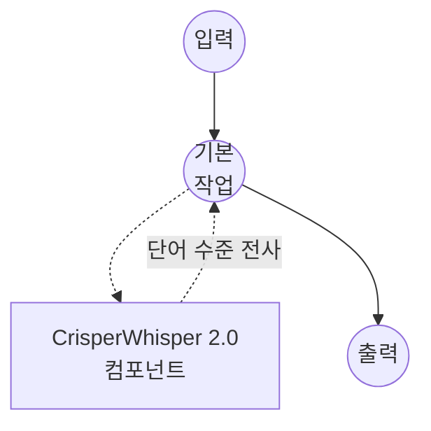

# Speech-to-Text CrisperWhisper 2.0 Model Task 예제

이 예제는 model-compose의 내장 speech-to-text 작업과 함께 CrisperWhisper 2.0을 사용하여 정확한 단어 수준 타임스탬프가 포함된 축어적(verbatim) 음성 전사를 수행하는 방법을 보여주며, 간투사와 필러 워드, 실제 발화 그대로를 보존하는 고품질 오프라인 인식을 제공합니다.

## 개요

이 워크플로우는 다음과 같은 로컬 축어적 음성-텍스트 변환을 제공합니다:

1. **축어적 전사**: 필러 워드, 잘못된 시작, 간투사를 그대로 보존 (또는 `intended` 모드에서 정리)
2. **단어 수준 타임스탬프**: 자막 및 강제 정렬에 적합한 정확한 단어별 시작/종료 시간 방출
3. **장시간 오디오**: 연속(continuation) 전략을 통해 긴 녹음 처리
4. **환각 완화**: 무음이나 잡음에서 조작된 세그먼트를 줄이는 내장 가드
5. **선택 가능한 백엔드**: 사용 가능 시 빠른 CTranslate2 포크 사용, 아니면 이식성 좋은 transformers 백엔드 사용
6. **로컬 모델 실행**: HuggingFace transformers(또는 ctranslate2)를 이용해 완전히 오프라인으로 실행

## 준비사항

### 필수 요구사항

- model-compose가 설치되어 PATH에서 사용 가능
- CrisperWhisper 2.0 실행을 위한 충분한 시스템 리소스 (권장: 8GB+ RAM, `large` 모델에는 GPU 권장)
- transformers, torch, librosa 및 soundfile이 있는 Python 환경 (자동 관리)
- 선택 사항: 빠른 `ct2` 백엔드를 위해 `ctranslate2-crisperwhisper` 포크 설치 (Linux x86_64 + NVIDIA)

### CrisperWhisper 2.0을 사용하는 이유

기본 Whisper와 비교했을 때, CrisperWhisper 2.0은 축어적이고 타이밍이 정확한 전사를 위해 튜닝되었습니다:

**이점:**
- **축어적 충실도**: 필러 워드("음", "어"), 반복, 발화 간투사를 그대로 유지
- **두 가지 출력 모드**: `verbatim`은 정확한 발화 보존; `intended`는 정리된 읽기 쉬운 텍스트 생성
- **단어 수준 타이밍**: 캡션 및 정렬 파이프라인을 위한 신뢰할 수 있는 단어별 타임스탬프
- **장시간 견고성**: 연속 전략으로 컨텍스트를 잃지 않고 긴 녹음을 이어붙임
- **환각 가드**: 무음, 음악, 잡음 중 조작된 텍스트를 줄임
- **프라이버시**: 모든 오디오 처리가 로컬에서 이루어지며 외부 서비스로 데이터 전송 없음

**트레이드오프:**
- **하드웨어 요구사항**: `large` 모델은 GPU에서 큰 이점을 얻음
- **백엔드 가용성**: 빠른 `ct2` 백엔드는 Linux x86_64 + NVIDIA에서만 실행; 다른 플랫폼은 `transformers`로 폴백
- **설정 시간**: 초기 모델 다운로드 및 로딩 시간

### 환경 구성

1. 이 예제 디렉토리로 이동:
   ```bash
   cd examples/model-tasks/speech-to-text-crisper-whisper
   ```

2. 추가 환경 구성 불필요 - 모델 및 종속성이 자동으로 관리됩니다.

## 실행 방법

1. **서비스 시작:**
   ```bash
   model-compose up
   ```

2. **워크플로우 실행:**

   **API 사용:**
   ```bash
   # 축어적 전사 (기본)
   curl -X POST http://localhost:8080/api/workflows/runs \
     -F "audio=@/path/to/your/audio.mp3" \
     -F "input={\"audio\": \"@audio\"}"

   # 특정 언어의 정리된 "intended" 전사
   curl -X POST http://localhost:8080/api/workflows/runs \
     -F "audio=@/path/to/your/audio.mp3" \
     -F "input={\"audio\": \"@audio\", \"language\": \"ko\", \"mode\": \"intended\"}"
   ```

   **웹 UI 사용:**
   - 웹 UI 열기: http://localhost:8081
   - 오디오 파일 업로드 (MP3, WAV, FLAC 등)
   - 선택적으로 `language` 설정 (예: `en`, `ko`, `ja`)
   - `mode` 선택: `verbatim` (필러 유지) 또는 `intended` (정리)
   - "Run Workflow" 버튼 클릭

   **CLI 사용:**
   ```bash
   # 축어적 전사
   model-compose run --input '{"audio": "/path/to/your/audio.mp3"}'

   # 언어를 명시한 정리된 전사
   model-compose run --input '{"audio": "/path/to/your/audio.mp3", "language": "ko", "mode": "intended"}'
   ```

## 컴포넌트 세부사항

### Speech to Text Model 컴포넌트 (기본)
- **유형**: speech-to-text 작업을 사용하는 Model 컴포넌트
- **목적**: 단어 수준 타임스탬프가 포함된 로컬 축어적 오디오 전사
- **모델**: `large` (`nyralabs/CrisperWhisper2.0_large`의 별칭)
- **패밀리**: crisper-whisper
- **기능**:
  - 자동 모델 다운로드 및 캐싱
  - `verbatim` 및 `intended` 출력 모드
  - 단어 수준 타임스탬프 방출
  - 연속 이어붙이기를 통한 장시간 오디오 처리
  - 환각 완화 및 온도 폴백
  - CT2 (빠름) 또는 transformers (이식성) 백엔드
  - CPU 및 GPU 가속

### 모델 정보: CrisperWhisper 2.0
- **개발자**: Nyra Labs
- **기본 아키텍처**: Whisper
- **사용 가능한 크기**: `large`, `turbo`, `medium`, `small` (별칭은 해당하는 HF ID로 해석됨)
- **기능**: 축어적 전사, 정리된 전사, 단어 수준 타이밍, 환각 완화
- **체크포인트 (기본)**: `nyralabs/CrisperWhisper2.0_large`

## 워크플로우 세부사항

### "Speech to Text (CrisperWhisper 2.0)" 워크플로우 (기본)

**설명**: CrisperWhisper 2.0을 사용하여 정확한 단어 수준 타임스탬프가 포함된 축어적 전사를 수행합니다.

#### 작업 흐름

이 예제는 명시적인 작업 없이 단순화된 단일 컴포넌트 구성을 사용합니다.



#### 입력 매개변수

| 매개변수 | 유형 | 필수 | 기본값 | 설명 |
|---------|------|------|--------|------|
| `audio` | audio | 예 | - | 입력 오디오 파일 (MP3, WAV, FLAC 등) |
| `language` | text | 아니오 | `en` | 전사 언어 코드 (예: `en`, `ko`, `ja`) |
| `mode` | text | 아니오 | `verbatim` | 출력 스타일: `verbatim` (필러 유지) 또는 `intended` (정리) |

#### 출력 형식

| 필드 | 유형 | 설명 |
|-----|------|------|
| `transcription` | json | 텍스트와 단어 수준 타임스탬프를 포함하는 전사 페이로드 |

## 시스템 요구사항

### 최소 요구사항
- **RAM**: 8GB (`large` 모델에는 권장 16GB+)
- **VRAM**: `large` 모델을 위한 6GB+ GPU 권장
- **디스크 공간**: 모델 저장 및 캐시를 위한 5GB+
- **CPU**: 멀티코어 프로세서 (4+ 코어 권장)
- **인터넷**: 초기 모델 다운로드에만 필요

### 성능 참고사항
- 첫 실행 시 모델 다운로드 필요
- 모델 로딩은 하드웨어에 따라 20-60초 소요
- GPU 가속으로 추론 속도가 크게 향상됨
- 사용 가능 시 `ct2` 백엔드는 `transformers`보다 눈에 띄게 빠름

## 사용자 정의

### 더 작거나 빠른 모델 선택

더 작은 크기 별칭이나 turbo 변형을 사용하여 품질을 속도로 교환:

```yaml
component:
  type: model
  task: speech-to-text
  driver: custom
  family: crisper-whisper
  model: turbo             # 또는 'medium', 'small', 또는 전체 HF ID
```

### GPU에서 실행

기본 구성은 `device: cpu`를 사용합니다. GPU를 사용할 수 있을 때 CUDA로 전환:

```yaml
component:
  type: model
  task: speech-to-text
  driver: custom
  family: crisper-whisper
  model: large
  device: cuda:0
  compute_type: float16
```

### 백엔드 강제 지정

호스트 간 재현 가능한 동작이 필요할 때 백엔드를 고정:

```yaml
component:
  type: model
  task: speech-to-text
  driver: custom
  family: crisper-whisper
  model: large
  backend: transformers    # 또는 포크가 설치된 Linux x86_64 + NVIDIA에서 'ct2'
```

### 장시간 및 견고성 설정 조정

장시간 녹음 동작과 잡음에 대한 견고성 세부 조정:

```yaml
component:
  type: model
  task: speech-to-text
  driver: custom
  family: crisper-whisper
  model: large
  action:
    audio: ${input.audio as audio}
    language: ${input.language | en}
    mode: verbatim
    return_timestamps: true
    timestamp_level: word
    longform_strategy: continuation
    hallucination_mitigation: true
    temperature_fallback: true
```

## 문제 해결

### 일반적인 문제

1. **메모리 부족**: 더 작은 크기 별칭(`medium`, `small`, 또는 `turbo`) 사용 또는 `compute_type`을 `int8`로 낮춤
2. **모델 다운로드 실패**: 인터넷 연결 및 사용 가능한 디스크 공간 확인
3. **느린 처리**: `device: cuda:0`으로 GPU 전환, 사용 가능 시 `backend: ct2`
4. **`ct2` 백엔드 누락**: CT2 포크는 Linux x86_64 + NVIDIA만 지원; 다른 플랫폼은 자동으로 `transformers` 사용
5. **무음에서의 환각 텍스트**: `hallucination_mitigation: true`를 확인하고 `temperature_fallback: true` 고려

### 성능 최적화

- **백엔드**: 지원되는 호스트에서 가장 큰 속도 향상을 위해 `ct2` 선호
- **Compute Type**: GPU에서는 `float16`, CPU에서는 낮은 메모리를 위해 `int8` 또는 `int8_float16`
- **언어 지정**: `language`를 명시적으로 설정하면 속도와 정확도가 향상됨
- **모델 크기**: GPU 메모리가 부족할 때 `turbo`는 초당 품질 대비 우수한 지점 제공

## 기본 Whisper와 비교

| 기능 | CrisperWhisper 2.0 | 기본 Whisper |
|------|-------------------|--------------|
| 축어적 충실도 | 필러/간투사 보존 | 정규화하는 경향 |
| 단어 타임스탬프 | 일급, 정확함 | 사용 가능하지만 덜 일관적 |
| 장시간 전략 | 연속 이어붙이기 | 청크 기반 |
| 환각 가드 | 내장 완화 | 내장 안 됨 |
| 출력 모드 | `verbatim` 및 `intended` | 단일 스타일 |
| 빠른 백엔드 | 선택적 `ct2` 포크 | 표준 transformers |

## 관련 예제

- [speech-to-text](../speech-to-text) — 일반 전사 및 번역을 위한 기본 Whisper
- [speech-to-text-vibevoice](../speech-to-text-vibevoice) — 화자 구분이 포함된 장시간 전사
- [speech-to-text-vibevoice-streaming](../speech-to-text-vibevoice-streaming) — 청크 단위 스트리밍 전사
