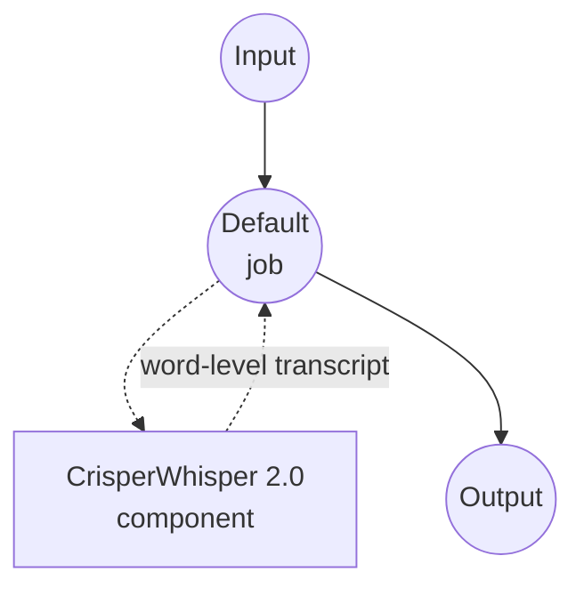

# Speech-to-Text CrisperWhisper 2.0 Model Task Example

This example demonstrates how to use CrisperWhisper 2.0 for verbatim speech transcription with precise word-level timestamps using model-compose's built-in speech-to-text task, providing high-fidelity offline recognition that preserves disfluencies, filler words, and exact wording.

## Overview

This workflow provides local verbatim speech-to-text transcription that:

1. **Verbatim Transcription**: Preserves filler words, false starts, and disfluencies (or cleans them up in `intended` mode)
2. **Word-level Timestamps**: Emits precise per-word start and end times suitable for subtitling and forced alignment
3. **Long-form Audio**: Handles extended recordings through a continuation strategy
4. **Hallucination Mitigation**: Built-in guards reduce fabricated segments on silence or noise
5. **Selectable Backend**: Uses the fast CTranslate2 fork when available, or the portable transformers backend
6. **Local Model Execution**: Runs entirely offline using HuggingFace transformers (or ctranslate2)

## Preparation

### Prerequisites

- model-compose installed and available in your PATH
- Sufficient system resources for running CrisperWhisper 2.0 (recommended: 8GB+ RAM, GPU recommended for the `large` model)
- Python environment with transformers, torch, librosa, and soundfile (automatically managed)
- Optional: `ctranslate2-crisperwhisper` fork installed for the fast `ct2` backend (Linux x86_64 + NVIDIA)

### Why CrisperWhisper 2.0

Compared to stock Whisper, CrisperWhisper 2.0 is tuned for verbatim, timing-accurate transcripts:

**Benefits:**
- **Verbatim Fidelity**: Keeps filler words ("um", "uh"), repetitions, and speech disfluencies intact
- **Two Output Modes**: `verbatim` preserves exact speech; `intended` produces cleaned, reader-friendly text
- **Word-level Timing**: Reliable per-word timestamps for captioning and alignment pipelines
- **Long-form Robustness**: Continuation strategy stitches long recordings without losing context
- **Hallucination Guard**: Reduces fabricated text during silence, music, or noise
- **Privacy**: All audio processing happens locally, no data sent to external services

**Trade-offs:**
- **Hardware Requirements**: The `large` model benefits substantially from a GPU
- **Backend Availability**: The fast `ct2` backend only runs on Linux x86_64 with NVIDIA; other platforms fall back to `transformers`
- **Setup Time**: Initial model download and loading time

### Environment Configuration

1. Navigate to this example directory:
   ```bash
   cd examples/model-tasks/speech-to-text-crisper-whisper
   ```

2. No additional environment configuration required - model and dependencies are managed automatically.

## How to Run

1. **Start the service:**
   ```bash
   model-compose up
   ```

2. **Run the workflow:**

   **Using API:**
   ```bash
   # Verbatim transcription (default)
   curl -X POST http://localhost:8080/api/workflows/runs \
     -F "audio=@/path/to/your/audio.mp3" \
     -F "input={\"audio\": \"@audio\"}"

   # Cleaned "intended" transcription in a specific language
   curl -X POST http://localhost:8080/api/workflows/runs \
     -F "audio=@/path/to/your/audio.mp3" \
     -F "input={\"audio\": \"@audio\", \"language\": \"ko\", \"mode\": \"intended\"}"
   ```

   **Using Web UI:**
   - Open the Web UI: http://localhost:8081
   - Upload an audio file (MP3, WAV, FLAC, etc.)
   - Optionally set `language` (e.g. `en`, `ko`, `ja`)
   - Choose `mode`: `verbatim` (keep fillers) or `intended` (cleaned)
   - Click the "Run Workflow" button

   **Using CLI:**
   ```bash
   # Verbatim transcription
   model-compose run --input '{"audio": "/path/to/your/audio.mp3"}'

   # Cleaned transcription with explicit language
   model-compose run --input '{"audio": "/path/to/your/audio.mp3", "language": "ko", "mode": "intended"}'
   ```

## Component Details

### Speech to Text Model Component (Default)
- **Type**: Model component with speech-to-text task
- **Purpose**: Local verbatim audio transcription with word-level timestamps
- **Model**: `large` (alias for `nyralabs/CrisperWhisper2.0_large`)
- **Family**: crisper-whisper
- **Features**:
  - Automatic model downloading and caching
  - `verbatim` and `intended` output modes
  - Word-level timestamp emission
  - Long-form audio via continuation stitching
  - Hallucination mitigation and temperature fallback
  - CT2 (fast) or transformers (portable) backend
  - CPU and GPU acceleration

### Model Information: CrisperWhisper 2.0
- **Developer**: Nyra Labs
- **Base Architecture**: Whisper
- **Available Sizes**: `large`, `turbo`, `medium`, `small` (aliases resolve to matching HF ids)
- **Capabilities**: Verbatim transcription, cleaned transcription, word-level timing, hallucination mitigation
- **Checkpoint (default)**: `nyralabs/CrisperWhisper2.0_large`

## Workflow Details

### "Speech to Text (CrisperWhisper 2.0)" Workflow (Default)

**Description**: Verbatim transcription with precise word-level timestamps using CrisperWhisper 2.0.

#### Job Flow

This example uses a simplified single-component configuration without explicit jobs.



#### Input Parameters

| Parameter | Type | Required | Default | Description |
|-----------|------|----------|---------|-------------|
| `audio` | audio | Yes | - | Input audio file (MP3, WAV, FLAC, etc.) |
| `language` | text | No | `en` | Language code for transcription (e.g. `en`, `ko`, `ja`) |
| `mode` | text | No | `verbatim` | Output style: `verbatim` (keep fillers) or `intended` (cleaned) |

#### Output Format

| Field | Type | Description |
|-------|------|-------------|
| `transcription` | json | Transcription payload including text and word-level timestamps |

## System Requirements

### Minimum Requirements
- **RAM**: 8GB (recommended 16GB+ for the `large` model)
- **VRAM**: 6GB+ GPU recommended for the `large` model
- **Disk Space**: 5GB+ for model storage and cache
- **CPU**: Multi-core processor (4+ cores recommended)
- **Internet**: Required for initial model download only

### Performance Notes
- First run requires model download
- Model loading takes 20-60 seconds depending on hardware
- GPU acceleration significantly improves inference speed
- The `ct2` backend is meaningfully faster than `transformers` when available

## Customization

### Selecting a Smaller or Faster Model

Trade quality for speed by using a smaller size alias or the turbo variant:

```yaml
component:
  type: model
  task: speech-to-text
  driver: custom
  family: crisper-whisper
  model: turbo             # or 'medium', 'small', or a full HF id
```

### Running on GPU

The default configuration uses `device: cpu`. Switch to CUDA when a GPU is available:

```yaml
component:
  type: model
  task: speech-to-text
  driver: custom
  family: crisper-whisper
  model: large
  device: cuda:0
  compute_type: float16
```

### Forcing a Backend

Pin the backend when you need reproducible behavior across hosts:

```yaml
component:
  type: model
  task: speech-to-text
  driver: custom
  family: crisper-whisper
  model: large
  backend: transformers    # or 'ct2' on Linux x86_64 + NVIDIA with the fork installed
```

### Adjusting Long-form and Robustness Settings

Fine-tune long-recording behavior and robustness against noise:

```yaml
component:
  type: model
  task: speech-to-text
  driver: custom
  family: crisper-whisper
  model: large
  action:
    audio: ${input.audio as audio}
    language: ${input.language | en}
    mode: verbatim
    return_timestamps: true
    timestamp_level: word
    longform_strategy: continuation
    hallucination_mitigation: true
    temperature_fallback: true
```

## Troubleshooting

### Common Issues

1. **Out of Memory**: Use a smaller size alias (`medium`, `small`, or `turbo`) or lower `compute_type` to `int8`
2. **Model Download Fails**: Check internet connection and available disk space
3. **Slow Processing**: Switch to GPU with `device: cuda:0` and, when available, `backend: ct2`
4. **Missing `ct2` Backend**: The CT2 fork only supports Linux x86_64 + NVIDIA; other platforms use `transformers` automatically
5. **Hallucinated Text on Silence**: Ensure `hallucination_mitigation: true` and consider `temperature_fallback: true`

### Performance Optimization

- **Backend**: Prefer `ct2` on supported hosts for the largest speedup
- **Compute Type**: `float16` on GPU, `int8` or `int8_float16` on CPU for lower memory
- **Language Specification**: Explicitly setting `language` improves speed and accuracy
- **Model Size**: `turbo` offers a strong quality-per-second point when GPU memory is tight

## Comparison with Stock Whisper

| Feature | CrisperWhisper 2.0 | Stock Whisper |
|---------|--------------------|---------------|
| Verbatim Fidelity | Preserves fillers/disfluencies | Tends to normalize |
| Word Timestamps | First-class, precise | Available but less consistent |
| Long-form Strategy | Continuation stitching | Chunk-based |
| Hallucination Guard | Built-in mitigation | Not built-in |
| Output Modes | `verbatim` and `intended` | Single style |
| Fast Backend | Optional `ct2` fork | Standard transformers |

## Related Examples

- [speech-to-text](../speech-to-text) — Stock Whisper for general transcription and translation
- [speech-to-text-vibevoice](../speech-to-text-vibevoice) — Long-form transcription with speaker attribution
- [speech-to-text-vibevoice-streaming](../speech-to-text-vibevoice-streaming) — Chunk-by-chunk streaming transcription
