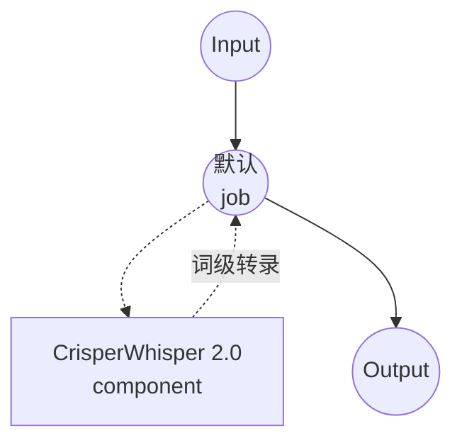

# 语音转文字 CrisperWhisper 2.0 模型任务示例

本示例演示如何使用 model-compose 内置的 speech-to-text 任务与 CrisperWhisper 2.0，实现带有精确词级时间戳的逐字（verbatim）语音转录，提供保留语气词、填充词及原始措辞的高保真离线识别。

## 概述

此工作流提供本地逐字语音转文字转录功能：

1. **逐字转录**：保留填充词、错误开头和口头禅（或在 `intended` 模式中清理）
2. **词级时间戳**：输出适用于字幕和强制对齐的精确每词起止时间
3. **长音频**：通过 continuation 策略处理较长的录音
4. **幻觉抑制**：内置防护措施减少在静音或噪声上生成的虚构片段
5. **可选后端**：可用时使用快速的 CTranslate2 分支，或使用可移植的 transformers 后端
6. **本地模型执行**：使用 HuggingFace transformers（或 ctranslate2）完全离线运行

## 准备工作

### 先决条件

- 已安装 model-compose 并在 PATH 中可用
- 运行 CrisperWhisper 2.0 所需的充足系统资源（推荐：8GB+ RAM，`large` 模型推荐 GPU）
- 带有 transformers、torch、librosa 和 soundfile 的 Python 环境（自动管理）
- 可选：安装 `ctranslate2-crisperwhisper` 分支以启用快速 `ct2` 后端（Linux x86_64 + NVIDIA）

### 为什么选择 CrisperWhisper 2.0

与原版 Whisper 相比，CrisperWhisper 2.0 针对逐字且时间精确的转录进行了调优：

**优势：**
- **逐字保真**：保留填充词（"嗯"、"啊"）、重复和口头禅
- **两种输出模式**：`verbatim` 保留原始语音；`intended` 生成清理后易读的文本
- **词级时间**：为字幕与对齐流水线提供可靠的每词时间戳
- **长音频鲁棒性**：continuation 策略在不丢失上下文的情况下拼接长录音
- **幻觉防护**：减少在静音、音乐或噪声中生成的虚构文本
- **隐私**：所有音频处理均在本地进行，不会将数据发送至外部服务

**权衡：**
- **硬件要求**：`large` 模型在 GPU 上收益显著
- **后端可用性**：快速 `ct2` 后端仅在 Linux x86_64 + NVIDIA 上运行；其他平台自动回退到 `transformers`
- **设置时间**：初始模型下载与加载时间

### 环境配置

1. 导航到此示例目录：
   ```bash
   cd examples/model-tasks/speech-to-text-crisper-whisper
   ```

2. 无需额外的环境配置 - 模型和依赖项自动管理。

## 如何运行

1. **启动服务：**
   ```bash
   model-compose up
   ```

2. **运行工作流：**

   **使用 API：**
   ```bash
   # 逐字转录（默认）
   curl -X POST http://localhost:8080/api/workflows/runs \
     -F "audio=@/path/to/your/audio.mp3" \
     -F "input={\"audio\": \"@audio\"}"

   # 指定语言的清理后 "intended" 转录
   curl -X POST http://localhost:8080/api/workflows/runs \
     -F "audio=@/path/to/your/audio.mp3" \
     -F "input={\"audio\": \"@audio\", \"language\": \"ko\", \"mode\": \"intended\"}"
   ```

   **使用 Web UI：**
   - 打开 Web UI：http://localhost:8081
   - 上传音频文件（MP3、WAV、FLAC 等）
   - 可选：设置 `language`（例如 `en`、`ko`、`ja`）
   - 选择 `mode`：`verbatim`（保留填充词）或 `intended`（清理）
   - 点击"Run Workflow"按钮

   **使用 CLI：**
   ```bash
   # 逐字转录
   model-compose run --input '{"audio": "/path/to/your/audio.mp3"}'

   # 指定语言的清理后转录
   model-compose run --input '{"audio": "/path/to/your/audio.mp3", "language": "ko", "mode": "intended"}'
   ```

## 组件详情

### Speech to Text Model 组件（默认）
- **类型**：带 speech-to-text 任务的模型组件
- **用途**：具备词级时间戳的本地逐字音频转录
- **模型**：`large`（`nyralabs/CrisperWhisper2.0_large` 的别名）
- **家族**：crisper-whisper
- **功能**：
  - 自动模型下载与缓存
  - `verbatim` 与 `intended` 输出模式
  - 词级时间戳输出
  - 通过 continuation 拼接处理长音频
  - 幻觉抑制与温度回退
  - CT2（快速）或 transformers（可移植）后端
  - CPU 与 GPU 加速

### 模型信息：CrisperWhisper 2.0
- **开发者**：Nyra Labs
- **基础架构**：Whisper
- **可用规模**：`large`、`turbo`、`medium`、`small`（别名解析为对应的 HF ID）
- **能力**：逐字转录、清理后转录、词级时间、幻觉抑制
- **检查点（默认）**：`nyralabs/CrisperWhisper2.0_large`

## 工作流详情

### "Speech to Text (CrisperWhisper 2.0)" 工作流（默认）

**描述**：使用 CrisperWhisper 2.0 进行带有精确词级时间戳的逐字转录。

#### 作业流程

此示例使用简化的单组件配置，没有显式作业。



#### 输入参数

| 参数 | 类型 | 必需 | 默认值 | 描述 |
|-----|------|------|--------|------|
| `audio` | audio | 是 | - | 输入音频文件（MP3、WAV、FLAC 等） |
| `language` | text | 否 | `en` | 转录语言代码（例如 `en`、`ko`、`ja`） |
| `mode` | text | 否 | `verbatim` | 输出风格：`verbatim`（保留填充词）或 `intended`（清理） |

#### 输出格式

| 字段 | 类型 | 描述 |
|-----|------|------|
| `transcription` | json | 包含文本与词级时间戳的转录负载 |

## 系统要求

### 最低要求
- **RAM**：8GB（`large` 模型推荐 16GB+）
- **VRAM**：`large` 模型推荐 6GB+ GPU
- **磁盘空间**：5GB+ 用于模型存储和缓存
- **CPU**：多核处理器（推荐 4+ 核）
- **互联网**：仅用于初始模型下载

### 性能说明
- 首次运行需要下载模型
- 模型加载需要 20-60 秒，具体取决于硬件
- GPU 加速可显著提高推理速度
- 可用时 `ct2` 后端明显快于 `transformers`

## 自定义

### 选择更小或更快的模型

通过使用更小的规模别名或 turbo 变体，以质量换取速度：

```yaml
component:
  type: model
  task: speech-to-text
  driver: custom
  family: crisper-whisper
  model: turbo             # 或 'medium'、'small'，或完整的 HF ID
```

### 在 GPU 上运行

默认配置使用 `device: cpu`。当 GPU 可用时切换为 CUDA：

```yaml
component:
  type: model
  task: speech-to-text
  driver: custom
  family: crisper-whisper
  model: large
  device: cuda:0
  compute_type: float16
```

### 强制指定后端

当需要跨主机的可复现行为时固定后端：

```yaml
component:
  type: model
  task: speech-to-text
  driver: custom
  family: crisper-whisper
  model: large
  backend: transformers    # 或在安装了分支的 Linux x86_64 + NVIDIA 上使用 'ct2'
```

### 调整长音频与鲁棒性设置

微调长录音行为和对噪声的鲁棒性：

```yaml
component:
  type: model
  task: speech-to-text
  driver: custom
  family: crisper-whisper
  model: large
  action:
    audio: ${input.audio as audio}
    language: ${input.language | en}
    mode: verbatim
    return_timestamps: true
    timestamp_level: word
    longform_strategy: continuation
    hallucination_mitigation: true
    temperature_fallback: true
```

## 故障排除

### 常见问题

1. **内存不足**：使用更小的规模别名（`medium`、`small` 或 `turbo`）或将 `compute_type` 降为 `int8`
2. **模型下载失败**：检查互联网连接与可用磁盘空间
3. **处理缓慢**：使用 `device: cuda:0` 切换到 GPU，并在可用时启用 `backend: ct2`
4. **缺少 `ct2` 后端**：CT2 分支仅支持 Linux x86_64 + NVIDIA；其他平台自动使用 `transformers`
5. **静音上的幻觉文本**：确保 `hallucination_mitigation: true`，并考虑 `temperature_fallback: true`

### 性能优化

- **后端**：在支持的主机上优先选择 `ct2` 以获得最大提速
- **Compute Type**：GPU 上 `float16`，CPU 上使用 `int8` 或 `int8_float16` 以降低内存
- **语言指定**：显式设置 `language` 可提升速度和精度
- **模型规模**：当 GPU 内存紧张时，`turbo` 提供每秒质量方面的良好折中

## 与原版 Whisper 的比较

| 功能 | CrisperWhisper 2.0 | 原版 Whisper |
|-----|-------------------|--------------|
| 逐字保真 | 保留填充词/口头禅 | 倾向于规范化 |
| 词级时间戳 | 一等公民、精确 | 可用但一致性较低 |
| 长音频策略 | continuation 拼接 | 基于分块 |
| 幻觉防护 | 内置抑制 | 未内置 |
| 输出模式 | `verbatim` 与 `intended` | 单一风格 |
| 快速后端 | 可选 `ct2` 分支 | 标准 transformers |

## 相关示例

- [speech-to-text](../speech-to-text) — 通用转录与翻译的原版 Whisper
- [speech-to-text-vibevoice](../speech-to-text-vibevoice) — 带说话人归属的长音频转录
- [speech-to-text-vibevoice-streaming](../speech-to-text-vibevoice-streaming) — 逐块流式转录
