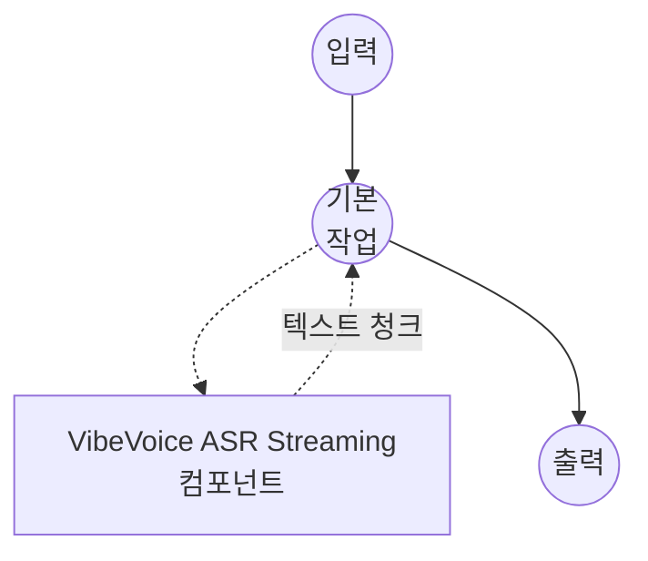

# Speech-to-Text VibeVoice ASR Streaming Model Task 예제

이 예제는 model-compose의 내장 speech-to-text 작업과 함께 Microsoft의 VibeVoice-ASR-Streaming 모델을 사용하여 오디오가 소비되는 동안 텍스트를 청크 단위로 전송하는 증분 음성 전사를 수행하는 방법을 보여주며, 저지연 라이브 및 준실시간 시나리오에 적합한 음성 인식을 제공합니다.

## 개요

이 워크플로우는 다음과 같은 로컬 스트리밍 음성-텍스트 변환을 제공합니다:

1. **스트리밍 출력**: 오디오가 디코딩되는 동안 전사 텍스트를 청크 단위로 방출
2. **저지연 인식**: 전체 패스 전사와 비교해 첫 토큰까지의 시간을 단축
3. **선택 가능한 모델 크기**: 기본으로 1.5B 체크포인트를 제공; 더 높은 품질을 원하면 7B로 교체
4. **핫워드 지원**: `context_info`를 통해 사용자 지정 용어의 인식률 향상
5. **로컬 모델 실행**: HuggingFace transformers를 이용해 완전히 오프라인으로 실행
6. **자동 모델 관리**: 첫 사용 시 체크포인트를 자동으로 다운로드하고 캐시

## 준비사항

### 필수 요구사항

- model-compose가 설치되어 PATH에서 사용 가능
- VibeVoice-ASR-Streaming 모델 실행을 위한 충분한 시스템 리소스 (권장: 1.5B는 8GB+ RAM, 7B는 16GB+, GPU 권장)
- transformers, torch, librosa 및 soundfile이 있는 Python 환경 (자동 관리)

### 스트리밍 VibeVoice-ASR을 사용하는 이유

스트리밍 ASR은 출력 형태를 조금 다르게 하는 대신 지연을 크게 줄여줍니다:

**이점:**
- **증분 텍스트**: 소비자가 오디오가 도착하는 동안 부분 전사를 표시할 수 있음
- **일정한 메모리**: 청크 단위 디코딩으로 전체 오디오를 단일 패스로 유지할 필요 없음
- **라이브 친화적**: 회의 자막, 라이브 스트림, 대화형 어시스턴트에 적합
- **핫워드 바이어싱**: 도메인 특화 어휘의 인식 정확도 향상
- **프라이버시**: 모든 오디오 처리가 로컬에서 이루어지며 외부 서비스로 데이터 전송 없음

**트레이드오프:**
- **화자 라벨 없음**: 스트리밍 체크포인트는 세그먼트별 `speaker_id` 없이 일반 텍스트를 방출
- **청크 경계**: 매우 짧은 청크 길이는 모호한 오디오에서 정확도를 저해할 수 있음
- **모델 선택**: 기본 1.5B는 빠르지만 7B 스트리밍 변형보다 품질이 낮음

### 환경 구성

1. 이 예제 디렉토리로 이동:
   ```bash
   cd examples/model-tasks/speech-to-text-vibevoice-streaming
   ```

2. 추가 환경 구성 불필요 - 모델 및 종속성이 자동으로 관리됩니다.

## 실행 방법

1. **서비스 시작:**
   ```bash
   model-compose up
   ```

2. **워크플로우 실행:**

   **API 사용:**
   ```bash
   # 기본 스트리밍 전사
   curl -X POST http://localhost:8080/api/workflows/runs \
     -F "audio=@/path/to/your/audio.mp3" \
     -F "input={\"audio\": \"@audio\"}"

   # 핫워드 바이어싱을 적용한 스트리밍 전사
   curl -X POST http://localhost:8080/api/workflows/runs \
     -F "audio=@/path/to/your/talk.wav" \
     -F "input={\"audio\": \"@audio\", \"context_info\": \"Microsoft,VibeVoice\"}"
   ```

   **웹 UI 사용:**
   - 웹 UI 열기: http://localhost:8081
   - 오디오 파일 업로드 (MP3, WAV, FLAC 등)
   - 선택적으로 쉼표로 구분된 핫워드를 `context_info`에 지정
   - "Run Workflow" 버튼 클릭 후 텍스트가 점진적으로 표시되는 것을 확인

   **CLI 사용:**
   ```bash
   # 기본 스트리밍 전사
   model-compose run --input '{"audio": "/path/to/your/audio.mp3"}'

   # 핫워드 포함 스트리밍 전사
   model-compose run --input '{"audio": "/path/to/your/audio.mp3", "context_info": "Microsoft,VibeVoice"}'
   ```

## 컴포넌트 세부사항

### Speech to Text Model 컴포넌트 (기본)
- **유형**: speech-to-text 작업을 사용하는 Model 컴포넌트
- **목적**: 로컬 스트리밍 오디오 전사
- **모델**: microsoft/VibeVoice-ASR-Streaming-1.5B
- **패밀리**: vibevoice
- **기능**:
  - 자동 모델 다운로드 및 캐싱
  - 청크 단위 텍스트 방출 (`streaming: true`)
  - 청크당 설정 가능한 `max_output_length`
  - `context_info`를 통한 핫워드 바이어싱
  - CPU 및 GPU 가속
  - 설정 가능한 attention 구현 (`sdpa`, `flash_attention_2`, `eager`)

### 모델 정보: VibeVoice-ASR-Streaming
- **개발자**: Microsoft
- **매개변수**: 약 15억 (기본) 또는 약 70억 (더 큰 변형)
- **유형**: 스트리밍 ASR 모델
- **학습 초점**: 저지연 증분 인식
- **기능**: 청크 단위 전사, 핫워드 바이어싱
- **체크포인트**:
  - `microsoft/VibeVoice-ASR-Streaming-1.5B` (기본, 더 빠름)
  - `microsoft/VibeVoice-ASR-Streaming-7B` (더 높은 품질)

## 워크플로우 세부사항

### "Speech to Text (VibeVoice ASR Streaming)" 워크플로우 (기본)

**설명**: Microsoft의 VibeVoice-ASR-Streaming을 사용한 스트리밍 음성 인식; 오디오가 소비될 때 텍스트가 청크 단위로 나타납니다.

#### 작업 흐름

이 예제는 명시적인 작업 없이 단순화된 단일 컴포넌트 구성을 사용합니다.



#### 입력 매개변수

| 매개변수 | 유형 | 필수 | 기본값 | 설명 |
|---------|------|------|--------|------|
| `audio` | audio | 예 | - | 입력 오디오 파일 (MP3, WAV, FLAC 등) |
| `context_info` | text | 아니오 | - | 인식 바이어싱을 위한 쉼표로 구분된 핫워드 (예: `Microsoft,VibeVoice`) |

#### 출력 형식

| 필드 | 유형 | 설명 |
|-----|------|------|
| `transcription` | text | 스트리밍된 전사 텍스트 (`streaming: true`일 때 청크 단위) |

## 시스템 요구사항

### 최소 요구사항
- **RAM**: 1.5B 체크포인트는 8GB (7B는 16GB+)
- **VRAM**: 6GB+ GPU 권장 (7B는 16GB+)
- **디스크 공간**: 1.5B 체크포인트는 5GB+ (7B는 20GB+)
- **CPU**: 멀티코어 프로세서 (4+ 코어 권장)
- **인터넷**: 초기 모델 다운로드에만 필요

### 성능 참고사항
- 첫 실행 시 모델 다운로드 필요 (1.5B는 약 3GB, 7B는 약 14GB)
- 모델 로딩은 하드웨어에 따라 20-60초 소요
- GPU 가속으로 추론 속도가 크게 향상되고 청크 지연이 감소함
- 더 작은 `max_output_length` 값은 처리량을 희생하는 대신 지연을 줄임

## 사용자 정의

### 더 큰 스트리밍 모델로 전환

지연보다 품질이 중요한 경우 7B 스트리밍 체크포인트 사용:

```yaml
component:
  type: model
  task: speech-to-text
  driver: custom
  family: vibevoice
  model: microsoft/VibeVoice-ASR-Streaming-7B
```

### 전체 전사 수집

스트리밍 청크 대신 완전한 전사를 반환하려면 `streaming: false`로 설정:

```yaml
component:
  type: model
  task: speech-to-text
  driver: custom
  family: vibevoice
  model: microsoft/VibeVoice-ASR-Streaming-1.5B
  action:
    audio: ${input.audio as audio}
    context_info: ${input.context_info}
    temperature: 0.0
    max_output_length: 256
    streaming: false
```

### 청크 크기 조정

`max_output_length`는 스트리밍 청크당 방출되는 토큰을 제한합니다. 값이 작을수록 지연이 낮은 더 작은 업데이트를 생성하고, 값이 클수록 청크당 오버헤드가 감소합니다:

```yaml
component:
  type: model
  task: speech-to-text
  driver: custom
  family: vibevoice
  model: microsoft/VibeVoice-ASR-Streaming-1.5B
  action:
    audio: ${input.audio as audio}
    max_output_length: 64      # 더 작은 청크, 더 빠른 업데이트
    streaming: true
```

### Flash Attention 활성화

`flash-attn`이 설치된 CUDA 호스트에서 attention 구현을 전환하면 처리량이 향상될 수 있습니다:

```yaml
component:
  type: model
  task: speech-to-text
  driver: custom
  family: vibevoice
  model: microsoft/VibeVoice-ASR-Streaming-1.5B
  attn_implementation: flash_attention_2
```

## 문제 해결

### 일반적인 문제

1. **메모리 부족**: 1.5B 체크포인트를 사용하거나 `compute_type`을 `float16`으로 낮춤
2. **모델 다운로드 실패**: 인터넷 연결 및 사용 가능한 디스크 공간 확인
3. **첫 청크 지연**: GPU 가속을 확보하고 `max_output_length`를 더 작게 조정
4. **도메인 용어 누락**: `context_info`를 통해 도메인 어휘 추가
5. **오디오 형식 오류**: 지원되는 오디오 형식 및 파일 무결성 확인

### 성능 최적화

- **GPU 사용**: 가능하면 CUDA에서 실행; 스트리밍은 특히 GPU 가속의 이점이 큼
- **Attention 백엔드**: 지원되는 GPU에서 `flash_attention_2`를 시도하여 처리량 향상
- **Compute Type**: 최신 GPU에서 `bfloat16`은 속도와 품질의 균형; CPU에서는 `float32`가 가장 안전
- **청크 크기**: 지연/처리량 요구에 맞게 `max_output_length` 조정

## 비스트리밍 변형을 사용해야 하는 시점

오디오가 소비되는 동안 텍스트가 나타나야 하는 경우 - 라이브 자막, 대화형 어시스턴트, 출력을 점진적으로 소비하려는 장시간 녹음에 이 스트리밍 예제를 선택하세요. 완성된 녹음에 대한 화자 구분과 세그먼트별 타임스탬프가 필요하다면 비스트리밍 `microsoft/VibeVoice-ASR` 체크포인트를 사용하는 [speech-to-text-vibevoice](../speech-to-text-vibevoice) 예제를 사용하세요.
