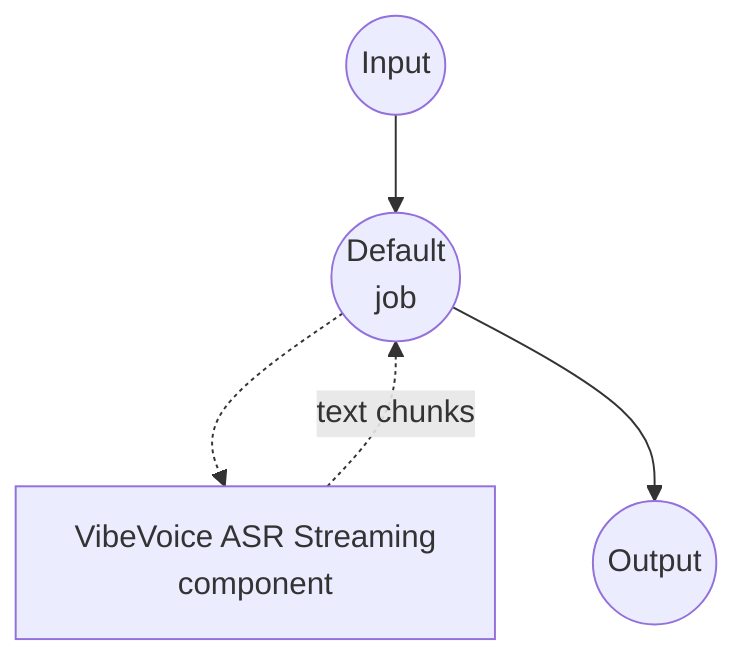

# Speech-to-Text VibeVoice ASR Streaming Model Task Example

This example demonstrates how to use Microsoft's VibeVoice-ASR-Streaming model for incremental speech transcription using model-compose's built-in speech-to-text task, delivering text chunk-by-chunk as audio is consumed for low-latency live and pseudo-real-time scenarios.

## Overview

This workflow provides local streaming speech-to-text transcription that:

1. **Streaming Output**: Emits transcribed text chunk-by-chunk while audio is decoded
2. **Low-latency Recognition**: Reduces time-to-first-token compared to full-pass transcription
3. **Selectable Model Size**: Ships with the 1.5B checkpoint; swap in the 7B variant for higher quality
4. **Hotword Support**: Boosts recognition of custom terms via `context_info`
5. **Local Model Execution**: Runs entirely offline using HuggingFace transformers
6. **Automatic Model Management**: Downloads and caches the checkpoint on first use

## Preparation

### Prerequisites

- model-compose installed and available in your PATH
- Sufficient system resources for running the VibeVoice-ASR-Streaming model (recommended: 8GB+ RAM for 1.5B, 16GB+ for 7B, GPU recommended)
- Python environment with transformers, torch, librosa, and soundfile (automatically managed)

### Why Streaming VibeVoice-ASR

Streaming ASR trades a slightly different output shape for much lower latency:

**Benefits:**
- **Incremental Text**: Consumers can display partial transcripts as audio arrives
- **Constant Memory**: Chunked decoding avoids holding the full audio in a single pass
- **Live-friendly**: Suitable for meeting captions, live streams, and interactive assistants
- **Hotword Biasing**: Sharpens recognition on domain-specific vocabulary
- **Privacy**: All audio processing happens locally, no data sent to external services

**Trade-offs:**
- **No Speaker Labels**: Streaming checkpoints emit plain text without per-segment `speaker_id`
- **Chunk Boundaries**: Very short chunk lengths can hurt accuracy on ambiguous audio
- **Model Choice**: The 1.5B default is fast but lower-quality than the 7B streaming variant

### Environment Configuration

1. Navigate to this example directory:
   ```bash
   cd examples/model-tasks/speech-to-text-vibevoice-streaming
   ```

2. No additional environment configuration required - model and dependencies are managed automatically.

## How to Run

1. **Start the service:**
   ```bash
   model-compose up
   ```

2. **Run the workflow:**

   **Using API:**
   ```bash
   # Basic streaming transcription
   curl -X POST http://localhost:8080/api/workflows/runs \
     -F "audio=@/path/to/your/audio.mp3" \
     -F "input={\"audio\": \"@audio\"}"

   # Streaming transcription with hotword biasing
   curl -X POST http://localhost:8080/api/workflows/runs \
     -F "audio=@/path/to/your/talk.wav" \
     -F "input={\"audio\": \"@audio\", \"context_info\": \"Microsoft,VibeVoice\"}"
   ```

   **Using Web UI:**
   - Open the Web UI: http://localhost:8081
   - Upload an audio file (MP3, WAV, FLAC, etc.)
   - Optionally provide `context_info` as a comma-separated list of hotwords
   - Click the "Run Workflow" button and watch text appear incrementally

   **Using CLI:**
   ```bash
   # Basic streaming transcription
   model-compose run --input '{"audio": "/path/to/your/audio.mp3"}'

   # Streaming transcription with hotwords
   model-compose run --input '{"audio": "/path/to/your/audio.mp3", "context_info": "Microsoft,VibeVoice"}'
   ```

## Component Details

### Speech to Text Model Component (Default)
- **Type**: Model component with speech-to-text task
- **Purpose**: Local streaming audio transcription
- **Model**: microsoft/VibeVoice-ASR-Streaming-1.5B
- **Family**: vibevoice
- **Features**:
  - Automatic model downloading and caching
  - Chunk-by-chunk text emission (`streaming: true`)
  - Configurable `max_output_length` per chunk
  - Hotword biasing via `context_info`
  - CPU and GPU acceleration
  - Configurable attention implementation (`sdpa`, `flash_attention_2`, `eager`)

### Model Information: VibeVoice-ASR-Streaming
- **Developer**: Microsoft
- **Parameters**: ~1.5 billion (default) or ~7 billion (larger variant)
- **Type**: Streaming ASR model
- **Training Focus**: Low-latency incremental recognition
- **Capabilities**: Chunked transcription, hotword biasing
- **Checkpoints**:
  - `microsoft/VibeVoice-ASR-Streaming-1.5B` (default, faster)
  - `microsoft/VibeVoice-ASR-Streaming-7B` (higher quality)

## Workflow Details

### "Speech to Text (VibeVoice ASR Streaming)" Workflow (Default)

**Description**: Streaming speech recognition with Microsoft's VibeVoice-ASR-Streaming; text appears chunk by chunk as the audio is consumed.

#### Job Flow

This example uses a simplified single-component configuration without explicit jobs.



#### Input Parameters

| Parameter | Type | Required | Default | Description |
|-----------|------|----------|---------|-------------|
| `audio` | audio | Yes | - | Input audio file (MP3, WAV, FLAC, etc.) |
| `context_info` | text | No | - | Comma-separated hotwords to bias recognition (e.g., `Microsoft,VibeVoice`) |

#### Output Format

| Field | Type | Description |
|-------|------|-------------|
| `transcription` | text | Streamed transcribed text (chunk-by-chunk when `streaming: true`) |

## System Requirements

### Minimum Requirements
- **RAM**: 8GB for the 1.5B checkpoint (16GB+ for 7B)
- **VRAM**: 6GB+ GPU recommended (16GB+ for 7B)
- **Disk Space**: 5GB+ for the 1.5B checkpoint (20GB+ for 7B)
- **CPU**: Multi-core processor (4+ cores recommended)
- **Internet**: Required for initial model download only

### Performance Notes
- First run requires model download (~3GB for 1.5B, ~14GB for 7B)
- Model loading takes 20-60 seconds depending on hardware
- GPU acceleration significantly improves inference speed and reduces chunk latency
- Smaller `max_output_length` values reduce latency at the cost of throughput

## Customization

### Switching to the Larger Streaming Model

Use the 7B streaming checkpoint when quality outweighs latency:

```yaml
component:
  type: model
  task: speech-to-text
  driver: custom
  family: vibevoice
  model: microsoft/VibeVoice-ASR-Streaming-7B
```

### Collecting the Full Transcript

Set `streaming: false` to return the complete transcript instead of streaming chunks:

```yaml
component:
  type: model
  task: speech-to-text
  driver: custom
  family: vibevoice
  model: microsoft/VibeVoice-ASR-Streaming-1.5B
  action:
    audio: ${input.audio as audio}
    context_info: ${input.context_info}
    temperature: 0.0
    max_output_length: 256
    streaming: false
```

### Tuning Chunk Size

`max_output_length` bounds the tokens emitted per streaming chunk. Lower values produce smaller updates with lower latency; higher values reduce per-chunk overhead:

```yaml
component:
  type: model
  task: speech-to-text
  driver: custom
  family: vibevoice
  model: microsoft/VibeVoice-ASR-Streaming-1.5B
  action:
    audio: ${input.audio as audio}
    max_output_length: 64      # smaller chunks, snappier updates
    streaming: true
```

### Enabling Flash Attention

On CUDA hosts with `flash-attn` installed, switching the attention implementation can improve throughput:

```yaml
component:
  type: model
  task: speech-to-text
  driver: custom
  family: vibevoice
  model: microsoft/VibeVoice-ASR-Streaming-1.5B
  attn_implementation: flash_attention_2
```

## Troubleshooting

### Common Issues

1. **Out of Memory**: Use the 1.5B checkpoint or lower `compute_type` to `float16`
2. **Model Download Fails**: Check internet connection and available disk space
3. **Slow First Chunk**: Ensure GPU acceleration and consider a smaller `max_output_length`
4. **Missed Domain Terms**: Add domain vocabulary through `context_info`
5. **Audio Format Errors**: Ensure supported audio format and check file integrity

### Performance Optimization

- **GPU Usage**: Run on CUDA when possible; streaming benefits especially from GPU acceleration
- **Attention Backend**: Try `flash_attention_2` on supported GPUs for higher throughput
- **Compute Type**: `bfloat16` on modern GPUs balances speed and quality; `float32` is safest on CPU
- **Chunk Size**: Tune `max_output_length` to match your latency/throughput needs

## When to Use the Non-streaming Variant

Choose this streaming example when text needs to appear as audio is consumed - live captions, interactive assistants, or long recordings where you want to consume output progressively. If you instead need speaker attribution and per-segment timestamps on a completed recording, use the [speech-to-text-vibevoice](../speech-to-text-vibevoice) example, which uses the non-streaming `microsoft/VibeVoice-ASR` checkpoint.
