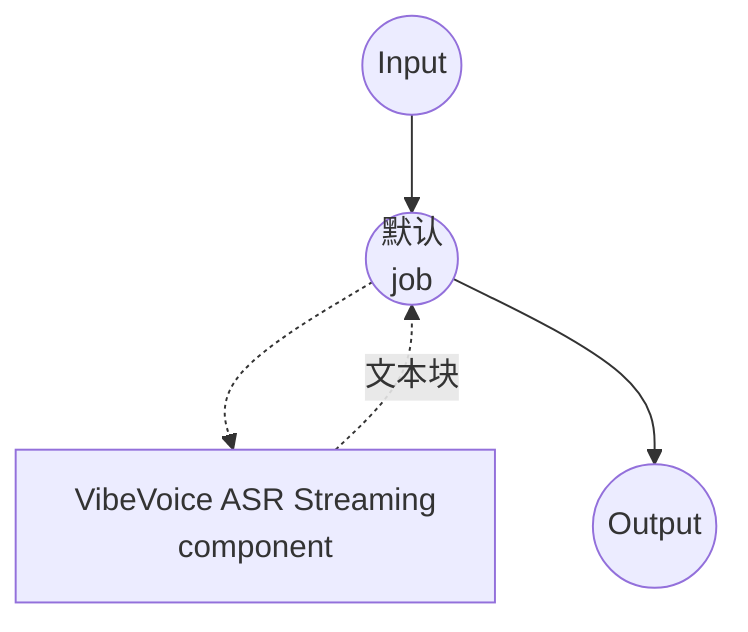

# 语音转文字 VibeVoice ASR 流式模型任务示例

本示例演示如何使用 model-compose 内置的 speech-to-text 任务与 Microsoft 的 VibeVoice-ASR-Streaming 模型，实现随着音频消费逐块输出文本的增量语音转录，适用于低延迟直播和准实时场景。

## 概述

此工作流提供本地流式语音转文字转录功能：

1. **流式输出**：在音频解码过程中逐块输出转录文本
2. **低延迟识别**：与整段转录相比缩短首个词元的到达时间
3. **可选模型规模**：默认附带 1.5B 检查点；如需更高质量可替换为 7B 变体
4. **热词支持**：通过 `context_info` 提升自定义术语的识别准确度
5. **本地模型执行**：使用 HuggingFace transformers 完全离线运行
6. **自动模型管理**：首次使用时自动下载并缓存检查点

## 准备工作

### 先决条件

- 已安装 model-compose 并在 PATH 中可用
- 运行 VibeVoice-ASR-Streaming 模型所需的充足系统资源（推荐：1.5B 使用 8GB+ RAM，7B 使用 16GB+，推荐 GPU）
- 带有 transformers、torch、librosa 和 soundfile 的 Python 环境（自动管理）

### 为什么选择流式 VibeVoice-ASR

流式 ASR 用略有不同的输出形态换取显著更低的延迟：

**优势：**
- **增量文本**：消费者可以在音频到达时显示部分转录
- **恒定内存**：分块解码避免将整段音频一次性保留
- **对直播友好**：适合会议字幕、直播和交互式助手
- **热词偏置**：提升领域专用词汇的识别准确度
- **隐私**：所有音频处理均在本地进行，不会将数据发送至外部服务

**权衡：**
- **无说话人标签**：流式检查点仅输出纯文本，不含各段的 `speaker_id`
- **块边界**：过短的块长度可能在含糊音频上降低准确率
- **模型选择**：默认 1.5B 更快但质量低于 7B 流式变体

### 环境配置

1. 导航到此示例目录：
   ```bash
   cd examples/model-tasks/speech-to-text-vibevoice-streaming
   ```

2. 无需额外的环境配置 - 模型和依赖项自动管理。

## 如何运行

1. **启动服务：**
   ```bash
   model-compose up
   ```

2. **运行工作流：**

   **使用 API：**
   ```bash
   # 基础流式转录
   curl -X POST http://localhost:8080/api/workflows/runs \
     -F "audio=@/path/to/your/audio.mp3" \
     -F "input={\"audio\": \"@audio\"}"

   # 带热词偏置的流式转录
   curl -X POST http://localhost:8080/api/workflows/runs \
     -F "audio=@/path/to/your/talk.wav" \
     -F "input={\"audio\": \"@audio\", \"context_info\": \"Microsoft,VibeVoice\"}"
   ```

   **使用 Web UI：**
   - 打开 Web UI：http://localhost:8081
   - 上传音频文件（MP3、WAV、FLAC 等）
   - 可选：以逗号分隔的形式将热词填入 `context_info`
   - 点击"Run Workflow"按钮，观察文本逐步显示

   **使用 CLI：**
   ```bash
   # 基础流式转录
   model-compose run --input '{"audio": "/path/to/your/audio.mp3"}'

   # 带热词的流式转录
   model-compose run --input '{"audio": "/path/to/your/audio.mp3", "context_info": "Microsoft,VibeVoice"}'
   ```

## 组件详情

### Speech to Text Model 组件（默认）
- **类型**：带 speech-to-text 任务的模型组件
- **用途**：本地流式音频转录
- **模型**：microsoft/VibeVoice-ASR-Streaming-1.5B
- **家族**：vibevoice
- **功能**：
  - 自动模型下载与缓存
  - 逐块文本输出（`streaming: true`）
  - 每块可配置的 `max_output_length`
  - 通过 `context_info` 的热词偏置
  - CPU 与 GPU 加速
  - 可配置的 attention 实现（`sdpa`、`flash_attention_2`、`eager`）

### 模型信息：VibeVoice-ASR-Streaming
- **开发者**：Microsoft
- **参数**：约 15 亿（默认）或约 70 亿（更大变体）
- **类型**：流式 ASR 模型
- **训练重点**：低延迟增量识别
- **能力**：分块转录、热词偏置
- **检查点**：
  - `microsoft/VibeVoice-ASR-Streaming-1.5B`（默认，更快）
  - `microsoft/VibeVoice-ASR-Streaming-7B`（更高质量）

## 工作流详情

### "Speech to Text (VibeVoice ASR Streaming)" 工作流（默认）

**描述**：使用 Microsoft 的 VibeVoice-ASR-Streaming 进行流式语音识别；在音频被消费时文本逐块出现。

#### 作业流程

此示例使用简化的单组件配置，没有显式作业。



#### 输入参数

| 参数 | 类型 | 必需 | 默认值 | 描述 |
|-----|------|------|--------|------|
| `audio` | audio | 是 | - | 输入音频文件（MP3、WAV、FLAC 等） |
| `context_info` | text | 否 | - | 用于偏置识别的逗号分隔热词（例如 `Microsoft,VibeVoice`） |

#### 输出格式

| 字段 | 类型 | 描述 |
|-----|------|------|
| `transcription` | text | 流式转录文本（`streaming: true` 时按块输出） |

## 系统要求

### 最低要求
- **RAM**：1.5B 检查点 8GB（7B 需 16GB+）
- **VRAM**：推荐 6GB+ GPU（7B 需 16GB+）
- **磁盘空间**：1.5B 检查点 5GB+（7B 需 20GB+）
- **CPU**：多核处理器（推荐 4+ 核）
- **互联网**：仅用于初始模型下载

### 性能说明
- 首次运行需要下载模型（1.5B 约 3GB，7B 约 14GB）
- 模型加载需要 20-60 秒，具体取决于硬件
- GPU 加速可显著提高推理速度并降低块延迟
- 较小的 `max_output_length` 值以吞吐量换取更低的延迟

## 自定义

### 切换到更大的流式模型

当质量比延迟更重要时使用 7B 流式检查点：

```yaml
component:
  type: model
  task: speech-to-text
  driver: custom
  family: vibevoice
  model: microsoft/VibeVoice-ASR-Streaming-7B
```

### 收集完整转录

设置 `streaming: false` 以返回完整转录而非流式块：

```yaml
component:
  type: model
  task: speech-to-text
  driver: custom
  family: vibevoice
  model: microsoft/VibeVoice-ASR-Streaming-1.5B
  action:
    audio: ${input.audio as audio}
    context_info: ${input.context_info}
    temperature: 0.0
    max_output_length: 256
    streaming: false
```

### 调整块大小

`max_output_length` 限制每个流式块输出的词元数。较小的值产生更小的更新且延迟更低；较大的值降低每块的开销：

```yaml
component:
  type: model
  task: speech-to-text
  driver: custom
  family: vibevoice
  model: microsoft/VibeVoice-ASR-Streaming-1.5B
  action:
    audio: ${input.audio as audio}
    max_output_length: 64      # 更小的块，更快的更新
    streaming: true
```

### 启用 Flash Attention

在安装了 `flash-attn` 的 CUDA 主机上，切换 attention 实现可提高吞吐量：

```yaml
component:
  type: model
  task: speech-to-text
  driver: custom
  family: vibevoice
  model: microsoft/VibeVoice-ASR-Streaming-1.5B
  attn_implementation: flash_attention_2
```

## 故障排除

### 常见问题

1. **内存不足**：使用 1.5B 检查点或将 `compute_type` 降为 `float16`
2. **模型下载失败**：检查互联网连接与可用磁盘空间
3. **首块延迟**：确保 GPU 加速并考虑更小的 `max_output_length`
4. **遗漏领域术语**：通过 `context_info` 添加领域词汇
5. **音频格式错误**：确保支持的音频格式并检查文件完整性

### 性能优化

- **GPU 使用**：尽可能在 CUDA 上运行；流式尤其能从 GPU 加速中受益
- **Attention 后端**：在支持的 GPU 上尝试 `flash_attention_2` 以提高吞吐量
- **Compute Type**：现代 GPU 上 `bfloat16` 平衡速度与质量；CPU 上 `float32` 最稳妥
- **块大小**：根据延迟/吞吐量需求调整 `max_output_length`

## 何时使用非流式变体

当文本需要在音频被消费时出现 - 直播字幕、交互式助手，或希望渐进消费输出的长录音时，选择此流式示例。若需要在完成的录音上获得说话人归属和段落级时间戳，请使用采用非流式 `microsoft/VibeVoice-ASR` 检查点的 [speech-to-text-vibevoice](../speech-to-text-vibevoice) 示例。
