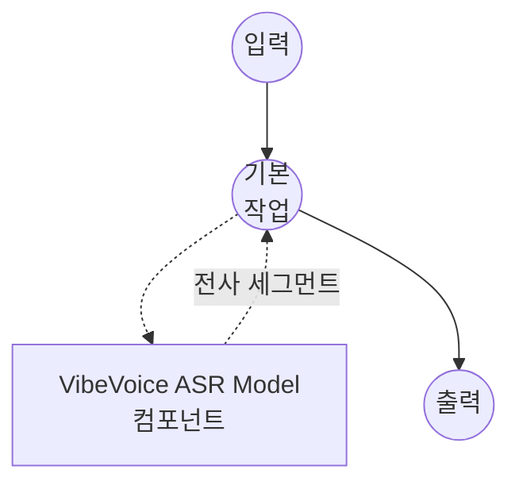

# Speech-to-Text VibeVoice ASR Model Task 예제

이 예제는 model-compose의 내장 speech-to-text 작업과 함께 Microsoft의 VibeVoice-ASR 모델을 사용하여 화자 구분 및 타임스탬프가 포함된 장시간 음성 전사를 수행하는 방법을 보여주며, 긴 오디오 콘텐츠에 대한 고품질 오프라인 음성 인식을 제공합니다.

## 개요

이 워크플로우는 다음과 같은 로컬 장시간 음성-텍스트 변환을 제공합니다:

1. **장시간 전사**: 청킹 없이 최대 60분 분량의 오디오를 단일 패스로 처리
2. **화자 구분**: 오디오 내 서로 다른 화자를 자동으로 식별하고 라벨링
3. **세그먼트 타임스탬프**: 전사 텍스트와 함께 세그먼트별 시작/종료 시간 반환
4. **핫워드 지원**: `context_info`를 통해 사용자 지정 용어의 인식률 향상
5. **로컬 모델 실행**: HuggingFace transformers를 이용해 완전히 오프라인으로 실행
6. **자동 모델 관리**: 첫 사용 시 체크포인트를 자동으로 다운로드하고 캐시

## 준비사항

### 필수 요구사항

- model-compose가 설치되어 PATH에서 사용 가능
- VibeVoice-ASR 7B 모델 실행을 위한 충분한 시스템 리소스 (권장: 16GB+ RAM, GPU 강력 권장)
- transformers, torch, librosa 및 soundfile이 있는 Python 환경 (자동 관리)

### 장시간 오디오에 VibeVoice-ASR을 사용하는 이유

컨텍스트가 짧은 ASR 모델과 비교했을 때, VibeVoice-ASR은 긴 오디오를 위해 설계되었습니다:

**이점:**
- **단일 패스 장시간 오디오**: 외부 청킹 없이 최대 1시간의 오디오 처리
- **화자 다이어리제이션**: 각 세그먼트에 `speaker_id`를 부여하여 인터뷰, 회의, 팟캐스트에 유용
- **구조화된 출력**: 타임스탬프 사용 시 `{text, start_time, end_time, speaker_id}` 형태의 세그먼트 반환
- **핫워드 바이어싱**: 쉼표로 구분된 힌트를 통해 도메인 특화 어휘의 정확도 향상
- **프라이버시**: 모든 오디오 처리가 로컬에서 이루어지며 외부 서비스로 데이터 전송 없음

**트레이드오프:**
- **하드웨어 요구사항**: 7B 체크포인트는 충분한 VRAM을 갖춘 최신 GPU에서 큰 이점을 얻음
- **비스트리밍**: 전체 오디오를 소비한 후 결과 생성; 증분 출력이 필요하면 스트리밍 예제 사용
- **설정 시간**: 초기 모델 다운로드(~14GB) 및 로딩 시간

### 환경 구성

1. 이 예제 디렉토리로 이동:
   ```bash
   cd examples/model-tasks/speech-to-text-vibevoice
   ```

2. 추가 환경 구성 불필요 - 모델 및 종속성이 자동으로 관리됩니다.

## 실행 방법

1. **서비스 시작:**
   ```bash
   model-compose up
   ```

2. **워크플로우 실행:**

   **API 사용:**
   ```bash
   # 타임스탬프 및 화자 라벨 포함 기본 전사
   curl -X POST http://localhost:8080/api/workflows/runs \
     -F "audio=@/path/to/your/audio.mp3" \
     -F "input={\"audio\": \"@audio\"}"

   # 핫워드 바이어싱을 적용한 전사
   curl -X POST http://localhost:8080/api/workflows/runs \
     -F "audio=@/path/to/your/meeting.wav" \
     -F "input={\"audio\": \"@audio\", \"context_info\": \"Microsoft,VibeVoice,Azure\"}"
   ```

   **웹 UI 사용:**
   - 웹 UI 열기: http://localhost:8081
   - 오디오 파일 업로드 (MP3, WAV, FLAC 등)
   - 선택적으로 쉼표로 구분된 핫워드를 `context_info`에 지정
   - "Run Workflow" 버튼 클릭

   **CLI 사용:**
   ```bash
   # 기본 전사
   model-compose run --input '{"audio": "/path/to/your/audio.mp3"}'

   # 핫워드 포함 전사
   model-compose run --input '{"audio": "/path/to/your/audio.mp3", "context_info": "Microsoft,VibeVoice"}'
   ```

## 컴포넌트 세부사항

### Speech to Text Model 컴포넌트 (기본)
- **유형**: speech-to-text 작업을 사용하는 Model 컴포넌트
- **목적**: 화자 구분이 포함된 로컬 장시간 오디오 전사
- **모델**: microsoft/VibeVoice-ASR
- **패밀리**: vibevoice
- **기능**:
  - 자동 모델 다운로드 및 캐싱
  - 장시간 오디오 전사 (패스당 최대 60분)
  - 세그먼트별 `speaker_id`가 포함된 화자 다이어리제이션
  - 세그먼트 수준 타임스탬프
  - `context_info`를 통한 핫워드 바이어싱
  - CPU 및 GPU 가속
  - 설정 가능한 attention 구현 (`sdpa`, `flash_attention_2`, `eager`)

### 모델 정보: VibeVoice-ASR
- **개발자**: Microsoft
- **매개변수**: 약 70억
- **유형**: 화자 구분이 가능한 장시간 ASR 모델
- **학습 초점**: 확장된 컨텍스트의 오디오 인식
- **기능**: 전사, 화자 다이어리제이션, 타임스탬프 방출, 핫워드 바이어싱
- **체크포인트**: `microsoft/VibeVoice-ASR` (비스트리밍)

## 워크플로우 세부사항

### "Speech to Text (VibeVoice ASR)" 워크플로우 (기본)

**설명**: Microsoft의 VibeVoice-ASR을 사용하여 화자 구분과 타임스탬프가 포함된 장시간 전사를 수행합니다 (비스트리밍, 최대 60분 단일 패스).

#### 작업 흐름

이 예제는 명시적인 작업 없이 단순화된 단일 컴포넌트 구성을 사용합니다.



#### 입력 매개변수

| 매개변수 | 유형 | 필수 | 기본값 | 설명 |
|---------|------|------|--------|------|
| `audio` | audio | 예 | - | 입력 오디오 파일 (MP3, WAV, FLAC 등) |
| `context_info` | text | 아니오 | - | 인식 바이어싱을 위한 쉼표로 구분된 핫워드 (예: `Microsoft,VibeVoice`) |

#### 출력 형식

| 필드 | 유형 | 설명 |
|-----|------|------|
| `transcription` | json | 각 세그먼트가 `text`, `start_time`, `end_time`, `speaker_id`를 포함하는 배열 |

## 시스템 요구사항

### 최소 요구사항
- **RAM**: 16GB (권장 32GB+)
- **VRAM**: 7B 체크포인트를 위한 16GB+ GPU 강력 권장
- **디스크 공간**: 모델 저장 및 캐시를 위한 20GB+
- **CPU**: 멀티코어 프로세서 (CPU 전용 추론 시 8+ 코어 권장)
- **인터넷**: 초기 모델 다운로드에만 필요

### 성능 참고사항
- 첫 실행 시 모델 다운로드 필요 (~14GB)
- 모델 로딩은 하드웨어에 따라 30-90초 소요
- GPU 가속으로 추론 속도가 크게 향상됨
- 처리 시간은 오디오 길이에 따라 증가하지만 반복적인 청크 오버헤드를 피할 수 있음

## 사용자 정의

### Compute Type 조정

품질과 속도/메모리를 절충해야 할 때 기본 `auto` compute type을 재정의하세요:

```yaml
component:
  type: model
  task: speech-to-text
  driver: custom
  family: vibevoice
  model: microsoft/VibeVoice-ASR
  compute_type: bfloat16   # 또는 float16, float32
```

### Flash Attention 활성화

`flash-attn`이 설치된 CUDA 호스트에서 attention 구현을 전환하면 처리량이 향상될 수 있습니다:

```yaml
component:
  type: model
  task: speech-to-text
  driver: custom
  family: vibevoice
  model: microsoft/VibeVoice-ASR
  attn_implementation: flash_attention_2
```

### 디코딩 튜닝

탐색적 전사를 위해 탐색 폭을 넓히거나 샘플링을 활성화하세요:

```yaml
component:
  type: model
  task: speech-to-text
  driver: custom
  family: vibevoice
  model: microsoft/VibeVoice-ASR
  action:
    audio: ${input.audio as audio}
    context_info: ${input.context_info}
    return_timestamps: true
    temperature: 0.2
    num_beams: 4
    streaming: false
```

## 문제 해결

### 일반적인 문제

1. **메모리 부족**: `compute_type`을 `float16`으로 낮추거나 VRAM이 더 큰 머신에서 실행; 일정한 메모리 디코딩이 필요하면 스트리밍 예제 고려
2. **모델 다운로드 실패**: 인터넷 연결 및 디스크 공간 확인
3. **느린 처리**: GPU 가속을 확보하고 지원 시 `flash_attention_2` 활성화
4. **도메인 용어 누락**: `context_info`를 통해 도메인 어휘 추가
5. **오디오 형식 오류**: 지원되는 오디오 형식과 파일 무결성 확인

### 성능 최적화

- **GPU 사용**: 가능하면 CUDA에서 실행; 7B 체크포인트는 CPU에서 상당히 느림
- **Attention 백엔드**: 지원되는 GPU에서 `flash_attention_2`를 시도하여 처리량 향상
- **Compute Type**: 최신 GPU에서 `bfloat16`은 속도와 품질의 균형; CPU에서는 `float32`가 가장 안전
- **핫워드**: `context_info`는 짧고 실제로 모호한 용어에만 집중

## 스트리밍 변형을 사용해야 하는 시점

완성된 녹음에 대한 화자 구분과 세그먼트별 타임스탬프가 필요할 때 이 비스트리밍 예제를 선택하세요. 반면 오디오가 도착할 때 청크 단위로 텍스트가 나타나기를 원한다면 `microsoft/VibeVoice-ASR-Streaming-*` 체크포인트를 사용하는 [speech-to-text-vibevoice-streaming](../speech-to-text-vibevoice-streaming) 예제를 사용하세요.
