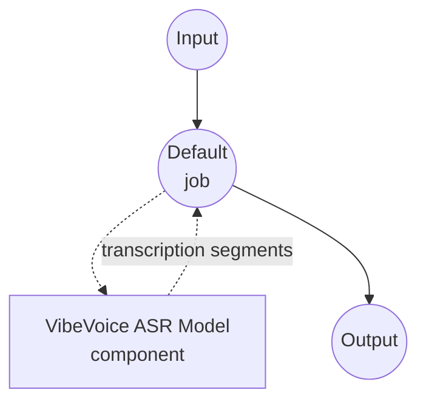

# Speech-to-Text VibeVoice ASR Model Task Example

This example demonstrates how to use Microsoft's VibeVoice-ASR model for long-form speech transcription with speaker attribution and timestamps using model-compose's built-in speech-to-text task, providing high-quality offline speech recognition for extended audio content.

## Overview

This workflow provides local long-form speech-to-text transcription that:

1. **Long-form Transcription**: Handles up to 60 minutes of audio in a single pass without chunking
2. **Speaker Attribution**: Automatically identifies and labels different speakers in the audio
3. **Segment Timestamps**: Returns per-segment start/end times alongside transcribed text
4. **Hotword Support**: Boosts recognition of custom terms via `context_info`
5. **Local Model Execution**: Runs entirely offline using HuggingFace transformers
6. **Automatic Model Management**: Downloads and caches the checkpoint on first use

## Preparation

### Prerequisites

- model-compose installed and available in your PATH
- Sufficient system resources for running the VibeVoice-ASR 7B model (recommended: 16GB+ RAM, GPU strongly recommended)
- Python environment with transformers, torch, librosa, and soundfile (automatically managed)

### Why VibeVoice-ASR for Long-form Audio

Compared to shorter-context ASR models, VibeVoice-ASR is designed for extended audio:

**Benefits:**
- **Single-pass Long Audio**: Processes up to one hour of audio without external chunking
- **Speaker Diarization**: Emits `speaker_id` for each segment, useful for interviews, meetings, and podcasts
- **Structured Output**: Returns segments with `{text, start_time, end_time, speaker_id}` when timestamps are enabled
- **Hotword Biasing**: Improves accuracy on domain-specific vocabulary via comma-separated hints
- **Privacy**: All audio processing happens locally, no data sent to external services

**Trade-offs:**
- **Hardware Requirements**: The 7B checkpoint benefits substantially from a modern GPU with adequate VRAM
- **Non-streaming**: Produces results after the whole audio is consumed; use the streaming example for incremental output
- **Setup Time**: Initial model download (~14GB) and loading time

### Environment Configuration

1. Navigate to this example directory:
   ```bash
   cd examples/model-tasks/speech-to-text-vibevoice
   ```

2. No additional environment configuration required - model and dependencies are managed automatically.

## How to Run

1. **Start the service:**
   ```bash
   model-compose up
   ```

2. **Run the workflow:**

   **Using API:**
   ```bash
   # Basic transcription with timestamps and speaker labels
   curl -X POST http://localhost:8080/api/workflows/runs \
     -F "audio=@/path/to/your/audio.mp3" \
     -F "input={\"audio\": \"@audio\"}"

   # Transcription with hotword biasing
   curl -X POST http://localhost:8080/api/workflows/runs \
     -F "audio=@/path/to/your/meeting.wav" \
     -F "input={\"audio\": \"@audio\", \"context_info\": \"Microsoft,VibeVoice,Azure\"}"
   ```

   **Using Web UI:**
   - Open the Web UI: http://localhost:8081
   - Upload an audio file (MP3, WAV, FLAC, etc.)
   - Optionally provide `context_info` as a comma-separated list of hotwords
   - Click the "Run Workflow" button

   **Using CLI:**
   ```bash
   # Basic transcription
   model-compose run --input '{"audio": "/path/to/your/audio.mp3"}'

   # Transcription with hotwords
   model-compose run --input '{"audio": "/path/to/your/audio.mp3", "context_info": "Microsoft,VibeVoice"}'
   ```

## Component Details

### Speech to Text Model Component (Default)
- **Type**: Model component with speech-to-text task
- **Purpose**: Local long-form audio transcription with speaker attribution
- **Model**: microsoft/VibeVoice-ASR
- **Family**: vibevoice
- **Features**:
  - Automatic model downloading and caching
  - Long-form audio transcription (up to 60 minutes per pass)
  - Speaker diarization with per-segment `speaker_id`
  - Segment-level timestamps
  - Hotword biasing via `context_info`
  - CPU and GPU acceleration
  - Configurable attention implementation (`sdpa`, `flash_attention_2`, `eager`)

### Model Information: VibeVoice-ASR
- **Developer**: Microsoft
- **Parameters**: ~7 billion
- **Type**: Long-form ASR model with speaker attribution
- **Training Focus**: Extended-context audio recognition
- **Capabilities**: Transcription, speaker diarization, timestamp emission, hotword biasing
- **Checkpoint**: `microsoft/VibeVoice-ASR` (non-streaming)

## Workflow Details

### "Speech to Text (VibeVoice ASR)" Workflow (Default)

**Description**: Long-form transcription with speaker attribution and timestamps using Microsoft's VibeVoice-ASR (non-streaming, up to 60-minute single-pass).

#### Job Flow

This example uses a simplified single-component configuration without explicit jobs.



#### Input Parameters

| Parameter | Type | Required | Default | Description |
|-----------|------|----------|---------|-------------|
| `audio` | audio | Yes | - | Input audio file (MP3, WAV, FLAC, etc.) |
| `context_info` | text | No | - | Comma-separated hotwords to bias recognition (e.g., `Microsoft,VibeVoice`) |

#### Output Format

| Field | Type | Description |
|-------|------|-------------|
| `transcription` | json | Array of segments, each containing `text`, `start_time`, `end_time`, and `speaker_id` |

## System Requirements

### Minimum Requirements
- **RAM**: 16GB (recommended 32GB+)
- **VRAM**: 16GB+ GPU strongly recommended for the 7B checkpoint
- **Disk Space**: 20GB+ for model storage and cache
- **CPU**: Multi-core processor (8+ cores recommended for CPU-only inference)
- **Internet**: Required for initial model download only

### Performance Notes
- First run requires model download (~14GB)
- Model loading takes 30-90 seconds depending on hardware
- GPU acceleration significantly improves inference speed
- Processing time scales with audio length but avoids repeated chunk overhead

## Customization

### Adjusting Compute Type

Override the default `auto` compute type when you need to trade quality for speed or memory:

```yaml
component:
  type: model
  task: speech-to-text
  driver: custom
  family: vibevoice
  model: microsoft/VibeVoice-ASR
  compute_type: bfloat16   # or float16, float32
```

### Enabling Flash Attention

On CUDA hosts with `flash-attn` installed, switching the attention implementation can improve throughput:

```yaml
component:
  type: model
  task: speech-to-text
  driver: custom
  family: vibevoice
  model: microsoft/VibeVoice-ASR
  attn_implementation: flash_attention_2
```

### Tuning Decoding

Widen the search or enable sampling for exploratory transcripts:

```yaml
component:
  type: model
  task: speech-to-text
  driver: custom
  family: vibevoice
  model: microsoft/VibeVoice-ASR
  action:
    audio: ${input.audio as audio}
    context_info: ${input.context_info}
    return_timestamps: true
    temperature: 0.2
    num_beams: 4
    streaming: false
```

## Troubleshooting

### Common Issues

1. **Out of Memory**: Lower `compute_type` to `float16` or run on a machine with more VRAM; consider the streaming example for constant-memory decoding
2. **Model Download Fails**: Check internet connection and available disk space
3. **Slow Processing**: Ensure GPU acceleration is available; enable `flash_attention_2` when supported
4. **Missed Domain Terms**: Add domain vocabulary through `context_info`
5. **Audio Format Errors**: Ensure supported audio format and check file integrity

### Performance Optimization

- **GPU Usage**: Run on CUDA when possible; the 7B checkpoint is significantly slower on CPU
- **Attention Backend**: Try `flash_attention_2` on supported GPUs for higher throughput
- **Compute Type**: `bfloat16` on modern GPUs balances speed and quality; `float32` is safest on CPU
- **Hotwords**: Keep `context_info` short and focused on truly ambiguous terms

## When to Use the Streaming Variant

Choose this non-streaming example when you need speaker attribution and per-segment timestamps for a completed recording. If you instead need text to appear chunk-by-chunk as audio arrives, use the [speech-to-text-vibevoice-streaming](../speech-to-text-vibevoice-streaming) example, which uses `microsoft/VibeVoice-ASR-Streaming-*` checkpoints.
