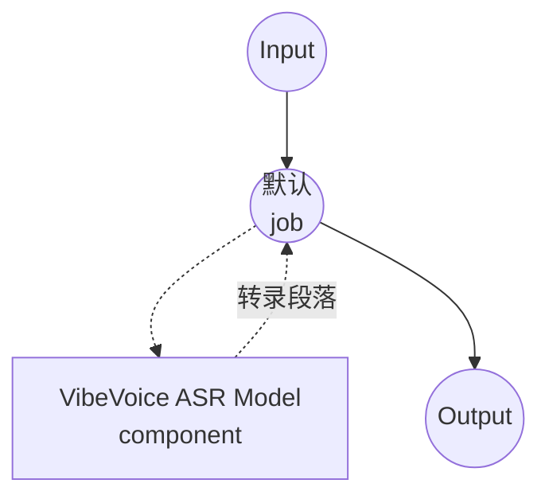

# 语音转文字 VibeVoice ASR 模型任务示例

本示例演示如何使用 model-compose 内置的 speech-to-text 任务与 Microsoft 的 VibeVoice-ASR 模型，实现带有说话人归属和时间戳的长音频转录，为较长音频内容提供高质量的离线语音识别。

## 概述

此工作流提供本地长音频语音转文字转录功能：

1. **长音频转录**：无需分块即可单次处理最长 60 分钟的音频
2. **说话人归属**：自动识别并标注音频中不同的说话人
3. **段落时间戳**：在转录文本旁返回各段的起止时间
4. **热词支持**：通过 `context_info` 提升自定义术语的识别准确度
5. **本地模型执行**：使用 HuggingFace transformers 完全离线运行
6. **自动模型管理**：首次使用时自动下载并缓存检查点

## 准备工作

### 先决条件

- 已安装 model-compose 并在 PATH 中可用
- 运行 VibeVoice-ASR 7B 模型所需的充足系统资源（推荐：16GB+ RAM，强烈推荐 GPU）
- 带有 transformers、torch、librosa 和 soundfile 的 Python 环境（自动管理）

### 为什么选择 VibeVoice-ASR 处理长音频

与短上下文 ASR 模型相比，VibeVoice-ASR 专为长音频而设计：

**优势：**
- **单次长音频处理**：无需外部分块即可处理长达一小时的音频
- **说话人分离**：为每段输出 `speaker_id`，适合访谈、会议和播客场景
- **结构化输出**：启用时间戳时返回 `{text, start_time, end_time, speaker_id}` 的段落
- **热词偏置**：通过逗号分隔的提示提升领域词汇的准确率
- **隐私**：所有音频处理均在本地进行，不会将数据发送至外部服务

**权衡：**
- **硬件要求**：7B 检查点在具有充足 VRAM 的现代 GPU 上收益显著
- **非流式**：整段音频处理完成后才产生结果；如需增量输出请使用流式示例
- **设置时间**：初始模型下载（~14GB）与加载时间

### 环境配置

1. 导航到此示例目录：
   ```bash
   cd examples/model-tasks/speech-to-text-vibevoice
   ```

2. 无需额外的环境配置 - 模型和依赖项自动管理。

## 如何运行

1. **启动服务：**
   ```bash
   model-compose up
   ```

2. **运行工作流：**

   **使用 API：**
   ```bash
   # 带时间戳与说话人标签的基础转录
   curl -X POST http://localhost:8080/api/workflows/runs \
     -F "audio=@/path/to/your/audio.mp3" \
     -F "input={\"audio\": \"@audio\"}"

   # 带热词偏置的转录
   curl -X POST http://localhost:8080/api/workflows/runs \
     -F "audio=@/path/to/your/meeting.wav" \
     -F "input={\"audio\": \"@audio\", \"context_info\": \"Microsoft,VibeVoice,Azure\"}"
   ```

   **使用 Web UI：**
   - 打开 Web UI：http://localhost:8081
   - 上传音频文件（MP3、WAV、FLAC 等）
   - 可选：以逗号分隔的形式将热词填入 `context_info`
   - 点击"Run Workflow"按钮

   **使用 CLI：**
   ```bash
   # 基础转录
   model-compose run --input '{"audio": "/path/to/your/audio.mp3"}'

   # 带热词的转录
   model-compose run --input '{"audio": "/path/to/your/audio.mp3", "context_info": "Microsoft,VibeVoice"}'
   ```

## 组件详情

### Speech to Text Model 组件（默认）
- **类型**：带 speech-to-text 任务的模型组件
- **用途**：具备说话人归属的本地长音频转录
- **模型**：microsoft/VibeVoice-ASR
- **家族**：vibevoice
- **功能**：
  - 自动模型下载与缓存
  - 长音频转录（单次最长 60 分钟）
  - 每段包含 `speaker_id` 的说话人分离
  - 段落级时间戳
  - 通过 `context_info` 的热词偏置
  - CPU 与 GPU 加速
  - 可配置的 attention 实现（`sdpa`、`flash_attention_2`、`eager`）

### 模型信息：VibeVoice-ASR
- **开发者**：Microsoft
- **参数**：约 70 亿
- **类型**：具备说话人归属的长音频 ASR 模型
- **训练重点**：扩展上下文的音频识别
- **能力**：转录、说话人分离、时间戳输出、热词偏置
- **检查点**：`microsoft/VibeVoice-ASR`（非流式）

## 工作流详情

### "Speech to Text (VibeVoice ASR)" 工作流（默认）

**描述**：使用 Microsoft 的 VibeVoice-ASR 进行带有说话人归属和时间戳的长音频转录（非流式，单次最长 60 分钟）。

#### 作业流程

此示例使用简化的单组件配置，没有显式作业。



#### 输入参数

| 参数 | 类型 | 必需 | 默认值 | 描述 |
|-----|------|------|--------|------|
| `audio` | audio | 是 | - | 输入音频文件（MP3、WAV、FLAC 等） |
| `context_info` | text | 否 | - | 用于偏置识别的逗号分隔热词（例如 `Microsoft,VibeVoice`） |

#### 输出格式

| 字段 | 类型 | 描述 |
|-----|------|------|
| `transcription` | json | 段落数组，每段包含 `text`、`start_time`、`end_time`、`speaker_id` |

## 系统要求

### 最低要求
- **RAM**：16GB（推荐 32GB+）
- **VRAM**：7B 检查点强烈推荐 16GB+ GPU
- **磁盘空间**：20GB+ 用于模型存储和缓存
- **CPU**：多核处理器（仅 CPU 推理时推荐 8+ 核）
- **互联网**：仅用于初始模型下载

### 性能说明
- 首次运行需要下载模型（~14GB）
- 模型加载需要 30-90 秒，具体取决于硬件
- GPU 加速可显著提高推理速度
- 处理时间随音频长度而增加，但避免了重复的分块开销

## 自定义

### 调整 Compute Type

当需要在质量与速度/内存之间权衡时，覆盖默认的 `auto` compute type：

```yaml
component:
  type: model
  task: speech-to-text
  driver: custom
  family: vibevoice
  model: microsoft/VibeVoice-ASR
  compute_type: bfloat16   # 或 float16、float32
```

### 启用 Flash Attention

在安装了 `flash-attn` 的 CUDA 主机上，切换 attention 实现可提高吞吐量：

```yaml
component:
  type: model
  task: speech-to-text
  driver: custom
  family: vibevoice
  model: microsoft/VibeVoice-ASR
  attn_implementation: flash_attention_2
```

### 调整解码

为了探索性转录，扩大搜索范围或启用采样：

```yaml
component:
  type: model
  task: speech-to-text
  driver: custom
  family: vibevoice
  model: microsoft/VibeVoice-ASR
  action:
    audio: ${input.audio as audio}
    context_info: ${input.context_info}
    return_timestamps: true
    temperature: 0.2
    num_beams: 4
    streaming: false
```

## 故障排除

### 常见问题

1. **内存不足**：将 `compute_type` 降为 `float16` 或使用 VRAM 更大的机器；如需恒定内存解码请考虑流式示例
2. **模型下载失败**：检查互联网连接与可用磁盘空间
3. **处理缓慢**：确保 GPU 加速可用；在支持时启用 `flash_attention_2`
4. **遗漏领域术语**：通过 `context_info` 添加领域词汇
5. **音频格式错误**：确保支持的音频格式并检查文件完整性

### 性能优化

- **GPU 使用**：尽可能在 CUDA 上运行；7B 检查点在 CPU 上明显较慢
- **Attention 后端**：在支持的 GPU 上尝试 `flash_attention_2` 以提高吞吐量
- **Compute Type**：现代 GPU 上 `bfloat16` 平衡速度与质量；CPU 上 `float32` 最稳妥
- **热词**：保持 `context_info` 简短，仅针对真正模糊的术语

## 何时使用流式变体

当需要针对已完成录音获得说话人归属和段落级时间戳时，选择此非流式示例。若需要在音频到达时逐块输出文本，请使用采用 `microsoft/VibeVoice-ASR-Streaming-*` 检查点的 [speech-to-text-vibevoice-streaming](../speech-to-text-vibevoice-streaming) 示例。
