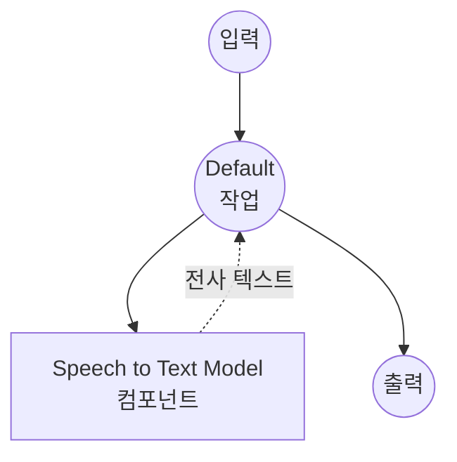

# Speech-to-Text Model Task 예제

이 예제는 model-compose의 내장 speech-to-text 작업과 허깅페이스 transformers를 사용하여 로컬 Whisper 모델로 오디오를 텍스트로 변환하는 방법을 보여주며, 오프라인 음성 인식 기능을 제공합니다.

## 개요

이 워크플로우는 다음과 같은 로컬 음성-텍스트 변환을 제공합니다:

1. **로컬 음성 모델**: 허깅페이스 transformers를 사용하여 사전 학습된 Whisper 모델을 로컬에서 실행
2. **오디오 전사**: 높은 정확도로 음성 오디오를 텍스트로 변환
3. **다국어 지원**: 자동 언어 감지를 포함한 99개 이상의 언어 지원
4. **번역**: 모든 언어의 음성을 영어로 직접 번역 가능
5. **자동 모델 관리**: 첫 사용 시 모델을 자동으로 다운로드하고 캐시
6. **외부 API 불필요**: API 의존성 없이 완전히 오프라인 전사

## 준비사항

### 필수 요구사항

- model-compose가 설치되어 PATH에서 사용 가능
- Whisper 모델 실행을 위한 충분한 시스템 리소스 (권장: 8GB+ RAM, GPU 권장)
- transformers, torch, librosa 및 soundfile이 있는 Python 환경 (자동 관리)

### 로컬 음성 모델을 사용하는 이유

클라우드 기반 음성 API와 달리 로컬 모델 실행은 다음을 제공합니다:

**로컬 처리의 이점:**
- **프라이버시**: 모든 오디오 처리가 로컬에서 이루어지며 외부 서비스로 오디오 전송 없음
- **비용**: 초기 설정 후 분당 또는 API 사용 요금 없음
- **오프라인**: 모델 다운로드 후 인터넷 연결 없이 작동
- **지연시간**: 전사에 네트워크 지연 없음
- **사용자 정의**: 모델 매개변수 및 언어 설정에 대한 완전한 제어
- **배치 처리**: 속도 제한 없이 무제한 오디오 처리

**트레이드오프:**
- **하드웨어 요구사항**: 최적 성능을 위해 적절한 RAM 및 GPU 필요
- **설정 시간**: 초기 모델 다운로드 및 로딩 시간
- **모델 제한**: 더 작은 모델은 클라우드 서비스보다 낮은 정확도를 가질 수 있음

### 환경 구성

1. 이 예제 디렉토리로 이동:
   ```bash
   cd examples/model-tasks/speech-to-text
   ```

2. 추가 환경 구성 불필요 - 모델 및 종속성이 자동으로 관리됩니다.

## 실행 방법

1. **서비스 시작:**
   ```bash
   model-compose up
   ```

2. **워크플로우 실행:**

   **API 사용:**
   ```bash
   # 기본 전사 (자동 언어 감지)
   curl -X POST http://localhost:8080/api/workflows/runs \
     -F "audio=@/path/to/your/audio.mp3" \
     -F "input={\"audio\": \"@audio\"}"

   # 언어를 명시한 전사
   curl -X POST http://localhost:8080/api/workflows/runs \
     -F "audio=@/path/to/your/audio.mp3" \
     -F "input={\"audio\": \"@audio\", \"language\": \"ko\"}"

   # 영어로 번역
   curl -X POST http://localhost:8080/api/workflows/runs \
     -F "audio=@/path/to/your/audio.mp3" \
     -F "input={\"audio\": \"@audio\", \"language\": \"ko\", \"task\": \"translate\"}"
   ```

   **웹 UI 사용:**
   - 웹 UI 열기: http://localhost:8081
   - 오디오 파일 업로드 (MP3, WAV, FLAC 등)
   - 선택적으로 언어 코드 지정 (예: `en`, `ko`, `ja`)
   - 영어 번역을 원하면 task를 `translate`로 설정
   - "Run Workflow" 버튼 클릭

   **CLI 사용:**
   ```bash
   # 기본 전사
   model-compose run speech-to-text --input '{"audio": "/path/to/your/audio.mp3"}'

   # 언어를 명시한 전사
   model-compose run speech-to-text --input '{"audio": "/path/to/your/audio.mp3", "language": "ko"}'

   # 영어로 번역
   model-compose run speech-to-text --input '{"audio": "/path/to/your/audio.mp3", "task": "translate"}'
   ```

## 컴포넌트 세부사항

### Speech to Text Model 컴포넌트 (기본)
- **유형**: speech-to-text 작업을 사용하는 Model 컴포넌트
- **목적**: 로컬 오디오 전사 및 번역
- **모델**: openai/whisper-large-v3-turbo
- **아키텍처**: Whisper
- **기능**:
  - 자동 모델 다운로드 및 캐싱
  - 다양한 오디오 형식 지원 (MP3, WAV, FLAC, OGG 등)
  - 자동 언어 감지
  - 99개 이상의 언어 전사 지원
  - 음성-영어 번역
  - CPU 및 GPU 가속 지원
  - 청킹을 통한 장시간 오디오 전사

### 모델 정보: Whisper Large v3 Turbo
- **개발자**: OpenAI (허깅페이스에 호스팅)
- **매개변수**: 약 8억 900만
- **유형**: 인코더-디코더 트랜스포머 모델
- **아키텍처**: Whisper
- **학습 데이터**: 68만 시간의 다국어 오디오
- **기능**: 전사, 번역, 언어 감지
- **지원 언어**: 99개 이상
- **라이센스**: MIT

## 워크플로우 세부사항

### "Speech to Text Transcription" 워크플로우 (기본)

**설명**: 로컬에서 실행되는 Whisper 모델을 사용하여 오디오 파일을 텍스트로 전사합니다.

#### 작업 흐름

이 예제는 명시적인 작업 없이 단순화된 단일 컴포넌트 구성을 사용합니다.



#### 입력 매개변수

| 매개변수 | 유형 | 필수 | 기본값 | 설명 |
|---------|------|------|--------|------|
| `audio` | audio | 예 | - | 입력 오디오 파일 (MP3, WAV, FLAC 등) |
| `language` | text | 아니오 | 자동 감지 | 전사 언어 코드 (예: `en`, `ko`, `ja`) |
| `task` | text | 아니오 | `transcribe` | 수행할 작업: `transcribe` 또는 `translate` |

#### 출력 형식

| 필드 | 유형 | 설명 |
|-----|------|------|
| `transcription` | text | 오디오에서 전사된 텍스트 |

## 시스템 요구사항

### 최소 요구사항
- **RAM**: 8GB (권장 16GB+)
- **VRAM**: 대형 모델을 위한 6GB+ GPU 권장
- **디스크 공간**: 모델 저장 및 캐시를 위한 5GB+
- **CPU**: 멀티코어 프로세서 (4+ 코어 권장)
- **인터넷**: 초기 모델 다운로드에만 필요

### 성능 참고사항
- 첫 실행 시 모델 다운로드 필요 (large-v3-turbo 약 3GB)
- 모델 로딩은 하드웨어에 따라 30-60초 소요
- GPU 가속으로 추론 속도가 크게 향상됨
- 처리 시간은 오디오 길이에 따라 다름

## 사용자 정의

### 다른 모델 사용

다른 Whisper 모델 변형으로 교체:

```yaml
component:
  type: model
  task: speech-to-text
  architecture: whisper
  model: openai/whisper-base        # 더 작고 빠른 모델
  # 또는
  model: openai/whisper-large-v3   # 최고 정확도
```

### Whisper Large 아키텍처 사용

전체 Whisper Large 모델의 경우:

```yaml
component:
  type: model
  task: speech-to-text
  architecture: whisper-large
  model: openai/whisper-large-v3
```

### 생성 매개변수 조정

전사 품질 세부 조정:

```yaml
component:
  type: model
  task: speech-to-text
  architecture: whisper
  model: openai/whisper-large-v3-turbo
  action:
    audio: ${input.audio as audio}
    language: ${input.language}
    params:
      num_beams: 5
      temperature: 0.0
      no_speech_threshold: 0.6
      return_timestamps: true
```

### 배치 처리

여러 오디오 파일 처리:

```yaml
workflow:
  title: 배치 오디오 전사
  jobs:
    - id: transcribe-audio
      component: speech-to-text-model
      repeat_count: ${input.audio_count}
      input:
        audio: ${input.audios[${index}]}
        language: ${input.language}
```

## 문제 해결

### 일반적인 문제

1. **메모리 부족**: 더 작은 모델 변형 사용 (예: `whisper-base`) 또는 배치 크기 줄이기
2. **모델 다운로드 실패**: 인터넷 연결 및 디스크 공간 확인
3. **느린 처리**: `device: cuda:0`으로 GPU 가속 활성화
4. **낮은 정확도**: 더 큰 모델 변형 시도 또는 언어 명시적 지정
5. **오디오 형식 오류**: 지원되는 오디오 형식 확인 및 파일 손상 검사

### 성능 최적화

- **GPU 사용**: GPU 가속을 위해 `device: cuda:0` 설정
- **모델 선택**: CPU에서 빠른 추론을 위해 `whisper-base` 또는 `whisper-small` 사용
- **언어 지정**: `language`를 명시적으로 설정하면 속도와 정확도가 향상됨
- **청크 길이**: 최적의 장시간 오디오 처리를 위해 `chunk_length` 매개변수 조정

## API 기반 솔루션과 비교

| 기능 | 로컬 Whisper 모델 | 클라우드 음성 API |
|-----|----------------|----------------|
| 프라이버시 | 완전한 프라이버시 | 프로바이더로 오디오 전송 |
| 비용 | 하드웨어 비용만 | 분당 가격 |
| 지연시간 | 하드웨어 의존적 | 네트워크 + API 지연 |
| 가용성 | 오프라인 가능 | 인터넷 필요 |
| 언어 지원 | 99개 이상 | 프로바이더 의존적 |
| 배치 처리 | 무제한 | 속도 제한 |
| 설정 복잡도 | 모델 다운로드 필요 | API 키만 |

## 모델 변형

다양한 사용 사례를 위한 다른 권장 Whisper 모델:

### 더 작은 모델 (낮은 요구사항)
- `openai/whisper-tiny` - 3,900만 매개변수, 가장 빠른 추론
- `openai/whisper-base` - 7,400만 매개변수, 좋은 균형
- `openai/whisper-small` - 2억 4,400만 매개변수, 더 나은 정확도

### 더 큰 모델 (높은 품질)
- `openai/whisper-large-v3-turbo` - 8억 900만 매개변수, 빠르고 정확함 (기본값)
- `openai/whisper-large-v3` - 15억 매개변수, 최고 정확도
