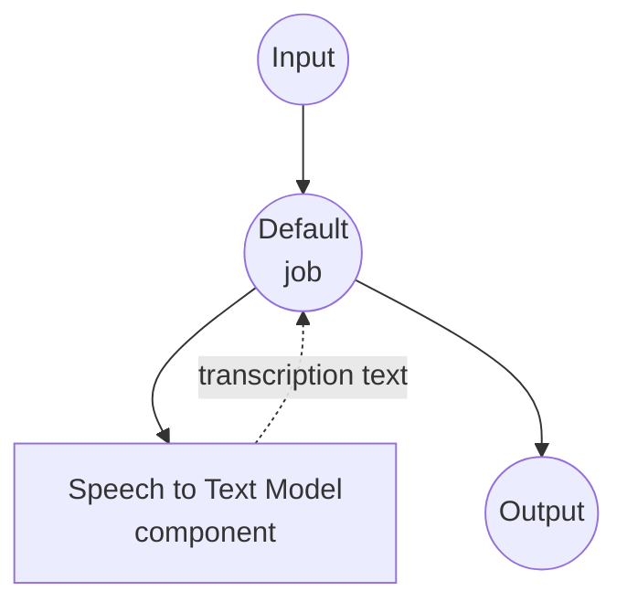

# Speech-to-Text Model Task Example

This example demonstrates how to use a local Whisper model for audio transcription using model-compose's built-in speech-to-text task with HuggingFace transformers, providing offline speech recognition capabilities.

## Overview

This workflow provides local speech-to-text transcription that:

1. **Local Speech Model**: Runs a pretrained Whisper model locally using HuggingFace transformers
2. **Audio Transcription**: Converts speech audio to text with high accuracy
3. **Multi-language Support**: Supports 99+ languages with automatic language detection
4. **Translation**: Can translate speech from any language directly to English
5. **Automatic Model Management**: Downloads and caches models automatically on first use
6. **No External APIs**: Completely offline transcription without API dependencies

## Preparation

### Prerequisites

- model-compose installed and available in your PATH
- Sufficient system resources for running Whisper model (recommended: 8GB+ RAM, GPU recommended)
- Python environment with transformers, torch, librosa, and soundfile (automatically managed)

### Why Local Speech Models

Unlike cloud-based speech APIs, local model execution provides:

**Benefits of Local Processing:**
- **Privacy**: All audio processing happens locally, no audio sent to external services
- **Cost**: No per-minute or API usage fees after initial setup
- **Offline**: Works without internet connection after model download
- **Latency**: No network latency for transcription
- **Customization**: Full control over model parameters and language settings
- **Batch Processing**: Unlimited audio processing without rate limits

**Trade-offs:**
- **Hardware Requirements**: Requires adequate RAM and GPU for optimal performance
- **Setup Time**: Initial model download and loading time
- **Model Limitations**: Smaller models may have lower accuracy than cloud services

### Environment Configuration

1. Navigate to this example directory:
   ```bash
   cd examples/model-tasks/speech-to-text
   ```

2. No additional environment configuration required - model and dependencies are managed automatically.

## How to Run

1. **Start the service:**
   ```bash
   model-compose up
   ```

2. **Run the workflow:**

   **Using API:**
   ```bash
   # Basic transcription (auto-detect language)
   curl -X POST http://localhost:8080/api/workflows/runs \
     -F "audio=@/path/to/your/audio.mp3" \
     -F "input={\"audio\": \"@audio\"}"

   # Transcription with explicit language
   curl -X POST http://localhost:8080/api/workflows/runs \
     -F "audio=@/path/to/your/audio.mp3" \
     -F "input={\"audio\": \"@audio\", \"language\": \"en\"}"

   # Translate speech to English
   curl -X POST http://localhost:8080/api/workflows/runs \
     -F "audio=@/path/to/your/audio.mp3" \
     -F "input={\"audio\": \"@audio\", \"language\": \"ko\", \"task\": \"translate\"}"
   ```

   **Using Web UI:**
   - Open the Web UI: http://localhost:8081
   - Upload an audio file (MP3, WAV, FLAC, etc.)
   - Optionally specify language code (e.g. `en`, `ko`, `ja`)
   - Optionally set task to `translate` for English translation
   - Click the "Run Workflow" button

   **Using CLI:**
   ```bash
   # Basic transcription
   model-compose run speech-to-text --input '{"audio": "/path/to/your/audio.mp3"}'

   # Transcription with language specified
   model-compose run speech-to-text --input '{"audio": "/path/to/your/audio.mp3", "language": "en"}'

   # Translate to English
   model-compose run speech-to-text --input '{"audio": "/path/to/your/audio.mp3", "task": "translate"}'
   ```

## Component Details

### Speech to Text Model Component (Default)
- **Type**: Model component with speech-to-text task
- **Purpose**: Local audio transcription and translation
- **Model**: openai/whisper-large-v3-turbo
- **Architecture**: Whisper
- **Features**:
  - Automatic model downloading and caching
  - Support for various audio formats (MP3, WAV, FLAC, OGG, etc.)
  - Automatic language detection
  - 99+ language transcription support
  - Speech-to-English translation
  - CPU and GPU acceleration support
  - Long-form audio transcription via chunking

### Model Information: Whisper Large v3 Turbo
- **Developer**: OpenAI (hosted on HuggingFace)
- **Parameters**: ~809 million
- **Type**: Encoder-decoder transformer model
- **Architecture**: Whisper
- **Training Data**: 680,000 hours of multilingual audio
- **Capabilities**: Transcription, translation, language detection
- **Supported Languages**: 99+ languages
- **License**: MIT

## Workflow Details

### "Speech to Text Transcription" Workflow (Default)

**Description**: Transcribe audio files to text using a locally running Whisper model.

#### Job Flow

This example uses a simplified single-component configuration without explicit jobs.



#### Input Parameters

| Parameter | Type | Required | Default | Description |
|-----------|------|----------|---------|-------------|
| `audio` | audio | Yes | - | Input audio file (MP3, WAV, FLAC, etc.) |
| `language` | text | No | auto-detect | Language code for transcription (e.g. `en`, `ko`, `ja`) |
| `task` | text | No | `transcribe` | Task to perform: `transcribe` or `translate` |

#### Output Format

| Field | Type | Description |
|-------|------|-------------|
| `transcription` | text | Transcribed text from the audio |

## System Requirements

### Minimum Requirements
- **RAM**: 8GB (recommended 16GB+)
- **VRAM**: 6GB+ GPU recommended for large model
- **Disk Space**: 5GB+ for model storage and cache
- **CPU**: Multi-core processor (4+ cores recommended)
- **Internet**: Required for initial model download only

### Performance Notes
- First run requires model download (~3GB for large-v3-turbo)
- Model loading takes 30-60 seconds depending on hardware
- GPU acceleration significantly improves inference speed
- Processing time scales with audio length

## Customization

### Using Different Models

Replace with other Whisper model variants:

```yaml
component:
  type: model
  task: speech-to-text
  architecture: whisper
  model: openai/whisper-base        # Smaller, faster model
  # or
  model: openai/whisper-large-v3   # Highest accuracy
```

### Adjusting Generation Parameters

Fine-tune transcription quality:

```yaml
component:
  type: model
  task: speech-to-text
  architecture: whisper
  model: openai/whisper-large-v3-turbo
  action:
    audio: ${input.audio as audio}
    language: ${input.language}
    params:
      num_beams: 5
      temperature: 0.0
      no_speech_threshold: 0.6
      return_timestamps: true
```

### Batch Processing

Process multiple audio files:

```yaml
workflow:
  title: Batch Audio Transcription
  jobs:
    - id: transcribe-audio
      component: speech-to-text-model
      repeat_count: ${input.audio_count}
      input:
        audio: ${input.audios[${index}]}
        language: ${input.language}
```

## Troubleshooting

### Common Issues

1. **Out of Memory**: Use a smaller model variant (e.g. `whisper-base`) or reduce batch size
2. **Model Download Fails**: Check internet connection and disk space
3. **Slow Processing**: Enable GPU acceleration with `device: cuda:0`
4. **Poor Accuracy**: Try larger model variant or specify the language explicitly
5. **Audio Format Errors**: Ensure supported audio format and check file corruption

### Performance Optimization

- **GPU Usage**: Set `device: cuda:0` for GPU acceleration
- **Model Selection**: Use `whisper-base` or `whisper-small` for faster inference on CPU
- **Language Specification**: Explicitly setting `language` improves speed and accuracy
- **Chunk Length**: Adjust `chunk_length` parameter for optimal long-form audio handling

## Comparison with API-based Solutions

| Feature | Local Whisper Model | Cloud Speech API |
|---------|--------------------|-----------------------|
| Privacy | Complete privacy | Audio sent to provider |
| Cost | Hardware cost only | Per-minute pricing |
| Latency | Hardware dependent | Network + API latency |
| Availability | Offline capable | Internet required |
| Languages | 99+ languages | Provider dependent |
| Batch Processing | Unlimited | Rate limited |
| Setup Complexity | Model download required | API key only |

## Model Variants

Other recommended Whisper models for different use cases:

### Smaller Models (Lower Requirements)
- `openai/whisper-tiny` - 39M parameters, fastest inference
- `openai/whisper-base` - 74M parameters, good balance
- `openai/whisper-small` - 244M parameters, better accuracy

### Larger Models (Higher Quality)
- `openai/whisper-large-v3-turbo` - 809M parameters, fast and accurate (default)
- `openai/whisper-large-v3` - 1.5B parameters, highest accuracy
