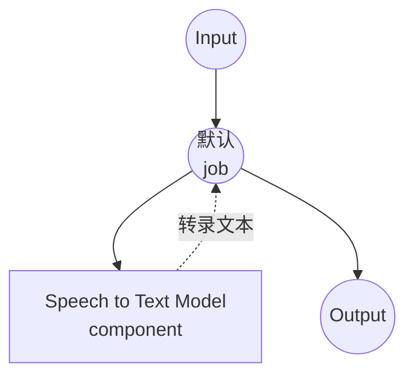

# 语音转文字模型任务示例

本示例演示如何使用 model-compose 的内置 speech-to-text 任务与 HuggingFace transformers，通过本地 Whisper 模型进行音频转录，提供离线语音识别功能。

## 概述

此工作流提供本地语音转文字转录功能：

1. **本地语音模型**：使用 HuggingFace transformers 在本地运行预训练的 Whisper 模型
2. **音频转录**：以高精度将语音音频转换为文本
3. **多语言支持**：支持 99+ 种语言，具备自动语言检测
4. **翻译**：可将任何语言的语音直接翻译为英语
5. **自动模型管理**：首次使用时自动下载和缓存模型
6. **无需外部 API**：无需 API 依赖的完全离线转录

## 准备工作

### 先决条件

- 已安装 model-compose 并在 PATH 中可用
- 运行 Whisper 模型所需的充足系统资源（推荐：8GB+ RAM，推荐 GPU）
- 带有 transformers、torch、librosa 和 soundfile 的 Python 环境（自动管理）

### 为什么选择本地语音模型

与基于云的语音 API 不同，本地模型执行提供：

**本地处理的优势：**
- **隐私**：所有音频处理在本地进行，不会将音频发送到外部服务
- **成本**：初始设置后无需按分钟或 API 使用费用
- **离线**：模型下载后无需互联网连接即可工作
- **延迟**：转录无网络延迟
- **自定义**：完全控制模型参数和语言设置
- **批量处理**：无限音频处理，无速率限制

**权衡：**
- **硬件要求**：需要足够的 RAM 和 GPU 以获得最佳性能
- **设置时间**：初始模型下载和加载时间
- **模型限制**：较小的模型可能精度低于云服务

### 环境配置

1. 导航到此示例目录：
   ```bash
   cd examples/model-tasks/speech-to-text
   ```

2. 无需额外的环境配置 - 模型和依赖项自动管理。

## 如何运行

1. **启动服务：**
   ```bash
   model-compose up
   ```

2. **运行工作流：**

   **使用 API：**
   ```bash
   # 基础转录（自动检测语言）
   curl -X POST http://localhost:8080/api/workflows/runs \
     -F "audio=@/path/to/your/audio.mp3" \
     -F "input={\"audio\": \"@audio\"}"

   # 指定语言的转录
   curl -X POST http://localhost:8080/api/workflows/runs \
     -F "audio=@/path/to/your/audio.mp3" \
     -F "input={\"audio\": \"@audio\", \"language\": \"en\"}"

   # 将语音翻译为英语
   curl -X POST http://localhost:8080/api/workflows/runs \
     -F "audio=@/path/to/your/audio.mp3" \
     -F "input={\"audio\": \"@audio\", \"language\": \"ko\", \"task\": \"translate\"}"
   ```

   **使用 Web UI：**
   - 打开 Web UI：http://localhost:8081
   - 上传音频文件（MP3、WAV、FLAC 等）
   - 可选择指定语言代码（例如 `en`、`ko`、`ja`）
   - 可选择将 task 设为 `translate` 以翻译为英语
   - 点击"Run Workflow"按钮

   **使用 CLI：**
   ```bash
   # 基础转录
   model-compose run speech-to-text --input '{"audio": "/path/to/your/audio.mp3"}'

   # 指定语言的转录
   model-compose run speech-to-text --input '{"audio": "/path/to/your/audio.mp3", "language": "en"}'

   # 翻译为英语
   model-compose run speech-to-text --input '{"audio": "/path/to/your/audio.mp3", "task": "translate"}'
   ```

## 组件详情

### 语音转文字模型组件（默认）
- **类型**：带 speech-to-text 任务的模型组件
- **用途**：本地音频转录和翻译
- **模型**：openai/whisper-large-v3-turbo
- **架构**：Whisper
- **功能**：
  - 自动模型下载和缓存
  - 支持各种音频格式（MP3、WAV、FLAC、OGG 等）
  - 自动语言检测
  - 支持 99+ 种语言的转录
  - 语音到英语翻译
  - CPU 和 GPU 加速支持
  - 通过分块进行长音频转录

### 模型信息：Whisper Large v3 Turbo
- **开发者**：OpenAI（托管在 HuggingFace 上）
- **参数**：约 8.09 亿
- **类型**：编码器-解码器 transformer 模型
- **架构**：Whisper
- **训练数据**：68 万小时的多语言音频
- **能力**：转录、翻译、语言检测
- **支持语言**：99+ 种
- **许可证**：MIT

## 工作流详情

### "Speech to Text Transcription" 工作流（默认）

**描述**：使用本地运行的 Whisper 模型将音频文件转录为文本。

#### 作业流程

此示例使用简化的单组件配置，没有显式作业。



#### 输入参数

| 参数 | 类型 | 必需 | 默认值 | 描述 |
|-----|------|------|--------|------|
| `audio` | audio | 是 | - | 输入音频文件（MP3、WAV、FLAC 等） |
| `language` | text | 否 | 自动检测 | 转录语言代码（例如 `en`、`ko`、`ja`） |
| `task` | text | 否 | `transcribe` | 要执行的任务：`transcribe` 或 `translate` |

#### 输出格式

| 字段 | 类型 | 描述 |
|-----|------|------|
| `transcription` | text | 从音频转录的文本 |

## 系统要求

### 最低要求
- **RAM**：8GB（推荐 16GB+）
- **VRAM**：大型模型推荐 6GB+ GPU
- **磁盘空间**：5GB+ 用于模型存储和缓存
- **CPU**：多核处理器（推荐 4+ 核）
- **互联网**：仅用于初始模型下载

### 性能说明
- 首次运行需要下载模型（large-v3-turbo 约 3GB）
- 模型加载需要 30-60 秒，具体取决于硬件
- GPU 加速可显著提高推理速度
- 处理时间随音频长度而变化

## 自定义

### 使用不同的模型

替换为其他 Whisper 模型变体：

```yaml
component:
  type: model
  task: speech-to-text
  architecture: whisper
  model: openai/whisper-base        # 更小、更快的模型
  # 或
  model: openai/whisper-large-v3   # 最高精度
```

### 调整生成参数

微调转录质量：

```yaml
component:
  type: model
  task: speech-to-text
  architecture: whisper
  model: openai/whisper-large-v3-turbo
  action:
    audio: ${input.audio as audio}
    language: ${input.language}
    params:
      num_beams: 5
      temperature: 0.0
      no_speech_threshold: 0.6
      return_timestamps: true
```

### 批量处理

处理多个音频文件：

```yaml
workflow:
  title: Batch Audio Transcription
  jobs:
    - id: transcribe-audio
      component: speech-to-text-model
      repeat_count: ${input.audio_count}
      input:
        audio: ${input.audios[${index}]}
        language: ${input.language}
```

## 故障排除

### 常见问题

1. **内存不足**：使用较小的模型变体（例如 `whisper-base`）或减小批量大小
2. **模型下载失败**：检查互联网连接和磁盘空间
3. **处理缓慢**：使用 `device: cuda:0` 启用 GPU 加速
4. **精度低**：尝试更大的模型变体或显式指定语言
5. **音频格式错误**：确保支持的音频格式并检查文件是否损坏

### 性能优化

- **GPU 使用**：设置 `device: cuda:0` 以启用 GPU 加速
- **模型选择**：在 CPU 上使用 `whisper-base` 或 `whisper-small` 以加快推理
- **语言指定**：显式设置 `language` 可提升速度和精度
- **块长度**：调整 `chunk_length` 参数以获得最佳长音频处理

## 与基于 API 的解决方案的比较

| 功能 | 本地 Whisper 模型 | 云语音 API |
|-----|-----------------|-----------|
| 隐私 | 完全隐私 | 音频发送到提供商 |
| 成本 | 仅硬件成本 | 按分钟定价 |
| 延迟 | 取决于硬件 | 网络 + API 延迟 |
| 可用性 | 可离线 | 需要互联网 |
| 语言支持 | 99+ 种语言 | 取决于提供商 |
| 批量处理 | 无限制 | 速率限制 |
| 设置复杂性 | 需要模型下载 | 仅需 API 密钥 |

## 模型变体

针对不同用例的其他推荐 Whisper 模型：

### 较小模型（较低要求）
- `openai/whisper-tiny` - 3900 万参数，最快推理
- `openai/whisper-base` - 7400 万参数，良好平衡
- `openai/whisper-small` - 2.44 亿参数，更好的精度

### 较大模型（更高质量）
- `openai/whisper-large-v3-turbo` - 8.09 亿参数，快速且精确（默认）
- `openai/whisper-large-v3` - 15 亿参数，最高精度
