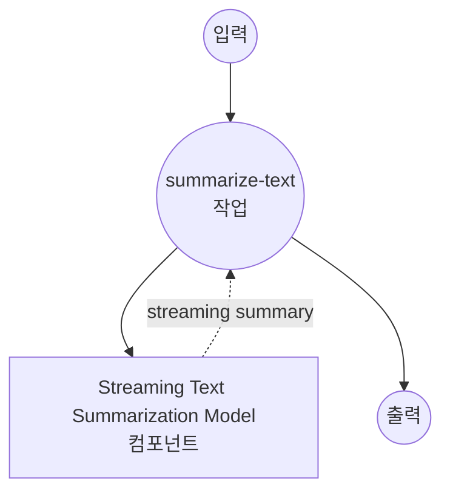

# Text Summarization Stream Model Task 예제

이 예제는 model-compose의 내장 text-generation 작업과 BART를 사용하여 로컬 시퀀스 투 시퀀스 모델로 스트리밍 텍스트 요약을 수행하는 방법을 보여주며, Server-Sent Events (SSE)를 사용한 실시간 문서 요약을 제공합니다.

## 개요

이 워크플로우는 다음과 같은 로컬 스트리밍 텍스트 요약을 제공합니다:

1. **로컬 스트리밍 모델**: 스트리밍 출력으로 BART-large-CNN 모델을 로컬에서 실행
2. **실시간 생성**: SSE를 통해 점진적 요약 생성 제공
3. **점진적 업데이트**: 생성되는 요약 토큰을 스트리밍
4. **자동 모델 관리**: 첫 사용 시 모델을 자동으로 다운로드하고 캐시
5. **외부 API 불필요**: 스트리밍 기능이 있는 완전히 오프라인 텍스트 처리

## 준비사항

### 필수 요구사항

- model-compose가 설치되어 PATH에서 사용 가능
- BART-large-CNN 실행을 위한 충분한 시스템 리소스 (권장: 8GB+ RAM)
- transformers 및 torch가 있는 Python 환경 (자동 관리)

### 로컬 스트리밍 요약을 사용하는 이유

클라우드 기반 텍스트 API와 달리 로컬 스트리밍 실행은 다음을 제공합니다:

**로컬 스트리밍의 이점:**
- **프라이버시**: 모든 텍스트 처리가 로컬에서 이루어지며 외부 서비스로 문서 전송 없음
- **실시간 피드백**: 즉각적인 가시성으로 점진적 요약 생성
- **비용**: 초기 설정 후 토큰당 또는 API 사용 요금 없음
- **오프라인**: 모델 다운로드 후 인터넷 연결 없이 작동
- **지연시간**: 텍스트 처리에 네트워크 지연 없음
- **사용자 경험**: 스트리밍 응답으로 인터랙티브한 느낌

**트레이드오프:**
- **하드웨어 요구사항**: 모델 및 스트리밍 처리를 위한 적절한 RAM 필요
- **설정 시간**: 초기 모델 다운로드 및 로딩 시간
- **스트리밍 복잡성**: SSE를 위한 더 복잡한 클라이언트측 처리
- **리소스 사용**: 스트리밍 중 지속적인 처리

### 환경 구성

1. 이 예제 디렉토리로 이동:
   ```bash
   cd examples/model-tasks/summarization-stream
   ```

2. 추가 환경 구성 불필요 - 모델 및 종속성이 자동으로 관리됩니다.

## 실행 방법

1. **서비스 시작:**
   ```bash
   model-compose up
   ```

2. **워크플로우 실행:**

   **API 사용:**
   ```bash
   curl -X POST http://localhost:8080/api/workflows/runs \
     -H "Content-Type: application/json" \
     -d '{"input": {"text": "Your long article or document text here..."}}'
   ```

   **웹 UI 사용:**
   - 웹 UI 열기: http://localhost:8081
   - 입력 매개변수 입력
   - "Run Workflow" 버튼 클릭

   **CLI 사용:**
   ```bash
   model-compose run summarization --input '{"text": "Your long article or document text here..."}'
   ```

## 컴포넌트 세부사항

### Text Summarization Streaming Model 컴포넌트 (기본)
- **유형**: text-generation 작업을 사용하는 Model 컴포넌트 (스트리밍 활성화)
- **목적**: 실시간 스트리밍 출력을 사용한 로컬 텍스트 요약
- **모델**: facebook/bart-large-cnn
- **아키텍처**: BART (seq2seq 트랜스포머)
- **기능**:
  - 실시간 토큰 단위 스트리밍
  - Server-Sent Events (SSE) 출력 형식
  - 자동 모델 다운로드 및 캐싱
  - 구성 가능한 생성 매개변수
  - CPU 및 GPU 가속 지원

### 모델 정보: BART-Large-CNN

- **개발자**: Facebook AI Research (Meta)
- **매개변수**: 4억 600만
- **유형**: Bidirectional Auto-Regressive Transformer
- **아키텍처**: 인코더-디코더 트랜스포머 (seq2seq)
- **학습**: 텍스트 채우기로 사전 학습, CNN/DailyMail로 미세 조정
- **스트리밍**: 즉시 출력으로 토큰 수준 생성
- **입력 제한**: 1024 토큰 (자동 잘림)
- **라이센스**: Apache 2.0

## 워크플로우 세부사항

### "Summarize Text" 워크플로우 (스트리밍)

**설명**: BART 모델을 사용하여 실시간 스트리밍 출력으로 긴 텍스트에서 간결한 요약을 생성합니다.

#### 작업 흐름



#### 입력 매개변수

| 매개변수 | 유형 | 필수 | 기본값 | 설명 |
|---------|------|------|--------|------|
| `text` | text | 예 | - | 요약할 입력 텍스트 (최대 1024 토큰) |

#### 출력 형식

**스트리밍 출력 (SSE):**
```
data: {"token": "Scientists", "is_final": false}

data: {"token": " have", "is_final": false}

data: {"token": " discovered", "is_final": false}

...

data: {"token": ".", "is_final": true}
```

**최종 출력:**
| 필드 | 유형 | 설명 |
|-----|------|------|
| - | text | SSE 형식의 완전한 요약 텍스트 |

## Server-Sent Events (SSE) 형식

스트리밍 출력은 실시간 업데이트를 위해 SSE 프로토콜을 사용합니다:

### 이벤트 구조
```
data: {"token": "string", "is_final": boolean}

```

### 토큰 속성
- **token**: 생성된 텍스트 토큰/단어
- **is_final**: 마지막 토큰 여부를 나타내는 불리언

### 연결 헤더
```
Content-Type: text/plain
Cache-Control: no-cache
Connection: keep-alive
```

## 시스템 요구사항

### 최소 요구사항
- **RAM**: 8GB (권장 16GB+)
- **디스크 공간**: 모델 저장 및 캐시를 위한 5GB+
- **CPU**: 멀티코어 프로세서 (4+ 코어 권장)
- **인터넷**: 초기 모델 다운로드에만 필요
- **네트워크**: SSE 스트리밍을 위한 로컬 네트워크 기능

### 성능 참고사항
- 첫 실행 시 모델 다운로드 필요 (~1.6GB)
- 모델 로딩은 하드웨어에 따라 1-2분 소요
- GPU 가속으로 스트리밍 속도 향상
- 스트리밍 지연시간은 생성 속도에 따라 다름

## 사용자 정의

### 스트리밍 매개변수 조정

스트리밍 동작 제어:

```yaml
component:
  type: model
  task: text-generation
  model: facebook/bart-large-cnn
  architecture: seq2seq
  text: ${input.text as text}
  streaming: true
  params:
    max_input_length: 1024
    min_length: 30
    max_length: 150
    num_beams: 1                # 탐욕적 검색으로 빠른 스트리밍
    do_sample: true             # 다양성을 위한 샘플링 활성화
    temperature: 0.7            # 무작위성 제어
```

### 커스텀 스트리밍 형식

출력 형식 수정:

```yaml
workflow:
  title: Custom Streaming Summary
  input: ${input}
  output: ${output as text;sse-json}    # JSON 형식 스트리밍

component:
  type: model
  task: text-generation
  model: facebook/bart-large-cnn
  text: ${input.text as text}
  streaming: true
```

### 버퍼 크기 제어

```yaml
component:
  type: model
  task: text-generation
  model: facebook/bart-large-cnn
  text: ${input.text as text}
  streaming: true
  params:
    streaming_buffer_size: 1    # 모든 토큰 스트리밍
    # 또는
    streaming_buffer_size: 5    # 스트리밍 전 5개 토큰 버퍼링
```

## 문제 해결

### 일반적인 문제

1. **SSE 연결 끊김**: 네트워크 안정성 및 방화벽 설정 확인
2. **느린 스트리밍**: GPU 가속 활성화 또는 빔 검색 줄이기
3. **메모리 문제**: 입력 길이 줄이기 또는 다른 애플리케이션 종료
4. **클라이언트 시간 초과**: 적절한 SSE 재연결 로직 구현
5. **불완전한 스트림**: 연결 오류를 우아하게 처리

### 스트리밍 최적화

- **네트워크**: 지연시간을 최소화하기 위해 로컬 연결 사용
- **버퍼 관리**: 최적 스트리밍을 위한 버퍼 크기 조정
- **클라이언트 구현**: 강력한 연결을 위한 적절한 SSE 라이브러리 사용
- **오류 처리**: 재연결 및 재시도 로직 구현

## 비스트리밍 솔루션과 비교

| 기능 | 스트리밍 요약 | 배치 요약 |
|-----|------------|---------|
| 사용자 경험 | 실시간 피드백 | 완료 대기 |
| 인지된 지연시간 | 낮음 (즉시 시작) | 높음 (전체 결과 대기) |
| 네트워크 사용 | 지속적인 스트림 | 단일 응답 |
| 클라이언트 복잡성 | SSE 처리 필요 | 간단한 요청/응답 |
| 오류 복구 | 부분 결과 사용 가능 | 전부 아니면 전무 |
| 리소스 사용 | 생성 중 지속적 | 처리 중 버스트 |
| 사용 사례 | 인터랙티브 애플리케이션 | 배치 처리 |

## 고급 사용

### 다중 문서 스트리밍
```yaml
workflow:
  title: Multi-Document Streaming Summary
  jobs:
    - id: stream-summaries
      component: streaming-summarizer
      repeat_count: ${input.document_count}
      input:
        text: ${input.documents[${index}]}
      output: ${output as text;sse-text}
```

### 점진적 향상
```javascript
class StreamingSummarizer {
  constructor(apiUrl) {
    this.apiUrl = apiUrl;
    this.summary = '';
  }

  async summarize(text, onUpdate, onComplete) {
    const response = await fetch(this.apiUrl, {
      method: 'POST',
      headers: {
        'Content-Type': 'application/json',
        'Accept': 'text/event-stream'
      },
      body: JSON.stringify({ text })
    });

    const reader = response.body.getReader();
    const decoder = new TextDecoder();

    while (true) {
      const { done, value } = await reader.read();
      if (done) break;

      const chunk = decoder.decode(value);
      const lines = chunk.split('\n');

      for (const line of lines) {
        if (line.startsWith('data: ')) {
          const data = JSON.parse(line.slice(6));
          this.summary += data.token;

          onUpdate(this.summary, data.token);

          if (data.is_final) {
            onComplete(this.summary);
            return this.summary;
          }
        }
      }
    }
  }
}

// 사용법
const summarizer = new StreamingSummarizer('/api');
await summarizer.summarize(
  longText,
  (partial, token) => console.log('New token:', token),
  (final) => console.log('Complete:', final)
);
```
