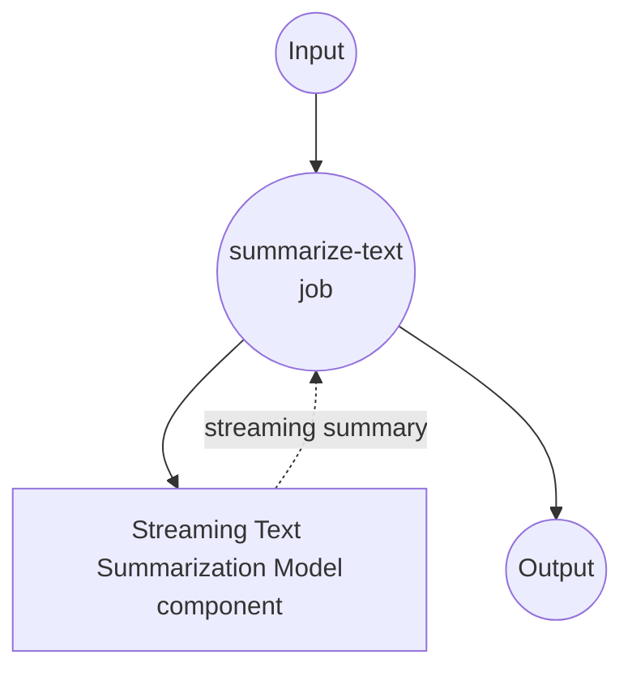

# Text Summarization Stream Model Task Example

This example demonstrates how to use local sequence-to-sequence models for streaming text summarization using model-compose's built-in text-generation task with BART, providing real-time document summarization with Server-Sent Events (SSE).

## Overview

This workflow provides local streaming text summarization that:

1. **Local Streaming Model**: Runs BART-large-CNN model locally with streaming output
2. **Real-time Generation**: Provides incremental summary generation via SSE
3. **Progressive Updates**: Streams summary tokens as they are generated
4. **Automatic Model Management**: Downloads and caches models automatically on first use
5. **No External APIs**: Completely offline text processing with streaming capabilities

## Preparation

### Prerequisites

- model-compose installed and available in your PATH
- Sufficient system resources for running BART-large-CNN (recommended: 8GB+ RAM)
- Python environment with transformers and torch (automatically managed)

### Why Local Streaming Summarization

Unlike cloud-based text APIs, local streaming execution provides:

**Benefits of Local Streaming:**
- **Privacy**: All text processing happens locally, no documents sent to external services
- **Real-time Feedback**: Progressive summary generation with immediate visibility
- **Cost**: No per-token or API usage fees after initial setup
- **Offline**: Works without internet connection after model download
- **Latency**: No network latency for text processing
- **User Experience**: Interactive feel with streaming responses

**Trade-offs:**
- **Hardware Requirements**: Requires adequate RAM for model and streaming processing
- **Setup Time**: Initial model download and loading time
- **Streaming Complexity**: More complex client-side handling for SSE
- **Resource Usage**: Continuous processing during streaming

### Environment Configuration

1. Navigate to this example directory:
   ```bash
   cd examples/model-tasks/summarization-stream
   ```

2. No additional environment configuration required - model and dependencies are managed automatically.

## How to Run

1. **Start the service:**
   ```bash
   model-compose up
   ```

2. **Run the workflow:**

   **Using API:**
   ```bash
   curl -X POST http://localhost:8080/api/workflows/runs \
     -H "Content-Type: application/json" \
     -d '{"input": {"text": "Your long article or document text here..."}}'
   ```

   **Using Web UI:**
   - Open the Web UI: http://localhost:8081
   - Enter your input parameters
   - Click the "Run Workflow" button

   **Using CLI:**
   ```bash
   model-compose run summarization --input '{"text": "Your long article or document text here..."}'
   ```

## Component Details

### Text Summarization Streaming Model Component (Default)
- **Type**: Model component with text-generation task (streaming enabled)
- **Purpose**: Local text summarization with real-time streaming output
- **Model**: facebook/bart-large-cnn
- **Architecture**: BART (seq2seq transformer)
- **Features**:
  - Real-time token-by-token streaming
  - Server-Sent Events (SSE) output format
  - Automatic model downloading and caching
  - Configurable generation parameters
  - CPU and GPU acceleration support

### Model Information: BART-Large-CNN

- **Developer**: Facebook AI Research (Meta)
- **Parameters**: 406 million
- **Type**: Bidirectional Auto-Regressive Transformer
- **Architecture**: Encoder-decoder transformer (seq2seq)
- **Training**: Pre-trained on text infilling, fine-tuned on CNN/DailyMail
- **Streaming**: Token-level generation with immediate output
- **Input Limit**: 1024 tokens (automatically truncated)
- **License**: Apache 2.0

## Workflow Details

### "Summarize Text" Workflow (Streaming)

**Description**: Generate concise summaries from longer texts with real-time streaming output using the BART model.

#### Job Flow



#### Input Parameters

| Parameter | Type | Required | Default | Description |
|-----------|------|----------|---------|-------------|
| `text` | text | Yes | - | Input text to summarize (max 1024 tokens) |

#### Output Format

**Streaming Output (SSE):**
```
data: {"token": "Scientists", "is_final": false}

data: {"token": " have", "is_final": false}

data: {"token": " discovered", "is_final": false}

...

data: {"token": ".", "is_final": true}
```

**Final Output:**
| Field | Type | Description |
|-------|------|-------------|
| - | text | Complete summary text (SSE format) |

## Server-Sent Events (SSE) Format

The streaming output uses the SSE protocol for real-time updates:

### Event Structure
```
data: {"token": "string", "is_final": boolean}

```

### Token Properties
- **token**: The generated text token/word
- **is_final**: Boolean indicating if this is the last token

### Connection Headers
```
Content-Type: text/plain
Cache-Control: no-cache
Connection: keep-alive
```

## System Requirements

### Minimum Requirements
- **RAM**: 8GB (recommended 16GB+)
- **Disk Space**: 5GB+ for model storage and cache
- **CPU**: Multi-core processor (4+ cores recommended)
- **Internet**: Required for initial model download only
- **Network**: Local network capability for SSE streaming

### Performance Notes
- First run requires model download (~1.6GB)
- Model loading takes 1-2 minutes depending on hardware
- GPU acceleration improves streaming speed
- Streaming latency depends on generation speed

## Customization

### Adjusting Streaming Parameters

Control streaming behavior:

```yaml
component:
  type: model
  task: text-generation
  model: facebook/bart-large-cnn
  architecture: seq2seq
  text: ${input.text as text}
  stream: true
  params:
    max_input_length: 1024
    min_length: 30
    max_length: 150
    num_beams: 1                # Faster streaming with greedy search
    do_sample: true             # Enable sampling for variety
    temperature: 0.7            # Control randomness
```

### Custom Streaming Format

Modify output format:

```yaml
workflow:
  title: Custom Streaming Summary
  input: ${input}
  output: ${output as text;sse-json}    # JSON format streaming

component:
  type: model
  task: text-generation
  model: facebook/bart-large-cnn
  text: ${input.text as text}
  stream: true
```

### Buffer Size Control

```yaml
component:
  type: model
  task: text-generation
  model: facebook/bart-large-cnn
  text: ${input.text as text}
  stream: true
  params:
    streaming_buffer_size: 1    # Stream every token
    # or
    streaming_buffer_size: 5    # Buffer 5 tokens before streaming
```

## Troubleshooting

### Common Issues

1. **SSE Connection Drops**: Check network stability and firewall settings
2. **Slow Streaming**: Enable GPU acceleration or reduce beam search
3. **Memory Issues**: Reduce input length or close other applications
4. **Client Timeout**: Implement proper SSE reconnection logic
5. **Incomplete Streams**: Handle connection errors gracefully

### Streaming Optimization

- **Network**: Use local connections to minimize latency
- **Buffer Management**: Adjust buffer size for optimal streaming
- **Client Implementation**: Use proper SSE libraries for robust connections
- **Error Handling**: Implement reconnection and retry logic

## Comparison with Non-Streaming Solutions

| Feature | Streaming Summarization | Batch Summarization |
|---------|----------------------|-------------------|
| User Experience | Real-time feedback | Wait for completion |
| Perceived Latency | Lower (immediate start) | Higher (wait for full result) |
| Network Usage | Continuous stream | Single response |
| Client Complexity | SSE handling required | Simple request/response |
| Error Recovery | Partial results available | All-or-nothing |
| Resource Usage | Continuous during generation | Burst during processing |
| Use Cases | Interactive applications | Batch processing |

## Advanced Usage

### Multi-Document Streaming
```yaml
workflow:
  title: Multi-Document Streaming Summary
  jobs:
    - id: stream-summaries
      component: streaming-summarizer
      repeat_count: ${input.document_count}
      input:
        text: ${input.documents[${index}]}
      output: ${output as text;sse-text}
```

### Progressive Enhancement
```javascript
class StreamingSummarizer {
  constructor(apiUrl) {
    this.apiUrl = apiUrl;
    this.summary = '';
  }

  async summarize(text, onUpdate, onComplete) {
    const response = await fetch(this.apiUrl, {
      method: 'POST',
      headers: {
        'Content-Type': 'application/json',
        'Accept': 'text/event-stream'
      },
      body: JSON.stringify({ text })
    });

    const reader = response.body.getReader();
    const decoder = new TextDecoder();

    while (true) {
      const { done, value } = await reader.read();
      if (done) break;

      const chunk = decoder.decode(value);
      const lines = chunk.split('\n');

      for (const line of lines) {
        if (line.startsWith('data: ')) {
          const data = JSON.parse(line.slice(6));
          this.summary += data.token;

          onUpdate(this.summary, data.token);

          if (data.is_final) {
            onComplete(this.summary);
            return this.summary;
          }
        }
      }
    }
  }
}

// Usage
const summarizer = new StreamingSummarizer('/api');
await summarizer.summarize(
  longText,
  (partial, token) => console.log('New token:', token),
  (final) => console.log('Complete:', final)
);
```
