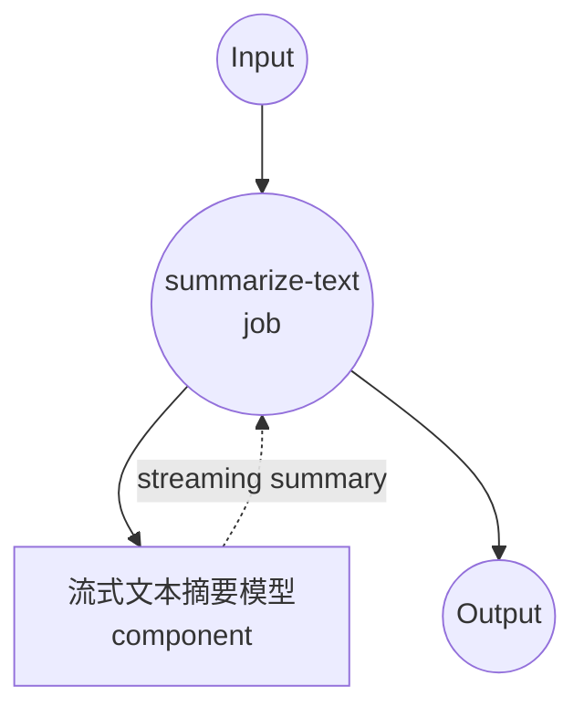

# 文本摘要流式模型任务示例

本示例演示如何使用本地序列到序列模型进行流式文本摘要，使用 model-compose 的内置文本生成任务与 BART 模型，通过服务器发送事件（SSE）提供实时文档摘要。

## 概述

此工作流提供本地流式文本摘要功能：

1. **本地流式模型**：在本地运行 BART-large-CNN 模型并提供流式输出
2. **实时生成**：通过 SSE 提供增量摘要生成
3. **渐进式更新**：在生成摘要词元时进行流式传输
4. **自动模型管理**：首次使用时自动下载和缓存模型
5. **无需外部 API**：具有流式功能的完全离线文本处理

## 准备工作

### 先决条件

- 已安装 model-compose 并在 PATH 中可用
- 运行 BART-large-CNN 所需的充足系统资源（推荐：8GB+ RAM）
- 带有 transformers 和 torch 的 Python 环境（自动管理）

### 为什么选择本地流式摘要

与基于云的文本 API 不同，本地流式执行提供：

**本地流式的优势：**
- **隐私**：所有文本处理在本地进行，不会将文档发送到外部服务
- **实时反馈**：渐进式摘要生成，立即可见
- **成本**：初始设置后无需按词元或 API 使用费用
- **离线**：模型下载后无需互联网连接即可工作
- **延迟**：文本处理无网络延迟
- **用户体验**：流式响应带来交互式体验

**权衡：**
- **硬件要求**：模型和流式处理需要足够的 RAM
- **设置时间**：初始模型下载和加载时间
- **流式复杂性**：客户端处理 SSE 更复杂
- **资源使用**：流式传输期间持续处理

### 环境配置

1. 导航到此示例目录：
   ```bash
   cd examples/model-tasks/summarization-stream
   ```

2. 无需额外的环境配置 - 模型和依赖项自动管理。

## 如何运行

1. **启动服务：**
   ```bash
   model-compose up
   ```

2. **运行工作流：**

   **使用 API：**
   ```bash
   curl -X POST http://localhost:8080/api/workflows/runs \
     -H "Content-Type: application/json" \
     -d '{"input": {"text": "Your long article or document text here..."}}'
   ```

   **使用 Web UI：**
   - 打开 Web UI：http://localhost:8081
   - 输入您的参数
   - 点击"Run Workflow"按钮

   **使用 CLI：**
   ```bash
   model-compose run summarization --input '{"text": "Your long article or document text here..."}'
   ```

## 组件详情

### 文本摘要流式模型组件（默认）
- **类型**：具有文本生成任务的模型组件（已启用流式）
- **用途**：具有实时流式输出的本地文本摘要
- **模型**：facebook/bart-large-cnn
- **架构**：BART（seq2seq transformer）
- **功能**：
  - 逐词元实时流式传输
  - 服务器发送事件（SSE）输出格式
  - 自动模型下载和缓存
  - 可配置的生成参数
  - CPU 和 GPU 加速支持

### 模型信息：BART-Large-CNN

- **开发者**：Facebook AI Research（Meta）
- **参数**：4.06 亿
- **类型**：双向自回归 Transformer
- **架构**：编码器-解码器 transformer（seq2seq）
- **训练**：在文本填充上预训练，在 CNN/DailyMail 上微调
- **流式**：词元级生成并立即输出
- **输入限制**：1024 词元（自动截断）
- **许可证**：Apache 2.0

## 工作流详情

### "摘要文本"工作流（流式）

**描述**：使用 BART 模型从较长文本生成简洁摘要，并提供实时流式输出。

#### 作业流程



#### 输入参数

| 参数 | 类型 | 必需 | 默认值 | 描述 |
|-----------|------|----------|---------|-------------|
| `text` | text | 是 | - | 要摘要的输入文本（最多 1024 词元）|

#### 输出格式

**流式输出（SSE）：**
```
data: {"token": "Scientists", "is_final": false}

data: {"token": " have", "is_final": false}

data: {"token": " discovered", "is_final": false}

...

data: {"token": ".", "is_final": true}
```

**最终输出：**
| 字段 | 类型 | 描述 |
|-------|------|-------------|
| - | text | 完整摘要文本（SSE 格式）|

## 服务器发送事件（SSE）格式

流式输出使用 SSE 协议进行实时更新：

### 事件结构
```
data: {"token": "string", "is_final": boolean}

```

### 词元属性
- **token**：生成的文本词元/单词
- **is_final**：布尔值，指示这是否是最后一个词元

### 连接头
```
Content-Type: text/plain
Cache-Control: no-cache
Connection: keep-alive
```

## 系统要求

### 最低要求
- **RAM**：8GB（推荐 16GB+）
- **磁盘空间**：5GB+ 用于模型存储和缓存
- **CPU**：多核处理器（推荐 4+ 核）
- **互联网**：仅用于初始模型下载
- **网络**：用于 SSE 流式传输的本地网络能力

### 性能说明
- 首次运行需要下载模型（约 1.6GB）
- 模型加载需要 1-2 分钟，具体取决于硬件
- GPU 加速可提高流式速度
- 流式延迟取决于生成速度

## 自定义

### 调整流式参数

控制流式行为：

```yaml
component:
  type: model
  task: text-generation
  model: facebook/bart-large-cnn
  architecture: seq2seq
  streaming: true
  action:
    text: ${input.text as text}
    params:
      max_input_length: 1024
      min_length: 30
      max_length: 150
      num_beams: 1                # 使用贪婪搜索加快流式
      do_sample: true             # 启用采样以增加多样性
      temperature: 0.7            # 控制随机性
```

### 自定义流式格式

修改输出格式：

```yaml
workflow:
  title: Custom Streaming Summary
  input: ${input}
  output: ${output as text;sse-json}    # JSON 格式流式

component:
  type: model
  task: text-generation
  model: facebook/bart-large-cnn
  streaming: true
  action:
    text: ${input.text as text}
```

### 缓冲区大小控制

```yaml
component:
  type: model
  task: text-generation
  model: facebook/bart-large-cnn
  streaming: true
  action:
    text: ${input.text as text}
    params:
      streaming_buffer_size: 1    # 流式传输每个词元
      # 或
      streaming_buffer_size: 5    # 在流式传输前缓冲 5 个词元
```

## 故障排除

### 常见问题

1. **SSE 连接断开**：检查网络稳定性和防火墙设置
2. **流式缓慢**：启用 GPU 加速或减少束搜索
3. **内存问题**：减少输入长度或关闭其他应用程序
4. **客户端超时**：实现适当的 SSE 重连逻辑
5. **流不完整**：优雅地处理连接错误

### 流式优化

- **网络**：使用本地连接以最小化延迟
- **缓冲区管理**：调整缓冲区大小以获得最佳流式
- **客户端实现**：使用适当的 SSE 库以实现稳健连接
- **错误处理**：实现重连和重试逻辑

## 与非流式解决方案的比较

| 功能 | 流式摘要 | 批量摘要 |
|---------|----------------------|-------------------|
| 用户体验 | 实时反馈 | 等待完成 |
| 感知延迟 | 较低（立即开始）| 较高（等待完整结果）|
| 网络使用 | 连续流 | 单一响应 |
| 客户端复杂性 | 需要 SSE 处理 | 简单的请求/响应 |
| 错误恢复 | 部分结果可用 | 全有或全无 |
| 资源使用 | 生成期间持续 | 处理期间突发 |
| 用例 | 交互式应用程序 | 批量处理 |

## 高级用法

### 多文档流式
```yaml
workflow:
  title: Multi-Document Streaming Summary
  jobs:
    - id: stream-summaries
      component: streaming-summarizer
      repeat_count: ${input.document_count}
      input:
        text: ${input.documents[${index}]}
      output: ${output as text;sse-text}
```

### 渐进式增强
```javascript
class StreamingSummarizer {
  constructor(apiUrl) {
    this.apiUrl = apiUrl;
    this.summary = '';
  }

  async summarize(text, onUpdate, onComplete) {
    const response = await fetch(this.apiUrl, {
      method: 'POST',
      headers: {
        'Content-Type': 'application/json',
        'Accept': 'text/event-stream'
      },
      body: JSON.stringify({ text })
    });

    const reader = response.body.getReader();
    const decoder = new TextDecoder();

    while (true) {
      const { done, value } = await reader.read();
      if (done) break;

      const chunk = decoder.decode(value);
      const lines = chunk.split('\n');

      for (const line of lines) {
        if (line.startsWith('data: ')) {
          const data = JSON.parse(line.slice(6));
          this.summary += data.token;

          onUpdate(this.summary, data.token);

          if (data.is_final) {
            onComplete(this.summary);
            return this.summary;
          }
        }
      }
    }
  }
}

// 用法
const summarizer = new StreamingSummarizer('/api');
await summarizer.summarize(
  longText,
  (partial, token) => console.log('New token:', token),
  (final) => console.log('Complete:', final)
);
```
