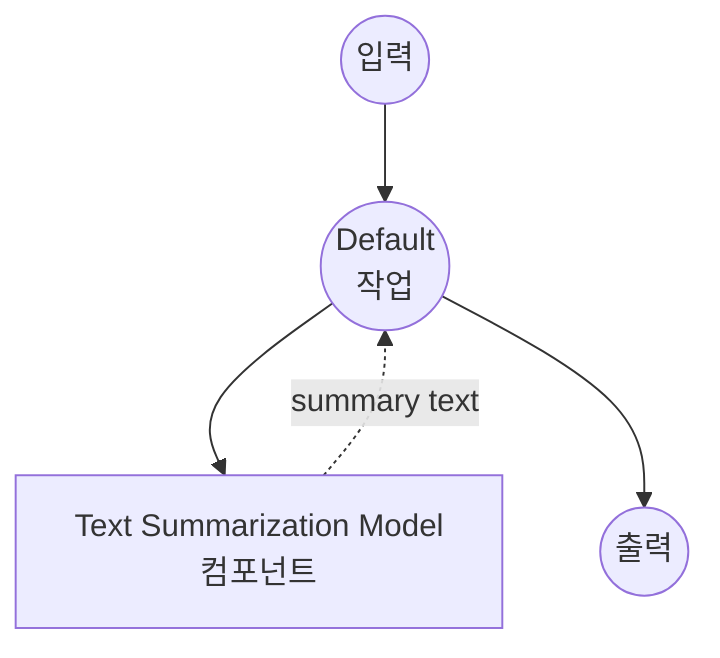

# Text Summarization Model Task 예제

이 예제는 model-compose의 내장 text-generation 작업과 BART를 사용하여 로컬 시퀀스 투 시퀀스 모델로 텍스트 요약을 수행하는 방법을 보여주며, 오프라인 문서 요약 기능을 제공합니다.

## 개요

이 워크플로우는 다음과 같은 로컬 텍스트 요약을 제공합니다:

1. **로컬 요약 모델**: 텍스트 요약을 위해 BART-large-CNN 모델을 로컬에서 실행
2. **추출적 및 생성적**: 긴 입력 텍스트에서 간결한 요약 생성
3. **자동 모델 관리**: 첫 사용 시 모델을 자동으로 다운로드하고 캐시
4. **외부 API 불필요**: 종속성 없이 완전히 오프라인 텍스트 처리
5. **구성 가능한 길이**: 조정 가능한 요약 길이 및 품질 매개변수

## 준비사항

### 필수 요구사항

- model-compose가 설치되어 PATH에서 사용 가능
- BART-large-CNN 실행을 위한 충분한 시스템 리소스 (권장: 8GB+ RAM)
- transformers 및 torch가 있는 Python 환경 (자동 관리)

### 로컬 요약 모델을 사용하는 이유

클라우드 기반 텍스트 API와 달리 로컬 모델 실행은 다음을 제공합니다:

**로컬 처리의 이점:**
- **프라이버시**: 모든 텍스트 처리가 로컬에서 이루어지며 외부 서비스로 문서 전송 없음
- **비용**: 초기 설정 후 토큰당 또는 API 사용 요금 없음
- **오프라인**: 모델 다운로드 후 인터넷 연결 없이 작동
- **지연시간**: 텍스트 처리에 네트워크 지연 없음
- **사용자 정의**: 요약 매개변수에 대한 완전한 제어
- **배치 처리**: 속도 제한 없이 무제한 문서 처리

**트레이드오프:**
- **하드웨어 요구사항**: 모델 및 텍스트 처리를 위한 적절한 RAM 필요
- **설정 시간**: 초기 모델 다운로드 및 로딩 시간
- **입력 길이 제한**: 최대 입력 길이 제약 (1024 토큰)
- **품질 트레이드오프**: 더 작은 모델은 덜 정교한 요약을 생성할 수 있음

### 환경 구성

1. 이 예제 디렉토리로 이동:
   ```bash
   cd examples/model-tasks/summarization
   ```

2. 추가 환경 구성 불필요 - 모델 및 종속성이 자동으로 관리됩니다.

## 실행 방법

1. **서비스 시작:**
   ```bash
   model-compose up
   ```

2. **워크플로우 실행:**

   **API 사용:**
   ```bash
   curl -X POST http://localhost:8080/api/workflows/runs \
     -H "Content-Type: application/json" \
     -d '{"input": {"text": "Your long article or document text here..."}}'
   ```

   **웹 UI 사용:**
   - 웹 UI 열기: http://localhost:8081
   - 입력 매개변수 입력
   - "Run Workflow" 버튼 클릭

   **CLI 사용:**
   ```bash
   model-compose run summarization --input '{"text": "Your long article or document text here..."}'
   ```

## 컴포넌트 세부사항

### Text Summarization Model 컴포넌트 (기본)
- **유형**: text-generation 작업을 사용하는 Model 컴포넌트
- **목적**: 시퀀스 투 시퀀스 모델을 사용한 로컬 텍스트 요약
- **모델**: facebook/bart-large-cnn
- **아키텍처**: BART (seq2seq 트랜스포머)
- **기능**:
  - 자동 모델 다운로드 및 캐싱
  - 추출적 및 생성적 요약
  - 구성 가능한 생성 매개변수
  - CPU 및 GPU 가속 지원
  - 메모리 효율적인 처리

### 모델 정보: BART-Large-CNN

- **개발자**: Facebook AI Research (Meta)
- **매개변수**: 4억 600만
- **유형**: Bidirectional Auto-Regressive Transformer
- **아키텍처**: 인코더-디코더 트랜스포머 (seq2seq)
- **학습**: 텍스트 채우기로 사전 학습, CNN/DailyMail로 미세 조정
- **특기**: 뉴스 기사 요약, 문서 요약
- **입력 제한**: 1024 토큰 (자동 잘림)
- **라이센스**: Apache 2.0

## 워크플로우 세부사항

### "Summarize Text" 워크플로우 (기본)

**설명**: 사전 학습된 언어 모델을 사용하여 긴 입력 텍스트에서 간결하고 유익한 요약을 생성합니다.

#### 작업 흐름

이 예제는 명시적인 작업 없이 단순화된 단일 컴포넌트 구성을 사용합니다.



#### 입력 매개변수

| 매개변수 | 유형 | 필수 | 기본값 | 설명 |
|---------|------|------|--------|------|
| `text` | text | 예 | - | 요약할 입력 텍스트 (최대 1024 토큰) |

#### 출력 형식

| 필드 | 유형 | 설명 |
|-----|------|------|
| `summary` | text | 입력 텍스트의 간결한 요약 |

## 시스템 요구사항

### 최소 요구사항
- **RAM**: 8GB (권장 16GB+)
- **디스크 공간**: 모델 저장 및 캐시를 위한 5GB+
- **CPU**: 멀티코어 프로세서 (4+ 코어 권장)
- **인터넷**: 초기 모델 다운로드에만 필요

### 성능 참고사항
- 첫 실행 시 모델 다운로드 필요 (~1.6GB)
- 모델 로딩은 하드웨어에 따라 1-2분 소요
- GPU 가속으로 요약 속도 향상
- 처리 시간은 입력 텍스트 길이에 따라 다름

## 모델 매개변수

모델 컴포넌트는 다양한 요약 매개변수를 지원합니다:

### 현재 구성
- **max_input_length**: 1024 토큰 (BART 모델 제한)
- **top_p**: 1.0 (결정론적 출력을 위해 nucleus 샘플링 비활성화)

### 추가 매개변수 (사용자 정의 가능)
```yaml
params:
  max_input_length: 1024
  min_length: 30              # 최소 요약 길이
  max_length: 150             # 최대 요약 길이
  length_penalty: 2.0         # 더 긴 출력에 대한 페널티
  num_beams: 4                # 더 나은 품질을 위한 빔 검색
  early_stopping: true        # 빔 검색 수렴 시 중지
  no_repeat_ngram_size: 3     # 반복적인 구문 방지
  do_sample: false            # 결정론적 생성
```

## 사용자 정의

### 요약 길이 조정

매개변수로 요약 길이 제어:

```yaml
component:
  type: model
  task: text-generation
  model: facebook/bart-large-cnn
  architecture: seq2seq
  text: ${input.text as text}
  params:
    max_input_length: 1024
    min_length: ${input.min_length as number | 50}
    max_length: ${input.max_length as number | 200}
    length_penalty: 2.0
    num_beams: 4
```

### 다른 모델 사용

다른 요약 모델로 교체:

```yaml
component:
  type: model
  task: text-generation
  model: facebook/bart-base              # 더 작고 빠른 모델
  # 또는
  model: google/pegasus-cnn_dailymail    # 대안 요약 모델
  # 또는
  model: t5-base                         # 요약을 위한 T5 모델
```

### 입력 전처리

텍스트 전처리 추가:

```yaml
component:
  type: model
  task: text-generation
  model: facebook/bart-large-cnn
  architecture: seq2seq
  text: |
    Document to summarize:
    ${input.text as text}

    Summary:
  params:
    max_input_length: 1024
    top_p: 1.0
```

## 문제 해결

### 일반적인 문제

1. **입력이 너무 김**: 텍스트가 1024 토큰 제한 초과 - 텍스트 잘라내기 또는 청킹
2. **부실한 요약**: 길이 매개변수 조정 또는 다른 모델 시도
3. **느린 처리**: GPU 가속 활성화 또는 더 작은 모델 사용
4. **메모리 문제**: 배치 크기 줄이기 또는 다른 애플리케이션 종료
5. **반복적인 출력**: no_repeat_ngram_size 매개변수 조정

### 성능 최적화

- **GPU 사용**: 빠른 추론을 위해 CUDA 호환 PyTorch 설치
- **메모리 관리**: 대규모 배치의 경우 텍스트를 개별적으로 처리
- **모델 선택**: 빠른 처리를 위해 bart-base 사용
- **텍스트 전처리**: 입력 텍스트를 적절하게 정리 및 형식화

## API 기반 솔루션과 비교

| 기능 | 로컬 요약 | 클라우드 텍스트 API |
|-----|---------|-----------------|
| 프라이버시 | 완전한 프라이버시 | 프로바이더로 텍스트 전송 |
| 비용 | 하드웨어 비용만 | 토큰당 가격 |
| 지연시간 | 하드웨어 의존적 | 네트워크 + API 지연 |
| 가용성 | 오프라인 가능 | 인터넷 필요 |
| 사용자 정의 | 완전한 매개변수 제어 | 제한된 API 매개변수 |
| 입력 길이 | 모델별 제한 | 가변 API 제한 |
| 품질 | 로컬 모델에 따라 다름 | 일반적으로 더 높은 품질 |
| 배치 처리 | 무제한 | 속도 제한 |
| 설정 복잡도 | 모델 다운로드 필요 | API 키만 |

## 고급 사용

### 다중 문서 요약
```yaml
workflow:
  title: Multi-Document Summary
  jobs:
    - id: summarize-docs
      component: text-summarizer
      repeat_count: ${input.document_count}
      input:
        text: ${input.documents[${index}]}
    - id: combine-summaries
      component: text-combiner
      input:
        summaries: ${summarize-docs.outputs}
```

### 계층적 요약
```yaml
workflow:
  title: Hierarchical Summary
  jobs:
    - id: chunk-text
      component: text-chunker
      input:
        text: ${input.long_text}
        chunk_size: 800
    - id: summarize-chunks
      component: text-summarizer
      repeat_count: ${chunk-text.chunk_count}
      input:
        text: ${chunk-text.chunks[${index}]}
    - id: final-summary
      component: text-summarizer
      input:
        text: ${summarize-chunks.outputs | join("\n\n")}
```

### 품질 평가
```yaml
component:
  type: model
  task: text-generation
  model: facebook/bart-large-cnn
  architecture: seq2seq
  text: ${input.text as text}
  params:
    max_input_length: 1024
    max_length: ${input.target_length as number | 150}
    num_beams: ${input.quality as number | 4}      # 빔 수 증가 = 품질 향상
    length_penalty: ${input.length_penalty as number | 2.0}
```

## 모델 변형

### 다양한 BART 모델
- **facebook/bart-base**: 1억 4,000만 매개변수, 빠른 추론
- **facebook/bart-large**: 4억 600만 매개변수, 범용
- **facebook/bart-large-cnn**: 4억 600만 매개변수, 뉴스 최적화 (기본값)

### 대안 아키텍처
- **google/pegasus-cnn_dailymail**: PEGASUS 모델, 뉴스 중심
- **t5-base**: T5 모델, 다목적 텍스트 투 텍스트
- **microsoft/DialoGPT-medium**: 대화형 요약

### 특화된 모델
- **facebook/bart-large-xsum**: 극단적 요약 (매우 간결함)
- **google/pegasus-arxiv**: 과학 논문 요약
- **allenai/led-base-16384**: 긴 문서 요약 (16k 토큰)
