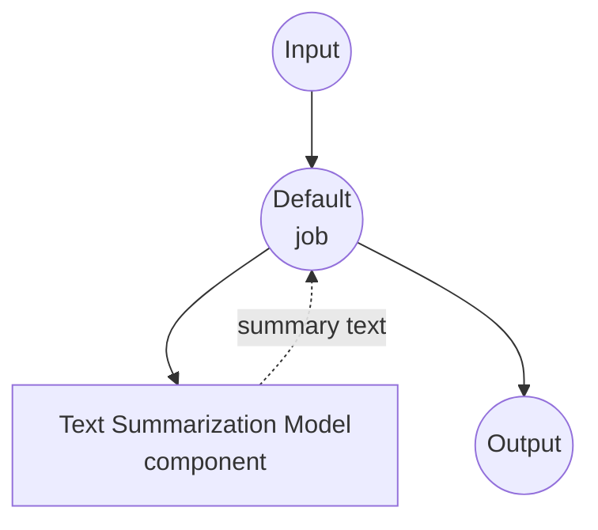

# Text Summarization Model Task Example

This example demonstrates how to use local sequence-to-sequence models for text summarization using model-compose's built-in text-generation task with BART, providing offline document summarization capabilities.

## Overview

This workflow provides local text summarization that:

1. **Local Summarization Model**: Runs BART-large-CNN model locally for text summarization
2. **Extractive & Abstractive**: Generates concise summaries from longer input texts
3. **Automatic Model Management**: Downloads and caches models automatically on first use
4. **No External APIs**: Completely offline text processing without dependencies
5. **Configurable Length**: Adjustable summary length and quality parameters

## Preparation

### Prerequisites

- model-compose installed and available in your PATH
- Sufficient system resources for running BART-large-CNN (recommended: 8GB+ RAM)
- Python environment with transformers and torch (automatically managed)

### Why Local Summarization Models

Unlike cloud-based text APIs, local model execution provides:

**Benefits of Local Processing:**
- **Privacy**: All text processing happens locally, no documents sent to external services
- **Cost**: No per-token or API usage fees after initial setup
- **Offline**: Works without internet connection after model download
- **Latency**: No network latency for text processing
- **Customization**: Full control over summarization parameters
- **Batch Processing**: Unlimited document processing without rate limits

**Trade-offs:**
- **Hardware Requirements**: Requires adequate RAM for model and text processing
- **Setup Time**: Initial model download and loading time
- **Input Length Limits**: Maximum input length constraints (1024 tokens)
- **Quality Trade-offs**: Smaller models may produce less sophisticated summaries

### Environment Configuration

1. Navigate to this example directory:
   ```bash
   cd examples/model-tasks/summarization
   ```

2. No additional environment configuration required - model and dependencies are managed automatically.

## How to Run

1. **Start the service:**
   ```bash
   model-compose up
   ```

2. **Run the workflow:**

   **Using API:**
   ```bash
   curl -X POST http://localhost:8080/api/workflows/runs \
     -H "Content-Type: application/json" \
     -d '{"input": {"text": "Your long article or document text here..."}}'
   ```

   **Using Web UI:**
   - Open the Web UI: http://localhost:8081
   - Enter your input parameters
   - Click the "Run Workflow" button

   **Using CLI:**
   ```bash
   model-compose run summarization --input '{"text": "Your long article or document text here..."}'
   ```

## Component Details

### Text Summarization Model Component (Default)
- **Type**: Model component with text-generation task
- **Purpose**: Local text summarization using sequence-to-sequence model
- **Model**: facebook/bart-large-cnn
- **Architecture**: BART (seq2seq transformer)
- **Features**:
  - Automatic model downloading and caching
  - Extractive and abstractive summarization
  - Configurable generation parameters
  - CPU and GPU acceleration support
  - Memory-efficient processing

### Model Information: BART-Large-CNN

- **Developer**: Facebook AI Research (Meta)
- **Parameters**: 406 million
- **Type**: Bidirectional Auto-Regressive Transformer
- **Architecture**: Encoder-decoder transformer (seq2seq)
- **Training**: Pre-trained on text infilling, fine-tuned on CNN/DailyMail
- **Specialties**: News article summarization, document summarization
- **Input Limit**: 1024 tokens (automatically truncated)
- **License**: Apache 2.0

## Workflow Details

### "Summarize Text" Workflow (Default)

**Description**: Generate concise and informative summaries from longer input texts using a pretrained language model.

#### Job Flow

This example uses a simplified single-component configuration without explicit jobs.



#### Input Parameters

| Parameter | Type | Required | Default | Description |
|-----------|------|----------|---------|-------------|
| `text` | text | Yes | - | Input text to summarize (max 1024 tokens) |

#### Output Format

| Field | Type | Description |
|-------|------|-------------|
| `summary` | text | Concise summary of the input text |

## System Requirements

### Minimum Requirements
- **RAM**: 8GB (recommended 16GB+)
- **Disk Space**: 5GB+ for model storage and cache
- **CPU**: Multi-core processor (4+ cores recommended)
- **Internet**: Required for initial model download only

### Performance Notes
- First run requires model download (~1.6GB)
- Model loading takes 1-2 minutes depending on hardware
- GPU acceleration improves summarization speed
- Processing time varies with input text length

## Model Parameters

The model component supports various summarization parameters:

### Current Configuration
- **max_input_length**: 1024 tokens (BART model limit)
- **top_p**: 1.0 (nucleus sampling disabled for deterministic output)

### Additional Parameters (Customizable)
```yaml
params:
  max_input_length: 1024
  min_length: 30              # Minimum summary length
  max_length: 150             # Maximum summary length
  length_penalty: 2.0         # Penalty for longer outputs
  num_beams: 4                # Beam search for better quality
  early_stopping: true        # Stop when beam search converges
  no_repeat_ngram_size: 3     # Prevent repetitive phrases
  do_sample: false            # Deterministic generation
```

## Customization

### Adjusting Summary Length

Control summary length with parameters:

```yaml
component:
  type: model
  task: text-generation
  model: facebook/bart-large-cnn
  architecture: seq2seq
  action:
    text: ${input.text as text}
    params:
      max_input_length: 1024
      min_length: ${input.min_length as number | 50}
      max_length: ${input.max_length as number | 200}
      length_penalty: 2.0
      num_beams: 4
```

### Using Different Models

Replace with other summarization models:

```yaml
component:
  type: model
  task: text-generation
  model: facebook/bart-base              # Smaller, faster model
  # or
  model: google/pegasus-cnn_dailymail    # Alternative summarization model
  # or
  model: t5-base                         # T5 model for summarization
```

### Input Preprocessing

Add text preprocessing:

```yaml
component:
  type: model
  task: text-generation
  model: facebook/bart-large-cnn
  architecture: seq2seq
  action:
    text: |
      Document to summarize:
      ${input.text as text}

      Summary:
    params:
      max_input_length: 1024
      top_p: 1.0
```

## Troubleshooting

### Common Issues

1. **Input Too Long**: Text exceeds 1024 token limit - truncate or chunk text
2. **Poor Summaries**: Adjust length parameters or try different models
3. **Slow Processing**: Enable GPU acceleration or use smaller models
4. **Memory Issues**: Reduce batch size or close other applications
5. **Repetitive Output**: Adjust no_repeat_ngram_size parameter

### Performance Optimization

- **GPU Usage**: Install CUDA-compatible PyTorch for faster inference
- **Memory Management**: Process texts individually for large batches
- **Model Selection**: Use bart-base for faster processing
- **Text Preprocessing**: Clean and format input text appropriately

## Comparison with API-based Solutions

| Feature | Local Summarization | Cloud Text API |
|---------|-------------------|----------------|
| Privacy | Complete privacy | Text sent to provider |
| Cost | Hardware cost only | Per-token pricing |
| Latency | Hardware dependent | Network + API latency |
| Availability | Offline capable | Internet required |
| Customization | Full parameter control | Limited API parameters |
| Input Length | Model-specific limits | Variable API limits |
| Quality | Depends on local model | Usually higher quality |
| Batch Processing | Unlimited | Rate limited |
| Setup Complexity | Model download required | API key only |

## Advanced Usage

### Multi-Document Summarization
```yaml
workflow:
  title: Multi-Document Summary
  jobs:
    - id: summarize-docs
      component: text-summarizer
      repeat_count: ${input.document_count}
      input:
        text: ${input.documents[${index}]}
    - id: combine-summaries
      component: text-combiner
      input:
        summaries: ${summarize-docs.outputs}
```

### Hierarchical Summarization
```yaml
workflow:
  title: Hierarchical Summary
  jobs:
    - id: chunk-text
      component: text-chunker
      input:
        text: ${input.long_text}
        chunk_size: 800
    - id: summarize-chunks
      component: text-summarizer
      repeat_count: ${chunk-text.chunk_count}
      input:
        text: ${chunk-text.chunks[${index}]}
    - id: final-summary
      component: text-summarizer
      input:
        text: ${summarize-chunks.outputs | join("\n\n")}
```

### Quality Assessment
```yaml
component:
  type: model
  task: text-generation
  model: facebook/bart-large-cnn
  architecture: seq2seq
  action:
    text: ${input.text as text}
    params:
      max_input_length: 1024
      max_length: ${input.target_length as number | 150}
      num_beams: ${input.quality as number | 4}      # Higher beams = better quality
      length_penalty: ${input.length_penalty as number | 2.0}
```

## Model Variants

### Different BART Models
- **facebook/bart-base**: 140M parameters, faster inference
- **facebook/bart-large**: 406M parameters, general-purpose
- **facebook/bart-large-cnn**: 406M parameters, news-optimized (default)

### Alternative Architectures
- **google/pegasus-cnn_dailymail**: PEGASUS model, news-focused
- **t5-base**: T5 model, versatile text-to-text
- **microsoft/DialoGPT-medium**: Conversational summarization

### Specialized Models
- **facebook/bart-large-xsum**: Extreme summarization (very concise)
- **google/pegasus-arxiv**: Scientific paper summarization
- **allenai/led-base-16384**: Long document summarization (16k tokens)
