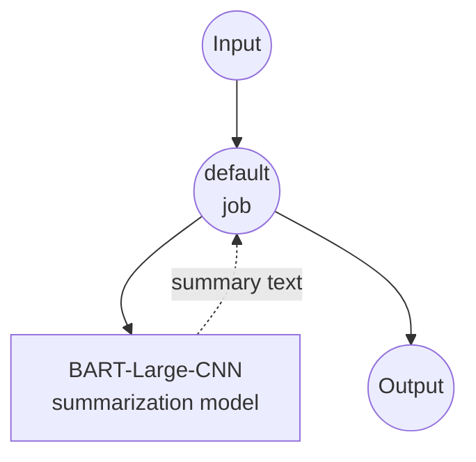

# Text Summarization Model Task Example

This example demonstrates how to use local sequence-to-sequence models for text summarization using model-compose's built-in text-generation task with BART, providing offline document summarization capabilities.

## Overview

This workflow provides local text summarization that:

1. **Local Summarization Model**: Runs BART-large-CNN model locally for text summarization
2. **Extractive & Abstractive**: Generates concise summaries from longer input texts
3. **Automatic Model Management**: Downloads and caches models automatically on first use
4. **No External APIs**: Completely offline text processing without dependencies
5. **Configurable Length**: Adjustable summary length and quality parameters

## Setup

### Prerequisites

- model-compose installed and available in your PATH
- Sufficient system resources for running BART-large-CNN (recommended: 8GB+ RAM)
- Python environment with transformers and torch (automatically managed)

### Why Local Summarization Models

Unlike cloud-based text APIs, local model execution provides:

**Benefits of Local Processing:**
- **Privacy**: All text processing happens locally, no documents sent to external services
- **Cost**: No per-token or API usage fees after initial setup
- **Offline**: Works without internet connection after model download
- **Latency**: No network latency for text processing
- **Customization**: Full control over summarization parameters
- **Batch Processing**: Unlimited document processing without rate limits

**Trade-offs:**
- **Hardware Requirements**: Requires adequate RAM for model and text processing
- **Setup Time**: Initial model download and loading time
- **Input Length Limits**: Maximum input length constraints (1024 tokens)
- **Quality Trade-offs**: Smaller models may produce less sophisticated summaries

### Environment Configuration

1. Navigate to this example directory:
   ```bash
   cd examples/model-tasks/summarization
   ```

2. No additional environment configuration required - model and dependencies are managed automatically.

## How to Run

### Run in HTTP Server Mode

```bash
model-compose up
```

On first run, this will:
- Download the BART-large-CNN model from HuggingFace
- Install required dependencies (transformers, torch, etc.)
- Load the model into memory
- Start the model-compose API on port 8080

Once the server starts:
- API endpoint: http://localhost:8080/api
- Web UI: http://localhost:8081

### Single Execution

```bash
model-compose run --input '{"text": "Your long document text here..."}'
```

## Available Components

### BART-Large-CNN Summarization Model Component
- **Type**: Model component with text-generation task
- **Purpose**: Local text summarization using sequence-to-sequence model
- **Model**: facebook/bart-large-cnn
- **Architecture**: BART (seq2seq transformer)
- **Features**:
  - Automatic model downloading and caching
  - Extractive and abstractive summarization
  - Configurable generation parameters
  - CPU and GPU acceleration support
  - Memory-efficient processing

### Model Information: BART-Large-CNN

- **Developer**: Facebook AI Research (Meta)
- **Parameters**: 406 million
- **Type**: Bidirectional Auto-Regressive Transformer
- **Architecture**: Encoder-decoder transformer (seq2seq)
- **Training**: Pre-trained on text infilling, fine-tuned on CNN/DailyMail
- **Specialties**: News article summarization, document summarization
- **Input Limit**: 1024 tokens (automatically truncated)
- **License**: Apache 2.0

## Workflow Details

### "Summarize Text" Workflow (Default)

**Description**: Generate concise and informative summaries from longer input texts using a pretrained language model.

#### Job Flow

This example uses a simplified single-component configuration without explicit jobs.



#### Input Parameters

| Parameter | Type | Required | Default | Description |
|-----------|------|----------|---------|-------------|
| `text` | text | Yes | - | Input text to summarize (max 1024 tokens) |

#### Output Format

| Field | Type | Description |
|-------|------|-------------|
| `summary` | text | Concise summary of the input text |

## System Requirements

### Minimum Requirements
- **RAM**: 8GB (recommended 16GB+)
- **Disk Space**: 5GB+ for model storage and cache
- **CPU**: Multi-core processor (4+ cores recommended)
- **Internet**: Required for initial model download only

### Performance Notes
- First run requires model download (~1.6GB)
- Model loading takes 1-2 minutes depending on hardware
- GPU acceleration improves summarization speed
- Processing time varies with input text length

## Example Usage

### News Article Summarization
```json
{
  "text": "Scientists have discovered a new species of deep-sea fish in the Mariana Trench. The fish, which has been named Pseudoliparis swirei, was found at a depth of 8,000 meters below sea level. This makes it the deepest-living fish ever recorded. The discovery was made using a specially designed submersible that can withstand the extreme pressure at these depths. The fish is small, measuring only about 10 centimeters in length, and appears to be adapted to the harsh conditions of the deep ocean. Researchers believe this discovery could lead to new insights about life in extreme environments and may have implications for understanding how life might exist on other planets."
}
```

**Expected Output:**
```json
{
  "summary": "Scientists discovered Pseudoliparis swirei, the deepest-living fish ever recorded, at 8,000 meters in the Mariana Trench. The 10-centimeter fish was found using a pressure-resistant submersible and could provide insights into extreme environment adaptation and extraterrestrial life possibilities."
}
```

### Research Paper Abstract
```json
{
  "text": "This study examines the impact of remote work on employee productivity and job satisfaction across various industries. We conducted a comprehensive survey of 2,500 employees from 50 companies over a six-month period. Our findings indicate that remote work led to a 23% increase in productivity metrics and a 31% improvement in job satisfaction scores. However, we also observed challenges including decreased team collaboration (down 18%) and increased feelings of isolation among workers. The study concludes that hybrid work models, combining remote and in-office work, may optimize the benefits while mitigating the drawbacks. Organizations should implement structured communication protocols and regular team-building activities to maintain collaboration and employee engagement in remote work environments."
}
```

### Technical Documentation
```json
{
  "text": "The new API endpoint allows developers to retrieve user profile information through a RESTful interface. To access the endpoint, developers must include a valid authentication token in the request header. The endpoint supports both GET and POST methods, with GET returning basic profile information and POST allowing for profile updates. Rate limiting is implemented at 100 requests per hour per API key. The response format is JSON and includes fields for user ID, name, email, profile picture URL, and last login timestamp. Error responses follow standard HTTP status codes with detailed error messages in the response body. Developers should implement proper error handling and respect rate limits to ensure optimal API performance."
}
```

### Meeting Notes
```json
{
  "text": "Today's product team meeting covered three main topics. First, we discussed the upcoming Q4 feature release, which will include the new dashboard analytics, user notification system, and mobile app improvements. The release is scheduled for November 15th, pending final QA testing. Second, we reviewed customer feedback from the recent user survey. The top requested features are dark mode, advanced filtering options, and integration with third-party calendar apps. Finally, we addressed the technical debt backlog and prioritized refactoring the authentication system and optimizing database queries. Action items include: Sarah will coordinate with the design team on dark mode mockups, Mike will research calendar integration APIs, and the dev team will begin authentication system refactoring next sprint."
}
```

## Model Parameters

The model component supports various summarization parameters:

### Current Configuration
- **max_input_length**: 1024 tokens (BART model limit)
- **top_p**: 1.0 (nucleus sampling disabled for deterministic output)

### Additional Parameters (Customizable)
```yaml
params:
  max_input_length: 1024
  min_length: 30              # Minimum summary length
  max_length: 150             # Maximum summary length
  length_penalty: 2.0         # Penalty for longer outputs
  num_beams: 4                # Beam search for better quality
  early_stopping: true        # Stop when beam search converges
  no_repeat_ngram_size: 3     # Prevent repetitive phrases
  do_sample: false            # Deterministic generation
```

## Customization

### Adjusting Summary Length

Control summary length with parameters:

```yaml
component:
  type: model
  task: text-generation
  model: facebook/bart-large-cnn
  architecture: seq2seq
  text: ${input.text as text}
  params:
    max_input_length: 1024
    min_length: ${input.min_length as number | 50}
    max_length: ${input.max_length as number | 200}
    length_penalty: 2.0
    num_beams: 4
```

### Using Different Models

Replace with other summarization models:

```yaml
component:
  type: model
  task: text-generation
  model: facebook/bart-base              # Smaller, faster model
  # or
  model: google/pegasus-cnn_dailymail    # Alternative summarization model
  # or
  model: t5-base                         # T5 model for summarization
```

### Input Preprocessing

Add text preprocessing:

```yaml
component:
  type: model
  task: text-generation
  model: facebook/bart-large-cnn
  architecture: seq2seq
  text: |
    Document to summarize:
    ${input.text as text}

    Summary:
  params:
    max_input_length: 1024
    top_p: 1.0
```

## Troubleshooting

### Common Issues

1. **Input Too Long**: Text exceeds 1024 token limit - truncate or chunk text
2. **Poor Summaries**: Adjust length parameters or try different models
3. **Slow Processing**: Enable GPU acceleration or use smaller models
4. **Memory Issues**: Reduce batch size or close other applications
5. **Repetitive Output**: Adjust no_repeat_ngram_size parameter

### Performance Optimization

- **GPU Usage**: Install CUDA-compatible PyTorch for faster inference
- **Memory Management**: Process texts individually for large batches
- **Model Selection**: Use bart-base for faster processing
- **Text Preprocessing**: Clean and format input text appropriately

## Comparison with API-based Solutions

| Feature | Local Summarization | Cloud Text API |
|---------|-------------------|----------------|
| Privacy | Complete privacy | Text sent to provider |
| Cost | Hardware cost only | Per-token pricing |
| Latency | Hardware dependent | Network + API latency |
| Availability | Offline capable | Internet required |
| Customization | Full parameter control | Limited API parameters |
| Input Length | Model-specific limits | Variable API limits |
| Quality | Depends on local model | Usually higher quality |
| Batch Processing | Unlimited | Rate limited |
| Setup Complexity | Model download required | API key only |

## Advanced Usage

### Multi-Document Summarization
```yaml
workflow:
  title: Multi-Document Summary
  jobs:
    - id: summarize-docs
      component: text-summarizer
      repeat_count: ${input.document_count}
      input:
        text: ${input.documents[${index}]}
    - id: combine-summaries
      component: text-combiner
      input:
        summaries: ${summarize-docs.outputs}
```

### Hierarchical Summarization
```yaml
workflow:
  title: Hierarchical Summary
  jobs:
    - id: chunk-text
      component: text-chunker
      input:
        text: ${input.long_text}
        chunk_size: 800
    - id: summarize-chunks
      component: text-summarizer
      repeat_count: ${chunk-text.chunk_count}
      input:
        text: ${chunk-text.chunks[${index}]}
    - id: final-summary
      component: text-summarizer
      input:
        text: ${summarize-chunks.outputs | join("\n\n")}
```

### Quality Assessment
```yaml
component:
  type: model
  task: text-generation
  model: facebook/bart-large-cnn
  architecture: seq2seq
  text: ${input.text as text}
  params:
    max_input_length: 1024
    max_length: ${input.target_length as number | 150}
    num_beams: ${input.quality as number | 4}      # Higher beams = better quality
    length_penalty: ${input.length_penalty as number | 2.0}
```

## Model Variants

### Different BART Models
- **facebook/bart-base**: 140M parameters, faster inference
- **facebook/bart-large**: 406M parameters, general-purpose
- **facebook/bart-large-cnn**: 406M parameters, news-optimized (default)

### Alternative Architectures
- **google/pegasus-cnn_dailymail**: PEGASUS model, news-focused
- **t5-base**: T5 model, versatile text-to-text
- **microsoft/DialoGPT-medium**: Conversational summarization

### Specialized Models
- **facebook/bart-large-xsum**: Extreme summarization (very concise)
- **google/pegasus-arxiv**: Scientific paper summarization
- **allenai/led-base-16384**: Long document summarization (16k tokens)
