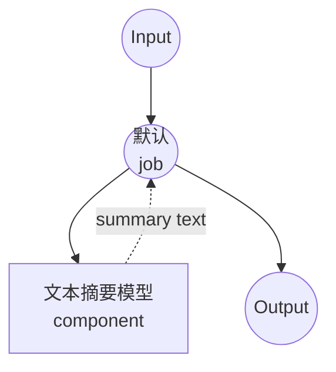

# 文本摘要模型任务示例

本示例演示如何使用本地序列到序列模型进行文本摘要，使用 model-compose 的内置文本生成任务与 BART 模型，提供离线文档摘要功能。

## 概述

此工作流提供本地文本摘要功能：

1. **本地摘要模型**：在本地运行 BART-large-CNN 模型进行文本摘要
2. **提取式和抽象式**：从较长的输入文本生成简洁摘要
3. **自动模型管理**：首次使用时自动下载和缓存模型
4. **无需外部 API**：完全离线的文本处理，无依赖项
5. **可配置长度**：可调整的摘要长度和质量参数

## 准备工作

### 先决条件

- 已安装 model-compose 并在 PATH 中可用
- 运行 BART-large-CNN 所需的充足系统资源（推荐：8GB+ RAM）
- 带有 transformers 和 torch 的 Python 环境（自动管理）

### 为什么选择本地摘要模型

与基于云的文本 API 不同，本地模型执行提供：

**本地处理的优势：**
- **隐私**：所有文本处理在本地进行，不会将文档发送到外部服务
- **成本**：初始设置后无需按词元或 API 使用费用
- **离线**：模型下载后无需互联网连接即可工作
- **延迟**：文本处理无网络延迟
- **自定义**：完全控制摘要参数
- **批量处理**：无限文档处理，无速率限制

**权衡：**
- **硬件要求**：模型和文本处理需要足够的 RAM
- **设置时间**：初始模型下载和加载时间
- **输入长度限制**：最大输入长度约束（1024 词元）
- **质量权衡**：较小的模型可能产生不太复杂的摘要

### 环境配置

1. 导航到此示例目录：
   ```bash
   cd examples/model-tasks/summarization
   ```

2. 无需额外的环境配置 - 模型和依赖项自动管理。

## 如何运行

1. **启动服务：**
   ```bash
   model-compose up
   ```

2. **运行工作流：**

   **使用 API：**
   ```bash
   curl -X POST http://localhost:8080/api/workflows/runs \
     -H "Content-Type: application/json" \
     -d '{"input": {"text": "Your long article or document text here..."}}'
   ```

   **使用 Web UI：**
   - 打开 Web UI：http://localhost:8081
   - 输入您的参数
   - 点击"Run Workflow"按钮

   **使用 CLI：**
   ```bash
   model-compose run summarization --input '{"text": "Your long article or document text here..."}'
   ```

## 组件详情

### 文本摘要模型组件（默认）
- **类型**：具有文本生成任务的模型组件
- **用途**：使用序列到序列模型进行本地文本摘要
- **模型**：facebook/bart-large-cnn
- **架构**：BART（seq2seq transformer）
- **功能**：
  - 自动模型下载和缓存
  - 提取式和抽象式摘要
  - 可配置的生成参数
  - CPU 和 GPU 加速支持
  - 内存高效处理

### 模型信息：BART-Large-CNN

- **开发者**：Facebook AI Research（Meta）
- **参数**：4.06 亿
- **类型**：双向自回归 Transformer
- **架构**：编码器-解码器 transformer（seq2seq）
- **训练**：在文本填充上预训练，在 CNN/DailyMail 上微调
- **专长**：新闻文章摘要、文档摘要
- **输入限制**：1024 词元（自动截断）
- **许可证**：Apache 2.0

## 工作流详情

### "摘要文本"工作流（默认）

**描述**：使用预训练语言模型从较长的输入文本生成简洁且信息丰富的摘要。

#### 作业流程

此示例使用简化的单组件配置，没有显式作业。



#### 输入参数

| 参数 | 类型 | 必需 | 默认值 | 描述 |
|-----------|------|----------|---------|-------------|
| `text` | text | 是 | - | 要摘要的输入文本（最多 1024 词元）|

#### 输出格式

| 字段 | 类型 | 描述 |
|-------|------|-------------|
| `summary` | text | 输入文本的简洁摘要 |

## 系统要求

### 最低要求
- **RAM**：8GB（推荐 16GB+）
- **磁盘空间**：5GB+ 用于模型存储和缓存
- **CPU**：多核处理器（推荐 4+ 核）
- **互联网**：仅用于初始模型下载

### 性能说明
- 首次运行需要下载模型（约 1.6GB）
- 模型加载需要 1-2 分钟，具体取决于硬件
- GPU 加速可提高摘要速度
- 处理时间随输入文本长度而变化

## 模型参数

模型组件支持各种摘要参数：

### 当前配置
- **max_input_length**：1024 词元（BART 模型限制）
- **top_p**：1.0（禁用核采样以获得确定性输出）

### 其他参数（可自定义）
```yaml
params:
  max_input_length: 1024
  min_length: 30              # 最小摘要长度
  max_length: 150             # 最大摘要长度
  length_penalty: 2.0         # 对较长输出的惩罚
  num_beams: 4                # 束搜索以获得更好的质量
  early_stopping: true        # 束搜索收敛时停止
  no_repeat_ngram_size: 3     # 防止重复短语
  do_sample: false            # 确定性生成
```

## 自定义

### 调整摘要长度

使用参数控制摘要长度：

```yaml
component:
  type: model
  task: text-generation
  model: facebook/bart-large-cnn
  architecture: seq2seq
  action:
    text: ${input.text as text}
    params:
      max_input_length: 1024
      min_length: ${input.min_length as number | 50}
      max_length: ${input.max_length as number | 200}
      length_penalty: 2.0
      num_beams: 4
```

### 使用不同的模型

替换为其他摘要模型：

```yaml
component:
  type: model
  task: text-generation
  model: facebook/bart-base              # 更小、更快的模型
  # 或
  model: google/pegasus-cnn_dailymail    # 替代摘要模型
  # 或
  model: t5-base                         # 用于摘要的 T5 模型
```

### 输入预处理

添加文本预处理：

```yaml
component:
  type: model
  task: text-generation
  model: facebook/bart-large-cnn
  architecture: seq2seq
  action:
    text: |
      Document to summarize:
      ${input.text as text}

      Summary:
    params:
      max_input_length: 1024
      top_p: 1.0
```

## 故障排除

### 常见问题

1. **输入过长**：文本超过 1024 词元限制 - 截断或分块文本
2. **摘要质量差**：调整长度参数或尝试不同的模型
3. **处理缓慢**：启用 GPU 加速或使用较小的模型
4. **内存问题**：减少批量大小或关闭其他应用程序
5. **重复输出**：调整 no_repeat_ngram_size 参数

### 性能优化

- **GPU 使用**：安装与 CUDA 兼容的 PyTorch 以加快推理
- **内存管理**：对于大批量，单独处理文本
- **模型选择**：使用 bart-base 以加快处理速度
- **文本预处理**：适当地清理和格式化输入文本

## 与基于 API 的解决方案的比较

| 功能 | 本地摘要 | 云文本 API |
|---------|-------------------|----------------|
| 隐私 | 完全隐私 | 文本发送到提供商 |
| 成本 | 仅硬件成本 | 按词元定价 |
| 延迟 | 取决于硬件 | 网络 + API 延迟 |
| 可用性 | 可离线 | 需要互联网 |
| 自定义 | 完全参数控制 | 有限的 API 参数 |
| 输入长度 | 特定模型限制 | 可变 API 限制 |
| 质量 | 取决于本地模型 | 通常质量更高 |
| 批量处理 | 无限制 | 速率限制 |
| 设置复杂性 | 需要模型下载 | 仅需 API 密钥 |

## 高级用法

### 多文档摘要
```yaml
workflow:
  title: Multi-Document Summary
  jobs:
    - id: summarize-docs
      component: text-summarizer
      repeat_count: ${input.document_count}
      input:
        text: ${input.documents[${index}]}
    - id: combine-summaries
      component: text-combiner
      input:
        summaries: ${summarize-docs.outputs}
```

### 分层摘要
```yaml
workflow:
  title: Hierarchical Summary
  jobs:
    - id: chunk-text
      component: text-chunker
      input:
        text: ${input.long_text}
        chunk_size: 800
    - id: summarize-chunks
      component: text-summarizer
      repeat_count: ${chunk-text.chunk_count}
      input:
        text: ${chunk-text.chunks[${index}]}
    - id: final-summary
      component: text-summarizer
      input:
        text: ${summarize-chunks.outputs | join("\n\n")}
```

### 质量评估
```yaml
component:
  type: model
  task: text-generation
  model: facebook/bart-large-cnn
  architecture: seq2seq
  action:
    text: ${input.text as text}
    params:
      max_input_length: 1024
      max_length: ${input.target_length as number | 150}
      num_beams: ${input.quality as number | 4}      # 更多束 = 更好的质量
      length_penalty: ${input.length_penalty as number | 2.0}
```

## 模型变体

### 不同的 BART 模型
- **facebook/bart-base**：1.4 亿参数，更快的推理
- **facebook/bart-large**：4.06 亿参数，通用
- **facebook/bart-large-cnn**：4.06 亿参数，新闻优化（默认）

### 替代架构
- **google/pegasus-cnn_dailymail**：PEGASUS 模型，专注于新闻
- **t5-base**：T5 模型，多功能文本到文本
- **microsoft/DialoGPT-medium**：对话式摘要

### 专业模型
- **facebook/bart-large-xsum**：极简摘要（非常简洁）
- **google/pegasus-arxiv**：科学论文摘要
- **allenai/led-base-16384**：长文档摘要（16k 词元）
