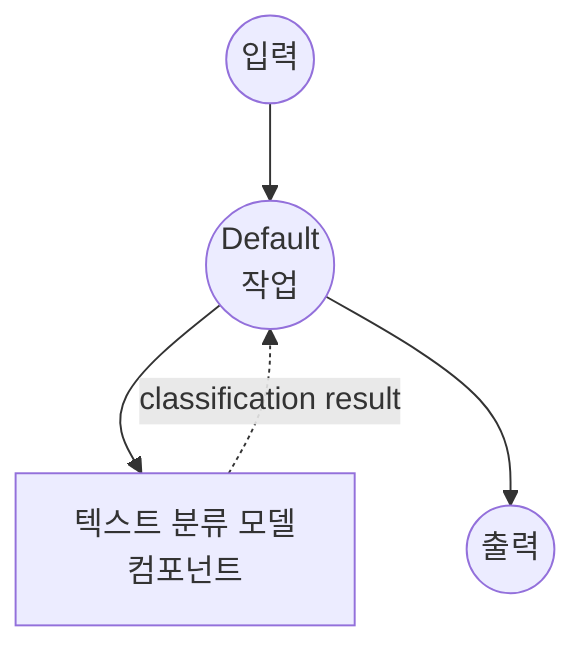

# 텍스트 분류 모델 작업 예제

이 예제는 model-compose의 내장 text-classification 작업을 사용하여 로컬 transformer 모델을 통해 텍스트 분류를 수행하는 방법을 보여주며, 자동화된 콘텐츠 관리 및 텍스트 분류 기능을 제공합니다.

## 개요

이 워크플로우는 다음과 같은 로컬 텍스트 분류를 제공합니다:

1. **로컬 분류 모델**: HuggingFace transformers를 사용하여 사전 학습된 분류 모델을 로컬에서 실행
2. **유해 댓글 감지**: 유해 콘텐츠와 무해 콘텐츠를 식별하는 특화된 모델 사용
3. **확률 점수**: 각 분류 레이블에 대한 신뢰도 점수 반환
4. **외부 API 불필요**: API 의존성 없이 완전히 오프라인 텍스트 분류

## 준비사항

### 필수 요구사항

- model-compose가 설치되어 PATH에서 사용 가능
- 분류 모델 실행을 위한 충분한 시스템 리소스 (권장: 4GB+ RAM)
- transformers 및 torch가 포함된 Python 환경 (자동 관리)

### 로컬 텍스트 분류를 사용하는 이유

클라우드 기반 분류 API와 달리, 로컬 모델 실행은 다음을 제공합니다:

**로컬 처리의 장점:**
- **프라이버시**: 모든 텍스트 처리가 로컬에서 발생하며, 외부 서비스로 데이터가 전송되지 않음
- **비용**: 초기 설정 후 요청당 또는 API 사용 요금 없음
- **속도**: 분류를 위한 네트워크 지연 없음
- **맞춤화**: 특정 분류 작업을 위한 특화된 모델 사용 가능
- **배치 처리**: 대용량 텍스트 데이터셋의 효율적인 처리
- **일관성**: 동일한 모델 버전으로 일관된 결과 보장

**사용 사례:**
- **콘텐츠 관리**: 유해하거나 부적절한 콘텐츠 필터링
- **감정 분석**: 텍스트 감정 분류 (긍정/부정)
- **주제 분류**: 주제별 문서 분류
- **스팸 감지**: 스팸과 정상 콘텐츠 식별
- **언어 감지**: 텍스트의 언어 식별

### 환경 구성

1. 이 예제 디렉토리로 이동:
   ```bash
   cd examples/model-tasks/text-classification
   ```

2. 추가 환경 구성 불필요 - 모델과 의존성은 자동으로 관리됩니다.

## 실행 방법

1. **서비스 시작:**
   ```bash
   model-compose up
   ```

2. **워크플로우 실행:**

   **API 사용:**
   ```bash
   curl -X POST http://localhost:8080/api/workflows/runs \
     -H "Content-Type: application/json" \
     -d '{"input": {"text": "This is a normal, respectful comment."}}'
   ```

   **웹 UI 사용:**
   - 웹 UI 열기: http://localhost:8081
   - 입력 매개변수 입력
   - "Run Workflow" 버튼 클릭

   **CLI 사용:**
   ```bash
   model-compose run text-classification --input '{"text": "This is a normal, respectful comment."}'
   ```

## 컴포넌트 세부사항

### 텍스트 분류 모델 컴포넌트 (기본)
- **유형**: text-classification 작업을 포함한 모델 컴포넌트
- **목적**: 텍스트를 유해 또는 무해 콘텐츠로 분류
- **모델**: martin-ha/toxic-comment-model
- **작업**: text-classification (HuggingFace transformers)
- **레이블**: ["non-toxic", "toxic"]
- **기능**:
  - 자동 모델 다운로드 및 캐싱
  - 각 레이블에 대한 확률 점수
  - 실시간 관리에 적합한 빠른 추론
  - CPU 및 GPU 가속 지원

### 모델 정보: toxic-comment-model
- **개발자**: martin-ha (HuggingFace 커뮤니티)
- **기반 모델**: DistilBERT
- **학습**: 유해 댓글 데이터셋으로 학습
- **언어**: 주로 영어
- **특화**: 콘텐츠 관리, 유해 언어 감지
- **성능**: 정확도와 속도의 균형이 우수
- **라이선스**: 특정 라이선스는 모델 카드 확인

## 워크플로우 세부사항

### "Classify Text" 워크플로우 (기본)

**설명**: 텍스트 분류 모델을 사용하여 입력 텍스트를 사전 정의된 레이블로 분류합니다.

#### 작업 흐름

이 예제는 명시적인 작업 없이 단순화된 단일 컴포넌트 구성을 사용합니다.



#### 입력 매개변수

| 매개변수 | 유형 | 필수 | 기본값 | 설명 |
|---------|------|------|--------|------|
| `text` | text | 예 | - | 분류할 입력 텍스트 |

#### 출력 형식

| 필드 | 유형 | 설명 |
|-----|------|------|
| `predicted` | object | 레이블과 확률 점수가 포함된 분류 결과 |

### 출력 구조

```json
{
  "predicted": {
    "label": "non-toxic",
    "score": 0.9234,
    "scores": [
      {"label": "non-toxic", "score": 0.9234},
      {"label": "toxic", "score": 0.0766}
    ]
  }
}
```

## 분류 결과 이해하기

### 신뢰도 해석
- **높은 신뢰도 (>0.9)**: 매우 신뢰할 수 있는 분류
- **중간 신뢰도 (0.7-0.9)**: 일반적으로 신뢰할 수 있음, 문맥 고려
- **낮은 신뢰도 (<0.7)**: 불확실한 분류, 사람의 검토 필요할 수 있음

## 시스템 요구사항

### 최소 요구사항
- **RAM**: 4GB (권장 8GB+)
- **디스크 공간**: 모델 저장 및 캐시를 위한 2GB+
- **CPU**: 멀티코어 프로세서 (2+ 코어 권장)
- **인터넷**: 초기 모델 다운로드 시에만 필요

### 성능 참고사항
- 첫 실행 시 모델 다운로드 필요 (~500MB)
- 모델 로딩은 하드웨어에 따라 1-2분 소요
- 분류는 매우 빠름 (텍스트당 밀리초)
- GPU 가속은 배치 처리에 상당한 속도 향상 제공

## 맞춤화

### 다른 분류 모델 사용

다른 분류 모델로 교체:

```yaml
component:
  type: model
  task: text-classification
  model: cardiffnlp/twitter-roberta-base-sentiment-latest  # 감정 분석
  labels: ["negative", "neutral", "positive"]
  action:
    text: ${input.text}
    params:
      return_probabilities: true
```

### 인기 있는 분류 모델

#### 감정 분석
```yaml
model: cardiffnlp/twitter-roberta-base-sentiment-latest
labels: ["negative", "neutral", "positive"]
```

#### 감정 분류
```yaml
model: j-hartmann/emotion-english-distilroberta-base
labels: ["anger", "disgust", "fear", "joy", "neutral", "sadness", "surprise"]
```

#### 언어 감지
```yaml
model: papluca/xlm-roberta-base-language-detection
# 자동으로 언어 감지, 레이블 지정 불필요
```

### 매개변수 조정

분류 동작 미세 조정:

```yaml
component:
  type: model
  task: text-classification
  model: martin-ha/toxic-comment-model
  labels: [ "non-toxic", "toxic" ]
  action:
    text: ${input.text}
    params:
      return_probabilities: true
      device: auto
      max_length: 512
      truncation: true
```

## 고급 사용법

### 배치 분류 워크플로우
```yaml
component:
  type: model
  task: text-classification
  model: martin-ha/toxic-comment-model
  labels: [ "non-toxic", "toxic" ]
  action:
    text: ${input.texts}  # 문자열 배열
    params:
      return_probabilities: true
```

### 다중 모델 분류 파이프라인
```yaml
workflows:
  - id: comprehensive-moderation
    jobs:
      - id: toxicity-check
        component: toxic-classifier
        input:
          text: ${input.text}
      - id: sentiment-analysis
        component: sentiment-classifier
        input:
          text: ${input.text}
      - id: combine-results
        component: result-combiner
        input:
          toxicity: ${jobs.toxicity-check.output.predicted}
          sentiment: ${jobs.sentiment-analysis.output.predicted}
        depends_on: [toxicity-check, sentiment-analysis]
```

### 사용자 정의 임계값 적용
```yaml
workflows:
  - id: content-filter
    jobs:
      - id: classify
        component: toxic-classifier
        input:
          text: ${input.text}
      - id: apply-threshold
        component: threshold-filter
        input:
          classification: ${jobs.classify.output.predicted}
          threshold: ${input.threshold | 0.8}
        depends_on: [classify]
```

## 모델 비교

### 콘텐츠 관리 모델

| 모델 | 정확도 | 속도 | 언어 | 사용 사례 |
|-----|--------|------|-----|---------|
| martin-ha/toxic-comment-model | 좋음 | 빠름 | 영어 | 일반 유해성 |
| unitary/toxic-bert | 높음 | 중간 | 영어 | 포괄적 유해성 |
| martin-ha/toxic-comment-model | 좋음 | 빠름 | 영어 | 실시간 관리 |

### 감정 분석 모델

| 모델 | 정확도 | 속도 | 도메인 | 언어 |
|-----|--------|------|--------|-----|
| cardiffnlp/twitter-roberta-base-sentiment | 높음 | 중간 | 소셜 미디어 | 영어 |
| nlptown/bert-base-multilingual-uncased-sentiment | 중간 | 중간 | 일반 | 다국어 |

## 문제 해결

### 일반적인 문제

1. **모델 다운로드 실패**: 인터넷 연결 및 디스크 공간 확인
2. **메모리 부족**: 더 작은 모델 사용 또는 배치 크기 축소
3. **낮은 정확도**: 도메인별 모델 고려 또는 미세 조정
4. **느린 성능**: 배치 처리를 위한 GPU 가속 활성화

### 성능 최적화

- **GPU 사용**: CUDA 지원과 함께 PyTorch 설치
- **배치 처리**: 여러 텍스트를 함께 처리
- **모델 선택**: 요구사항에 맞는 적절한 모델 크기 선택

## 콘텐츠 관리 파이프라인

### 실시간 관리
```yaml
workflows:
  - id: real-time-moderation
    jobs:
      - id: classify-content
        component: toxic-classifier
        input:
          text: ${input.user_message}
      - id: filter-content
        component: content-filter
        input:
          classification: ${jobs.classify-content.output.predicted}
          original_text: ${input.user_message}
          threshold: 0.8
        depends_on: [classify-content]
```

### 배치 콘텐츠 검토
```yaml
workflows:
  - id: batch-review
    jobs:
      - id: classify-batch
        component: toxic-classifier
        input:
          text: ${input.messages}  # 메시지 배열
      - id: generate-report
        component: moderation-report
        input:
          classifications: ${jobs.classify-batch.output.predicted}
          threshold: 0.7
        depends_on: [classify-batch]
```

### 채팅 애플리케이션과 함께
```yaml
workflows:
  - id: chat-moderation
    jobs:
      - id: check-message
        component: toxic-classifier
        input:
          text: ${input.message}
      - id: handle-result
        component: message-handler
        input:
          classification: ${jobs.check-message.output.predicted}
          user_id: ${input.user_id}
          channel_id: ${input.channel_id}
        depends_on: [check-message]
```
