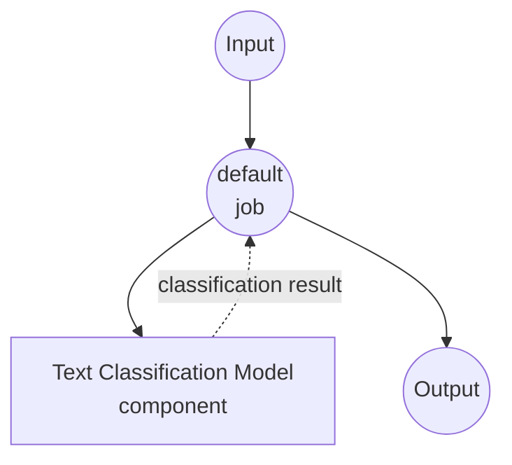

# Text Classification Model Task Example

This example demonstrates how to perform text classification using local transformer models with model-compose's built-in text-classification task, providing automated content moderation and text categorization capabilities.

## Overview

This workflow provides local text classification that:

1. **Local Classification Model**: Runs pretrained classification models locally using HuggingFace transformers
2. **Toxic Comment Detection**: Uses a specialized model for identifying toxic vs non-toxic content
3. **Probability Scores**: Returns confidence scores for each classification label
4. **No External APIs**: Completely offline text classification without API dependencies

## Preparation

### Prerequisites

- model-compose installed and available in your PATH
- Sufficient system resources for running classification models (recommended: 4GB+ RAM)
- Python environment with transformers and torch (automatically managed)

### Why Local Text Classification

Unlike cloud-based classification APIs, local model execution provides:

**Benefits of Local Processing:**
- **Privacy**: All text processing happens locally, no data sent to external services
- **Cost**: No per-request or API usage fees after initial setup
- **Speed**: No network latency for classification
- **Customization**: Use specialized models for specific classification tasks
- **Batch Processing**: Efficient processing of large text datasets
- **Consistency**: Same model version ensures consistent results

**Use Cases:**
- **Content Moderation**: Filter toxic or inappropriate content
- **Sentiment Analysis**: Classify text sentiment (positive/negative)
- **Topic Classification**: Categorize documents by topic
- **Spam Detection**: Identify spam vs legitimate content
- **Language Detection**: Identify the language of text

### Environment Configuration

1. Navigate to this example directory:
   ```bash
   cd examples/model-tasks/text-classification
   ```

2. No additional environment configuration required - model and dependencies are managed automatically.

## How to Run

1. **Start the service:**
   ```bash
   model-compose up
   ```

2. **Run the workflow:**

   **Using API:**
   ```bash
   curl -X POST http://localhost:8080/api/workflows/__default__/runs \
     -H "Content-Type: application/json" \
     -d '{"input": {"text": "This is a normal, respectful comment."}}'
   ```

   **Using Web UI:**
   - Open the Web UI: http://localhost:8081
   - Enter your input parameters
   - Click the "Run Workflow" button

   **Using CLI:**
   ```bash
   model-compose run text-classification --input '{"text": "This is a normal, respectful comment."}'
   ```

## Component Details

### Text Classification Model Component
- **Type**: Model component with text-classification task
- **Purpose**: Classify text as toxic or non-toxic content
- **Model**: martin-ha/toxic-comment-model
- **Task**: text-classification (HuggingFace transformers)
- **Labels**: ["non-toxic", "toxic"]
- **Features**:
  - Automatic model downloading and caching
  - Probability scores for each label
  - Fast inference suitable for real-time moderation
  - CPU and GPU acceleration support

### Model Information: toxic-comment-model
- **Developer**: martin-ha (HuggingFace community)
- **Base Model**: DistilBERT
- **Training**: Trained on toxic comment datasets
- **Languages**: Primarily English
- **Specialties**: Content moderation, toxic language detection
- **Performance**: Good balance of accuracy and speed
- **License**: Check model card for specific license

## Workflow Details

### "Classify Text" Workflow (Default)

**Description**: Classifies input text into predefined labels using a text classification model.

#### Job Flow

This example uses a simplified single-component configuration without explicit jobs.



#### Input Parameters

| Parameter | Type | Required | Default | Description |
|-----------|------|----------|---------|-------------|
| `text` | text | Yes | - | The input text to classify |

#### Output Format

| Field | Type | Description |
|-------|------|-------------|
| `predicted` | object | Classification result with labels and probability scores |

### Output Structure

```json
{
  "predicted": {
    "label": "non-toxic",
    "score": 0.9234,
    "scores": [
      {"label": "non-toxic", "score": 0.9234},
      {"label": "toxic", "score": 0.0766}
    ]
  }
}
```

## Understanding Classification Results

### Confidence Interpretation
- **High Confidence (>0.9)**: Very reliable classification
- **Medium Confidence (0.7-0.9)**: Generally reliable, consider context
- **Low Confidence (<0.7)**: Uncertain classification, may need human review

## System Requirements

### Minimum Requirements
- **RAM**: 4GB (recommended 8GB+)
- **Disk Space**: 2GB+ for model storage and cache
- **CPU**: Multi-core processor (2+ cores recommended)
- **Internet**: Required for initial model download only

### Performance Notes
- First run requires model download (~500MB)
- Model loading takes 1-2 minutes depending on hardware
- Classification is very fast (milliseconds per text)
- GPU acceleration provides significant speedup for batch processing

## Customization

### Using Different Classification Models

Replace with other classification models:

```yaml
component:
  type: model
  task: text-classification
  model: cardiffnlp/twitter-roberta-base-sentiment-latest  # Sentiment analysis
  labels: ["negative", "neutral", "positive"]
  text: ${input.text}
  params:
    return_probabilities: true
```

### Popular Classification Models

#### Sentiment Analysis
```yaml
model: cardiffnlp/twitter-roberta-base-sentiment-latest
labels: ["negative", "neutral", "positive"]
```

#### Emotion Classification
```yaml
model: j-hartmann/emotion-english-distilroberta-base
labels: ["anger", "disgust", "fear", "joy", "neutral", "sadness", "surprise"]
```

#### Language Detection
```yaml
model: papluca/xlm-roberta-base-language-detection
# Automatically detects language, no need to specify labels
```

### Adjusting Parameters

Fine-tune classification behavior:

```yaml
component:
  type: model
  task: text-classification
  model: martin-ha/toxic-comment-model
  labels: [ "non-toxic", "toxic" ]
  text: ${input.text}
  params:
    return_probabilities: true
    device: auto
    max_length: 512
    truncation: true
```

## Advanced Usage

### Batch Classification Workflow
```yaml
component:
  type: model
  task: text-classification
  model: martin-ha/toxic-comment-model
  labels: [ "non-toxic", "toxic" ]
  text: ${input.texts}  # Array of strings
  params:
    return_probabilities: true
```

### Multi-Model Classification Pipeline
```yaml
workflows:
  - id: comprehensive-moderation
    jobs:
      - id: toxicity-check
        component: toxic-classifier
        input:
          text: ${input.text}
      - id: sentiment-analysis
        component: sentiment-classifier
        input:
          text: ${input.text}
      - id: combine-results
        component: result-combiner
        input:
          toxicity: ${jobs.toxicity-check.output.predicted}
          sentiment: ${jobs.sentiment-analysis.output.predicted}
        depends_on: [toxicity-check, sentiment-analysis]
```

### Custom Threshold Application
```yaml
workflows:
  - id: content-filter
    jobs:
      - id: classify
        component: toxic-classifier
        input:
          text: ${input.text}
      - id: apply-threshold
        component: threshold-filter
        input:
          classification: ${jobs.classify.output.predicted}
          threshold: ${input.threshold | 0.8}
        depends_on: [classify]
```

## Model Comparison

### Content Moderation Models

| Model | Accuracy | Speed | Languages | Use Case |
|-------|----------|--------|-----------|----------|
| martin-ha/toxic-comment-model | Good | Fast | English | General toxicity |
| unitary/toxic-bert | High | Medium | English | Comprehensive toxicity |
| martin-ha/toxic-comment-model | Good | Fast | English | Real-time moderation |

### Sentiment Analysis Models

| Model | Accuracy | Speed | Domain | Languages |
|-------|----------|--------|--------|-----------|
| cardiffnlp/twitter-roberta-base-sentiment | High | Medium | Social media | English |
| nlptown/bert-base-multilingual-uncased-sentiment | Medium | Medium | General | Multilingual |

## Troubleshooting

### Common Issues

1. **Model Download Fails**: Check internet connection and disk space
2. **Out of Memory**: Use smaller models or reduce batch sizes
3. **Poor Accuracy**: Consider domain-specific models or fine-tuning
4. **Slow Performance**: Enable GPU acceleration for batch processing

### Performance Optimization

- **GPU Usage**: Install PyTorch with CUDA support
- **Batch Processing**: Process multiple texts together
- **Model Selection**: Choose appropriate model size for your needs

## Content Moderation Pipeline

### Real-time Moderation
```yaml
workflows:
  - id: real-time-moderation
    jobs:
      - id: classify-content
        component: toxic-classifier
        input:
          text: ${input.user_message}
      - id: filter-content
        component: content-filter
        input:
          classification: ${jobs.classify-content.output.predicted}
          original_text: ${input.user_message}
          threshold: 0.8
        depends_on: [classify-content]
```

### Batch Content Review
```yaml
workflows:
  - id: batch-review
    jobs:
      - id: classify-batch
        component: toxic-classifier
        input:
          text: ${input.messages}  # Array of messages
      - id: generate-report
        component: moderation-report
        input:
          classifications: ${jobs.classify-batch.output.predicted}
          threshold: 0.7
        depends_on: [classify-batch]
```

### With Chat Applications
```yaml
workflows:
  - id: chat-moderation
    jobs:
      - id: check-message
        component: toxic-classifier
        input:
          text: ${input.message}
      - id: handle-result
        component: message-handler
        input:
          classification: ${jobs.check-message.output.predicted}
          user_id: ${input.user_id}
          channel_id: ${input.channel_id}
        depends_on: [check-message]
```
