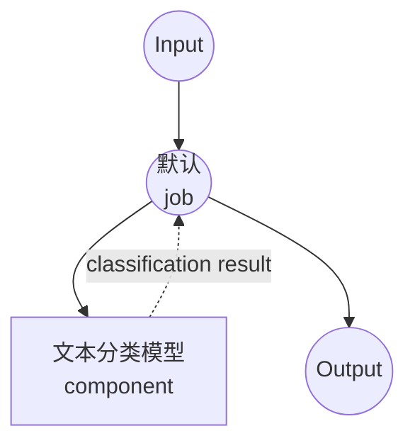

# 文本分类模型任务示例

本示例演示如何使用本地 transformer 模型进行文本分类，使用 model-compose 的内置文本分类任务，提供自动化内容审核和文本分类功能。

## 概述

此工作流提供本地文本分类功能：

1. **本地分类模型**：使用 HuggingFace transformers 在本地运行预训练分类模型
2. **有毒评论检测**：使用专门的模型识别有毒与非有毒内容
3. **概率分数**：返回每个分类标签的置信度分数
4. **无需外部 API**：完全离线的文本分类，无 API 依赖项

## 准备工作

### 先决条件

- 已安装 model-compose 并在 PATH 中可用
- 运行分类模型所需的充足系统资源（推荐：4GB+ RAM）
- 带有 transformers 和 torch 的 Python 环境（自动管理）

### 为什么选择本地文本分类

与基于云的分类 API 不同，本地模型执行提供：

**本地处理的优势：**
- **隐私**：所有文本处理在本地进行，不会将数据发送到外部服务
- **成本**：初始设置后无需按请求或 API 使用费用
- **速度**：分类无网络延迟
- **自定义**：使用专门的模型进行特定分类任务
- **批量处理**：高效处理大型文本数据集
- **一致性**：相同的模型版本确保结果一致

**用例：**
- **内容审核**：过滤有毒或不当内容
- **情感分析**：分类文本情感（积极/消极）
- **主题分类**：按主题对文档进行分类
- **垃圾邮件检测**：识别垃圾邮件与合法内容
- **语言检测**：识别文本的语言

### 环境配置

1. 导航到此示例目录：
   ```bash
   cd examples/model-tasks/text-classification
   ```

2. 无需额外的环境配置 - 模型和依赖项自动管理。

## 如何运行

1. **启动服务：**
   ```bash
   model-compose up
   ```

2. **运行工作流：**

   **使用 API：**
   ```bash
   curl -X POST http://localhost:8080/api/workflows/runs \
     -H "Content-Type: application/json" \
     -d '{"input": {"text": "This is a normal, respectful comment."}}'
   ```

   **使用 Web UI：**
   - 打开 Web UI：http://localhost:8081
   - 输入您的参数
   - 点击"Run Workflow"按钮

   **使用 CLI：**
   ```bash
   model-compose run text-classification --input '{"text": "This is a normal, respectful comment."}'
   ```

## 组件详情

### 文本分类模型组件（默认）
- **类型**：具有文本分类任务的模型组件
- **用途**：将文本分类为有毒或非有毒内容
- **模型**：martin-ha/toxic-comment-model
- **任务**：text-classification（HuggingFace transformers）
- **标签**：["non-toxic", "toxic"]
- **功能**：
  - 自动模型下载和缓存
  - 每个标签的概率分数
  - 快速推理适合实时审核
  - CPU 和 GPU 加速支持

### 模型信息：toxic-comment-model
- **开发者**：martin-ha（HuggingFace 社区）
- **基础模型**：DistilBERT
- **训练**：在有毒评论数据集上训练
- **语言**：主要是英语
- **专长**：内容审核、有毒语言检测
- **性能**：准确性和速度的良好平衡
- **许可证**：查看模型卡以了解具体许可证

## 工作流详情

### "分类文本"工作流（默认）

**描述**：使用文本分类模型将输入文本分类为预定义标签。

#### 作业流程

此示例使用简化的单组件配置，没有显式作业。



#### 输入参数

| 参数 | 类型 | 必需 | 默认值 | 描述 |
|-----------|------|----------|---------|-------------|
| `text` | text | 是 | - | 要分类的输入文本 |

#### 输出格式

| 字段 | 类型 | 描述 |
|-------|------|-------------|
| `predicted` | object | 包含标签和概率分数的分类结果 |

### 输出结构

```json
{
  "predicted": {
    "label": "non-toxic",
    "score": 0.9234,
    "scores": [
      {"label": "non-toxic", "score": 0.9234},
      {"label": "toxic", "score": 0.0766}
    ]
  }
}
```

## 理解分类结果

### 置信度解释
- **高置信度（>0.9）**：非常可靠的分类
- **中等置信度（0.7-0.9）**：通常可靠，考虑上下文
- **低置信度（<0.7）**：不确定的分类，可能需要人工审查

## 系统要求

### 最低要求
- **RAM**：4GB（推荐 8GB+）
- **磁盘空间**：2GB+ 用于模型存储和缓存
- **CPU**：多核处理器（推荐 2+ 核）
- **互联网**：仅用于初始模型下载

### 性能说明
- 首次运行需要下载模型（约 500MB）
- 模型加载需要 1-2 分钟，具体取决于硬件
- 分类非常快（每个文本几毫秒）
- GPU 加速可为批量处理提供显著加速

## 自定义

### 使用不同的分类模型

替换为其他分类模型：

```yaml
component:
  type: model
  task: text-classification
  model: cardiffnlp/twitter-roberta-base-sentiment-latest  # 情感分析
  labels: ["negative", "neutral", "positive"]
  action:
    text: ${input.text}
    params:
      return_probabilities: true
```

### 常用分类模型

#### 情感分析
```yaml
model: cardiffnlp/twitter-roberta-base-sentiment-latest
labels: ["negative", "neutral", "positive"]
```

#### 情绪分类
```yaml
model: j-hartmann/emotion-english-distilroberta-base
labels: ["anger", "disgust", "fear", "joy", "neutral", "sadness", "surprise"]
```

#### 语言检测
```yaml
model: papluca/xlm-roberta-base-language-detection
# 自动检测语言，无需指定标签
```

### 调整参数

微调分类行为：

```yaml
component:
  type: model
  task: text-classification
  model: martin-ha/toxic-comment-model
  labels: [ "non-toxic", "toxic" ]
  action:
    text: ${input.text}
    params:
      return_probabilities: true
      device: auto
      max_length: 512
      truncation: true
```

## 高级用法

### 批量分类工作流
```yaml
component:
  type: model
  task: text-classification
  model: martin-ha/toxic-comment-model
  labels: [ "non-toxic", "toxic" ]
  action:
    text: ${input.texts}  # 字符串数组
    params:
      return_probabilities: true
```

### 多模型分类管道
```yaml
workflows:
  - id: comprehensive-moderation
    jobs:
      - id: toxicity-check
        component: toxic-classifier
        input:
          text: ${input.text}
      - id: sentiment-analysis
        component: sentiment-classifier
        input:
          text: ${input.text}
      - id: combine-results
        component: result-combiner
        input:
          toxicity: ${jobs.toxicity-check.output.predicted}
          sentiment: ${jobs.sentiment-analysis.output.predicted}
        depends_on: [toxicity-check, sentiment-analysis]
```

### 自定义阈值应用
```yaml
workflows:
  - id: content-filter
    jobs:
      - id: classify
        component: toxic-classifier
        input:
          text: ${input.text}
      - id: apply-threshold
        component: threshold-filter
        input:
          classification: ${jobs.classify.output.predicted}
          threshold: ${input.threshold | 0.8}
        depends_on: [classify]
```

## 模型比较

### 内容审核模型

| 模型 | 准确性 | 速度 | 语言 | 用例 |
|-------|----------|--------|-----------|----------|
| martin-ha/toxic-comment-model | 良好 | 快速 | 英语 | 一般有毒性 |
| unitary/toxic-bert | 高 | 中等 | 英语 | 全面有毒性 |
| martin-ha/toxic-comment-model | 良好 | 快速 | 英语 | 实时审核 |

### 情感分析模型

| 模型 | 准确性 | 速度 | 领域 | 语言 |
|-------|----------|--------|--------|-----------|
| cardiffnlp/twitter-roberta-base-sentiment | 高 | 中等 | 社交媒体 | 英语 |
| nlptown/bert-base-multilingual-uncased-sentiment | 中等 | 中等 | 一般 | 多语言 |

## 故障排除

### 常见问题

1. **模型下载失败**：检查互联网连接和磁盘空间
2. **内存不足**：使用较小的模型或减少批量大小
3. **准确性差**：考虑特定领域的模型或微调
4. **性能缓慢**：为批量处理启用 GPU 加速

### 性能优化

- **GPU 使用**：安装带有 CUDA 支持的 PyTorch
- **批量处理**：一起处理多个文本
- **模型选择**：根据您的需求选择适当的模型大小

## 内容审核管道

### 实时审核
```yaml
workflows:
  - id: real-time-moderation
    jobs:
      - id: classify-content
        component: toxic-classifier
        input:
          text: ${input.user_message}
      - id: filter-content
        component: content-filter
        input:
          classification: ${jobs.classify-content.output.predicted}
          original_text: ${input.user_message}
          threshold: 0.8
        depends_on: [classify-content]
```

### 批量内容审查
```yaml
workflows:
  - id: batch-review
    jobs:
      - id: classify-batch
        component: toxic-classifier
        input:
          text: ${input.messages}  # 消息数组
      - id: generate-report
        component: moderation-report
        input:
          classifications: ${jobs.classify-batch.output.predicted}
          threshold: 0.7
        depends_on: [classify-batch]
```

### 与聊天应用程序配合使用
```yaml
workflows:
  - id: chat-moderation
    jobs:
      - id: check-message
        component: toxic-classifier
        input:
          text: ${input.message}
      - id: handle-result
        component: message-handler
        input:
          classification: ${jobs.check-message.output.predicted}
          user_id: ${input.user_id}
          channel_id: ${input.channel_id}
        depends_on: [check-message]
```
