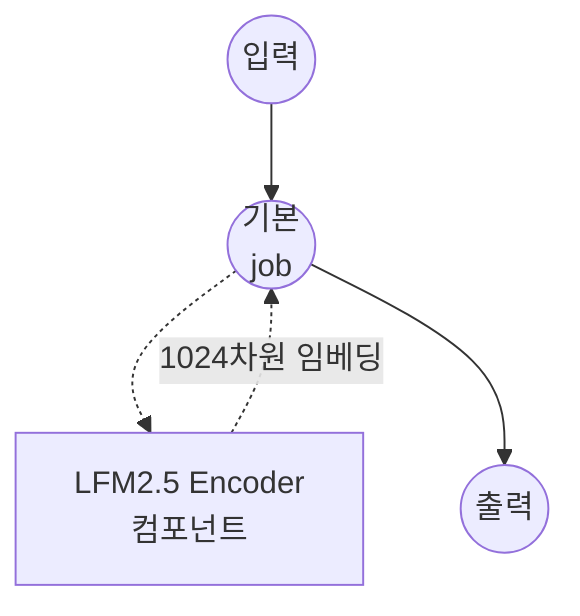

# LFM2.5 Encoder 텍스트 임베딩 예제

이 예제는 model-compose의 내장 `text-embedding` 작업으로 LiquidAI의 [LFM2.5-Encoder-350M](https://huggingface.co/LiquidAI/LFM2.5-Encoder-350M) 모델을 사용해 다국어 텍스트 임베딩을 생성하는 방법을 보여줍니다. 15개 언어에 대해 1024차원의 의미론적 벡터를 생성하며 검색, 클러스터링, 의미 유사도 계산 등에 활용할 수 있습니다.

## 개요

이 워크플로우는 다음과 같은 로컬 텍스트 임베딩 생성을 제공합니다:

1. **다국어 인코더**: HuggingFace transformers를 통해 LFM2.5-Encoder-350M을 로컬에서 실행 (15개 언어 지원)
2. **긴 컨텍스트 임베딩**: 최대 8,192 토큰까지 인코딩, 1024차원의 hidden size
3. **온디바이스 추론**: 온디바이스 사용을 위해 설계된 효율적인 양방향 인코더, 외부 API 불필요
4. **평균 풀링 벡터**: 토큰별 hidden state를 하나의 L2 정규화된 문장 임베딩으로 집계

## LFM2.5-Encoder-350M 소개

**LFM2.5-Encoder-350M**은 Liquid AI가 LFM2 아키텍처 기반으로 공개한 다국어 양방향 인코더(약 3억 5,450만 파라미터)입니다. 원래는 텍스트 분류, 토큰 분류, 검색, 재순위화, 의미 유사도, 자연어 추론 등 다운스트림 태스크로 파인튜닝하도록 설계된 범용 인코더 백본이지만, 평균 풀링과 L2 정규화를 함께 사용하면 별도 학습 없이도 문장 인코더로 훌륭하게 동작합니다.

| 속성 | 값 |
|------|-----|
| 파라미터 수 | 약 3억 5,450만 |
| Hidden size | 1024 |
| 어휘 크기 | 65,536 |
| 컨텍스트 길이 | 8,192 토큰 |
| 지원 언어 | 15개 (영어, 독일어, 스페인어, 프랑스어, 이탈리아어, 네덜란드어, 폴란드어, 포르투갈어, 아랍어, 힌디어, 일본어, 러시아어, 터키어, 베트남어, 중국어) |
| 라이선스 | LFM Open License v1.0 |

## 준비사항

### 필수 요구사항

- model-compose가 설치되어 PATH에서 사용 가능
- 충분한 시스템 리소스 (권장: 8GB+ RAM, GPU는 선택 사항이나 있으면 더 빠름)
- `torch` 및 `transformers`가 있는 Python 환경 (자동 관리)
- 최초 모델 다운로드용 인터넷 연결 (약 700MB)

### 환경 구성

1. 이 예제 디렉토리로 이동:
   ```bash
   cd examples/model-tasks/text-embedding-lfm2
   ```

2. 추가 환경 구성은 필요 없습니다 — 모델과 종속성은 첫 실행 시 자동으로 다운로드 및 캐시됩니다.

## 실행 방법

1. **서비스 시작:**
   ```bash
   model-compose up
   ```

2. **워크플로우 실행:**

   **API 사용:**
   ```bash
   curl -X POST http://localhost:8080/api/workflows/runs \
     -H "Content-Type: application/json" \
     -d '{"input": {"text": "다국어 인코더를 테스트합니다"}}'
   ```

   **웹 UI 사용:**
   - 웹 UI 열기: http://localhost:8081
   - 입력 텍스트 입력
   - "Run Workflow" 버튼 클릭

   **CLI 사용:**
   ```bash
   model-compose run --input '{"text": "머신러닝은 기술을 변화시키고 있습니다"}'
   ```

## 컴포넌트 세부사항

### Text Embedding Model 컴포넌트 (기본)
- **유형**: `text-embedding` 작업을 사용하는 Model 컴포넌트
- **모델**: `LiquidAI/LFM2.5-Encoder-350M`
- **드라이버**: `huggingface`
- **아키텍처**: `auto` — `trust_remote_code`를 통해 `AutoModel`이 LFM2 인코더 바디를 자동으로 로드
- **풀링**: `mean` — 시퀀스 전체에 걸쳐 토큰 hidden state를 평균
- **정규화**: `true` — 출력 벡터를 L2 정규화하여 코사인 유사도가 내적으로 계산되도록 함

## 워크플로우 세부사항

### "Generate Text Embedding with LFM2.5 Encoder" 워크플로우 (기본)

**설명**: LiquidAI의 LFM2.5-Encoder-350M 모델을 사용해 다국어 텍스트 임베딩 벡터를 생성합니다.

#### 작업 흐름

이 예제는 명시적 job 없이 단일 컴포넌트로 구성된 단순한 형태를 사용합니다.



#### 입력 파라미터

| 파라미터 | 유형 | 필수 | 기본값 | 설명 |
|----------|------|------|--------|------|
| `text`   | text | 예   | -      | 임베딩 벡터로 변환할 입력 텍스트. 배치 임베딩을 위해 문자열 배열로도 전달 가능. |

#### 출력 형식

| 필드        | 유형 | 설명 |
|-------------|------|------|
| `embedding` | json | L2 정규화된 텍스트 임베딩을 나타내는 1024개의 부동소수점 배열 |

## 시스템 요구사항

### 최소 요구사항
- **RAM**: 8GB (8k 컨텍스트 한계에 가까운 긴 입력 처리 시 16GB+ 권장)
- **디스크 공간**: 모델 가중치 및 캐시용 약 2GB
- **CPU**: 멀티코어 프로세서; 처리량 확보에는 GPU (CUDA 또는 Apple MPS) 권장
- **인터넷**: 최초 모델 다운로드에만 필요

### 성능 참고사항
- 첫 실행 시 약 700MB의 가중치 다운로드
- 짧은 입력은 CPU 추론도 가능하지만, 긴 컨텍스트나 배치 입력은 GPU/MPS가 확연히 빠름
- 로딩 시간은 하드웨어에 따라 일반적으로 10~30초

## 커스터마이징

### 배치 임베딩
문자열 배열을 전달해 여러 텍스트를 한 번에 임베딩할 수 있습니다:
```yaml
component:
  type: model
  task: text-embedding
  driver: huggingface
  model: LiquidAI/LFM2.5-Encoder-350M
  action:
    text: ${input.texts}   # 문자열 배열
```

### CLS 풀링 사용
첫 토큰 표현을 사용하는 다운스트림 헤드를 파인튜닝하는 경우 풀링을 `cls`로 전환하세요:
```yaml
action:
  text: ${input.text}
  pooling: cls
  normalize: true
```

### 긴 컨텍스트 입력
LFM2.5는 최대 8,192 토큰을 지원합니다. 토크나이저 기본값보다 더 긴 입력이 필요하다면 `max_input_length`를 설정하세요:
```yaml
action:
  text: ${input.text}
  max_input_length: 8192
```

## 문제 해결

- **모델 다운로드 실패**: 인터넷 연결과 디스크 공간을 확인하세요. 가중치는 약 700MB입니다.
- **메모리 부족**: `max_input_length`를 줄이거나 입력을 짧게 하거나 RAM/VRAM이 더 큰 머신에서 실행하세요.
- **느린 추론**: NVIDIA GPU라면 CUDA 지원 PyTorch를 설치하고, Apple Silicon이라면 MPS가 활성화되어 있는지 확인하세요.
- **trust-remote-code 관련 프롬프트**: LFM2.5는 Hub에 커스텀 모델 코드를 포함하고 있으며 HuggingFace 드라이버가 이를 투명하게 로드합니다 — 추가 조치는 필요 없습니다.
