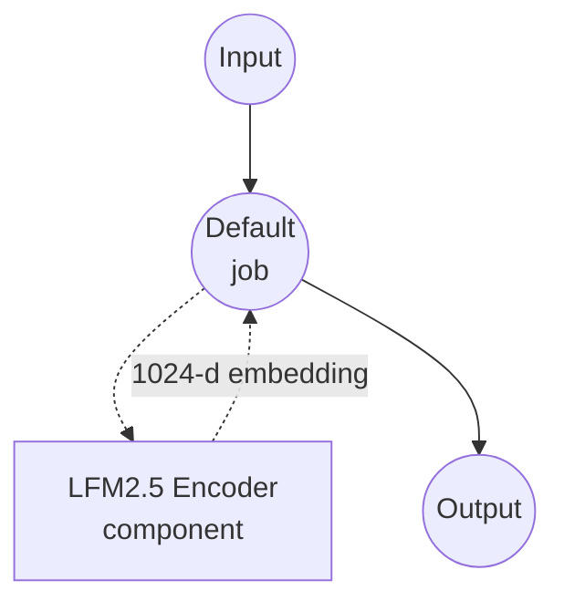

# LFM2.5 Encoder Text Embedding Example

This example demonstrates how to generate multilingual text embeddings using LiquidAI's [LFM2.5-Encoder-350M](https://huggingface.co/LiquidAI/LFM2.5-Encoder-350M) model with model-compose's built-in `text-embedding` task, producing 1024-dimensional semantic vectors suitable for retrieval, clustering, and semantic similarity across 15 languages.

## Overview

This workflow provides local text embedding generation that:

1. **Multilingual Encoder**: Runs LFM2.5-Encoder-350M locally via HuggingFace transformers with support for 15 languages
2. **Long-Context Embeddings**: Encodes inputs up to 8,192 tokens with a 1024-dimensional hidden size
3. **On-Device Inference**: Efficient bidirectional encoder designed for on-device use, no external APIs required
4. **Mean-Pooled Vectors**: Aggregates token hidden states into a single L2-normalized sentence embedding

## About LFM2.5-Encoder-350M

**LFM2.5-Encoder-350M** is a multilingual bidirectional encoder (~354.5M parameters) built on the LFM2 architecture by Liquid AI. It was released as a general-purpose encoder body intended to be fine-tuned for downstream tasks — text classification, token classification, retrieval, reranking, semantic similarity, and NLI — but it also works well out of the box as a sentence encoder when combined with mean pooling and L2 normalization.

| Property | Value |
|----------|-------|
| Parameters | ~354.5M |
| Hidden size | 1024 |
| Vocabulary size | 65,536 |
| Context length | 8,192 tokens |
| Languages | 15 (English, German, Spanish, French, Italian, Dutch, Polish, Portuguese, Arabic, Hindi, Japanese, Russian, Turkish, Vietnamese, Chinese) |
| License | LFM Open License v1.0 |

## Preparation

### Prerequisites

- model-compose installed and available in your PATH
- Sufficient system resources (recommended: 8GB+ RAM, GPU optional but faster)
- Python environment with `torch` and `transformers` (automatically managed)
- Internet connection for the initial model download (~700MB)

### Environment Configuration

1. Navigate to this example directory:
   ```bash
   cd examples/model-tasks/text-embedding-lfm2
   ```

2. No additional environment configuration is required — the model and its dependencies are downloaded and cached automatically on first run.

## How to Run

1. **Start the service:**
   ```bash
   model-compose up
   ```

2. **Run the workflow:**

   **Using API:**
   ```bash
   curl -X POST http://localhost:8080/api/workflows/runs \
     -H "Content-Type: application/json" \
     -d '{"input": {"text": "多言語エンコーダを試しています"}}'
   ```

   **Using Web UI:**
   - Open the Web UI: http://localhost:8081
   - Enter your input text
   - Click the "Run Workflow" button

   **Using CLI:**
   ```bash
   model-compose run --input '{"text": "Machine learning is transforming technology"}'
   ```

## Component Details

### Text Embedding Model Component (Default)
- **Type**: Model component with `text-embedding` task
- **Model**: `LiquidAI/LFM2.5-Encoder-350M`
- **Driver**: `huggingface`
- **Architecture**: `auto` — lets `AutoModel` load the LFM2 encoder body via `trust_remote_code`
- **Pooling**: `mean` — averages token hidden states across the sequence
- **Normalize**: `true` — L2-normalizes the output vector so cosine similarity reduces to a dot product

## Workflow Details

### "Generate Text Embedding with LFM2.5 Encoder" Workflow (Default)

**Description**: Generate a multilingual text embedding vector using LiquidAI's LFM2.5-Encoder-350M model.

#### Job Flow

This example uses a simplified single-component configuration without explicit jobs.



#### Input Parameters

| Parameter | Type | Required | Default | Description |
|-----------|------|----------|---------|-------------|
| `text`    | text | Yes      | -       | The input text to convert into an embedding vector. Can also be an array of strings for batch embedding. |

#### Output Format

| Field       | Type | Description |
|-------------|------|-------------|
| `embedding` | json | Array of 1024 floating-point numbers representing the L2-normalized text embedding. |

## System Requirements

### Minimum Requirements
- **RAM**: 8GB (recommended 16GB+ for long inputs near the 8k context limit)
- **Disk Space**: ~2GB for model weights and cache
- **CPU**: Multi-core processor; GPU (CUDA or Apple MPS) recommended for throughput
- **Internet**: Required for the initial model download only

### Performance Notes
- First run downloads ~700MB of weights
- CPU inference is workable for short inputs; GPU/MPS is noticeably faster for long context and batch inputs
- Loading time is typically 10–30 seconds depending on hardware

## Customization

### Batch Embedding
Pass an array of strings to embed several texts in one call:
```yaml
component:
  type: model
  task: text-embedding
  driver: huggingface
  model: LiquidAI/LFM2.5-Encoder-350M
  action:
    text: ${input.texts}   # array of strings
```

### Using CLS Pooling
If you fine-tune a downstream head that consumes the first-token representation, switch pooling to `cls`:
```yaml
action:
  text: ${input.text}
  pooling: cls
  normalize: true
```

### Long-Context Inputs
LFM2.5 supports up to 8,192 tokens. Set `max_input_length` if the default from the tokenizer is smaller than what you need:
```yaml
action:
  text: ${input.text}
  max_input_length: 8192
```

## Troubleshooting

- **Model download fails**: Verify internet connectivity and available disk space; the weights are ~700MB.
- **Out of memory**: Reduce `max_input_length`, shorten inputs, or move to a machine with more RAM/VRAM.
- **Slow inference**: Install PyTorch with CUDA (NVIDIA) or ensure Apple MPS is available for Apple Silicon acceleration.
- **Trust-remote-code prompts**: LFM2.5 ships custom model code on the Hub; the HuggingFace driver loads it transparently — no extra action is needed.
