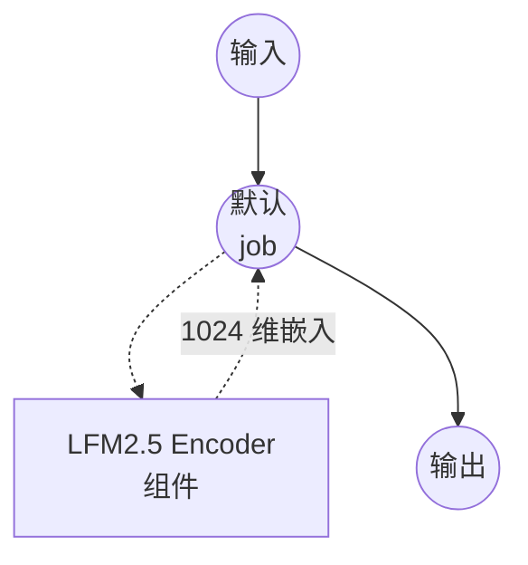

# LFM2.5 Encoder 文本嵌入示例

本示例演示如何使用 model-compose 内置的 `text-embedding` 任务，通过 LiquidAI 的 [LFM2.5-Encoder-350M](https://huggingface.co/LiquidAI/LFM2.5-Encoder-350M) 模型生成多语言文本嵌入，为跨 15 种语言的检索、聚类和语义相似度计算生成 1024 维的语义向量。

## 概述

此工作流提供本地文本嵌入生成功能：

1. **多语言编码器**：通过 HuggingFace transformers 在本地运行 LFM2.5-Encoder-350M，支持 15 种语言
2. **长上下文嵌入**：可编码最多 8,192 个词元的输入，隐藏层维度为 1024
3. **端侧推理**：面向端侧场景设计的高效双向编码器，无需外部 API
4. **均值池化向量**：将各词元的隐藏状态聚合为一个经过 L2 归一化的句子嵌入

## 关于 LFM2.5-Encoder-350M

**LFM2.5-Encoder-350M** 是 Liquid AI 基于 LFM2 架构发布的多语言双向编码器（约 3.545 亿参数）。它作为通用编码器主体发布，主要用于对下游任务进行微调 —— 文本分类、词元分类、检索、重排序、语义相似度、自然语言推理等 —— 但结合均值池化与 L2 归一化后，也可以直接作为句子编码器使用，无需额外训练。

| 属性 | 值 |
|------|-----|
| 参数量 | 约 3.545 亿 |
| 隐藏层维度 | 1024 |
| 词表大小 | 65,536 |
| 上下文长度 | 8,192 词元 |
| 支持语言 | 15 种（英语、德语、西班牙语、法语、意大利语、荷兰语、波兰语、葡萄牙语、阿拉伯语、印地语、日语、俄语、土耳其语、越南语、中文） |
| 许可证 | LFM Open License v1.0 |

## 准备工作

### 先决条件

- 已安装 model-compose 并在 PATH 中可用
- 足够的系统资源（建议：8GB+ 内存，GPU 可选但更快）
- 安装了 `torch` 和 `transformers` 的 Python 环境（自动管理）
- 首次下载模型需联网（约 700MB）

### 环境配置

1. 进入本示例目录：
   ```bash
   cd examples/model-tasks/text-embedding-lfm2
   ```

2. 无需额外的环境配置 —— 模型和依赖项在首次运行时会自动下载和缓存。

## 如何运行

1. **启动服务：**
   ```bash
   model-compose up
   ```

2. **运行工作流：**

   **使用 API：**
   ```bash
   curl -X POST http://localhost:8080/api/workflows/runs \
     -H "Content-Type: application/json" \
     -d '{"input": {"text": "正在测试多语言编码器"}}'
   ```

   **使用 Web UI：**
   - 打开 Web UI：http://localhost:8081
   - 输入您的文本
   - 点击"Run Workflow"按钮

   **使用 CLI：**
   ```bash
   model-compose run --input '{"text": "机器学习正在改变技术"}'
   ```

## 组件详情

### 文本嵌入模型组件（默认）
- **类型**：使用 `text-embedding` 任务的模型组件
- **模型**：`LiquidAI/LFM2.5-Encoder-350M`
- **驱动**：`huggingface`
- **架构**：`auto` —— 通过 `trust_remote_code` 让 `AutoModel` 自动加载 LFM2 编码器主体
- **池化**：`mean` —— 对整个序列的词元隐藏状态取均值
- **归一化**：`true` —— 对输出向量做 L2 归一化，使余弦相似度可通过点积直接计算

## 工作流详情

### "Generate Text Embedding with LFM2.5 Encoder" 工作流（默认）

**说明**：使用 LiquidAI 的 LFM2.5-Encoder-350M 模型生成多语言文本嵌入向量。

#### 作业流程

本示例采用无显式 job 的单组件简化配置。



#### 输入参数

| 参数    | 类型 | 必填 | 默认值 | 说明 |
|---------|------|------|--------|------|
| `text`  | text | 是   | -      | 要转换为嵌入向量的输入文本。也可传入字符串数组进行批量嵌入。 |

#### 输出格式

| 字段         | 类型 | 说明 |
|--------------|------|------|
| `embedding`  | json | 表示 L2 归一化后文本嵌入的 1024 个浮点数数组。 |

## 系统要求

### 最低要求
- **内存**：8GB（接近 8k 上下文上限的长输入建议 16GB+）
- **磁盘空间**：模型权重和缓存约 2GB
- **CPU**：多核处理器；提升吞吐量建议使用 GPU（CUDA 或 Apple MPS）
- **网络**：仅首次下载模型时需要

### 性能说明
- 首次运行会下载约 700MB 的权重
- 短输入使用 CPU 推理即可，长上下文或批量输入下 GPU/MPS 明显更快
- 加载时间通常为 10~30 秒，具体取决于硬件

## 自定义

### 批量嵌入
传入字符串数组即可一次嵌入多条文本：
```yaml
component:
  type: model
  task: text-embedding
  driver: huggingface
  model: LiquidAI/LFM2.5-Encoder-350M
  action:
    text: ${input.texts}   # 字符串数组
```

### 使用 CLS 池化
若要微调依赖首个词元表示的下游头，可将池化切换为 `cls`：
```yaml
action:
  text: ${input.text}
  pooling: cls
  normalize: true
```

### 长上下文输入
LFM2.5 最多支持 8,192 个词元。若分词器默认值小于你的需求，请设置 `max_input_length`：
```yaml
action:
  text: ${input.text}
  max_input_length: 8192
```

## 故障排除

- **模型下载失败**：请检查网络连接和磁盘空间；权重约 700MB。
- **内存不足**：减小 `max_input_length`、缩短输入，或换到 RAM/VRAM 更大的机器上。
- **推理缓慢**：NVIDIA 显卡请安装支持 CUDA 的 PyTorch；Apple Silicon 请确认已启用 MPS。
- **trust-remote-code 提示**：LFM2.5 在 Hub 上包含自定义模型代码，HuggingFace 驱动会透明加载 —— 无需额外操作。
