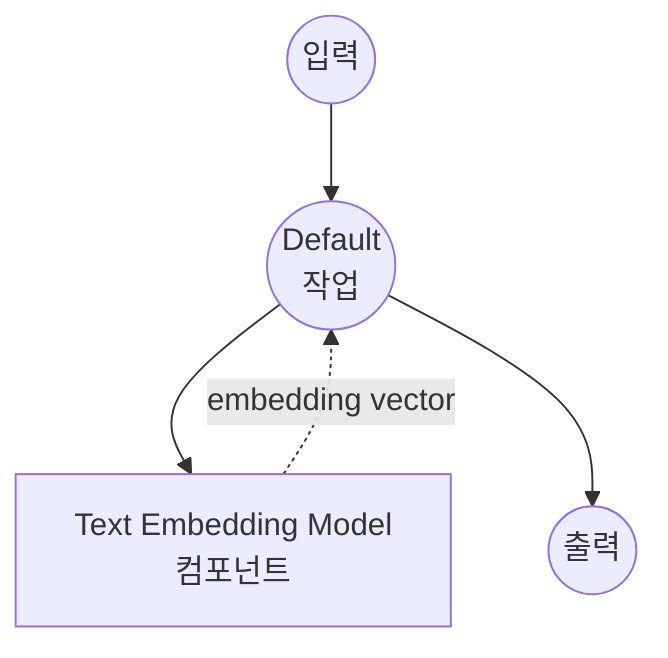

# Text Embedding Model Task 예제

이 예제는 model-compose의 내장 text-embedding 작업을 사용하여 로컬 문장 변환 모델로 텍스트 임베딩을 생성하는 방법을 보여주며, 유사도 검색 및 ML 애플리케이션을 위한 의미론적 벡터 표현을 제공합니다.

## 개요

이 워크플로우는 다음과 같은 로컬 텍스트 임베딩 생성을 제공합니다:

1. **로컬 임베딩 모델**: HuggingFace transformers를 사용하여 문장 변환 모델을 로컬에서 실행
2. **의미론적 벡터**: 텍스트를 고차원 벡터 표현으로 변환
3. **자동 모델 관리**: 첫 사용 시 모델을 자동으로 다운로드하고 캐시
4. **외부 API 불필요**: API 의존성 없이 완전히 오프라인 임베딩 생성

## 준비사항

### 필수 요구사항

- model-compose가 설치되어 PATH에서 사용 가능
- 임베딩 모델 실행을 위한 충분한 시스템 리소스 (권장: 4GB+ RAM)
- sentence-transformers 및 torch가 있는 Python 환경 (자동 관리)

### 로컬 텍스트 임베딩을 사용하는 이유

클라우드 기반 임베딩 API와 달리 로컬 모델 실행은 다음을 제공합니다:

**로컬 처리의 이점:**
- **프라이버시**: 모든 텍스트 처리가 로컬에서 이루어지며 외부 서비스로 데이터 전송 없음
- **비용**: 초기 설정 후 토큰당 또는 API 사용 요금 없음
- **오프라인**: 모델 다운로드 후 인터넷 연결 없이 작동
- **배치 처리**: 대규모 텍스트 데이터셋의 효율적인 처리
- **일관성**: 동일한 모델 버전으로 시간 경과에 따라 일관된 임베딩 보장
- **속도**: 임베딩 생성에 네트워크 지연 없음

**사용 사례:**
- **의미론적 검색**: 유사한 문서 또는 구절 찾기
- **클러스터링**: 관련 텍스트를 함께 그룹화
- **분류**: 임베딩을 ML 모델의 특징으로 사용
- **추천 시스템**: 텍스트 기반 유사 콘텐츠 찾기
- **중복 감지**: 유사하거나 중복된 텍스트 식별

### 환경 구성

1. 이 예제 디렉토리로 이동:
   ```bash
   cd examples/model-tasks/text-embedding
   ```

2. 추가 환경 구성 불필요 - 모델 및 종속성이 자동으로 관리됩니다.

## 실행 방법

1. **서비스 시작:**
   ```bash
   model-compose up
   ```

2. **워크플로우 실행:**

   **API 사용:**
   ```bash
   curl -X POST http://localhost:8080/api/workflows/runs \
     -H "Content-Type: application/json" \
     -d '{"input": {"text": "Machine learning is transforming technology"}}'
   ```

   **웹 UI 사용:**
   - 웹 UI 열기: http://localhost:8081
   - 입력 매개변수 입력
   - "Run Workflow" 버튼 클릭

   **CLI 사용:**
   ```bash
   model-compose run text-embedding --input '{"text": "Machine learning is transforming technology"}'
   ```

## 컴포넌트 세부사항

### Text Embedding Model 컴포넌트 (기본)
- **유형**: text-embedding 작업을 사용하는 Model 컴포넌트
- **목적**: 텍스트의 의미론적 벡터 표현 생성
- **모델**: sentence-transformers/all-MiniLM-L6-v2
- **작업**: text-embedding (sentence-transformers 기반)
- **기능**:
  - 자동 모델 다운로드 및 캐싱
  - 빠르고 효율적인 임베딩 생성
  - 384차원 출력 벡터
  - 다국어 지원 (주로 영어)
  - CPU 및 GPU 가속 지원

### 모델 정보: all-MiniLM-L6-v2
- **개발자**: Microsoft (sentence-transformers를 통해)
- **아키텍처**: MiniLM (Mini Language Model)
- **매개변수**: 약 2,300만
- **출력 차원**: 384
- **최대 시퀀스 길이**: 256 토큰
- **언어**: 주로 영어, 일부 다국어 기능
- **학습**: 10억 문장 쌍으로 학습
- **성능**: 속도, 크기 및 품질의 우수한 균형
- **라이센스**: Apache 2.0

## 워크플로우 세부사항

### "Generate Text Embedding" 워크플로우 (기본)

**설명**: 문장 변환 모델을 사용하여 텍스트 임베딩 벡터를 생성합니다.

#### 작업 흐름

이 예제는 명시적인 작업 없이 단순화된 단일 컴포넌트 구성을 사용합니다.



#### 입력 매개변수

| 매개변수 | 유형 | 필수 | 기본값 | 설명 |
|---------|------|------|--------|------|
| `text` | text | 예 | - | 임베딩 벡터로 변환할 입력 텍스트 |

#### 출력 형식

| 필드 | 유형 | 설명 |
|-----|------|------|
| `embedding` | json | 텍스트 임베딩을 나타내는 384개의 부동 소수점 숫자 배열 |

## 시스템 요구사항

### 최소 요구사항
- **RAM**: 4GB (권장 8GB+)
- **디스크 공간**: 모델 저장 및 캐시를 위한 2GB+
- **CPU**: 멀티코어 프로세서 (2+ 코어 권장)
- **인터넷**: 초기 모델 다운로드에만 필요

### 성능 참고사항
- 첫 실행 시 모델 다운로드 필요 (~90MB)
- 모델 로딩은 하드웨어에 따라 30-60초 소요
- 임베딩 생성은 매우 빠름 (텍스트당 밀리초)
- GPU 가속은 단일 임베딩에 대해 미미한 개선 제공

## 사용자 정의

### 다른 모델 사용

다른 문장 변환 모델로 교체:

```yaml
component:
  type: model
  task: text-embedding
  model: sentence-transformers/all-mpnet-base-v2    # 더 높은 품질, 느림
  text: ${input.text}
  # 출력: 768 차원

# 또는 다국어 지원:
# model: sentence-transformers/paraphrase-multilingual-MiniLM-L12-v2
```

### 배치 처리

여러 텍스트를 효율적으로 처리:

```yaml
component:
  type: model
  task: text-embedding
  model: sentence-transformers/all-MiniLM-L6-v2
  text: ${input.texts}  # 문자열 배열
```

### 모델 매개변수

모델 동작 미세 조정:

```yaml
component:
  type: model
  task: text-embedding
  model: sentence-transformers/all-MiniLM-L6-v2
  text: ${input.text}
  params:
    device: auto        # 'cpu', 'cuda', 또는 'auto'
    normalize: true     # 출력 벡터 정규화
    convert_to_numpy: true
```

## 고급 사용

### 문서 유사도 워크플로우
```yaml
workflows:
  - id: document-similarity
    jobs:
      - id: embed-query
        component: text-embedder
        input:
          text: ${input.query_text}
      - id: embed-documents
        component: text-embedder
        input:
          text: ${input.document_texts}  # 문서 배열
      - id: calculate-similarity
        component: similarity-calculator
        input:
          query_embedding: ${jobs.embed-query.output.embedding}
          document_embeddings: ${jobs.embed-documents.output.embedding}
        depends_on: [embed-query, embed-documents]
```

### 의미론적 검색 파이프라인
```yaml
component:
  type: model
  task: text-embedding
  model: sentence-transformers/all-MiniLM-L6-v2
  text: ${input.search_queries}
  output: ${output as json}
```

## 모델 비교

### 속도 vs 품질 트레이드오프

| 모델 | 매개변수 | 차원 | 속도 | 품질 | 사용 사례 |
|-----|---------|------|------|------|---------|
| all-MiniLM-L6-v2 | 23M | 384 | 빠름 | 좋음 | 범용 |
| all-mpnet-base-v2 | 110M | 768 | 중간 | 높음 | 높은 정확도 필요 |
| all-distilroberta-v1 | 82M | 768 | 중간 | 높음 | 균형잡힌 성능 |

### 다국어 모델

| 모델 | 언어 | 차원 | 성능 |
|-----|------|------|------|
| paraphrase-multilingual-MiniLM-L12-v2 | 50+ | 384 | 우수한 다국어 |
| paraphrase-multilingual-mpnet-base-v2 | 50+ | 768 | 최고 다국어 |

## 문제 해결

### 일반적인 문제

1. **메모리 부족**: 더 작은 모델 사용 또는 배치 크기 줄이기
2. **모델 다운로드 실패**: 인터넷 연결 및 디스크 공간 확인
3. **느린 성능**: 가능한 경우 GPU 가속 활성화
4. **차원 불일치**: 파이프라인 전체에서 일관된 모델 보장

### 성능 최적화

- **GPU 사용**: GPU 가속을 위해 CUDA 지원이 있는 PyTorch 설치
- **배치 처리**: 더 나은 처리량을 위해 여러 텍스트를 함께 처리
- **모델 캐싱**: 첫 다운로드 후 모델이 캐시됨

## 통합 예제

### 벡터 데이터베이스와 함께
```yaml
workflows:
  - id: store-embeddings
    jobs:
      - id: generate-embedding
        component: text-embedder
        input:
          text: ${input.document}
      - id: store-vector
        component: vector-store
        input:
          vector: ${jobs.generate-embedding.output.embedding}
          metadata: ${input.metadata}
        depends_on: [generate-embedding]
```

### ML 파이프라인과 함께
```yaml
workflows:
  - id: text-classification
    jobs:
      - id: embed-text
        component: text-embedder
        input:
          text: ${input.text}
      - id: classify
        component: classifier
        input:
          features: ${jobs.embed-text.output.embedding}
        depends_on: [embed-text]
```
