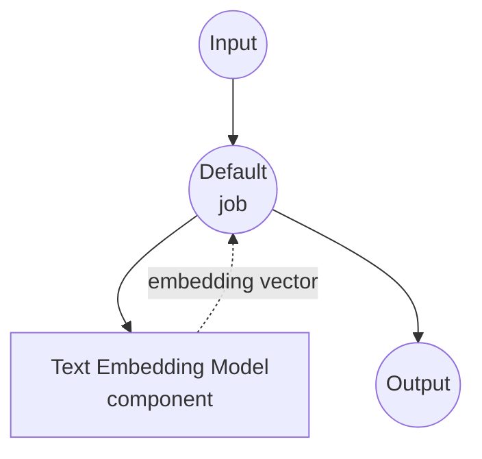

# Text Embedding Model Task Example

This example demonstrates how to generate text embeddings using local sentence transformer models with model-compose's built-in text-embedding task, providing semantic vector representations of text for similarity search and ML applications.

## Overview

This workflow provides local text embedding generation that:

1. **Local Embedding Model**: Runs sentence transformer models locally using HuggingFace transformers
2. **Semantic Vectors**: Converts text into high-dimensional vector representations
3. **Automatic Model Management**: Downloads and caches models automatically on first use
4. **No External APIs**: Completely offline embedding generation without API dependencies

## Preparation

### Prerequisites

- model-compose installed and available in your PATH
- Sufficient system resources for running embedding models (recommended: 4GB+ RAM)
- Python environment with sentence-transformers and torch (automatically managed)

### Why Local Text Embeddings

Unlike cloud-based embedding APIs, local model execution provides:

**Benefits of Local Processing:**
- **Privacy**: All text processing happens locally, no data sent to external services
- **Cost**: No per-token or API usage fees after initial setup
- **Offline**: Works without internet connection after model download
- **Batch Processing**: Efficient processing of large text datasets
- **Consistency**: Same model version ensures consistent embeddings over time
- **Speed**: No network latency for embedding generation

**Use Cases:**
- **Semantic Search**: Find similar documents or passages
- **Clustering**: Group related texts together
- **Classification**: Use embeddings as features for ML models
- **Recommendation Systems**: Find similar content based on text
- **Duplicate Detection**: Identify similar or duplicate texts

### Environment Configuration

1. Navigate to this example directory:
   ```bash
   cd examples/model-tasks/text-embedding
   ```

2. No additional environment configuration required - model and dependencies are managed automatically.

## How to Run

1. **Start the service:**
   ```bash
   model-compose up
   ```

2. **Run the workflow:**

   **Using API:**
   ```bash
   curl -X POST http://localhost:8080/api/workflows/runs \
     -H "Content-Type: application/json" \
     -d '{"input": {"text": "Machine learning is transforming technology"}}'
   ```

   **Using Web UI:**
   - Open the Web UI: http://localhost:8081
   - Enter your input parameters
   - Click the "Run Workflow" button

   **Using CLI:**
   ```bash
   model-compose run text-embedding --input '{"text": "Machine learning is transforming technology"}'
   ```

## Component Details

### Text Embedding Model Component (Default)
- **Type**: Model component with text-embedding task
- **Purpose**: Generate semantic vector representations of text
- **Model**: sentence-transformers/all-MiniLM-L6-v2
- **Task**: text-embedding (sentence-transformers based)
- **Features**:
  - Automatic model downloading and caching
  - Fast and efficient embedding generation
  - 384-dimensional output vectors
  - Multilingual support (primarily English)
  - CPU and GPU acceleration support

### Model Information: all-MiniLM-L6-v2
- **Developer**: Microsoft (via sentence-transformers)
- **Architecture**: MiniLM (Mini Language Model)
- **Parameters**: ~23 million
- **Output Dimensions**: 384
- **Max Sequence Length**: 256 tokens
- **Languages**: Primarily English, some multilingual capability
- **Training**: Trained on 1 billion sentence pairs
- **Performance**: Good balance of speed, size, and quality
- **License**: Apache 2.0

## Workflow Details

### "Generate Text Embedding" Workflow (Default)

**Description**: Generate a text embedding vector using a sentence transformers model.

#### Job Flow

This example uses a simplified single-component configuration without explicit jobs.



#### Input Parameters

| Parameter | Type | Required | Default | Description |
|-----------|------|----------|---------|-------------|
| `text` | text | Yes | - | The input text to convert into an embedding vector |

#### Output Format

| Field | Type | Description |
|-------|------|-------------|
| `embedding` | json | Array of 384 floating-point numbers representing the text embedding |

## System Requirements

### Minimum Requirements
- **RAM**: 4GB (recommended 8GB+)
- **Disk Space**: 2GB+ for model storage and cache
- **CPU**: Multi-core processor (2+ cores recommended)
- **Internet**: Required for initial model download only

### Performance Notes
- First run requires model download (~90MB)
- Model loading takes 30-60 seconds depending on hardware
- Embedding generation is very fast (milliseconds per text)
- GPU acceleration provides marginal improvement for single embeddings

## Customization

### Using Different Models

Replace with other sentence transformer models:

```yaml
component:
  type: model
  task: text-embedding
  model: sentence-transformers/all-mpnet-base-v2    # Higher quality, slower
  text: ${input.text}
  # Output: 768 dimensions

# Or for multilingual support:
# model: sentence-transformers/paraphrase-multilingual-MiniLM-L12-v2
```

### Batch Processing

Process multiple texts efficiently:

```yaml
component:
  type: model
  task: text-embedding
  model: sentence-transformers/all-MiniLM-L6-v2
  text: ${input.texts}  # Array of strings
```

### Model Parameters

Fine-tune model behavior:

```yaml
component:
  type: model
  task: text-embedding
  model: sentence-transformers/all-MiniLM-L6-v2
  text: ${input.text}
  params:
    device: auto        # 'cpu', 'cuda', or 'auto'
    normalize: true     # Normalize output vectors
    convert_to_numpy: true
```

## Advanced Usage

### Document Similarity Workflow
```yaml
workflows:
  - id: document-similarity
    jobs:
      - id: embed-query
        component: text-embedder
        input:
          text: ${input.query_text}
      - id: embed-documents
        component: text-embedder
        input:
          text: ${input.document_texts}  # Array of documents
      - id: calculate-similarity
        component: similarity-calculator
        input:
          query_embedding: ${jobs.embed-query.output.embedding}
          document_embeddings: ${jobs.embed-documents.output.embedding}
        depends_on: [embed-query, embed-documents]
```

### Semantic Search Pipeline
```yaml
component:
  type: model
  task: text-embedding
  model: sentence-transformers/all-MiniLM-L6-v2
  text: ${input.search_queries}
  output: ${output as json}
```

## Model Comparison

### Speed vs Quality Trade-offs

| Model | Parameters | Dimensions | Speed | Quality | Use Case |
|-------|------------|------------|--------|---------|----------|
| all-MiniLM-L6-v2 | 23M | 384 | Fast | Good | General purpose |
| all-mpnet-base-v2 | 110M | 768 | Medium | High | High accuracy needed |
| all-distilroberta-v1 | 82M | 768 | Medium | High | Balanced performance |

### Multilingual Models

| Model | Languages | Dimensions | Performance |
|-------|-----------|------------|-------------|
| paraphrase-multilingual-MiniLM-L12-v2 | 50+ | 384 | Good multilingual |
| paraphrase-multilingual-mpnet-base-v2 | 50+ | 768 | Best multilingual |

## Troubleshooting

### Common Issues

1. **Out of Memory**: Use smaller models or reduce batch sizes
2. **Model Download Fails**: Check internet connection and disk space
3. **Slow Performance**: Enable GPU acceleration if available
4. **Dimension Mismatch**: Ensure consistent model across your pipeline

### Performance Optimization

- **GPU Usage**: Install PyTorch with CUDA support for GPU acceleration
- **Batch Processing**: Process multiple texts together for better throughput
- **Model Caching**: Models are cached after first download

## Integration Examples

### With Vector Databases
```yaml
workflows:
  - id: store-embeddings
    jobs:
      - id: generate-embedding
        component: text-embedder
        input:
          text: ${input.document}
      - id: store-vector
        component: vector-store
        input:
          vector: ${jobs.generate-embedding.output.embedding}
          metadata: ${input.metadata}
        depends_on: [generate-embedding]
```

### With ML Pipelines
```yaml
workflows:
  - id: text-classification
    jobs:
      - id: embed-text
        component: text-embedder
        input:
          text: ${input.text}
      - id: classify
        component: classifier
        input:
          features: ${jobs.embed-text.output.embedding}
        depends_on: [embed-text]
```
