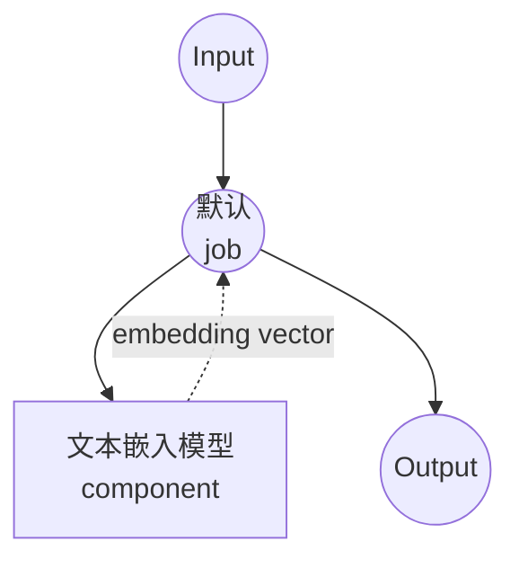

# 文本嵌入模型任务示例

本示例演示如何使用本地句子 transformer 模型生成文本嵌入，使用 model-compose 的内置文本嵌入任务，为相似性搜索和机器学习应用提供文本的语义向量表示。

## 概述

此工作流提供本地文本嵌入生成功能：

1. **本地嵌入模型**：使用 HuggingFace transformers 在本地运行句子 transformer 模型
2. **语义向量**：将文本转换为高维向量表示
3. **自动模型管理**：首次使用时自动下载和缓存模型
4. **无需外部 API**：完全离线的嵌入生成，无 API 依赖项

## 准备工作

### 先决条件

- 已安装 model-compose 并在 PATH 中可用
- 运行嵌入模型所需的充足系统资源（推荐：4GB+ RAM）
- 带有 sentence-transformers 和 torch 的 Python 环境（自动管理）

### 为什么选择本地文本嵌入

与基于云的嵌入 API 不同，本地模型执行提供：

**本地处理的优势：**
- **隐私**：所有文本处理在本地进行，不会将数据发送到外部服务
- **成本**：初始设置后无需按词元或 API 使用费用
- **离线**：模型下载后无需互联网连接即可工作
- **批量处理**：高效处理大型文本数据集
- **一致性**：相同的模型版本确保嵌入随时间保持一致
- **速度**：嵌入生成无网络延迟

**用例：**
- **语义搜索**：查找相似的文档或段落
- **聚类**：将相关文本分组在一起
- **分类**：使用嵌入作为机器学习模型的特征
- **推荐系统**：基于文本查找相似内容
- **重复检测**：识别相似或重复的文本

### 环境配置

1. 导航到此示例目录：
   ```bash
   cd examples/model-tasks/text-embedding
   ```

2. 无需额外的环境配置 - 模型和依赖项自动管理。

## 如何运行

1. **启动服务：**
   ```bash
   model-compose up
   ```

2. **运行工作流：**

   **使用 API：**
   ```bash
   curl -X POST http://localhost:8080/api/workflows/runs \
     -H "Content-Type: application/json" \
     -d '{"input": {"text": "Machine learning is transforming technology"}}'
   ```

   **使用 Web UI：**
   - 打开 Web UI：http://localhost:8081
   - 输入您的参数
   - 点击"Run Workflow"按钮

   **使用 CLI：**
   ```bash
   model-compose run text-embedding --input '{"text": "Machine learning is transforming technology"}'
   ```

## 组件详情

### 文本嵌入模型组件（默认）
- **类型**：具有文本嵌入任务的模型组件
- **用途**：生成文本的语义向量表示
- **模型**：sentence-transformers/all-MiniLM-L6-v2
- **任务**：text-embedding（基于 sentence-transformers）
- **功能**：
  - 自动模型下载和缓存
  - 快速高效的嵌入生成
  - 384 维输出向量
  - 多语言支持（主要是英语）
  - CPU 和 GPU 加速支持

### 模型信息：all-MiniLM-L6-v2
- **开发者**：Microsoft（通过 sentence-transformers）
- **架构**：MiniLM（迷你语言模型）
- **参数**：约 2300 万
- **输出维度**：384
- **最大序列长度**：256 词元
- **语言**：主要是英语，一些多语言能力
- **训练**：在 10 亿句子对上训练
- **性能**：速度、大小和质量的良好平衡
- **许可证**：Apache 2.0

## 工作流详情

### "生成文本嵌入"工作流（默认）

**描述**：使用句子 transformers 模型生成文本嵌入向量。

#### 作业流程

此示例使用简化的单组件配置，没有显式作业。



#### 输入参数

| 参数 | 类型 | 必需 | 默认值 | 描述 |
|-----------|------|----------|---------|-------------|
| `text` | text | 是 | - | 要转换为嵌入向量的输入文本 |

#### 输出格式

| 字段 | 类型 | 描述 |
|-------|------|-------------|
| `embedding` | json | 表示文本嵌入的 384 个浮点数数组 |

## 系统要求

### 最低要求
- **RAM**：4GB（推荐 8GB+）
- **磁盘空间**：2GB+ 用于模型存储和缓存
- **CPU**：多核处理器（推荐 2+ 核）
- **互联网**：仅用于初始模型下载

### 性能说明
- 首次运行需要下载模型（约 90MB）
- 模型加载需要 30-60 秒，具体取决于硬件
- 嵌入生成非常快（每个文本几毫秒）
- GPU 加速对单个嵌入的改进有限

## 自定义

### 使用不同的模型

替换为其他句子 transformer 模型：

```yaml
component:
  type: model
  task: text-embedding
  model: sentence-transformers/all-mpnet-base-v2    # 质量更高，速度较慢
  action:
    text: ${input.text}
  # 输出：768 维

# 或用于多语言支持：
# model: sentence-transformers/paraphrase-multilingual-MiniLM-L12-v2
```

### 批量处理

高效处理多个文本：

```yaml
component:
  type: model
  task: text-embedding
  model: sentence-transformers/all-MiniLM-L6-v2
  action:
    text: ${input.texts}  # 字符串数组
```

### 模型参数

微调模型行为：

```yaml
component:
  type: model
  task: text-embedding
  model: sentence-transformers/all-MiniLM-L6-v2
  action:
    text: ${input.text}
    params:
      device: auto        # 'cpu'、'cuda' 或 'auto'
      normalize: true     # 归一化输出向量
      convert_to_numpy: true
```

## 高级用法

### 文档相似性工作流
```yaml
workflows:
  - id: document-similarity
    jobs:
      - id: embed-query
        component: text-embedder
        input:
          text: ${input.query_text}
      - id: embed-documents
        component: text-embedder
        input:
          text: ${input.document_texts}  # 文档数组
      - id: calculate-similarity
        component: similarity-calculator
        input:
          query_embedding: ${jobs.embed-query.output.embedding}
          document_embeddings: ${jobs.embed-documents.output.embedding}
        depends_on: [embed-query, embed-documents]
```

### 语义搜索管道
```yaml
component:
  type: model
  task: text-embedding
  model: sentence-transformers/all-MiniLM-L6-v2
  action:
    text: ${input.search_queries}
    output: ${output as json}
```

## 模型比较

### 速度与质量权衡

| 模型 | 参数 | 维度 | 速度 | 质量 | 用例 |
|-------|------------|------------|--------|---------|----------|
| all-MiniLM-L6-v2 | 2300万 | 384 | 快速 | 良好 | 通用 |
| all-mpnet-base-v2 | 1.1亿 | 768 | 中等 | 高 | 需要高准确性 |
| all-distilroberta-v1 | 8200万 | 768 | 中等 | 高 | 平衡性能 |

### 多语言模型

| 模型 | 语言 | 维度 | 性能 |
|-------|-----------|------------|-------------|
| paraphrase-multilingual-MiniLM-L12-v2 | 50+ | 384 | 良好的多语言 |
| paraphrase-multilingual-mpnet-base-v2 | 50+ | 768 | 最佳多语言 |

## 故障排除

### 常见问题

1. **内存不足**：使用较小的模型或减少批量大小
2. **模型下载失败**：检查互联网连接和磁盘空间
3. **性能缓慢**：如果可用，启用 GPU 加速
4. **维度不匹配**：确保管道中使用一致的模型

### 性能优化

- **GPU 使用**：安装带有 CUDA 支持的 PyTorch 以进行 GPU 加速
- **批量处理**：一起处理多个文本以获得更好的吞吐量
- **模型缓存**：首次下载后缓存模型

## 集成示例

### 与向量数据库配合使用
```yaml
workflows:
  - id: store-embeddings
    jobs:
      - id: generate-embedding
        component: text-embedder
        input:
          text: ${input.document}
      - id: store-vector
        component: vector-store
        input:
          vector: ${jobs.generate-embedding.output.embedding}
          metadata: ${input.metadata}
        depends_on: [generate-embedding]
```

### 与机器学习管道配合使用
```yaml
workflows:
  - id: text-classification
    jobs:
      - id: embed-text
        component: text-embedder
        input:
          text: ${input.text}
      - id: classify
        component: classifier
        input:
          features: ${jobs.embed-text.output.embedding}
        depends_on: [embed-text]
```
