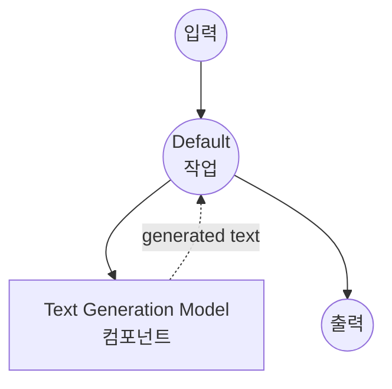

# Text Generation Model Task 예제

이 예제는 model-compose의 내장 모델 작업 기능과 HuggingFace transformers를 사용하여 로컬 언어 모델로 텍스트를 생성하는 방법을 보여줍니다.

## 개요

이 워크플로우는 다음과 같은 로컬 텍스트 생성을 제공합니다:

1. **로컬 모델 실행**: HuggingFace transformers를 사용하여 사전 학습된 언어 모델을 로컬에서 실행
2. **자동 모델 관리**: 첫 사용 시 모델을 자동으로 다운로드하고 캐시
3. **텍스트 생성**: 구성 가능한 매개변수로 입력 프롬프트를 기반으로 텍스트 생성
4. **외부 API 불필요**: API 의존성 없이 완전히 오프라인 텍스트 생성

## 준비사항

### 필수 요구사항

- model-compose가 설치되어 PATH에서 사용 가능
- SmolLM3-3B 모델 실행을 위한 충분한 시스템 리소스 (권장: 8GB+ RAM)
- transformers 및 torch가 있는 Python 환경 (자동 관리)

### 로컬 모델을 사용하는 이유

클라우드 기반 API와 달리 로컬 모델 실행은 다음을 제공합니다:

**로컬 처리의 이점:**
- **프라이버시**: 모든 텍스트 처리가 로컬에서 이루어지며 외부 서비스로 데이터 전송 없음
- **비용**: 초기 설정 후 토큰당 또는 API 사용 요금 없음
- **오프라인**: 모델 다운로드 후 인터넷 연결 없이 작동
- **지연시간**: 텍스트 생성에 네트워크 지연 없음
- **사용자 정의**: 모델 매개변수 및 동작에 대한 완전한 제어
- **재현성**: 동일한 매개변수로 실행 간 일관된 결과

**트레이드오프:**
- **하드웨어 요구사항**: 적절한 RAM 및 처리 능력 필요
- **설정 시간**: 초기 모델 다운로드 및 로딩 시간
- **모델 크기 제한**: 더 큰 모델은 사용 가능한 메모리에 맞지 않을 수 있음

### 환경 구성

1. 이 예제 디렉토리로 이동:
   ```bash
   cd examples/model-tasks/text-generation
   ```

2. 추가 환경 구성 불필요 - 모델 및 종속성이 자동으로 관리됩니다.

## 실행 방법

1. **서비스 시작:**
   ```bash
   model-compose up
   ```

2. **워크플로우 실행:**

   **API 사용:**
   ```bash
   curl -X POST http://localhost:8080/api/workflows/runs \
     -H "Content-Type: application/json" \
     -d '{"input": {"prompt": "Once upon a time in a distant galaxy"}}'
   ```

   **웹 UI 사용:**
   - 웹 UI 열기: http://localhost:8081
   - 프롬프트 입력
   - "Run Workflow" 버튼 클릭

   **CLI 사용:**
   ```bash
   model-compose run --input '{"prompt": "Once upon a time in a distant galaxy"}'
   ```

## 컴포넌트 세부사항

### Text Generation Model 컴포넌트 (기본)
- **유형**: text-generation 작업을 사용하는 Model 컴포넌트
- **목적**: 사전 학습된 언어 모델을 사용한 로컬 텍스트 생성
- **모델**: HuggingFaceTB/SmolLM3-3B (30억 매개변수 모델)
- **작업**: text-generation (HuggingFace transformers 작업)
- **기능**:
  - 자동 모델 다운로드 및 캐싱
  - 구성 가능한 생성 매개변수
  - 대형 컨텍스트 윈도우 지원 (32,768 토큰)
  - CPU 및 GPU 가속 지원
  - 메모리 효율적인 모델 로딩

### 모델 정보: SmolLM3-3B
- **개발자**: HuggingFace (HuggingFaceTB 팀)
- **매개변수**: 30억
- **유형**: 효율성에 최적화된 인과 언어 모델
- **컨텍스트 길이**: 최대 32,768 토큰
- **언어**: 주로 영어, 일부 다국어 기능
- **특기**: 일반 텍스트 생성, 지시 따르기, 코딩 작업
- **라이센스**: Apache 2.0

## 워크플로우 세부사항

### "Generate Text from Prompt" 워크플로우 (기본)

**설명**: 사전 학습된 언어 모델을 사용하여 주어진 프롬프트를 기반으로 텍스트를 생성합니다.

#### 작업 흐름

이 예제는 명시적인 작업 없이 단순화된 단일 컴포넌트 구성을 사용합니다.



#### 입력 매개변수

| 매개변수 | 유형 | 필수 | 기본값 | 설명 |
|---------|------|------|--------|------|
| `prompt` | text | 예 | - | 텍스트 생성을 위한 초기 텍스트 프롬프트 |

#### 출력 형식

| 필드 | 유형 | 설명 |
|-----|------|------|
| `generated` | text | 원본 프롬프트를 포함한 완전한 생성된 텍스트 |

## 시스템 요구사항

### 최소 요구사항
- **RAM**: 8GB (권장 16GB+)
- **디스크 공간**: 모델 저장 및 캐시를 위한 10GB+
- **CPU**: 멀티코어 프로세서 (4+ 코어 권장)
- **인터넷**: 초기 모델 다운로드에만 필요

### 성능 참고사항
- 첫 실행 시 모델 다운로드 필요 (수 GB)
- 모델 로딩은 하드웨어에 따라 1-2분 소요
- GPU 가속으로 생성 속도가 크게 향상됨
- 생성 속도는 프롬프트 길이 및 출력 요구사항에 따라 다름

## 모델 매개변수

모델 컴포넌트는 다양한 생성 매개변수를 지원합니다:

### 현재 구성
- **max_output_length**: 32,768 토큰 (최대 컨텍스트 윈도우)

### 추가 매개변수 (사용자 정의 가능)
```yaml
params:
  max_output_length: 32768
  temperature: 0.7          # 무작위성 제어 (0.0-1.0)
  top_p: 0.9               # Nucleus 샘플링 매개변수
  top_k: 50                # Top-k 샘플링 매개변수
  repetition_penalty: 1.1   # 반복적인 텍스트 방지
  do_sample: true          # 탐욕적 디코딩 vs 샘플링 활성화
```

## 문제 해결

### 일반적인 문제

1. **메모리 부족**: max_output_length 줄이거나 시스템 RAM 업그레이드
2. **모델 다운로드 실패**: 인터넷 연결 및 디스크 공간 확인
3. **느린 생성**: GPU 가속 또는 더 작은 모델 고려
4. **임포트 오류**: transformers 및 torch가 올바르게 설치되었는지 확인

### 성능 최적화

- **GPU 사용**: GPU 가속을 위해 CUDA 호환 PyTorch 설치
- **메모리 관리**: RAM을 확보하기 위해 다른 애플리케이션 종료
- **모델 선택**: 제한된 하드웨어의 경우 더 작은 모델 (1B 매개변수) 고려

## 사용자 정의

### 다른 모델 사용

다른 HuggingFace text-generation 모델로 교체:

```yaml
component:
  type: model
  task: text-generation
  model: microsoft/DialoGPT-small    # 더 작은 대화형 모델
  # 또는
  model: EleutherAI/gpt-neo-1.3B     # 대안 1.3B 매개변수 모델
```

### 생성 매개변수 조정

텍스트 생성 동작 미세 조정:

```yaml
component:
  type: model
  task: text-generation
  model: HuggingFaceTB/SmolLM3-3B
  action:
    text: ${input.prompt as text}
    params:
      max_output_length: 1024
      temperature: ${input.temperature as number | 0.7}
      top_p: ${input.top_p as number | 0.9}
      do_sample: true
```

### 입력 템플릿

특정 사용 사례를 위한 프롬프트 템플릿 추가:

```yaml
component:
  type: model
  task: text-generation
  model: HuggingFaceTB/SmolLM3-3B
  action:
    text: |
      ### Instruction:
      ${input.instruction}

      ### Response:
    params:
      max_output_length: 2048
```

## API 기반 솔루션과 비교

| 기능 | 로컬 모델 | 클라우드 API |
|-----|---------|------------|
| 프라이버시 | 완전한 프라이버시 | 프로바이더로 데이터 전송 |
| 비용 | 하드웨어 비용만 | 토큰당/요청당 가격 |
| 지연시간 | 하드웨어 의존적 | 네트워크 + API 지연 |
| 가용성 | 오프라인 가능 | 인터넷 필요 |
| 모델 제어 | 완전한 매개변수 제어 | 제한된 구성 |
| 확장성 | 하드웨어 제한 | 탄력적 확장 |
| 설정 복잡도 | 모델 다운로드 필요 | API 키만 |
| 사용자 정의 | 높음 (미세 조정 가능) | API 매개변수만 |

## 고급 사용

### 배치 처리
```yaml
workflow:
  title: Batch Text Generation
  jobs:
    - id: generate-multiple
      component: text-generator
      repeat_count: ${input.batch_size}
      input:
        prompt: ${input.prompts[${index}]}
```

### 템플릿 기반 생성
```yaml
component:
  type: model
  task: text-generation
  model: HuggingFaceTB/SmolLM3-3B
  action:
    text: ${input.template | "Generate text about: ${input.topic}"}
```

## 모델 변형

다양한 사용 사례를 위한 다른 권장 모델:

### 더 작은 모델 (낮은 요구사항)
- `HuggingFaceTB/SmolLM3-1.7B` - 1.7B 매개변수, 빠른 추론
- `microsoft/DialoGPT-small` - 대화 전문

### 더 큰 모델 (높은 품질)
- `microsoft/DialoGPT-large` - 더 나은 품질, 더 높은 메모리 요구사항
- `EleutherAI/gpt-neo-2.7B` - 2.7B 매개변수, 우수한 일반 성능

### 특화된 모델
- `Salesforce/codegen-350M-mono` - 코드 생성 중심
- `facebook/blenderbot-400M-distill` - 대화형 AI
