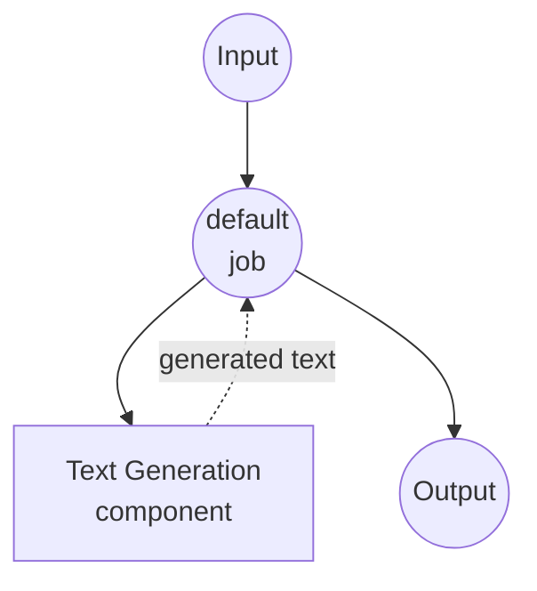

# Text Generation Model Task Example

This example demonstrates how to use local language models for text generation using model-compose's built-in model task functionality with HuggingFace transformers.

## Overview

This workflow provides local text generation that:

1. **Local Model Execution**: Runs a pretrained language model locally using HuggingFace transformers
2. **Automatic Model Management**: Downloads and caches models automatically on first use
3. **Text Continuation**: Generates text based on input prompts with configurable parameters
4. **No External APIs**: Completely offline text generation without API dependencies

## Preparation

### Prerequisites

- model-compose installed and available in your PATH
- Sufficient system resources for running SmolLM3-3B model (recommended: 8GB+ RAM)
- Python environment with transformers and torch (automatically managed)

### Why Local Models

Unlike cloud-based APIs, local model execution provides:

**Benefits of Local Processing:**
- **Privacy**: All text processing happens locally, no data sent to external services
- **Cost**: No per-token or API usage fees after initial setup
- **Offline**: Works without internet connection after model download
- **Latency**: No network latency for text generation
- **Customization**: Full control over model parameters and behavior
- **Reproducibility**: Consistent results across runs with same parameters

**Trade-offs:**
- **Hardware Requirements**: Requires adequate RAM and processing power
- **Setup Time**: Initial model download and loading time
- **Model Size Limitations**: Larger models may not fit in available memory

### Environment Configuration

1. Navigate to this example directory:
   ```bash
   cd examples/model-tasks/text-generation
   ```

2. No additional environment configuration required - model and dependencies are managed automatically.

## How to Run

1. **Start the service:**
   ```bash
   model-compose up
   ```

2. **Run the workflow:**

   **Using API:**
   ```bash
   curl -X POST http://localhost:8080/api/workflows/__default__/runs \
     -H "Content-Type: application/json" \
     -d '{"input": {"prompt": "Once upon a time in a distant galaxy"}}'
   ```

   **Using Web UI:**
   - Open the Web UI: http://localhost:8081
   - Enter your prompt
   - Click the "Run Workflow" button

   **Using CLI:**
   ```bash
   model-compose run --input '{"prompt": "Once upon a time in a distant galaxy"}'
   ```

## Component Details

### Text Generation Model Component
- **Type**: Model component with text-generation task
- **Purpose**: Local text generation using pretrained language model
- **Model**: HuggingFaceTB/SmolLM3-3B (3 billion parameter model)
- **Task**: text-generation (HuggingFace transformers task)
- **Features**:
  - Automatic model downloading and caching
  - Configurable generation parameters
  - Large context window support (32,768 tokens)
  - CPU and GPU acceleration support
  - Memory-efficient model loading

### Model Information: SmolLM3-3B
- **Developer**: HuggingFace (HuggingFaceTB team)
- **Parameters**: 3 billion
- **Type**: Causal language model optimized for efficiency
- **Context Length**: Up to 32,768 tokens
- **Languages**: Primarily English, with some multilingual capabilities
- **Specialties**: General text generation, instruction following, coding tasks
- **License**: Apache 2.0

## Workflow Details

### "Generate Text from Prompt" Workflow (Default)

**Description**: Generate text based on a given prompt using a pretrained language model.

#### Job Flow

This example uses a simplified single-component configuration without explicit jobs.



#### Input Parameters

| Parameter | Type | Required | Default | Description |
|-----------|------|----------|---------|-------------|
| `prompt` | text | Yes | - | The initial text prompt for text generation |

#### Output Format

| Field | Type | Description |
|-------|------|-------------|
| `generated` | text | The complete generated text including the original prompt |

## System Requirements

### Minimum Requirements
- **RAM**: 8GB (recommended 16GB+)
- **Disk Space**: 10GB+ for model storage and cache
- **CPU**: Multi-core processor (4+ cores recommended)
- **Internet**: Required for initial model download only

### Performance Notes
- First run requires model download (several GB)
- Model loading takes 1-2 minutes depending on hardware
- GPU acceleration significantly improves generation speed
- Generation speed varies with prompt length and output requirements

## Model Parameters

The model component supports various generation parameters:

### Current Configuration
- **max_output_length**: 32,768 tokens (maximum context window)

### Additional Parameters (Customizable)
```yaml
params:
  max_output_length: 32768
  temperature: 0.7          # Controls randomness (0.0-1.0)
  top_p: 0.9               # Nucleus sampling parameter
  top_k: 50                # Top-k sampling parameter
  repetition_penalty: 1.1   # Prevents repetitive text
  do_sample: true          # Enable sampling vs greedy decoding
```

## Troubleshooting

### Common Issues

1. **Out of Memory**: Reduce max_output_length or upgrade system RAM
2. **Model Download Fails**: Check internet connection and disk space
3. **Slow Generation**: Consider GPU acceleration or smaller model
4. **Import Errors**: Ensure transformers and torch are properly installed

### Performance Optimization

- **GPU Usage**: Install CUDA-compatible PyTorch for GPU acceleration
- **Memory Management**: Close other applications to free up RAM
- **Model Selection**: Consider smaller models (1B parameters) for limited hardware

## Customization

### Using Different Models

Replace the model with other HuggingFace text-generation models:

```yaml
component:
  type: model
  task: text-generation
  model: microsoft/DialoGPT-small    # Smaller conversational model
  # or
  model: EleutherAI/gpt-neo-1.3B     # Alternative 1.3B parameter model
```

### Adjusting Generation Parameters

Fine-tune text generation behavior:

```yaml
component:
  type: model
  task: text-generation
  model: HuggingFaceTB/SmolLM3-3B
  text: ${input.prompt as text}
  params:
    max_output_length: 1024
    temperature: ${input.temperature as number | 0.7}
    top_p: ${input.top_p as number | 0.9}
    do_sample: true
```

### Input Templating

Add prompt templates for specific use cases:

```yaml
component:
  type: model
  task: text-generation
  model: HuggingFaceTB/SmolLM3-3B
  text: |
    ### Instruction:
    ${input.instruction}

    ### Response:
  params:
    max_output_length: 2048
```

## Comparison with API-based Solutions

| Feature | Local Model | Cloud API |
|---------|------------|-----------|
| Privacy | Complete privacy | Data sent to provider |
| Cost | Hardware cost only | Per-token/request pricing |
| Latency | Hardware dependent | Network + API latency |
| Availability | Offline capable | Internet required |
| Model Control | Full parameter control | Limited configuration |
| Scalability | Hardware limited | Elastic scaling |
| Setup Complexity | Model download required | API key only |
| Customization | High (fine-tuning possible) | API parameters only |

## Advanced Usage

### Batch Processing
```yaml
workflow:
  title: Batch Text Generation
  jobs:
    - id: generate-multiple
      component: text-generator
      repeat_count: ${input.batch_size}
      input:
        prompt: ${input.prompts[${index}]}
```

### Template-Based Generation
```yaml
component:
  type: model
  task: text-generation
  model: HuggingFaceTB/SmolLM3-3B
  text: ${input.template | "Generate text about: ${input.topic}"}
```

## Model Variants

Other recommended models for different use cases:

### Smaller Models (Lower Requirements)
- `HuggingFaceTB/SmolLM3-1.7B` - 1.7B parameters, faster inference
- `microsoft/DialoGPT-small` - Specialized for conversations

### Larger Models (Higher Quality)
- `microsoft/DialoGPT-large` - Better quality, higher memory requirements
- `EleutherAI/gpt-neo-2.7B` - 2.7B parameters, good general performance

### Specialized Models
- `Salesforce/codegen-350M-mono` - Code generation focus
- `facebook/blenderbot-400M-distill` - Conversational AI