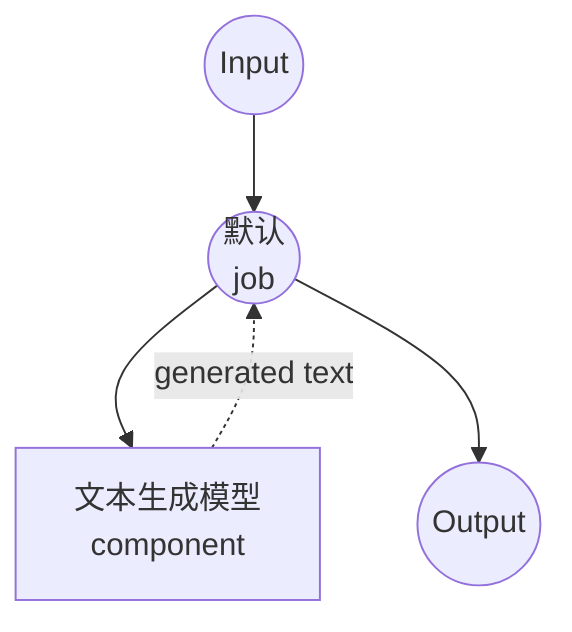

# 文本生成模型任务示例

本示例演示如何使用本地语言模型进行文本生成，使用 model-compose 的内置模型任务功能与 HuggingFace transformers。

## 概述

此工作流提供本地文本生成功能：

1. **本地模型执行**：使用 HuggingFace transformers 在本地运行预训练语言模型
2. **自动模型管理**：首次使用时自动下载和缓存模型
3. **文本续写**：基于输入提示生成文本，具有可配置参数
4. **无需外部 API**：完全离线的文本生成，无 API 依赖项

## 准备工作

### 先决条件

- 已安装 model-compose 并在 PATH 中可用
- 运行 SmolLM3-3B 模型所需的充足系统资源（推荐：8GB+ RAM）
- 带有 transformers 和 torch 的 Python 环境（自动管理）

### 为什么选择本地模型

与基于云的 API 不同，本地模型执行提供：

**本地处理的优势：**
- **隐私**：所有文本处理在本地进行，不会将数据发送到外部服务
- **成本**：初始设置后无需按词元或 API 使用费用
- **离线**：模型下载后无需互联网连接即可工作
- **延迟**：文本生成无网络延迟
- **自定义**：完全控制模型参数和行为
- **可重现性**：使用相同参数跨运行获得一致结果

**权衡：**
- **硬件要求**：需要足够的 RAM 和处理能力
- **设置时间**：初始模型下载和加载时间
- **模型大小限制**：较大的模型可能无法适应可用内存

### 环境配置

1. 导航到此示例目录：
   ```bash
   cd examples/model-tasks/text-generation
   ```

2. 无需额外的环境配置 - 模型和依赖项自动管理。

## 如何运行

1. **启动服务：**
   ```bash
   model-compose up
   ```

2. **运行工作流：**

   **使用 API：**
   ```bash
   curl -X POST http://localhost:8080/api/workflows/runs \
     -H "Content-Type: application/json" \
     -d '{"input": {"prompt": "Once upon a time in a distant galaxy"}}'
   ```

   **使用 Web UI：**
   - 打开 Web UI：http://localhost:8081
   - 输入您的提示
   - 点击"Run Workflow"按钮

   **使用 CLI：**
   ```bash
   model-compose run --input '{"prompt": "Once upon a time in a distant galaxy"}'
   ```

## 组件详情

### 文本生成模型组件（默认）
- **类型**：具有文本生成任务的模型组件
- **用途**：使用预训练语言模型进行本地文本生成
- **模型**：HuggingFaceTB/SmolLM3-3B（30 亿参数模型）
- **任务**：text-generation（HuggingFace transformers 任务）
- **功能**：
  - 自动模型下载和缓存
  - 可配置的生成参数
  - 大上下文窗口支持（32,768 词元）
  - CPU 和 GPU 加速支持
  - 内存高效的模型加载

### 模型信息：SmolLM3-3B
- **开发者**：HuggingFace（HuggingFaceTB 团队）
- **参数**：30 亿
- **类型**：针对效率优化的因果语言模型
- **上下文长度**：最多 32,768 词元
- **语言**：主要是英语，具有一些多语言能力
- **专长**：通用文本生成、指令遵循、编码任务
- **许可证**：Apache 2.0

## 工作流详情

### "从提示生成文本"工作流（默认）

**描述**：基于给定提示使用预训练语言模型生成文本。

#### 作业流程

此示例使用简化的单组件配置，没有显式作业。



#### 输入参数

| 参数 | 类型 | 必需 | 默认值 | 描述 |
|-----------|------|----------|---------|-------------|
| `prompt` | text | 是 | - | 文本生成的初始文本提示 |

#### 输出格式

| 字段 | 类型 | 描述 |
|-------|------|-------------|
| `generated` | text | 包括原始提示的完整生成文本 |

## 系统要求

### 最低要求
- **RAM**：8GB（推荐 16GB+）
- **磁盘空间**：10GB+ 用于模型存储和缓存
- **CPU**：多核处理器（推荐 4+ 核）
- **互联网**：仅用于初始模型下载

### 性能说明
- 首次运行需要下载模型（数 GB）
- 模型加载需要 1-2 分钟，具体取决于硬件
- GPU 加速可显著提高生成速度
- 生成速度随提示长度和输出要求而变化

## 模型参数

模型组件支持各种生成参数：

### 当前配置
- **max_output_length**：32,768 词元（最大上下文窗口）

### 其他参数（可自定义）
```yaml
params:
  max_output_length: 32768
  temperature: 0.7          # 控制随机性（0.0-1.0）
  top_p: 0.9               # 核采样参数
  top_k: 50                # Top-k 采样参数
  repetition_penalty: 1.1   # 防止重复文本
  do_sample: true          # 启用采样与贪婪解码
```

## 故障排除

### 常见问题

1. **内存不足**：减少 max_output_length 或升级系统 RAM
2. **模型下载失败**：检查互联网连接和磁盘空间
3. **生成缓慢**：考虑 GPU 加速或较小的模型
4. **导入错误**：确保正确安装 transformers 和 torch

### 性能优化

- **GPU 使用**：安装与 CUDA 兼容的 PyTorch 以进行 GPU 加速
- **内存管理**：关闭其他应用程序以释放 RAM
- **模型选择**：对于有限的硬件，考虑较小的模型（10 亿参数）

## 自定义

### 使用不同的模型

替换为其他 HuggingFace 文本生成模型：

```yaml
component:
  type: model
  task: text-generation
  model: microsoft/DialoGPT-small    # 更小的对话模型
  # 或
  model: EleutherAI/gpt-neo-1.3B     # 替代 13 亿参数模型
```

### 调整生成参数

微调文本生成行为：

```yaml
component:
  type: model
  task: text-generation
  model: HuggingFaceTB/SmolLM3-3B
  action:
    text: ${input.prompt as text}
    params:
      max_output_length: 1024
      temperature: ${input.temperature as number | 0.7}
      top_p: ${input.top_p as number | 0.9}
      do_sample: true
```

### 输入模板化

为特定用例添加提示模板：

```yaml
component:
  type: model
  task: text-generation
  model: HuggingFaceTB/SmolLM3-3B
  action:
    text: |
      ### Instruction:
      ${input.instruction}

      ### Response:
    params:
      max_output_length: 2048
```

## 与基于 API 的解决方案的比较

| 功能 | 本地模型 | 云 API |
|---------|------------|-----------|
| 隐私 | 完全隐私 | 数据发送到提供商 |
| 成本 | 仅硬件成本 | 按词元/请求定价 |
| 延迟 | 取决于硬件 | 网络 + API 延迟 |
| 可用性 | 可离线 | 需要互联网 |
| 模型控制 | 完全参数控制 | 有限配置 |
| 可扩展性 | 硬件受限 | 弹性扩展 |
| 设置复杂性 | 需要模型下载 | 仅需 API 密钥 |
| 自定义 | 高（可微调）| 仅 API 参数 |

## 高级用法

### 批量处理
```yaml
workflow:
  title: Batch Text Generation
  jobs:
    - id: generate-multiple
      component: text-generator
      repeat_count: ${input.batch_size}
      input:
        prompt: ${input.prompts[${index}]}
```

### 基于模板的生成
```yaml
component:
  type: model
  task: text-generation
  model: HuggingFaceTB/SmolLM3-3B
  action:
    text: ${input.template | "Generate text about: ${input.topic}"}
```

## 模型变体

其他推荐用于不同用例的模型：

### 较小的模型（较低要求）
- `HuggingFaceTB/SmolLM3-1.7B` - 17 亿参数，更快的推理
- `microsoft/DialoGPT-small` - 专门用于对话

### 较大的模型（更高质量）
- `microsoft/DialoGPT-large` - 更好的质量，更高的内存要求
- `EleutherAI/gpt-neo-2.7B` - 27 亿参数，良好的通用性能

### 专业模型
- `Salesforce/codegen-350M-mono` - 专注于代码生成
- `facebook/blenderbot-400M-distill` - 对话式 AI
