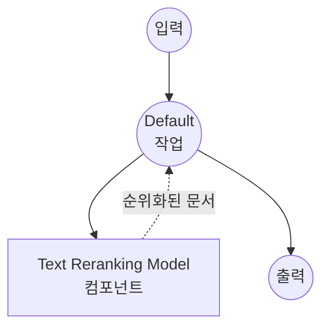

# Text Reranking Model Task 예제

이 예제는 model-compose의 내장 `text-reranking` 작업과 HuggingFace transformers를 사용하여 로컬 크로스 인코더 모델로 쿼리에 대한 후보 문서 목록을 재순위화하는 방법을 보여주며, RAG 파이프라인에 적합한 오프라인 검색 정제 기능을 제공합니다.

## 개요

이 워크플로우는 다음과 같은 로컬 텍스트 재순위화를 제공합니다:

1. **로컬 리랭커 모델**: BAAI의 `bge-reranker-v2-m3` 크로스 인코더를 로컬에서 실행
2. **쿼리-문서 점수화**: 바이 인코더와 달리 각 (쿼리, 문서) 쌍을 결합하여 점수화
3. **Top-K 선택**: 점수 기준으로 정렬된 가장 관련성 높은 Top-K 문서 반환
4. **다국어 지원**: 영어, 중국어, 한국어, 일본어를 포함한 많은 언어에서 동작
5. **외부 API 불필요**: 완전한 오프라인 재순위화, 프라이빗 RAG 파이프라인에 이상적
6. **자동 모델 관리**: 첫 사용 시 모델을 자동으로 다운로드하고 캐시

## 준비사항

### 필수 요구사항

- model-compose가 설치되어 PATH에서 사용 가능
- 크로스 인코더를 위한 충분한 시스템 리소스 (권장: 8GB+ RAM, GPU 선택)
- `transformers` 및 `torch`가 있는 Python 환경 (자동 관리)

### 재순위화가 필요한 이유

1단계 검색기(BM25 또는 바이 인코더 임베딩)는 빠르지만 정밀도가 낮습니다. 크로스 인코더 리랭커는 쿼리와 각 후보 문서를 함께 읽어 훨씬 더 정확한 관련성 점수를 생성합니다. 일반적인 사용:

1. 빠른 바이 인코더 / BM25로 상위 100개 후보 검색
2. 그 100개를 크로스 인코더로 재순위화하여 실제 상위 5개 또는 10개 도출
3. 재순위화된 컨텍스트를 LLM에 투입

**로컬 재순위화의 이점:**
- **프라이버시**: 쿼리와 문서가 인프라를 떠나지 않음
- **비용**: 초기 모델 다운로드 후 요청당 가격 없음
- **지연시간**: 네트워크 왕복 없음; 로컬 GPU/CPU 추론만 사용
- **결정론적**: 동일한 쿼리 + 문서는 항상 동일한 점수를 생성

**트레이드오프:**
- **연산량**: 크로스 인코더는 쌍당 바이 인코더보다 느림 — 전체 코퍼스가 아닌 상위 N개만 재순위화
- **하드웨어**: 큰 N 또는 낮은 지연 시나리오에는 GPU 권장

### 환경 구성

1. 이 예제 디렉토리로 이동:
   ```bash
   cd examples/model-tasks/text-reranking
   ```

2. 추가 환경 구성 불필요 — 첫 실행 시 모델이 자동으로 다운로드 및 캐시됩니다.

## 실행 방법

1. **서비스 시작:**
   ```bash
   model-compose up
   ```

2. **워크플로우 실행:**

   **API 사용:**
   ```bash
   curl -X POST http://localhost:8080/api/workflows/runs \
     -H "Content-Type: application/json" \
     -d '{
       "input": {
         "query": "What is the capital of France?",
         "documents": [
           "Paris is the capital and most populous city of France.",
           "Berlin is the capital of Germany.",
           "The Eiffel Tower is located in Paris.",
           "Tokyo is the capital of Japan."
         ],
         "top_k": 2
       }
     }'
   ```

   **Web UI 사용:**
   - Web UI 열기: http://localhost:8081
   - 쿼리, 후보 문서, `top_k` 입력
   - "Run Workflow" 버튼 클릭

   **CLI 사용:**
   ```bash
   model-compose run --input '{
     "query": "What is the capital of France?",
     "documents": [
       "Paris is the capital and most populous city of France.",
       "Berlin is the capital of Germany.",
       "The Eiffel Tower is located in Paris.",
       "Tokyo is the capital of Japan."
     ],
     "top_k": 2
   }'
   ```

## 컴포넌트 세부사항

### Text Reranking Model 컴포넌트 (기본)
- **유형**: `text-reranking` 작업을 사용하는 Model 컴포넌트
- **드라이버**: `huggingface`
- **모델**: `BAAI/bge-reranker-v2-m3`
- **기능**:
  - (쿼리, 문서) 쌍의 크로스 인코더 결합 점수화
  - 다국어 지원 (100개 이상 언어)
  - 점수 내림차순 정렬로 Top-K 필터링
  - GPU 메모리 제한을 위해 순차 실행 (`max_concurrent_count: 1`)

### 모델 정보: BGE Reranker v2 M3
- **개발자**: BAAI (Beijing Academy of Artificial Intelligence)
- **베이스**: XLM-RoBERTa 다국어 백본
- **아키텍처**: 크로스 인코더
- **최대 입력 길이**: 8192 토큰 (긴 컨텍스트 지원)
- **언어**: 100개 이상
- **라이센스**: MIT

## 워크플로우 세부사항

### "Rerank Documents" 워크플로우 (기본)

**설명**: 크로스 인코더 모델을 사용하여 쿼리에 대해 후보 문서 목록을 재순위화합니다.

#### 작업 흐름

이 예제는 명시적인 작업 없이 단순화된 단일 컴포넌트 구성을 사용합니다.



#### 입력 매개변수

| 매개변수 | 유형 | 필수 | 기본값 | 설명 |
|---------|------|------|--------|------|
| `query` | text | 예 | - | 문서 점수화 기준이 되는 쿼리 텍스트 |
| `documents` | text[] | 예 | - | 재순위화할 후보 문서 리스트 |
| `top_k` | integer | 아니오 | 5 | 반환할 상위 점수 문서 수 |

#### 출력 형식

| 필드 | 유형 | 설명 |
|-----|------|------|
| `ranked` | object[] | 관련성 점수 내림차순으로 정렬된 Top-K 문서 |

`ranked`의 각 요소에는 일반적으로 문서 텍스트, 원본 인덱스, 관련성 점수가 포함됩니다.

## 시스템 요구사항

### 최소 요구사항
- **RAM**: 8GB (권장 16GB+)
- **VRAM**: 선택; 대규모 배치의 경우 4GB+ GPU가 크게 속도 향상
- **디스크 공간**: 모델용 약 2.5GB
- **CPU**: 멀티코어 프로세서 (4+ 코어 권장)
- **인터넷**: 일회성 모델 다운로드에만 필요

### 성능 참고사항
- 첫 실행 시 모델 다운로드 (~2.3GB)
- CPU 추론은 문서 수에 따라 선형적으로 확장
- GPU 추론은 모든 (쿼리, 문서) 쌍을 효율적으로 배치 처리
- 8192 토큰 컨텍스트로 사전 청킹 없이 긴 구절 재순위화 가능

## 사용자 정의

### 다른 리랭커 사용

HuggingFace에서 다른 크로스 인코더로 교체:

```yaml
component:
  type: model
  task: text-reranking
  driver: huggingface
  model: BAAI/bge-reranker-base       # 더 작고 빠름
  # 또는
  model: BAAI/bge-reranker-large      # 더 높은 정확도
  # 또는
  model: cross-encoder/ms-marco-MiniLM-L-6-v2   # 경량 영어 전용
```

### 검색기와 체이닝

일반적인 RAG 패턴: 광범위 검색 후 재순위화:

```yaml
workflow:
  jobs:
    - id: retrieve
      component: vector-store
      input:
        query: ${input.query}
        top_k: 100
    - id: rerank
      component: text-reranker
      input:
        query: ${input.query}
        documents: ${retrieve.documents}
        top_k: 10
    - id: generate
      component: llm
      input:
        prompt: |
          Context:
          ${rerank.ranked}

          Question: ${input.query}
```

### Top-K 조정

`top_k`를 변경하여 더 많거나 적은 결과 반환:

```bash
model-compose run --input '{
  "query": "...",
  "documents": ["...", "..."],
  "top_k": 10
}'
```

## 문제 해결

### 일반적인 문제

1. **메모리 부족**: `bge-reranker-base` 사용, 호출당 문서 수 감소, 또는 컨텍스트 길이 축소
2. **모델 다운로드 실패**: 인터넷 연결 및 디스크 공간 확인
3. **느린 추론**: `device: cuda:0`으로 GPU 활성화; GPU에서 배치 재순위화가 훨씬 효율적
4. **문서가 너무 김**: `bge-reranker-v2-m3`는 (쿼리 + 문서) 쌍당 최대 8192 토큰 허용; 더 긴 입력은 잘라내기

### 성능 최적화

- **GPU**: 훨씬 빠른 추론을 위해 `device: cuda:0` (또는 Apple Silicon은 `mps`) 설정
- **배치 크기**: huggingface 드라이버는 자동으로 배치 처리; N번의 호출보다 한 번의 호출에 문서 유지
- **모델 크기**: 지연에 민감한 사용 사례에는 `bge-reranker-base`, 최고 품질에는 `v2-m3` 사용
- **사전 필터링**: 전체 코퍼스가 아닌 검색기의 상위 100개만 재순위화

## 바이 인코더 임베딩과의 비교

| 기능 | 크로스 인코더 리랭커 | 바이 인코더 임베딩 |
|-----|-----------------|-----------------|
| 점수화 | 결합 (쿼리 + 문서) | 독립 (내적) |
| 정확도 | 높음 | 낮음 |
| 쌍당 지연시간 | 높음 | 매우 낮음 |
| 코퍼스 크기 확장성 | 아니오 (상위 N개만 재순위화) | 예 (근사 최근접 이웃) |
| 일반적 사용 | 두 번째 단계 | 첫 번째 단계 |

## 모델 변형

- **BAAI/bge-reranker-base**: 2억 7,800만 매개변수, 더 빠름, 영어 중심
- **BAAI/bge-reranker-large**: 5억 6,000만 매개변수, 더 높은 정확도
- **BAAI/bge-reranker-v2-m3**: 5억 6,800만 매개변수, 다국어, 8k 컨텍스트 (기본값)
- **cross-encoder/ms-marco-MiniLM-L-6-v2**: 2,200만 매개변수, 초경량, 영어 전용
