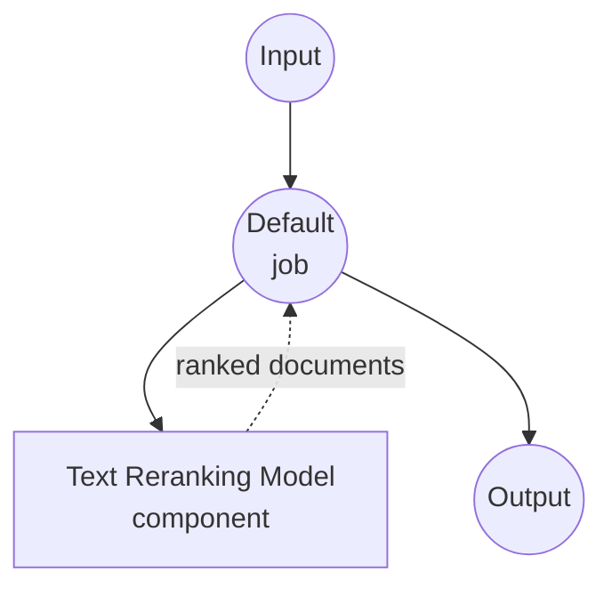

# Text Reranking Model Task Example

This example demonstrates how to rerank a list of candidate documents against a query using a local cross-encoder model via model-compose's built-in `text-reranking` task with HuggingFace transformers, providing offline retrieval refinement suitable for RAG pipelines.

## Overview

This workflow provides local text reranking that:

1. **Local Reranker Model**: Runs BAAI's `bge-reranker-v2-m3` cross-encoder locally
2. **Query-Document Scoring**: Scores each (query, document) pair jointly, unlike a bi-encoder
3. **Top-K Selection**: Returns the top-K most relevant documents sorted by score
4. **Multilingual**: Works across many languages, including English, Chinese, Korean, and Japanese
5. **No External APIs**: Fully offline reranking, ideal for private RAG pipelines
6. **Automatic Model Management**: Downloads and caches the model on first use

## Preparation

### Prerequisites

- model-compose installed and available in your PATH
- Sufficient system resources for a cross-encoder (recommended: 8GB+ RAM, GPU optional)
- Python environment with `transformers` and `torch` (managed automatically)

### Why Rerank

A first-stage retriever (BM25 or bi-encoder embeddings) is fast but coarse. A cross-encoder reranker reads the query and each candidate document together, producing a much more precise relevance score. Typical usage:

1. Retrieve top-100 candidates with a fast bi-encoder / BM25
2. Rerank those 100 with a cross-encoder to get the true top-5 or top-10
3. Feed the reranked context into an LLM

**Benefits of Local Reranking:**
- **Privacy**: Queries and documents never leave your infrastructure
- **Cost**: No per-request pricing after the initial model download
- **Latency**: No network round-trip; only local GPU/CPU inference
- **Determinism**: Same query + documents always produce the same scores

**Trade-offs:**
- **Compute**: Cross-encoders are slower per pair than bi-encoders — rerank only the top-N, not the whole corpus
- **Hardware**: A GPU is recommended for large N or low-latency scenarios

### Environment Configuration

1. Navigate to this example directory:
   ```bash
   cd examples/model-tasks/text-reranking
   ```

2. No additional environment configuration required — the model is downloaded and cached automatically on first run.

## How to Run

1. **Start the service:**
   ```bash
   model-compose up
   ```

2. **Run the workflow:**

   **Using API:**
   ```bash
   curl -X POST http://localhost:8080/api/workflows/runs \
     -H "Content-Type: application/json" \
     -d '{
       "input": {
         "query": "What is the capital of France?",
         "documents": [
           "Paris is the capital and most populous city of France.",
           "Berlin is the capital of Germany.",
           "The Eiffel Tower is located in Paris.",
           "Tokyo is the capital of Japan."
         ],
         "top_k": 2
       }
     }'
   ```

   **Using Web UI:**
   - Open the Web UI: http://localhost:8081
   - Enter your query, the candidate documents, and `top_k`
   - Click the "Run Workflow" button

   **Using CLI:**
   ```bash
   model-compose run --input '{
     "query": "What is the capital of France?",
     "documents": [
       "Paris is the capital and most populous city of France.",
       "Berlin is the capital of Germany.",
       "The Eiffel Tower is located in Paris.",
       "Tokyo is the capital of Japan."
     ],
     "top_k": 2
   }'
   ```

## Component Details

### Text Reranking Model Component (Default)
- **Type**: Model component with `text-reranking` task
- **Driver**: `huggingface`
- **Model**: `BAAI/bge-reranker-v2-m3`
- **Features**:
  - Cross-encoder joint scoring of (query, document) pairs
  - Multilingual support (100+ languages)
  - Top-K filtering with score-descending order
  - Serial execution (`max_concurrent_count: 1`) to keep GPU memory bounded

### Model Information: BGE Reranker v2 M3
- **Developer**: BAAI (Beijing Academy of Artificial Intelligence)
- **Base**: XLM-RoBERTa multilingual backbone
- **Architecture**: Cross-encoder
- **Max Input Length**: 8192 tokens (long-context capable)
- **Languages**: 100+ languages
- **License**: MIT

## Workflow Details

### "Rerank Documents" Workflow (Default)

**Description**: Rerank a list of candidate documents against a query using a cross-encoder model.

#### Job Flow

This example uses a simplified single-component configuration without explicit jobs.



#### Input Parameters

| Parameter | Type | Required | Default | Description |
|-----------|------|----------|---------|-------------|
| `query` | text | Yes | - | Query text to score documents against |
| `documents` | text[] | Yes | - | List of candidate documents to rerank |
| `top_k` | integer | No | 5 | Number of top-scoring documents to return |

#### Output Format

| Field | Type | Description |
|-------|------|-------------|
| `ranked` | object[] | Top-K documents sorted by relevance score (descending) |

Each element in `ranked` typically contains the document text, its original index, and its relevance score.

## System Requirements

### Minimum Requirements
- **RAM**: 8GB (recommended 16GB+)
- **VRAM**: Optional; 4GB+ GPU speeds up large batches significantly
- **Disk Space**: ~2.5GB for the model
- **CPU**: Multi-core processor (4+ cores recommended)
- **Internet**: Required for the one-time model download

### Performance Notes
- First run downloads the model (~2.3GB)
- CPU inference scales linearly with the number of documents
- GPU inference batches all (query, document) pairs efficiently
- 8192-token context lets you rerank long passages without pre-chunking

## Customization

### Using a Different Reranker

Swap in another cross-encoder from HuggingFace:

```yaml
component:
  type: model
  task: text-reranking
  driver: huggingface
  model: BAAI/bge-reranker-base       # Smaller, faster
  # or
  model: BAAI/bge-reranker-large      # Higher accuracy
  # or
  model: cross-encoder/ms-marco-MiniLM-L-6-v2   # Lightweight English-only
```

### Chaining with a Retriever

Typical RAG pattern: retrieve broad, then rerank:

```yaml
workflow:
  jobs:
    - id: retrieve
      component: vector-store
      input:
        query: ${input.query}
        top_k: 100
    - id: rerank
      component: text-reranker
      input:
        query: ${input.query}
        documents: ${retrieve.documents}
        top_k: 10
    - id: generate
      component: llm
      input:
        prompt: |
          Context:
          ${rerank.ranked}

          Question: ${input.query}
```

### Adjusting Top-K

Return more or fewer results by changing `top_k`:

```bash
model-compose run --input '{
  "query": "...",
  "documents": ["...", "..."],
  "top_k": 10
}'
```

## Troubleshooting

### Common Issues

1. **Out of Memory**: Use `bge-reranker-base`, reduce document count per call, or lower context length
2. **Model Download Fails**: Check internet connection and disk space
3. **Slow Inference**: Enable GPU with `device: cuda:0`; batch reranking is much more efficient on GPU
4. **Documents Too Long**: `bge-reranker-v2-m3` accepts up to 8192 tokens per (query + document) pair; truncate longer inputs

### Performance Optimization

- **GPU**: Set `device: cuda:0` (or `mps` on Apple Silicon) for significantly faster inference
- **Batch Size**: The huggingface driver batches automatically; keep documents in one call rather than N calls
- **Model Size**: Use `bge-reranker-base` for latency-sensitive use cases, `v2-m3` for best quality
- **Pre-filtering**: Rerank only the top-100 from your retriever, not the entire corpus

## Comparison with Bi-Encoder Embeddings

| Feature | Cross-Encoder Reranker | Bi-Encoder Embeddings |
|---------|-----------------------|-----------------------|
| Scoring | Joint (query + doc) | Independent (dot product) |
| Accuracy | Higher | Lower |
| Latency per pair | Higher | Very low |
| Scales to corpus size | No (rerank top-N only) | Yes (approx. nearest neighbor) |
| Typical usage | Second stage | First stage |

## Model Variants

- **BAAI/bge-reranker-base**: 278M params, faster, English-focused
- **BAAI/bge-reranker-large**: 560M params, higher accuracy
- **BAAI/bge-reranker-v2-m3**: 568M params, multilingual, 8k context (default)
- **cross-encoder/ms-marco-MiniLM-L-6-v2**: 22M params, ultra-light, English-only
