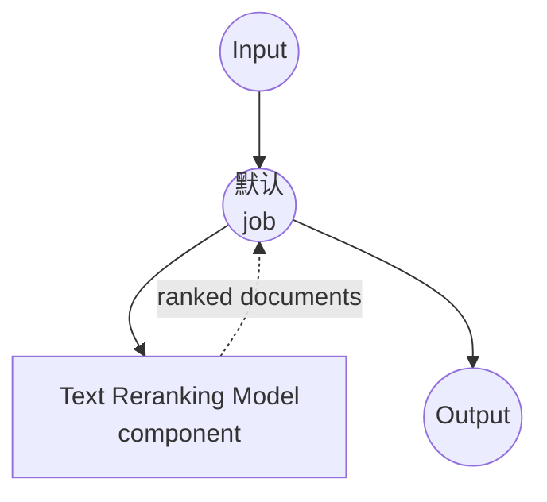

# 文本重排序模型任务示例

本示例演示如何使用 model-compose 的内置 `text-reranking` 任务与 HuggingFace transformers，通过本地交叉编码器模型对候选文档列表相对于查询进行重排序，提供适用于 RAG 管道的离线检索精化功能。

## 概述

此工作流提供本地文本重排序功能：

1. **本地重排序模型**：在本地运行 BAAI 的 `bge-reranker-v2-m3` 交叉编码器
2. **查询-文档评分**：与双编码器不同，对每个（查询、文档）对进行联合评分
3. **Top-K 选择**：返回按分数排序的最相关的 Top-K 文档
4. **多语言**：支持多种语言，包括英语、中文、韩语和日语
5. **无需外部 API**：完全离线重排序，非常适合私有 RAG 管道
6. **自动模型管理**：首次使用时自动下载和缓存模型

## 准备工作

### 先决条件

- 已安装 model-compose 并在 PATH 中可用
- 用于交叉编码器的充足系统资源（推荐：8GB+ RAM，GPU 可选）
- 带有 `transformers` 和 `torch` 的 Python 环境（自动管理）

### 为什么需要重排序

第一阶段检索器（BM25 或双编码器嵌入）快速但粗糙。交叉编码器重排序器将查询和每个候选文档一起读取，生成更精确的相关性分数。典型用法：

1. 使用快速双编码器 / BM25 检索前 100 个候选
2. 用交叉编码器对这 100 个进行重排序，得到真正的前 5 或前 10
3. 将重排序后的上下文输入 LLM

**本地重排序的优势：**
- **隐私**：查询和文档永不离开您的基础设施
- **成本**：初始模型下载后无按请求定价
- **延迟**：无网络往返；仅本地 GPU/CPU 推理
- **确定性**：相同的查询 + 文档始终产生相同的分数

**权衡：**
- **计算量**：交叉编码器每对比双编码器慢 — 仅重排序前 N 个，而不是整个语料库
- **硬件**：对于大 N 或低延迟场景，推荐使用 GPU

### 环境配置

1. 导航到此示例目录：
   ```bash
   cd examples/model-tasks/text-reranking
   ```

2. 无需额外的环境配置 — 首次运行时自动下载并缓存模型。

## 如何运行

1. **启动服务：**
   ```bash
   model-compose up
   ```

2. **运行工作流：**

   **使用 API：**
   ```bash
   curl -X POST http://localhost:8080/api/workflows/runs \
     -H "Content-Type: application/json" \
     -d '{
       "input": {
         "query": "What is the capital of France?",
         "documents": [
           "Paris is the capital and most populous city of France.",
           "Berlin is the capital of Germany.",
           "The Eiffel Tower is located in Paris.",
           "Tokyo is the capital of Japan."
         ],
         "top_k": 2
       }
     }'
   ```

   **使用 Web UI：**
   - 打开 Web UI：http://localhost:8081
   - 输入查询、候选文档和 `top_k`
   - 点击"Run Workflow"按钮

   **使用 CLI：**
   ```bash
   model-compose run --input '{
     "query": "What is the capital of France?",
     "documents": [
       "Paris is the capital and most populous city of France.",
       "Berlin is the capital of Germany.",
       "The Eiffel Tower is located in Paris.",
       "Tokyo is the capital of Japan."
     ],
     "top_k": 2
   }'
   ```

## 组件详情

### 文本重排序模型组件（默认）
- **类型**：带 `text-reranking` 任务的模型组件
- **驱动**：`huggingface`
- **模型**：`BAAI/bge-reranker-v2-m3`
- **功能**：
  - （查询、文档）对的交叉编码器联合评分
  - 多语言支持（100+ 种语言）
  - 按分数降序进行 Top-K 过滤
  - 顺序执行（`max_concurrent_count: 1`）以限制 GPU 内存

### 模型信息：BGE Reranker v2 M3
- **开发者**：BAAI（北京智源人工智能研究院）
- **基础**：XLM-RoBERTa 多语言主干
- **架构**：交叉编码器
- **最大输入长度**：8192 词元（支持长上下文）
- **语言**：100+ 种
- **许可证**：MIT

## 工作流详情

### "Rerank Documents" 工作流（默认）

**描述**：使用交叉编码器模型对候选文档列表相对于查询进行重排序。

#### 作业流程

此示例使用简化的单组件配置，没有显式作业。



#### 输入参数

| 参数 | 类型 | 必需 | 默认值 | 描述 |
|-----|------|------|--------|------|
| `query` | text | 是 | - | 用于文档评分的查询文本 |
| `documents` | text[] | 是 | - | 要重排序的候选文档列表 |
| `top_k` | integer | 否 | 5 | 要返回的最高得分文档数量 |

#### 输出格式

| 字段 | 类型 | 描述 |
|-----|------|------|
| `ranked` | object[] | 按相关性分数（降序）排序的 Top-K 文档 |

`ranked` 中的每个元素通常包含文档文本、其原始索引和相关性分数。

## 系统要求

### 最低要求
- **RAM**：8GB（推荐 16GB+）
- **VRAM**：可选；4GB+ GPU 可显著加快大批量处理
- **磁盘空间**：模型约 2.5GB
- **CPU**：多核处理器（推荐 4+ 核）
- **互联网**：仅用于一次性模型下载

### 性能说明
- 首次运行下载模型（约 2.3GB）
- CPU 推理随文档数量线性扩展
- GPU 推理可高效批处理所有（查询、文档）对
- 8192 词元上下文让您可以无需预先分块即可重排序长段落

## 自定义

### 使用不同的重排序器

从 HuggingFace 替换为其他交叉编码器：

```yaml
component:
  type: model
  task: text-reranking
  driver: huggingface
  model: BAAI/bge-reranker-base       # 更小、更快
  # 或
  model: BAAI/bge-reranker-large      # 更高精度
  # 或
  model: cross-encoder/ms-marco-MiniLM-L-6-v2   # 轻量级英语专用
```

### 与检索器链接

典型的 RAG 模式：广泛检索，然后重排序：

```yaml
workflow:
  jobs:
    - id: retrieve
      component: vector-store
      input:
        query: ${input.query}
        top_k: 100
    - id: rerank
      component: text-reranker
      input:
        query: ${input.query}
        documents: ${retrieve.documents}
        top_k: 10
    - id: generate
      component: llm
      input:
        prompt: |
          Context:
          ${rerank.ranked}

          Question: ${input.query}
```

### 调整 Top-K

通过修改 `top_k` 返回更多或更少的结果：

```bash
model-compose run --input '{
  "query": "...",
  "documents": ["...", "..."],
  "top_k": 10
}'
```

## 故障排除

### 常见问题

1. **内存不足**：使用 `bge-reranker-base`，减少每次调用的文档数量，或降低上下文长度
2. **模型下载失败**：检查互联网连接和磁盘空间
3. **推理缓慢**：使用 `device: cuda:0` 启用 GPU；在 GPU 上批量重排序效率高得多
4. **文档太长**：`bge-reranker-v2-m3` 每对（查询 + 文档）最多接受 8192 词元；截断更长的输入

### 性能优化

- **GPU**：设置 `device: cuda:0`（Apple Silicon 上使用 `mps`）以显著加快推理
- **批量大小**：huggingface 驱动自动批处理；将文档保持在一次调用中，而不是 N 次调用
- **模型大小**：对延迟敏感的用例使用 `bge-reranker-base`，对最佳质量使用 `v2-m3`
- **预过滤**：仅重排序检索器的前 100 个，而不是整个语料库

## 与双编码器嵌入的比较

| 功能 | 交叉编码器重排序器 | 双编码器嵌入 |
|-----|-----------------|-----------|
| 评分 | 联合（查询 + 文档） | 独立（点积） |
| 精度 | 较高 | 较低 |
| 每对延迟 | 较高 | 非常低 |
| 可扩展到语料库大小 | 否（仅重排序前 N 个） | 是（近似最近邻） |
| 典型用途 | 第二阶段 | 第一阶段 |

## 模型变体

- **BAAI/bge-reranker-base**：2.78 亿参数，更快，英语为主
- **BAAI/bge-reranker-large**：5.6 亿参数，更高精度
- **BAAI/bge-reranker-v2-m3**：5.68 亿参数，多语言，8k 上下文（默认）
- **cross-encoder/ms-marco-MiniLM-L-6-v2**：2200 万参数，超轻量级，英语专用
