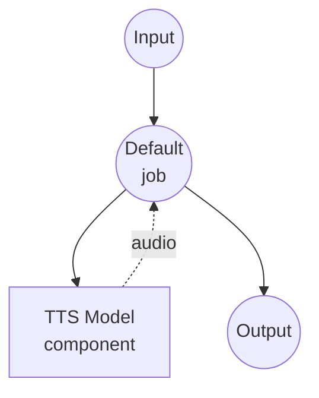

# Text to Speech (Voice Cloning with CosyVoice2) Model Task Example

This example demonstrates how to perform zero-shot voice cloning using CosyVoice2 (FunAudioLLM) at 24 kHz, running locally via model-compose's built-in model task functionality.

## Overview

This workflow provides local voice cloning and speech synthesis that:

1. **Local Model Execution**: Runs CosyVoice2-0.5B locally without external APIs
2. **Zero-Shot Voice Cloning**: Reproduces a speaker's voice from a short reference audio sample
3. **Optional Reference Transcript**: Provide a transcript for tighter alignment, or omit it for cross-lingual mode
4. **24 kHz Output**: Emits synthesized speech at the model's native 24 kHz sample rate

## Preparation

### Prerequisites

- model-compose installed and available in your PATH
- Sufficient system resources (recommended: 8GB+ VRAM if using a GPU)
- Python environment with CosyVoice dependencies (automatically managed)
- A reference audio file (and optionally its transcript) for voice cloning

### Environment Configuration

1. Navigate to this example directory:
   ```bash
   cd examples/model-tasks/text-to-speech-clone-cosyvoice
   ```

2. No additional environment configuration required - model and dependencies are managed automatically.

## How to Run

1. **Start the service:**
   ```bash
   model-compose up
   ```

2. **Run the workflow:**

   **Using Web UI (Recommended):**
   - Open the Web UI: http://localhost:8084
   - Enter the text to synthesize
   - Upload a reference audio file
   - Optionally enter the transcript of the reference audio
   - Click the "Run Workflow" button

   **Using API:**
   ```bash
   curl -X POST http://localhost:8083/api/workflows/runs \
     -H "Content-Type: application/json" \
     -d '{
       "input": {
         "text": "This is synthesized speech using a cloned voice.",
         "reference_audio": "<base64-encoded-audio>",
         "reference_text": "Transcript of the reference audio."
       }
     }'
   ```

   **Using CLI:**
   ```bash
   model-compose run --input '{
     "text": "This is synthesized speech using a cloned voice.",
     "reference_audio": "<base64-encoded-audio>",
     "reference_text": "Transcript of the reference audio."
   }'
   ```

## Component Details

### Text-to-Speech Model Component (Default)
- **Type**: Model component with `text-to-speech` task
- **Purpose**: Zero-shot voice cloning and speech synthesis from reference audio
- **Model**: `FunAudioLLM/CosyVoice2-0.5B`
- **Driver**: `custom`
- **Family**: `cosyvoice`
- **Device**: `auto`
- **Method**: `clone` - clones a voice from reference audio and generates speech
- **Concurrency**: 1 (single request at a time)

### Model Information: CosyVoice2-0.5B
- **Developer**: FunAudioLLM (Alibaba DAMO)
- **Parameters**: ~0.5 billion
- **Type**: Zero-shot voice cloning TTS model
- **Sample Rate**: 24 kHz output
- **Languages**: Multilingual support
- **Output Format**: Audio (WAV)

## Workflow Details

### "Text to Speech with Voice Cloning (CosyVoice2)" Workflow (Default)

**Description**: Zero-shot voice cloning using CosyVoice2 (FunAudioLLM) at 24 kHz.

#### Job Flow



#### Input Parameters

| Parameter | Type | Required | Default | Description |
|-----------|------|----------|---------|-------------|
| `text` | text | Yes | - | The text to synthesize with the cloned voice |
| `reference_audio` | audio | Yes | - | Reference audio sample to clone the voice from |
| `reference_text` | text | No | `""` | Transcript of the reference audio. Omit for cross-lingual mode |

#### Output Format

| Field | Type | Description |
|-------|------|-------------|
| - | audio | Generated speech audio in the cloned voice (WAV, 24 kHz) |

## Example Output

The workflow returns a WAV audio stream containing speech synthesized in the cloned voice at 24 kHz.

## Customization

### Switching to CosyVoice3

Update `component.model` to use the CosyVoice3 base model:

```yaml
component:
  type: model
  task: text-to-speech
  driver: custom
  family: cosyvoice
  model: FunAudioLLM/Fun-CosyVoice3-0.5B-2512
  device: auto
```

### Using Built-in Speakers (SFT Model)

If you want to use built-in preset speakers instead of zero-shot cloning, switch to the SFT model and use `method: generate`:

```yaml
component:
  type: model
  task: text-to-speech
  driver: custom
  family: cosyvoice
  model: iic/CosyVoice-300M-SFT
  device: auto
  action:
    method: generate
    text: ${input.text as text}
    output: ${result as audio/wav}
```

### Cross-Lingual Voice Cloning

Omit `reference_text` (leave it empty) to synthesize text in a language different from the reference audio while preserving the speaker's timbre.

## Related Examples

- **[text-to-speech-clone](../text-to-speech-clone/)**: Voice cloning with Qwen3-TTS
- **[text-to-speech-clone-luxtts](../text-to-speech-clone-luxtts/)**: Voice cloning with LuxTTS (ZipVoice) at 48 kHz
- **[text-to-speech-clone-tada](../text-to-speech-clone-tada/)**: Voice cloning with HumeAI TADA
