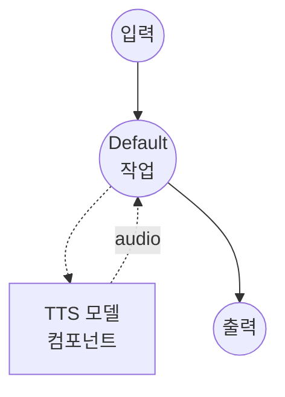

# 텍스트 음성 변환 (FireRedTTS3 보이스 클로닝) 모델 태스크 예제

이 예제는 FireRedTTS3-Base를 사용하여 24개 언어와 21개 중국어 방언에서 제로샷 보이스 클로닝을 수행하는 방법을 보여주며, model-compose의 내장 모델 태스크 기능을 통해 로컬에서 실행됩니다.

## 개요

이 워크플로우는 다음과 같은 로컬 보이스 클로닝 및 음성 합성을 제공합니다:

1. **로컬 모델 실행**: 외부 API 없이 FireRedTTS3-Base를 로컬에서 실행
2. **제로샷 보이스 클로닝**: 짧은 참조 오디오 샘플에서 화자의 음성을 재현
3. **다국어 및 다방언**: 24개 언어와 21개 중국어 방언 그룹 지원
4. **선택적 참조 텍스트**: 더 정밀한 정렬을 위해 텍스트를 제공하거나, 생략하여 프롬프트 전용 모드 사용
5. **24 kHz 출력**: 모델의 기본 24 kHz 샘플 레이트로 합성된 음성 출력

## 준비사항

### 필수 요구사항

- model-compose가 설치되어 PATH에서 사용 가능
- 충분한 시스템 리소스 (GPU 사용 시 권장: 8GB+ VRAM)
- FireRedTTS3가 `sys.path`에서 사용 가능한 Python 환경
- 보이스 클로닝을 위한 참조 오디오 파일 (및 선택적으로 해당 텍스트)

### FireRedTTS3 설치

FireRedTTS3는 PyPI 배포판이 없습니다. 저장소를 클론하여 가상환경에 노출시키세요:

```bash
git clone https://github.com/FireRedTeam/FireRedTTS3.git
# 그런 다음 저장소 루트를 sys.path에 추가하세요 (예: venv의 site-packages에 .pth 파일 생성),
# 또는 클론한 저장소 내부에서 model-compose를 실행하세요.
```

사전 학습된 체크포인트는 컴포넌트가 처음 시작될 때 HuggingFace(`FireRedTeam/FireRedTTS3`)에서 자동으로 다운로드됩니다.

### 환경 구성

1. 이 예제 디렉토리로 이동:
   ```bash
   cd examples/model-tasks/text-to-speech-clone-fireredtts3
   ```

2. 추가 환경 구성이 필요 없습니다 - 모델 가중치와 의존성은 자동으로 관리됩니다.

## 실행 방법

1. **서비스 시작:**
   ```bash
   model-compose up
   ```

2. **워크플로우 실행:**

   **웹 UI 사용 (권장):**
   - 웹 UI 열기: http://localhost:8084
   - 합성할 텍스트 입력
   - 참조 오디오 파일 업로드
   - 참조 오디오의 텍스트를 선택적으로 입력
   - 언어 코드를 선택적으로 설정 (예: `en`, `zh`, `ko`, 중국어 방언은 `zh-Sichuan`)
   - "Run Workflow" 버튼 클릭

   **API 사용:**
   ```bash
   curl -X POST http://localhost:8083/api/workflows/runs \
     -H "Content-Type: application/json" \
     -d '{
       "input": {
         "text": "복제된 음성으로 합성된 음성입니다.",
         "reference_audio": "<base64-인코딩된-오디오>",
         "reference_text": "참조 오디오의 텍스트.",
         "language": "ko"
       }
     }'
   ```

   **CLI 사용:**
   ```bash
   model-compose run --input '{
     "text": "복제된 음성으로 합성된 음성입니다.",
     "reference_audio": "<base64-인코딩된-오디오>",
     "reference_text": "참조 오디오의 텍스트.",
     "language": "Korean"
   }'
   ```

## 컴포넌트 세부사항

### 텍스트 음성 변환 모델 컴포넌트 (기본)
- **유형**: `text-to-speech` 태스크를 가진 모델 컴포넌트
- **목적**: 참조 오디오로부터의 제로샷 보이스 클로닝 및 음성 합성
- **모델**: `FireRedTeam/FireRedTTS3`
- **드라이버**: `custom`
- **패밀리**: `fireredtts3`
- **프리셋**: `base` - FireRedTTS3-Base 체크포인트를 로드
- **디바이스**: `auto`
- **메서드**: `clone` - 참조 오디오에서 음성을 복제하고 음성 생성
- **동시성**: 1 (한 번에 하나의 요청)

### 모델 정보: FireRedTTS3-Base
- **개발자**: FireRedTeam
- **유형**: 의미론적으로 강화된 음성 표현을 사용하는 제로샷 보이스 클로닝 TTS 모델
- **샘플 레이트**: 24 kHz 출력
- **언어**: 영어, 중국어, 한국어, 일본어, 프랑스어, 독일어, 스페인어, 아랍어, 힌디어, 베트남어 등 24개 언어
- **방언**: 21개 중국어 방언 그룹 (쓰촨, 상하이, 광둥, 민난, 우 등)
- **출력 형식**: 오디오 (WAV)

## 워크플로우 세부사항

### "Text to Speech with Voice Cloning (FireRedTTS3)" 워크플로우 (기본)

**설명**: FireRedTTS3-Base를 사용한 24개 언어와 21개 중국어 방언 걸친 24 kHz 제로샷 보이스 클로닝.

#### 작업 흐름



#### 입력 매개변수

| 매개변수 | 유형 | 필수 | 기본값 | 설명 |
|---------|------|------|--------|------|
| `text` | text | 예 | - | 복제된 음성으로 합성할 텍스트 |
| `reference_audio` | audio | 예 | - | 음성을 복제할 참조 오디오 샘플 |
| `reference_text` | text | 아니오 | `""` | 참조 오디오의 텍스트. 화자 유사도를 향상시킴 |
| `language` | text | 아니오 | `""` | ISO 언어 코드 (예: `en`, `zh`, `ko`) 또는 중국어 방언 서브태그 (예: `zh-Sichuan`, `zh-Cantonese`, `zh-yue`). 생략 시 자동 감지 |

#### 출력 형식

| 필드 | 유형 | 설명 |
|-----|------|------|
| - | audio | 복제된 음성으로 생성된 음성 오디오 (WAV, 24 kHz) |

## 예제 출력

워크플로우는 복제된 음성으로 24 kHz에서 합성된 음성을 담은 WAV 오디오 스트림을 반환합니다.

## 사용자 정의

### Instruct 프리셋으로 전환

`preset`을 `instruct`로 변경하면 FireRedTTS3-Instruct를 대신 로드합니다. `clone` 메서드는 여전히 작동하며 Instruct 모델의 인컨텍스트 러닝 TTS 경로를 통해 라우팅됩니다:

```yaml
component:
  type: model
  task: text-to-speech
  driver: custom
  family: fireredtts3
  preset: instruct
  model: FireRedTeam/FireRedTTS3
  device: auto
```

Instruct 프리셋 사용 시 `language`는 무시됩니다 - Instruct 모델은 참조 오디오와 텍스트에서 언어를 유도합니다.

### 보이스 클로닝 모범 사례

최상의 화자 유사도를 얻으려면 대상 텍스트와 동일한 언어 또는 방언의 참조 오디오를 제공하세요. 예를 들어 쓰촨 방언을 합성할 때는 쓰촨 방언 참조 오디오를 사용하고 `language: zh-Sichuan`으로 설정하세요.

## 관련 예제

- **[text-to-speech-design-fireredtts3](../text-to-speech-design-fireredtts3/)**: 자연어 설명에서의 보이스 디자인
- **[text-to-speech-edit-fireredtts3](../text-to-speech-edit-fireredtts3/)**: 의미론적 및 음향적 음성 편집
- **[text-to-speech-clone-cosyvoice](../text-to-speech-clone-cosyvoice/)**: CosyVoice2를 사용한 보이스 클로닝
- **[text-to-speech-clone](../text-to-speech-clone/)**: Qwen3-TTS를 사용한 보이스 클로닝
