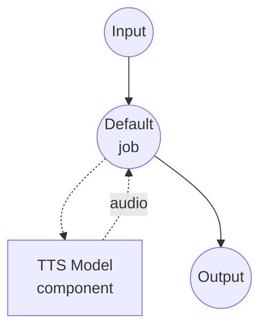

# Text to Speech (Voice Cloning with FireRedTTS3) Model Task Example

This example demonstrates how to perform zero-shot voice cloning using FireRedTTS3-Base across 24 languages and 21 Chinese dialects, running locally via model-compose's built-in model task functionality.

## Overview

This workflow provides local voice cloning and speech synthesis that:

1. **Local Model Execution**: Runs FireRedTTS3-Base locally without external APIs
2. **Zero-Shot Voice Cloning**: Reproduces a speaker's voice from a short reference audio sample
3. **Multilingual & Multi-Dialect**: Supports 24 languages and 21 Chinese dialect groups
4. **Optional Reference Transcript**: Provide a transcript for tighter alignment, or omit it for prompt-only mode
5. **24 kHz Output**: Emits synthesized speech at the model's native 24 kHz sample rate

## Preparation

### Prerequisites

- model-compose installed and available in your PATH
- Sufficient system resources (recommended: 8GB+ VRAM if using a GPU)
- Python environment with FireRedTTS3 available on `sys.path`
- A reference audio file (and optionally its transcript) for voice cloning

### Installing FireRedTTS3

FireRedTTS3 has no PyPI distribution. Clone the repository and expose it to your virtualenv:

```bash
git clone https://github.com/FireRedTeam/FireRedTTS3.git
# Then add the repo root to sys.path (e.g. via a .pth file in your venv's site-packages),
# or run model-compose from inside the cloned repo.
```

The pretrained checkpoint is downloaded automatically from HuggingFace (`FireRedTeam/FireRedTTS3`) the first time the component starts.

### Environment Configuration

1. Navigate to this example directory:
   ```bash
   cd examples/model-tasks/text-to-speech-clone-fireredtts3
   ```

2. No additional environment configuration required - model weights and dependencies are managed automatically.

## How to Run

1. **Start the service:**
   ```bash
   model-compose up
   ```

2. **Run the workflow:**

   **Using Web UI (Recommended):**
   - Open the Web UI: http://localhost:8084
   - Enter the text to synthesize
   - Upload a reference audio file
   - Optionally enter the transcript of the reference audio
   - Optionally set a language code (e.g. `en`, `zh`, `ko`, or `zh-Sichuan` for a Chinese dialect)
   - Click the "Run Workflow" button

   **Using API:**
   ```bash
   curl -X POST http://localhost:8083/api/workflows/runs \
     -H "Content-Type: application/json" \
     -d '{
       "input": {
         "text": "This is synthesized speech using a cloned voice.",
         "reference_audio": "<base64-encoded-audio>",
         "reference_text": "Transcript of the reference audio.",
         "language": "en"
       }
     }'
   ```

   **Using CLI:**
   ```bash
   model-compose run --input '{
     "text": "This is synthesized speech using a cloned voice.",
     "reference_audio": "<base64-encoded-audio>",
     "reference_text": "Transcript of the reference audio.",
     "language": "en"
   }'
   ```

## Component Details

### Text-to-Speech Model Component (Default)
- **Type**: Model component with `text-to-speech` task
- **Purpose**: Zero-shot voice cloning and speech synthesis from reference audio
- **Model**: `FireRedTeam/FireRedTTS3`
- **Driver**: `custom`
- **Family**: `fireredtts3`
- **Preset**: `base` - loads the FireRedTTS3-Base checkpoint
- **Device**: `auto`
- **Method**: `clone` - clones a voice from reference audio and generates speech
- **Concurrency**: 1 (single request at a time)

### Model Information: FireRedTTS3-Base
- **Developer**: FireRedTeam
- **Type**: Zero-shot voice cloning TTS model with semantically enriched speech representations
- **Sample Rate**: 24 kHz output
- **Languages**: 24 languages including English, Chinese, Korean, Japanese, French, German, Spanish, Arabic, Hindi, Vietnamese, and more
- **Dialects**: 21 Chinese dialect groups (Sichuan, Shanghai, Cantonese, Minnan, Wu, etc.)
- **Output Format**: Audio (WAV)

## Workflow Details

### "Text to Speech with Voice Cloning (FireRedTTS3)" Workflow (Default)

**Description**: Zero-shot voice cloning across 24 languages and 21 Chinese dialects using FireRedTTS3-Base at 24 kHz.

#### Job Flow



#### Input Parameters

| Parameter | Type | Required | Default | Description |
|-----------|------|----------|---------|-------------|
| `text` | text | Yes | - | The text to synthesize with the cloned voice |
| `reference_audio` | audio | Yes | - | Reference audio sample to clone the voice from |
| `reference_text` | text | No | `""` | Transcript of the reference audio. Improves speaker similarity |
| `language` | text | No | `""` | ISO language code (e.g. `en`, `zh`, `ko`) or a Chinese dialect sub-tag (e.g. `zh-Sichuan`, `zh-Cantonese`, `zh-yue`). Auto-detected when omitted |

#### Output Format

| Field | Type | Description |
|-------|------|-------------|
| - | audio | Generated speech audio in the cloned voice (WAV, 24 kHz) |

## Example Output

The workflow returns a WAV audio stream containing speech synthesized in the cloned voice at 24 kHz.

## Customization

### Switching to the Instruct Preset

Switch `preset` to `instruct` to load FireRedTTS3-Instruct instead. The `clone` method still works and routes through the Instruct model's in-context-learning TTS path:

```yaml
component:
  type: model
  task: text-to-speech
  driver: custom
  family: fireredtts3
  preset: instruct
  model: FireRedTeam/FireRedTTS3
  device: auto
```

Note that when using the Instruct preset, `language` is ignored — the Instruct model derives language from the reference audio and text.

### Best Practices for Voice Cloning

For the best speaker similarity, provide a reference audio in the same language or dialect as the target text. For example, when synthesizing Sichuanese, use a Sichuanese reference audio and set `language: zh-Sichuan`.

## Related Examples

- **[text-to-speech-design-fireredtts3](../text-to-speech-design-fireredtts3/)**: Voice design from a natural-language description
- **[text-to-speech-edit-fireredtts3](../text-to-speech-edit-fireredtts3/)**: Semantic and acoustic speech editing
- **[text-to-speech-clone-cosyvoice](../text-to-speech-clone-cosyvoice/)**: Voice cloning with CosyVoice2
- **[text-to-speech-clone](../text-to-speech-clone/)**: Voice cloning with Qwen3-TTS
