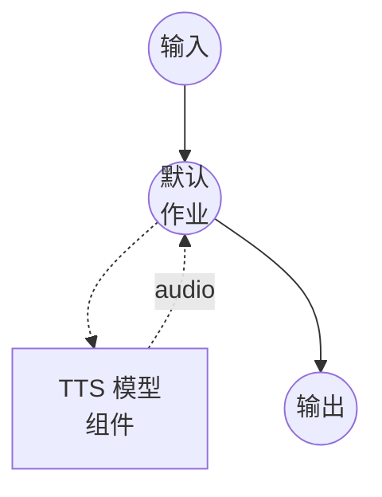

# 文本转语音（FireRedTTS3 语音克隆）模型任务示例

此示例演示如何使用 FireRedTTS3-Base 在 24 种语言和 21 种中文方言上执行零样本语音克隆，通过 model-compose 的内置模型任务功能在本地运行。

## 概述

此工作流提供本地语音克隆和语音合成：

1. **本地模型执行**：无需外部 API，在本地运行 FireRedTTS3-Base
2. **零样本语音克隆**：从简短的参考音频样本中复制说话者的声音
3. **多语言与多方言**：支持 24 种语言和 21 种中文方言组
4. **可选的参考文本**：提供转录文本以获得更精确的对齐，或省略以使用仅提示模式
5. **24 kHz 输出**：以模型原生 24 kHz 采样率输出合成语音

## 准备工作

### 前置条件

- 已安装 model-compose 并在您的 PATH 中可用
- 足够的系统资源（使用 GPU 时推荐：8GB+ VRAM）
- 在 `sys.path` 中包含 FireRedTTS3 的 Python 环境
- 用于语音克隆的参考音频文件（以及可选的转录文本）

### 安装 FireRedTTS3

FireRedTTS3 没有 PyPI 发行版。克隆仓库并将其暴露给您的虚拟环境：

```bash
git clone https://github.com/FireRedTeam/FireRedTTS3.git
# 然后将仓库根目录添加到 sys.path（例如通过在 venv 的 site-packages 中创建 .pth 文件），
# 或从克隆的仓库内部运行 model-compose。
```

预训练检查点将在组件首次启动时从 HuggingFace（`FireRedTeam/FireRedTTS3`）自动下载。

### 环境配置

1. 导航到此示例目录：
   ```bash
   cd examples/model-tasks/text-to-speech-clone-fireredtts3
   ```

2. 无需额外的环境配置 - 模型权重和依赖会自动管理。

## 运行方式

1. **启动服务：**
   ```bash
   model-compose up
   ```

2. **运行工作流：**

   **使用 Web UI（推荐）：**
   - 打开 Web UI：http://localhost:8084
   - 输入要合成的文本
   - 上传参考音频文件
   - 可选择输入参考音频的转录文本
   - 可选择设置语言代码（例如 `en`、`zh`、`ko`，中文方言使用 `zh-Sichuan`）
   - 点击"运行工作流"按钮

   **使用 API：**
   ```bash
   curl -X POST http://localhost:8083/api/workflows/runs \
     -H "Content-Type: application/json" \
     -d '{
       "input": {
         "text": "这是使用克隆语音合成的语音。",
         "reference_audio": "<base64编码的音频>",
         "reference_text": "参考音频的转录文本。",
         "language": "zh"
       }
     }'
   ```

   **使用 CLI：**
   ```bash
   model-compose run --input '{
     "text": "这是使用克隆语音合成的语音。",
     "reference_audio": "<base64编码的音频>",
     "reference_text": "参考音频的转录文本。",
     "language": "Chinese"
   }'
   ```

## 组件详情

### 文本转语音模型组件（默认）
- **类型**：具有 `text-to-speech` 任务的模型组件
- **用途**：从参考音频进行零样本语音克隆和语音合成
- **模型**：`FireRedTeam/FireRedTTS3`
- **驱动**：`custom`
- **系列**：`fireredtts3`
- **预设**：`base` - 加载 FireRedTTS3-Base 检查点
- **设备**：`auto`
- **方法**：`clone` - 从参考音频克隆语音并生成语音
- **并发数**：1（同时处理一个请求）

### 模型信息：FireRedTTS3-Base
- **开发者**：FireRedTeam
- **类型**：具有语义丰富语音表示的零样本语音克隆 TTS 模型
- **采样率**：24 kHz 输出
- **语言**：24 种语言，包括英语、中文、韩语、日语、法语、德语、西班牙语、阿拉伯语、印地语、越南语等
- **方言**：21 种中文方言组（四川话、上海话、粤语、闽南话、吴语等）
- **输出格式**：音频（WAV）

## 工作流详情

### "Text to Speech with Voice Cloning (FireRedTTS3)" 工作流（默认）

**描述**：使用 FireRedTTS3-Base 在 24 种语言和 21 种中文方言上进行 24 kHz 零样本语音克隆。

#### 作业流程



#### 输入参数

| 参数 | 类型 | 必需 | 默认值 | 描述 |
|-----------|------|----------|---------|-------------|
| `text` | text | 是 | - | 使用克隆语音合成的文本 |
| `reference_audio` | audio | 是 | - | 用于克隆语音的参考音频样本 |
| `reference_text` | text | 否 | `""` | 参考音频的转录文本。提高说话者相似度 |
| `language` | text | 否 | `""` | ISO 语言代码（例如 `en`、`zh`、`ko`）或中文方言子标签（例如 `zh-Sichuan`、`zh-Cantonese`、`zh-yue`）。省略时自动检测 |

#### 输出格式

| 字段 | 类型 | 描述 |
|-------|------|-------------|
| - | audio | 使用克隆语音生成的语音音频（WAV，24 kHz） |

## 示例输出

工作流返回包含以 24 kHz 使用克隆语音合成的语音的 WAV 音频流。

## 自定义

### 切换到 Instruct 预设

将 `preset` 更改为 `instruct` 以改为加载 FireRedTTS3-Instruct。`clone` 方法仍然有效，并通过 Instruct 模型的上下文学习 TTS 路径进行路由：

```yaml
component:
  type: model
  task: text-to-speech
  driver: custom
  family: fireredtts3
  preset: instruct
  model: FireRedTeam/FireRedTTS3
  device: auto
```

请注意，使用 Instruct 预设时会忽略 `language` - Instruct 模型从参考音频和文本中推导语言。

### 语音克隆最佳实践

为获得最佳说话者相似度，请提供与目标文本相同语言或方言的参考音频。例如，合成四川话时，请使用四川话参考音频并设置 `language: zh-Sichuan`。

## 相关示例

- **[text-to-speech-design-fireredtts3](../text-to-speech-design-fireredtts3/)**：从自然语言描述进行语音设计
- **[text-to-speech-edit-fireredtts3](../text-to-speech-edit-fireredtts3/)**：语义和声学语音编辑
- **[text-to-speech-clone-cosyvoice](../text-to-speech-clone-cosyvoice/)**：使用 CosyVoice2 的语音克隆
- **[text-to-speech-clone](../text-to-speech-clone/)**：使用 Qwen3-TTS 的语音克隆
