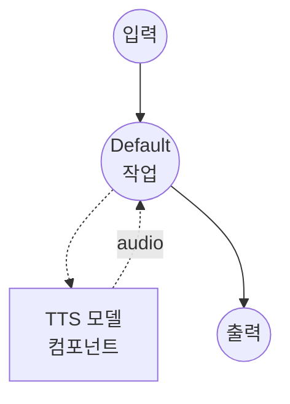

# 텍스트 음성 변환 (LuxTTS 보이스 클로닝) 모델 태스크 예제

이 예제는 LuxTTS (ZipVoice)를 사용하여 48 kHz의 제로샷 보이스 클로닝을 수행하는 방법을 보여주며, model-compose의 내장 모델 태스크 기능을 통해 로컬에서 실행됩니다.

## 개요

이 워크플로우는 다음과 같은 로컬 보이스 클로닝 및 음성 합성을 제공합니다:

1. **로컬 모델 실행**: 외부 API 없이 LuxTTS를 로컬에서 실행
2. **제로샷 보이스 클로닝**: 짧은 참조 오디오 샘플에서 화자의 음성을 재현
3. **텍스트 불필요**: 참조 텍스트가 필요 없음 - 참조 오디오만으로 클로닝 수행
4. **48 kHz 출력**: 더 높은 충실도를 위해 모델의 기본 48 kHz 샘플 레이트로 합성된 음성 출력

## 준비사항

### 필수 요구사항

- model-compose가 설치되어 PATH에서 사용 가능
- 충분한 시스템 리소스 (GPU 사용 시 권장: 8GB+ VRAM)
- LuxTTS 의존성이 포함된 Python 환경 (자동 관리)
- 보이스 클로닝을 위한 참조 오디오 파일

### 환경 구성

1. 이 예제 디렉토리로 이동:
   ```bash
   cd examples/model-tasks/text-to-speech-clone-luxtts
   ```

2. 추가 환경 구성이 필요 없습니다 - 모델과 의존성은 자동으로 관리됩니다.

## 실행 방법

1. **서비스 시작:**
   ```bash
   model-compose up
   ```

2. **워크플로우 실행:**

   **웹 UI 사용 (권장):**
   - 웹 UI 열기: http://localhost:8084
   - 합성할 텍스트 입력
   - 참조 오디오 파일 업로드
   - "Run Workflow" 버튼 클릭

   **API 사용:**
   ```bash
   curl -X POST http://localhost:8083/api/workflows/runs \
     -H "Content-Type: application/json" \
     -d '{
       "input": {
         "text": "복제된 음성으로 합성된 음성입니다.",
         "reference_audio": "<base64-인코딩된-오디오>"
       }
     }'
   ```

   **CLI 사용:**
   ```bash
   model-compose run --input '{
     "text": "복제된 음성으로 합성된 음성입니다.",
     "reference_audio": "<base64-인코딩된-오디오>"
   }'
   ```

## 컴포넌트 세부사항

### 텍스트 음성 변환 모델 컴포넌트 (기본)
- **유형**: `text-to-speech` 태스크를 가진 모델 컴포넌트
- **목적**: 참조 오디오에서의 제로샷 보이스 클로닝 및 음성 합성
- **모델**: `YatharthS/LuxTTS`
- **드라이버**: `custom`
- **패밀리**: `luxtts`
- **디바이스**: `auto`
- **메서드**: `clone` - 참조 오디오에서 음성을 복제하고 음성 생성
- **동시성**: 1 (한 번에 하나의 요청)

### 모델 정보: LuxTTS
- **기반**: ZipVoice
- **유형**: 제로샷 보이스 클로닝 TTS 모델
- **샘플 레이트**: 48 kHz 출력
- **출력 형식**: 오디오 (WAV)

## 워크플로우 세부사항

### "Text to Speech with Voice Cloning (LuxTTS)" 워크플로우 (기본)

**설명**: LuxTTS (ZipVoice)를 사용한 48 kHz 제로샷 보이스 클로닝.

#### 작업 흐름



#### 입력 매개변수

| 매개변수 | 유형 | 필수 | 기본값 | 설명 |
|---------|------|------|--------|------|
| `text` | text | 예 | - | 복제된 음성으로 합성할 텍스트 |
| `reference_audio` | audio | 예 | - | 음성을 복제할 참조 오디오 샘플 |

#### 출력 형식

| 필드 | 유형 | 설명 |
|-----|------|------|
| - | audio | 복제된 음성으로 생성된 음성 오디오 (WAV, 48 kHz) |

## 예제 출력

워크플로우는 복제된 음성으로 48 kHz에서 합성된 음성을 담은 WAV 오디오 스트림을 반환합니다.

## 사용자 정의

### 다른 디바이스 사용

`device`를 조정하여 CPU 또는 특정 GPU를 강제로 사용합니다:

```yaml
component:
  type: model
  task: text-to-speech
  driver: custom
  family: luxtts
  model: YatharthS/LuxTTS
  device: cuda:0   # 또는 cpu, mps, auto
```

### 참조 오디오 팁

- 배경 소음이 없는 깨끗한 오디오 사용
- 3-10초의 자연스러운 음성이 가장 효과적
- 일반적인 형식(WAV, MP3, FLAC)의 오디오 사용

## 관련 예제

- **[text-to-speech-clone](../text-to-speech-clone/)**: Qwen3-TTS를 사용한 보이스 클로닝
- **[text-to-speech-clone-cosyvoice](../text-to-speech-clone-cosyvoice/)**: CosyVoice2를 사용한 24 kHz 보이스 클로닝
- **[text-to-speech-clone-tada](../text-to-speech-clone-tada/)**: HumeAI TADA를 사용한 보이스 클로닝
