# Text to Speech (Voice Cloning with HumeAI TADA) Model Task Example

This example demonstrates how to perform voice cloning using HumeAI TADA (Text-Acoustic Dual Alignment) at 24 kHz, running locally via model-compose's built-in model task functionality.

## Overview

This workflow provides local voice cloning and speech synthesis that:

1. **Local Model Execution**: Runs HumeAI TADA locally without external APIs
2. **Text-Acoustic Dual Alignment**: TADA aligns text and acoustic features for high-quality cloning
3. **Reference-Based Synthesis**: Uses both reference audio and its transcript for accurate voice matching
4. **24 kHz Output**: Emits synthesized speech at the model's native 24 kHz sample rate

## Preparation

### Prerequisites

- model-compose installed and available in your PATH
- Sufficient system resources (recommended: 8GB+ VRAM if using a GPU)
- Python environment with TADA dependencies (automatically managed)
- A reference audio file and its transcript for voice cloning

### Environment Configuration

1. Navigate to this example directory:
   ```bash
   cd examples/model-tasks/text-to-speech-clone-tada
   ```

2. No additional environment configuration required - model and dependencies are managed automatically.

## How to Run

1. **Start the service:**
   ```bash
   model-compose up
   ```

2. **Run the workflow:**

   **Using Web UI (Recommended):**
   - Open the Web UI: http://localhost:8084
   - Enter the text to synthesize
   - Upload a reference audio file
   - Enter the transcript of the reference audio
   - Click the "Run Workflow" button

   **Using API:**
   ```bash
   curl -X POST http://localhost:8083/api/workflows/runs \
     -H "Content-Type: application/json" \
     -d '{
       "input": {
         "text": "This is synthesized speech using a cloned voice.",
         "reference_audio": "<base64-encoded-audio>",
         "reference_text": "Transcript of the reference audio."
       }
     }'
   ```

   **Using CLI:**
   ```bash
   model-compose run --input '{
     "text": "This is synthesized speech using a cloned voice.",
     "reference_audio": "<base64-encoded-audio>",
     "reference_text": "Transcript of the reference audio."
   }'
   ```

## Component Details

### Text-to-Speech Model Component (Default)
- **Type**: Model component with `text-to-speech` task
- **Purpose**: Voice cloning and speech synthesis from reference audio
- **Model**: `HumeAI/tada-1b`
- **Driver**: `custom`
- **Family**: `tada`
- **Device**: `auto`
- **Method**: `clone` - clones a voice from reference audio and generates speech
- **Concurrency**: 1 (single request at a time)

### Model Information: HumeAI TADA-1B
- **Developer**: Hume AI
- **Parameters**: ~1 billion
- **Type**: Text-Acoustic Dual Alignment voice cloning TTS model
- **Sample Rate**: 24 kHz output
- **Output Format**: Audio (WAV)

## Workflow Details

### "Text to Speech with Voice Cloning (HumeAI TADA)" Workflow (Default)

**Description**: Voice cloning using HumeAI TADA (Text-Acoustic Dual Alignment) at 24 kHz.

#### Job Flow

```mermaid
graph TD
    J1((Default<br/>job))
    C1[TTS Model<br/>component]
    J1 -.-> C1
    C1 -.-> |audio| J1
    Input((Input)) --> J1
    J1 --> Output((Output))
```



#### Input Parameters

| Parameter | Type | Required | Default | Description |
|-----------|------|----------|---------|-------------|
| `text` | text | Yes | - | The text to synthesize with the cloned voice |
| `reference_audio` | audio | Yes | - | Reference audio sample to clone the voice from |
| `reference_text` | text | Yes | - | Transcript of the reference audio for alignment |

#### Output Format

| Field | Type | Description |
|-------|------|-------------|
| - | audio | Generated speech audio in the cloned voice (WAV, 24 kHz) |

## Example Output

The workflow returns a WAV audio stream containing speech synthesized in the cloned voice at 24 kHz.

## Customization

### Switching to the Multilingual 3B Model

Use the larger multilingual TADA checkpoint for broader language coverage:

```yaml
component:
  type: model
  task: text-to-speech
  driver: custom
  family: tada
  model: HumeAI/tada-3b-ml
  device: auto
```

### Reference Audio Tips

- Use clean audio without background noise
- 3-10 seconds of natural speech works best
- Ensure the audio is in a common format (WAV, MP3, FLAC)
- Provide an accurate transcript that matches the reference audio

## Related Examples

- **[text-to-speech-clone](../text-to-speech-clone/)**: Voice cloning with Qwen3-TTS
- **[text-to-speech-clone-cosyvoice](../text-to-speech-clone-cosyvoice/)**: Voice cloning with CosyVoice2 at 24 kHz
- **[text-to-speech-clone-luxtts](../text-to-speech-clone-luxtts/)**: Voice cloning with LuxTTS (ZipVoice) at 48 kHz
